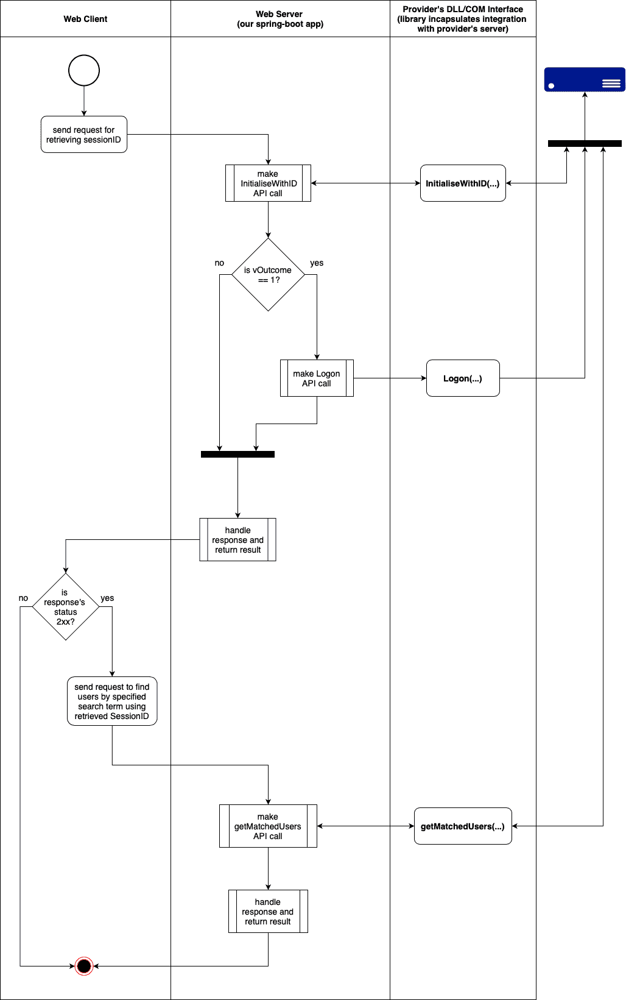

# COM 接口 API 教程:Java Spring Boot +雅各布库

> 原文：<https://www.freecodecamp.org/news/interface-in-java-tutorial-how-to-call-the-com-interface-spring-boot-jacob-library/>

在本文中，我将向您展示如何将 [JACOB 库](https://sourceforge.net/projects/jacob-project/)嵌入到您的 [Spring Boot](https://spring.io/projects/spring-boot) 应用程序中。这将帮助你在你的 web 应用程序中通过 [DLL](https://en.wikipedia.org/wiki/Dynamic-link_library) 库调用 [COM 接口 API](https://en.wikipedia.org/wiki/Component_Object_Model) 。

此外，为了便于说明，我将提供一个 COM API 的描述，以便您可以在它的基础上构建您的应用程序。你可以在这个 [GitHub repo](https://github.com/povisenko/jacob-within-spring-boot-2) 中找到所有的代码片段。

但是首先，快速说明一下:在 [C 标志](https://cthesigns.co.uk)我们部署了这个解决方案，允许我们与 [EMIS 健康](https://www.emishealth.com)整合。这是一种电子病历系统，用于英国的初级保健。为了集成，我们使用了他们提供的 DLL 库。

我将在这里向您展示的方法(经过消毒，以避免泄露任何敏感信息)在两年多前投入生产，并已证明其耐用性。

由于我们最近采用了一种全新的方法来与 EMIS 整合，旧系统将在一两个月后关闭。所以这个教程是它的绝唱。睡吧，我的小王子。

## 什么是 DLL API？

首先，让我们从 DLL 库的清晰描述开始。为此，我准备了一个原始技术文档的简短模型。

让我们通过它来看看一个 COM 接口的三个方法是什么。

### 用 ID 方法初始化

这个方法是现场需要的一个安全特性，它允许我们获得一个到 API 服务器的连接，我们希望将这个 API 服务器与库集成在一起。

它需要当前 API 用户的`AccountID` (GUID )(以访问服务器)和下面列出的一些其他初始化参数。

该功能还支持自动登录功能。如果客户端有运行系统的登录版本(库是该系统的一部分)并在同一主机上调用方法，API 将自动完成该用户帐户下的登录。然后它会为后续的 API 调用返回`SessionID`。

否则，客户端需要使用返回的`LoginID`继续执行`Logon`函数(见下一部分)。

要调用该函数，请使用带有以下参数的名称`InitialiseWithID`:

| 名字 | 进/出 | 类型 | 描述 |
| --- | --- | --- | --- |
| 地址 | 在…里 | 线 | 提供的集成服务器 IP |
| 帐户 ID | 在…里 | 线 | 提供了唯一的 GUID 字符串 |
| LoginID | 在外 | 线 | 用于登录 API 调用的 GUID 字符串 |
| 错误 | 在外 | 线 | 错误描述 |
| 结果 | 在外 | 整数 | -1 =参考错误
1 =成功初始化等待登录
2 =由于缺少服务器或不正确的详细信息而无法连接到服务器
3 =不匹配的帐户 ID
4 =自动登录成功 |
| SessionID | 在外 | 线 | 用于后续交互的 GUID(如果自动登录成功) |

### 登录方法

此方法确定用户的权限。这里的用户名是用来登录系统的 ID。密码是为该用户名设置的 API 密码。

在成功的场景中，调用返回一个`SessionID`字符串(GUID ),必须将它传递给其他后续调用以对它们进行身份验证。

要调用该函数，请使用带有以下参数的名称`Logon`:

| 名字 | 进/出 | 类型 | 描述 |
| --- | --- | --- | --- |
| LoginID | 在…里 | 线 | 用 id 初始化的初始化方法返回的登录 ID |
| 用户名 | 在…里 | 线 | 提供的 API 用户名 |
| 密码 | 在…里 | 线 | 提供的 API 密码 |
| SessionID | 在外 | 线 | 用于后续交互的 GUID(如果登录成功) |
| 错误 | 在外 | 线 | 错误描述 |
| 结果 | 在外 | 整数 | -1 =技术错误
1 =成功
2 =过期
3 =不成功
4 =无效登录 id 或登录 ID 无权访问本产品 |

### getMatchedUsers 方法

此调用允许您查找符合特定标准的用户数据记录。搜索词一次只能引用一个字段，如姓氏、名字或出生日期。

成功的调用会返回一个包含数据的 XML 字符串。

要调用该函数，请使用带有以下参数的名称`getMatchedUsers`:

| 名字 | 进/出 | 类型 | 描述 |
| --- | --- | --- | --- |
| SessionID | 在…里 | 线 | 登录方法返回的会话 id |
| 匹配术语 | 在…里 | 线 | 搜索术语 |
| 匹配列表 | 在外 | 线 | 符合所提供的相应 XSD 方案的 XML |
| SessionID | 在外 | 线 | 用于后续交互的 GUID(如果登录成功) |
| 错误 | 在外 | 线 | 错误描述 |
| 结果 | 在外 | 整数 | -1 =技术错误
1 =发现用户
2 =拒绝访问
3 =没有用户 |

## DLL 库应用程序流

为了更容易理解我们想要实现什么，我决定创建一个简单的流程图。

它描述了 web 客户机如何使用其 API 与我们的基于服务器的应用程序进行交互的一步一步的场景。它封装了与 DLL 库的交互，并允许我们使用提供的匹配项(搜索标准)获得假设的用户:



Application Flow Diagram

## 正在注册 COM

现在让我们学习如何访问 DLL 库。为了能够与第三方 COM 接口交互，需要将它[添加到注册表](https://docs.microsoft.com/en-us/windows/win32/com/registering-com-applications)中。

医生是这样说的:

> 注册表是一个系统数据库，包含有关系统硬件和软件配置以及系统用户的信息。任何基于 Windows 的程序都可以向注册表中添加信息，并从注册表中读取信息。客户端在注册表中搜索感兴趣的组件来使用。
> 
> 注册表维护系统中安装的所有 COM 对象的信息。每当应用程序创建 COM 组件的实例时，都会查询注册表以将组件的 CLSID 或 ProgID 解析为包含它的服务器 DLL 或 EXE 的路径名。
> 
> 确定组件的服务器后，Windows 要么将服务器加载到客户端应用程序的进程空间(进程内组件)，要么在自己的进程空间启动服务器(本地和远程服务器)。
> 
> 服务器创建一个组件的实例，并向客户端返回一个对组件接口的引用。

为了了解如何做到这一点，微软官方文档[说](https://docs.microsoft.com/en-us/dotnet/framework/interop/registering-assemblies-with-com):

> 您可以运行一个名为[程序集注册工具(Regasm.exe)](https://docs.microsoft.com/en-us/dotnet/framework/tools/regasm-exe-assembly-registration-tool)的命令行工具来注册或注销一个用于 COM 的程序集。Regasm.exe 将关于类的信息添加到系统注册表中，这样 COM 客户端就可以使用。NET Framework 类。
> 
> [注册服务](https://docs.microsoft.com/en-us/dotnet/api/system.runtime.interopservices.registrationservices)类提供了等效的功能。托管组件必须先在 Windows 注册表中注册，然后才能从 COM 客户端激活

确保您的主机已经安装了所需的`.NET Framework`组件。之后，您可以执行以下 CLI 命令:

```
C:\Windows\Microsoft.NET\Framework\v2.0.50727\RegAsm.exe {PATH_TO_YOUR_DLL_FILE} /codebase
```

将显示一条消息，指示文件是否成功注册。现在我们准备好下一步了。

## 定义应用程序的主干

### DllApiService

首先，让我们按原样定义描述我们的 DLL 库的接口:

```
public interface DllApiService {

    /**
     * @param accountId identifier for which we trigger initialisation
     * @return Tuple3 from values of Outcome, SessionID/LoginID, error
     * where by the first argument you can understand what is the result of the API call
     */
    Mono<Tuple3<Integer, String, String>> initialiseWithID(String accountId);

    /**
     * @param loginId  is retrieved before using {@link DllApiService#initialiseWithID(String)} call
     * @param username
     * @param password
     * @return Tuple3 from values of Outcome, SessionID, Error
     * where by the first argument you can understand what is the result of the API call
     */
    Mono<Tuple3<Integer, String, String>> logon(String loginId, String username, String password);

    /**
     * @param sessionId is retrieved before using either
     *                  {@link DllApiService#initialiseWithID(String)} or
     *                  {@link DllApiService#logon(String, String, String)} calls
     * @param matchTerm
     * @return Tuple3 from values of Outcome, MatchedList, Error
     * where by the first argument you can understand what is the result of the API call
     */
    Mono<Tuple3<Integer, String, String>> getMatchedUsers(String sessionId, String matchTerm);

    enum COM_API_Method {
        InitialiseWithID, Logon, getMatchedUsers
    }
}
```

您可能已经注意到，除了`initialiseWithID`函数之外，所有方法都映射到上述 COM 接口的定义。

我决定省略签名中的`address`变量(集成服务器的 IP ),并将它作为我们将要实现的环境变量注入。

### SessionIDService 已解释

为了能够使用库检索任何数据，首先我们需要获取`SessionID`。

根据上面的流程图，这包括首先调用`initialiseWithID`方法。之后，根据结果，我们将获得 SessionID 或`LoginID`用于后续的`Logon`调用。

所以基本上这是一个两步的幕后过程。现在，让我们创建接口，然后是实现:

```
public interface SessionIDService {

    /**
     * @param accountId identifier for which we retrieve SessionID
     * @param username
     * @param password
     * @return Tuple3 containing the following values:
     * result ( Boolean), sessionId (String) and status (HTTP Status depending on the result)
     */
    Mono<Tuple3<Boolean, String, HttpStatus>> getSessionId(String accountId, String username, String password);
}
```

```
@Service
@RequiredArgsConstructor
public class SessionIDServiceImpl implements SessionIDService {

    private final DllApiService dll;

    @Override
    public Mono<Tuple3<Boolean, String, HttpStatus>> getSessionId(String accountId, String username, String password) {
        return dll.initialiseWithID(accountId)
                  .flatMap(t4 -> {
                      switch (t4.getT1()) {
                          case -1:
                              return just(of(false, t4.getT3(), SERVICE_UNAVAILABLE));

                          case 1: {

                              return dll.logon(t4.getT2(), username, password)
                                        .map(t3 -> {
                                            switch (t3.getT1()) {
                                                case -1:
                                                    return of(false, t3.getT3(), SERVICE_UNAVAILABLE);
                                                case 1:
                                                    return of(true, t3.getT2(), OK);
                                                case 2:
                                                case 4:
                                                    return of(false, t3.getT3(), FORBIDDEN);
                                                default:
                                                    return of(false, t3.getT3(), BAD_REQUEST);

                                            }
                                        });

                          }

                          case 4:
                              return just(of(true, t4.getT2(), OK));

                          default:
                              return just(of(false, t4.getT3(), BAD_REQUEST));
                      }
                  });

    }
}
```

### API 外观

下一步是设计我们的 web 应用程序 API。它应该表示和封装我们与 COM 接口 API 的交互:

```
@Configuration
public class DllApiRouter {

    @Bean
    public RouterFunction<ServerResponse> dllApiRoute(DllApiRouterHandler handler) {
        return RouterFunctions.route(GET("/api/sessions/{accountId}"), handler::sessionId)
                              .andRoute(GET("/api/users/{matchTerm}"), handler::matchedUsers);
    }
}
```

除了`Router`类，让我们用检索 SessionID 和用户记录数据的逻辑来定义它的处理程序的实现。

对于第二个场景，为了能够根据设计进行 DLL `getMatchedUsers` API 调用，让我们使用强制头`X-SESSION-ID`:

```
@Slf4j
@Component
@RequiredArgsConstructor
public class DllApiRouterHandler {

    private static final String SESSION_ID_HDR = "X-SESSION-ID";

    private final DllApiService service;
    private final AccountRepo accountRepo;
    private final SessionIDService sessionService;

    public Mono<ServerResponse> sessionId(ServerRequest request) {
        final String accountId = request.pathVariable("accountId");

        return accountRepo.findById(accountId)
                          .flatMap(acc -> sessionService.getSessionId(accountId, acc.getApiUsername(), acc.getApiPassword()))
                          .doOnEach(logNext(t3 -> {
                              if (t3.getT1()) {
                                  log.info(format("SessionId to return %s", t3.getT2()));
                              } else {
                                  log.warn(format("Session Id could not be retrieved. Cause: %s", t3.getT2()));
                              }
                          }))
                          .flatMap(t3 -> status(t3.getT3()).contentType(APPLICATION_JSON)
                                                           .bodyValue(t3.getT1() ? t3.getT2() : Response.error(t3.getT2())))

                          .switchIfEmpty(Mono.just("Account could not be found with provided ID " + accountId)
                                             .doOnEach(logNext(log::info))
                                             .flatMap(msg -> badRequest().bodyValue(Response.error(msg))));
    }

    public Mono<ServerResponse> matchedUsers(ServerRequest request) {

        return sessionIdHeader(request).map(sId -> Tuples.of(sId, request.queryParam("matchTerm")
                                                                         .orElseThrow(() -> new IllegalArgumentException(
                                                                                 "matchTerm query param should be specified"))))
                                       .flatMap(t2 -> service.getMatchedUsers(t2.getT1(), t2.getT2()))
                                       .flatMap(this::handleT3)
                                       .onErrorResume(IllegalArgumentException.class, this::handleIllegalArgumentException);

    }

    private Mono<String> sessionIdHeader(ServerRequest request) {
        return Mono.justOrEmpty(request.headers()
                                       .header(SESSION_ID_HDR)
                                       .stream()
                                       .findFirst()
                                       .orElseThrow(() -> new IllegalArgumentException(SESSION_ID_HDR + " header is mandatory")));
    }

    private Mono<ServerResponse> handleT3(Tuple3<Integer, String, String> t3) {
        switch (t3.getT1()) {
            case 1:
                return ok().contentType(APPLICATION_JSON)
                           .bodyValue(t3.getT2());
            case 2:
                return status(FORBIDDEN).contentType(APPLICATION_JSON)
                                        .bodyValue(Response.error(t3.getT3()));
            default:
                return badRequest().contentType(APPLICATION_JSON)
                                   .bodyValue(Response.error(t3.getT3()));
        }
    }

    private Mono<ServerResponse> handleIllegalArgumentException(IllegalArgumentException e) {
        return Mono.just(Response.error(e.getMessage()))
                   .doOnEach(logNext(res -> log.info(String.join(",", res.getErrors()))))
                   .flatMap(res -> badRequest().contentType(MediaType.APPLICATION_JSON)
                                               .bodyValue(res));
    }

    @Getter
    @Setter
    @NoArgsConstructor
    public static class Response implements Serializable {

        private String message;

        private Set<String> errors;

        private Response(Set<String> errors) {
            this.errors = errors;
        }

        public static Response error(String error) {
            return new Response(singleton(error));
        }
    }
}
```

### 账户实体

您可能已经注意到，我们已经在路由器的处理程序中导入了`AccountRepo`，以便通过提供的`accountId`在数据库中找到实体。这让我们获得相应的 API 用户凭证，并在 DLL `Logon` API 调用中使用这三个凭证。

为了更清楚地了解情况，让我们也定义一下托管的`Account`实体:

```
@TypeAlias("Account")
@Document(collection = "accounts")
public class Account {

    @Version
    private Long version;

    /**
     * unique account ID for API, provided by supplier
     * defines restriction for data domain visibility
     * i.e. data from one account is not visible for another
     */
    @Id
    private String accountId;

    /**
     * COM API username, provided by supplier
     */
    private String apiUsername;

    /**
     * COM API password, provided by supplier
     */
    private String apiPassword;

    @CreatedDate
    private Date createdAt;

    @LastModifiedDate
    private Date updatedOn;
}
```

## 雅各布图书馆设置

除了核心部分 JACOB 库的配置和使用，我们的应用程序的所有部分现在都准备好了。让我们从建立图书馆开始。

该库通过[sourceforge.net](https://sourceforge.net/projects/jacob-project/)发布。我没有在中央 Maven Repo 或任何其他在线存储库中找到它。所以我决定将它作为本地包手动导入到我们的项目中。

为此，我下载了它，并把它放在了根文件夹中的`/libs/jacob-1.19`下。

之后，将下面的 [maven-install-plugin](https://maven.apache.org/plugins/maven-install-plugin/) 配置放到`pom.xml`中。这将在 Maven 的`install`构建阶段将库添加到本地存储库中:

```
<plugin>
   <groupId>org.apache.maven.plugins</groupId>
   <artifactId>maven-install-plugin</artifactId>
   <executions>
      <execution>
         <id>install-jacob</id>
         <phase>validate</phase>
         <configuration>
            <file>${basedir}/libs/jacob-1.19/jacob.jar</file>
            <repositoryLayout>default</repositoryLayout>
            <groupId>net.sf.jacob-project</groupId>
            <artifactId>jacob</artifactId>
            <version>1.19</version>
            <packaging>jar</packaging>
            <generatePom>true</generatePom>
         </configuration>
         <goals>
            <goal>install-file</goal>
         </goals>
      </execution>
   </executions>
</plugin>
```

这将让您像往常一样轻松地添加依赖项:

```
<dependency>
   <groupId>net.sf.jacob-project</groupId>
   <artifactId>jacob</artifactId>
   <version>1.19</version>
</dependency>
```

库导入已完成。现在让我们准备好使用它。

为了与 COM 组件交互，JACOB 提供了一个名为`ActiveXComponent`类的包装器(正如我之前提到的)。

它有一个叫做`invoke(String function, Variant... args)`的方法，可以让我们做出我们想要的东西。

一般来说，我们的库被设置为创建`ActiveXComponent` bean，因此我们可以在应用程序中的任何地方使用它(并且我们希望在`DllApiService`的实现中使用它)。

因此，让我们定义一个单独的 Spring `@Configuration`以及所有必要的准备工作:

```
@Slf4j
@Configuration
public class JacobCOMConfiguration {

    private static final String COM_INTERFACE_NAME = "NAME_OF_COM_INTERFACE_AS_IN_REGISTRY";

    private static final String JACOB_LIB_PATH = System.getProperty("user.dir") + "\\libs\\jacob-1.19";
    private static final String LIB_FILE = System.getProperty("os.arch")
                                                 .equals("amd64") ? "\\jacob-1.19-x64.dll" : "\\jacob-1.19-x86.dll";

    private File temporaryDll;

    static {
        log.info("JACOB lib path: {}", JACOB_LIB_PATH);
        log.info("JACOB file lib path: {}", JACOB_LIB_PATH + LIB_FILE);
        System.setProperty("java.library.path", JACOB_LIB_PATH);
        System.setProperty("com.jacob.debug", "true");
    }

    @PostConstruct
    public void init() throws IOException {
        InputStream inputStream = new FileInputStream(JACOB_LIB_PATH + LIB_FILE);

        temporaryDll = File.createTempFile("jacob", ".dll");
        FileOutputStream outputStream = new FileOutputStream(temporaryDll);
        byte[] array = new byte[8192];
        for (int i = inputStream.read(array); i != -1; i = inputStream.read(array)) {
            outputStream.write(array, 0, i);
        }
        outputStream.close();

        System.setProperty(LibraryLoader.JACOB_DLL_PATH, temporaryDll.getAbsolutePath());
        LibraryLoader.loadJacobLibrary();
        log.info("JACOB library is loaded and ready to use");
    }

    @Bean
    public ActiveXComponent dllAPI() {
        ActiveXComponent activeXComponent = new ActiveXComponent(COM_INTERFACE_NAME);
        log.info("API COM interface {} wrapped into ActiveXComponent is created and ready to use", COM_INTERFACE_NAME);
        return activeXComponent;
    }

    @PreDestroy
    public void clean() {
        temporaryDll.deleteOnExit();
        log.info("Temporary DLL API library is cleaned on exit");
    }
}
```

值得一提的是，除了定义 bean 之外，我们还基于主机的 ISA(指令集架构)初始化库组件。

此外，我们遵循一些常见的建议来制作相应库文件的副本。这避免了运行时原始文件的任何潜在损坏。当应用程序终止时，我们还需要清理所有分配的资源。

现在库已经设置好了，可以使用了。最后，我们可以实现帮助我们与 DLL API 交互的最后一个主要组件:`DllApiServiceImpl`。

## 如何实现 DLL 库 API 服务

因为所有的 COM API 调用都将使用一种通用的方法，所以让我们先实现`InitialiseWithID`。之后，所有其他方法都可以用类似的方式轻松实现。

正如我之前提到的，为了与 COM 接口交互，JACOB 为我们提供了具有`invoke(String function, Variant... args)`方法的`ActiveXComponent`类。

如果你想了解更多关于`Variant`类的信息，JACOB 文档中有如下内容(你可以在[档案](https://sourceforge.net/projects/jacob-project/)中或者在[项目](https://github.com/povisenko/jacob-within-spring-boot-2)的`/libs/jacob-1.19`下找到它):

> 用于 Java 和 COM 之间所有回调和大多数通信的多格式数据类型。它提供了一个可以处理所有数据类型的类。

这意味着在`InitialiseWithID`签名中定义的所有参数都应该用`new Variant(java.lang.Object in)`包装，并传递给`invoke`方法。使用本文开头的接口描述中指定的相同顺序。

我们还没有触及的另一件重要的事情是如何区分`in`和`out`类型的参数。

为此，`Variant`提供了一个构造函数，它接受数据对象和关于它是否通过引用的信息。这意味着在调用`invoke`后，所有被初始化为引用的变量都可以在调用后被访问。所以我们可以从`out`论证中提取结果。

为此，只需将一个额外的布尔变量作为第二个参数传递给构造函数:`new Variant(java.lang.Object pValueObject, boolean fByRef)`。

将`Variant`对象初始化为引用对客户端提出了一个额外的要求，即决定何时释放该值(这样它就可以被垃圾收集器丢弃)。

为此，我们有一个`safeRelease()`方法，当从相应的`Variant`对象中获取值时，应该调用这个方法。

将所有的片段放在一起，我们得到了以下服务的实现:

```
@RequiredArgsConstructor
public class DllApiServiceImpl implements DllApiService {

    @Value("${DLL_API_ADDRESS}")
    private String address;

    private final ActiveXComponent dll;

    @Override
    public Mono<Tuple3<Integer, String, String>> initialiseWithID(final String accountId) {

        return Mono.just(format("Calling %s(%s, %s, %s, %s, %s, %s)",//
                                InitialiseWithID, address, accountId, "loginId/out", "error/out", "outcome/out", "sessionId/out"))
                   .doOnEach(logNext(log::info))
                   //invoke COM interface method and extract the result mapping it onto corresponding *Out inner class
                   .map(msg -> invoke(InitialiseWithID, vars -> InitialiseWithIDOut.builder()
                                                                                   .loginId(vars[3].toString())
                                                                                   .error(vars[4].toString())
                                                                                   .outcome(valueOf(vars[5].toString()))
                                                                                   .sessionId(vars[6].toString())
                                                                                   .build(), //
                                      new Variant(address), new Variant(accountId), initRef(), initRef(), initRef(), initRef()))
                   //Handle the response according to the documentation
                   .map(out -> {

                       final String errorVal;

                       switch (out.outcome) {
                           case 2:
                               errorVal = "InitialiseWithID method call failed. DLL API request outcome (response code from server via DLL) = 2 " +//
                                       "(Unable to connect to server due to absent server, or incorrect details)";
                               break;
                           case 3:
                               errorVal = "InitialiseWithID method call failed. DLL API request outcome (response code from server via DLLe) = 3 (Unmatched AccountID)";
                               break;
                           default:
                               errorVal = handleOutcome(out.outcome, out.error, InitialiseWithID);
                       }

                       return of(out, errorVal);
                   })
                   .doOnEach(logNext(t2 -> {
                       InitialiseWithIDOut out = t2.getT1();
                       log.info("{} API call result:\noutcome: {}\nsessionId: {}\nerror: {}\nloginId: {}",//
                                InitialiseWithID, out.outcome, out.sessionId, t2.getT2(), out.loginId);
                   }))
                   .map(t2 -> {
                       InitialiseWithIDOut out = t2.getT1();
                       //out.outcome == 4 auto-login successful, SessionID is retrieved
                       return of(out.outcome, out.outcome == 4 ? out.sessionId : out.loginId, t2.getT2());
                   });
    }

    private static Variant initRef() {
        return new Variant("", true);
    }

    private static String handleOutcome(Integer outcome, String error, COM_API_Method method) {
        switch (outcome) {
            case 1:
                return "no error";
            case 2:
                return format("%s method call failed. DLL API request outcome (response code from server via DLL) = 2 (Access denied)", method);
            default:
                return format("%s method call failed. DLL API request outcome (response code from server via DLL) = %s (server technical error). " + //
                                      "DLL API is temporary unavailable (server behind is down), %s", method, outcome, error);
        }

    }

    /**
     * @param method     to be called in COM interface
     * @param returnFunc maps Variants (references) array onto result object that is to be returned by the method
     * @param vars       arguments required for calling COM interface method
     * @param <T>        type of the result object that is to be returned by the method
     * @return result of the COM API method invocation in defined format
     */
    private <T extends Out> T invoke(COM_API_Method method, Function<Variant[], T> returnFunc, Variant... vars) {
        dll.invoke(method.name(), vars);
        T res = returnFunc.apply(vars);
        asList(vars).forEach(Variant::safeRelease);
        return res;
    }

    @SuperBuilder
    private static abstract class Out {
        final Integer outcome;
        final String error;
    }

    @SuperBuilder
    private static class InitialiseWithIDOut extends Out {
        final String loginId;
        final String sessionId;
}
```

另外两个方法`Logon`和`getMatchedUsers`相应地被实现。你可以参考我的 [GitHub](https://github.com/povisenko/jacob-within-spring-boot-2/blob/master/src/main/java/me/povisenko/jacob_within_spring_boot_2/services/impl/DllApiServiceImpl.java) 回购服务的完整版本，如果你想检查一下。

## 祝贺你——你已经学到了一些东西

我们已经通过一步一步的场景向我们展示了一个假想的 COM API 是如何在 Java 中分发和调用的。

我们还了解了如何配置 JACOB 库，以及如何在您的 Spring Boot 2 应用程序中有效地使用它与 DDL 库进行交互。

一个小的改进是缓存检索到的 SessionID，这可以改善一般的流程。但是这超出了本文的范围。

如果你想进一步研究，你可以在 GitHub 上找到它，它是用 Spring 的缓存机制实现的。

希望你喜欢和我一起学习所有的东西，并且觉得这个教程很有帮助！