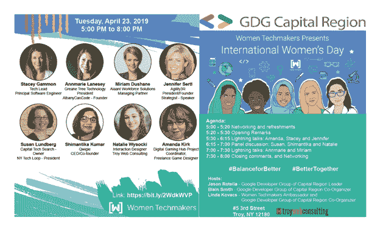

# 2019 年国际妇女节庆祝活动

> 原文：<https://www.freecodecamp.org/news/international-womens-day-2019-celebration/>

****幕后****

****成为女性技术大使****

2018 年，我决定开始我的远程自由职业生涯，并通过完成认证的最后一个 FreeCodeamp 项目和参加 AlbanyCanCode bootcamp 来继续扩展我的全栈开发者知识。

我开始经常光顾 Meetups，并与首都地区的谷歌开发者团队建立了良好的关系，在那里我爱上了 Flutter，谷歌的移动应用 SDK，用于从单一代码库构建漂亮的原生 iOS 和 Android 应用。2019 年 2 月，我被任命为谷歌开发者团队负责人/联合组织者和首都地区女性技术创客大使，并开始让更多女性参与 GDG 编码活动和会议。我开始通过动手操作 Codelab 在 Flutter 上主持每月一次的 GDG 会议，在我的第一次北美女性科技创客在线会议上，我了解到谷歌支持我们在 3 月和 4 月推广国际妇女节庆祝活动。

****国际妇女节活动筹备****

因为是二月的最后一天，我不可能在日历上标记的 3 月 8 日举办活动。我开始与 Jason Rotella 一起制定细节，他是我们在 GDG 的主要创始人，在组织活动方面有丰富的经验。我们正在考虑一个有 2-3 名演讲者、20 名与会者的小型活动，以及一个对女性和男性开放的 3 小时活动。杰森开始给我们过去的赞助商和演讲者发电子邮件，并把我介绍给他们。

这是一次奇妙冒险的开始，最终成为一次非常成功的事件。每个人都回答说，希望成为活动的一部分。很快我们发现我们处于一个非常困难的境地，不得不拒绝提供场地，因为我们已经同意了。对于演讲者，我们决定欢迎接受我们邀请的所有 8 位女性演讲者，尽管我们知道 3 个小时是不够的，并考虑到明年要举办一整天的活动。这是一个很大的惊喜，发现我们的社区走到一起，创造了在 IWD 庆祝活动的影响。

我们开始工作，协调每一个小细节，以确保 3 小时的活动将是一个难忘的。我们的赞助商 Troy Web Consulting 不仅超出了我们的要求，也超出了我们的期望。他们甚至在活动的最小细节上也让我感到惊讶，比如会议室的鲜花，一幅献给 IWD 的美丽图画，在注册点欢迎我们的客人，以及许多其他每秒都吸引我的目光并让我微笑的事情。他们还专门负责活动图片，并为音频和视频服务的研究提供便利。来回要开一个半小时的车，对我来说，会场提供的茶点对我来说是一个巨大的压力。

很快，筹备这项活动变成了一项全职工作，但这是值得的。我们开始与场馆代表和发言人开会，让每个人准备好从活动中期待什么以及如何准备。我们围绕#BalanceforBetter 和“我们在一起更好”(#BetterTogether)等话题讨论活动的焦点。

在 AlbanyCanCode 的一个训练营中，我得到了帮助来宣传这个活动，有将近 12-14 名女性和少数男性参加了这个活动。在某一点上，我们不得不在 Meetup 中设置 RSVP 的上限，阻止出席，并开始与场馆代表讨论房间容量以及最终的可能性，以容纳更多的人，因为收到了大量的请求。我们与他们一起制定了一个解决方案，从最初的 20-30 个房间增加到 40-50 个房间，并重新开放了 Meetup RSVP。即使这样，在活动当天，我们承认还有其他人试图注册活动，但跑出了房间，他们还是出现了。公众是多种多样的，在这个房间里，55 个女性中几乎有 40 个不愿意或不感兴趣转向科技行业。

****大日子——****[****国际妇女节活动****](https://www.meetup.com/Google-Developer-Group-of-the-Capital-Region/events/259908829/)

**International Women’s Day 2019**

即使在最小的细节上准备一切，仍然会给你带来惊喜和挑战，让你去面对和解决。幸运的是，我在活动开始前一个小时就出现了，我能够及时解决一些技术问题。不仅如此，我们的演讲者也尊重预定的时间，我们不必担心时间不够，也不必在最后仓促行事。对于那些直到活动结束才离开的人，我可以说会议室在活动结束前都是满的，我们有一个抽奖时间，有一些谷歌奖品，如谷歌迷你和谷歌虚拟现实。

在这里你可以找到一些事件的[照片和](https://www.meetup.com/Google-Developer-Group-of-the-Capital-Region/photos/29920636)事件的[视频。](https://youtu.be/zzyruEj_5Ak)

**Amanda Krik**

我们的第一位闪电演讲嘉宾是 ****阿曼达·克里克****——游戏设计师、教育家和终身游戏爱好者阿曼达已经为各种各样的观众设计了十多年的游戏。她目前白天担任 RPI 数字游戏中心的协调员，与当地行业和学校合作，改善该地区的游戏开发。在业余时间，她从事自己的个人项目，做自由职业者，并介绍了各种各样的游戏开发主题，包括游戏开发的包容性，开源游戏开发，项目管理和游戏设计。

阿曼达谈到了游戏行业的性别平衡以及诸如冒名顶替综合症与现实之间的自信问题。她解释了学习新技能的挑战和寻求建议/帮助的不适，对任务长度和难度的错误预期，甚至是对失败的恐惧，以及如何克服它们，因为在游戏周期中经常会通过玩游戏来克服——失败并获得乐趣。Amanda 准备了一个简单的游戏演示叫 Ren'Py，但是我们建议不要现场编码以避免问题，因为时间很短。她能够用幻灯片展示演示，并向观众解释一个 15 分钟编码游戏的过程，并展示每个人都可以编码并加入游戏行业。 [****视频****](https://youtu.be/masma9SO7tE)

**Stacey Gammon**

我们的下一位演讲者是 ****斯泰西·盖蒙—**** 她曾在国家安全局、谷歌工作，最近是 Elastic 的技术主管兼首席软件工程师。和阿曼达一样，斯泰西也谈到了科技行业的信心&骗子综合症。她解释了如何在找到工作之前、之中和之后处理它。她的座右铭是“抓住机会，相信自己！”通过个人的例子，Stacey 解释了给自己更多的信任会给你带来更多的机会。

她还解释了面试是如何主观的，自信或怀疑会给面试官留下积极或消极的印象，并改变获得工作的机会。不仅如此，在得到这份工作后，自信会影响你在工作中的成功和成长，她的意思是，如果你不明白某件事，不要认为这是你缺乏知识的反映，而是要大胆说出更多的意见。

Stacey 解释了自信，尤其是在领导岗位上，有时会被理解为过于直接或咄咄逼人，她建议听取反馈，调整，学习，成长。包括你在内的每个人都会犯错误，有些情况下没有简单的答案，但继续对自己有信心和信念是你职业生涯持续成功不可或缺的一部分。 [****视频****](https://youtu.be/B2ZI8f4zCVU)

**Jennifer Sertl**

我们的轻松谈话由下一位演讲者继续进行 ****詹妮弗·塞尔****——agility 3r 的总裁和创始人，这是一家致力于加强战略技能和帮助领导者变得更有弹性、反应更敏捷和更善于反思的领导力发展公司。她是 Triarchy 出版社出版的《战略领导力与灵魂》的合著者。她目前是社会创新峰会的现场社交媒体大使，该峰会每半年在华盛顿州、DC 和硅谷举行一次。她作为北部风险连接(UVC)和医疗技术协会的顾问，帮助建设纽约北部。
詹妮弗解释了世界是平的，尤其是在社交媒体上。对她来说，拥有清晰的声音和观点使我们能够获取信息，利用我们的专业知识，并在本地和全球范围内寻找社区，以加速实现我们的战略目标。

Jennifer 与我们分享了一些有助于表达你的观点的策略，以及扩大你的观点以支持战略业务目标的方法。

●增强信心的策略

●打造个人品牌的方法

●管理和组织社交媒体信息的方式

Jennifer 是一位经验证的 Twitter 专家，85 个国家和 353 个城市都在关注她的工作。她是这些纽约北部公司的战略家:Gryt Health，Upstate Venture Connect，MedTech Association 和第二大道软件。她分析了她与客户合作的真实例子，如苹果销售平台以及有形和无形资产的转换。“在任何人雇佣你之前，他们都会在网上搜索你的信息。所以留下一串数字痕迹，让你成为专家”(多莉·克拉克)

Jennifer 向公众介绍了如何正确使用社交网络作为企业的资产。她介绍了敏捷 3R 计划:弹性、响应性和反思。 [****视频****](https://youtu.be/-k1QB_pBNRg)

短暂休息后，我们的节目继续进行小组讨论，由三位演讲者回答我们的问题并与公众互动。

**Susan Lundberg**

**Shimantika Kumar**

**Natalie Wysocki**

****苏珊·伦德伯格**** —资本技术搜索公司 19 年的所有者，于 2018 年创办了纽约技术循环公司，这是一个专注于发展软件社区的协会。

****shiman tika Kumar****—20 年在各行业担任营销和销售职位的经验。她在伊利诺伊大学香槟分校接受了市场营销和广告方面的正规教育。Sam 曾在钢铁、医疗保健、金融科技(金融科技)和数字媒体等行业担任营销角色。
目前，她是一名企业家，正在进行她的第一次创业，这是一款名为 Qwigle 的移动应用。

娜塔莉·威索基——娜塔莉在密歇根大学学习信息科学，并作为一名交互设计师在特洛伊网络咨询公司工作了近两年。她热爱自己的工作，因为它结合了艺术、技术和人。虽然她仍处于职业生涯的早期，但她渴望成为一名领导者和技术娴熟的设计师。

小组讨论由谷歌开发者小组负责人兼首都地区联合组织者 Blain Smith 主持，重点讨论了工作场所的多样性和各组织采用的宣传技巧等问题。

苏珊讨论了女性在劳动力中的作用以及科技行业雇佣女性的要求。Natalie 解释了多元化在她的组织中的作用，以及她的组织在发展多元化、包容性文化方面取得的成功。她还将自己作为设计师的角色与拥抱多样性联系起来，因为这份工作需要与客户和用户产生共鸣，以及跨越多个学科弥合利益相关者和队友之间的差距。

Shimantika 解释了她对多样性的看法，这种看法超越了性别多样性，触及了文化多样性。多学科团队的多样性，他们有能力创造不同的产品，因为不同专业背景的人参与进来会产生不同的观点。

娜塔莉通过讨论她打算如何支持她的同事来阐述人们背景的想法。有些人可能会害羞，而另一些人则更喜欢大胆。因此，她描述了同情他人并以适合他们性格的方式帮助他们的重要性。她提倡倾听和关注团队的动态。

苏珊带来了女性和男性之间的差异，以及关注如何对待他人，你喜欢如何对待他人，从而带来了多样性领域的平衡。

Shimantika 强调了这样一个观点，即如果你相信你想要追求的想法，就要杀死所有其他的解决方案，去追求你自己的解决方案。

苏珊提到了导师在我们的道路上所做的贡献，这些贡献赋予了我们沿途所做的决定。她让人们意识到女性不是其他女性的好导师，也没有能力感谢别人的赞美。

Natalie 分享了她在组织中的经验，她认为组织中的领导机会非常容易获得。她描述了对于一个有想法、有抱负的人来说，会见首席执行官并领导变革计划是多么容易。

公众还分享了他们自己与多样性有关的经历、他们自己的斗争以及他们如何克服这些困难。公众又一次惩罚了女性领导人，因为她们无法指导其他妇女，将妇女之间的竞争带到了桌面上，如何通过支持其他妇女来克服这种竞争，对于任何竞争概念来说都很难生存。

我们的发言者在讨论中提出了自己的观点，倡导多样性。给人们公平竞争的机会，给每个人领导的机会。因为有些害羞的人可能认为他们的想法不够好。鼓励他们追求自己的想法，支持他们表达自己的想法。此外，还提到了我们应该采取哪些步骤来使宣传在专业领域而不仅仅是在其他领域更加有效。在科技行业为女性创造更多的空间不仅仅意味着开发领域，还包括设计和其他任何技术领域。 [****视频****](https://youtu.be/K7yxCnpk_6I)

**—2008 年，安玛丽与他人共同创立了格雷安树科技公司，这是一家纽约州认证的女性所有企业(WBE)。
2016 年，Annmarie 成立了 AlbanyCanCode，这是一个致力于帮助来自各种背景的当地人才找到地区技术领域就业途径的组织。她在 AlbanyCanCode、WMHT 和首都地区商会的董事会任职。**

******米丽娅姆·杜尚****—Alaant 劳动力解决方案公司的管理合伙人，该公司被公认为帮助雇主吸引、获得、聘用和留住最佳人才的全国领先公司之一。**

**Annmarie 和 Miriam 同步谈论了 AlbanyCanCode 和科技行业正在改变的生活。他们解释了如今计算机文化如何影响更多的妇女和其他无代表的类别，以及 AlbanyCanCode 计划如何通过改变首都地区的平衡对其产生影响。**

**他们谈论我们社区的编码训练营的热情为我们所有人打开了许多参与机会的大门，例如笔记本电脑登陆图书馆计划，使学生能够追求该计划提供的学习途径。为了让每个人都能上这门课，交通或儿童看护等服务的可用性非常重要。**

**讨论解释了公司参与该项目新毕业生的招聘过程。组织接受没有研究生学位的编码训练营毕业生的实际趋势使得 AlbanyCanCode 通过提供所有隐藏的人才在我们的社区中产生了巨大的影响。事实是，学校没有教学生，也没有让他们为新的就业行业做好准备。**

**奥尔巴尼 Can Code 是从 K-12 到入门级再到职业中期的管道。为了解决软件劳动力的多样性，并在我们整个地区培养代码素养，关键是:授权中小学教师在课程日包括编码活动。**

**奥尔巴尼 Can Code 与首都地区的地区合作，在 2017 年接触了一百多名 K-12 教育工作者。两年内，AlbanyCanCode 有 103 名学生毕业(每年翻一番)，其中大约一半已经在 IT 行业找到了工作。许多人已经通过编码训练营完成了额外的课程。教授的技能是前端、后端、数据库、自动化测试课程中的编码技能，以及沟通、团队合作、思维方式、习惯和项目经验、简历、面试和网络方面的工作准备等软技能。**

**雇主网络是 AlbanyCanCode 最大的资产之一，网络中有 100 多个雇主，其中近 20 个参与了课程。他们通过课堂参观、故事、简历帮助、模拟面试来参与导师计划。此外，他们带来了技术:什么是新的，什么是旧的，你需要什么。他们参与毕业生的安置，提供实习、学徒和初级职位。如何让每个人都参与进来？我们中的任何人都有许多方法可以帮助 AlbanyCanCode 在社区中成长，作为讲师、场地、新兵、导师和雇主。**

**如前所述，人们相信到处都有隐藏的天赋，包括萨拉托加县。2019 年，扩大斯克内克塔迪和奥尔巴尼的覆盖范围在萨拉托加县举办的课程中取得了很好的效果，并有计划在 2019 年夏天和秋天扩大目录。 [****视频****](https://youtu.be/o4UVgT5BHrA)**

**我们以抽奖活动结束了我们的活动，并承诺明年我们将举办一整天的活动，不仅让演讲者有机会分享他们的经验，而且让每个人都享受在我们的小刹车期间似乎如此强大的网络部分。由于我们的社区表现得如此强大，并一起努力宣传国际妇女节，我们决定明年记住这一点。**

**由于国际妇女节活动的成功，包括许多女性观众，使他们意识到这个机会，我们看到了女性加入我们的编码实验室的转变，这在谷歌开发者小组 Meetup 上得到推广，这非常受欢迎，我们仍在努力。**