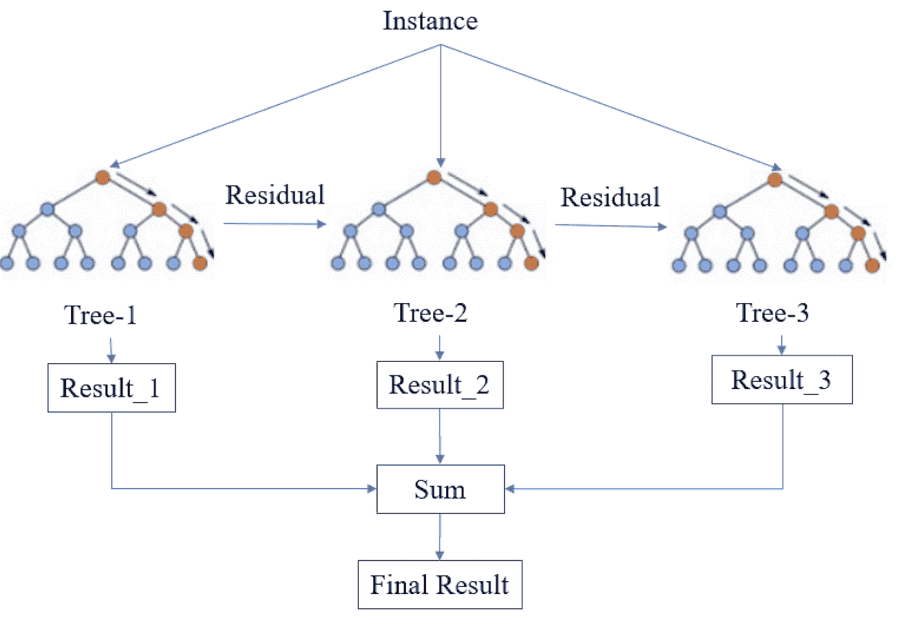
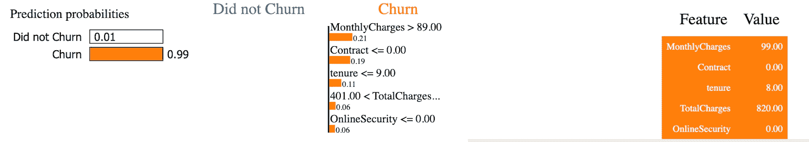
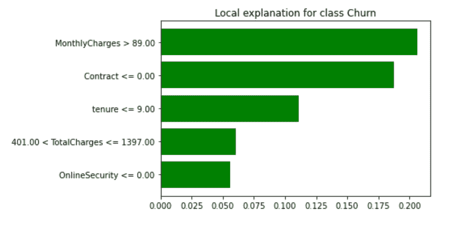
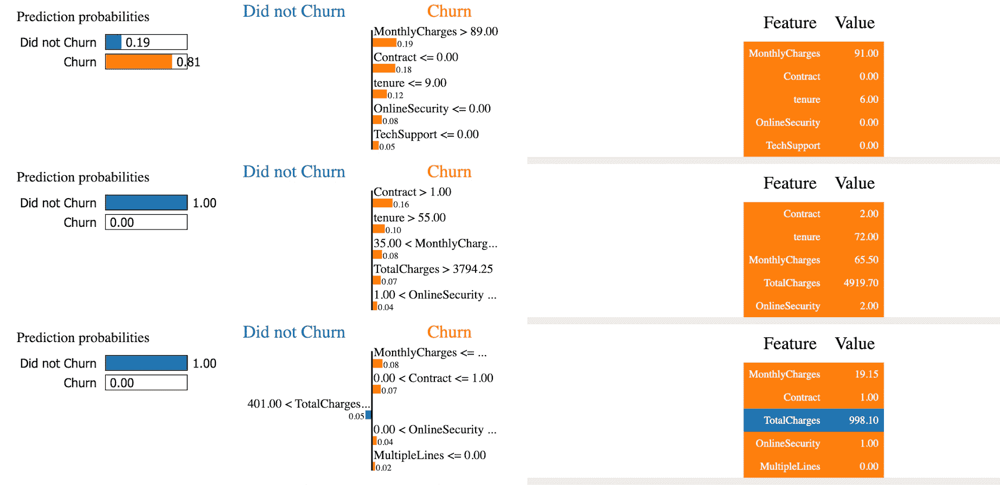
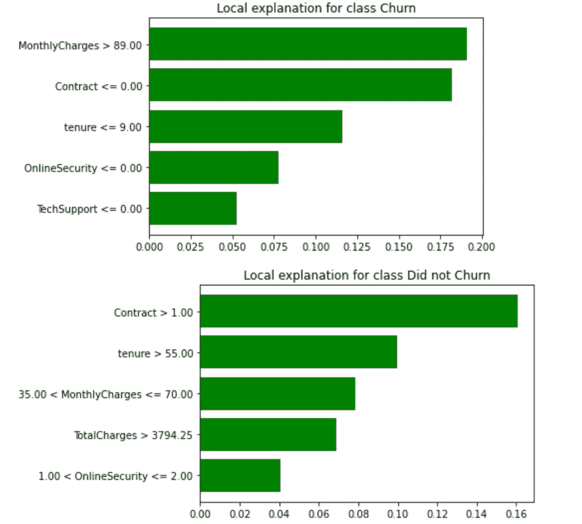
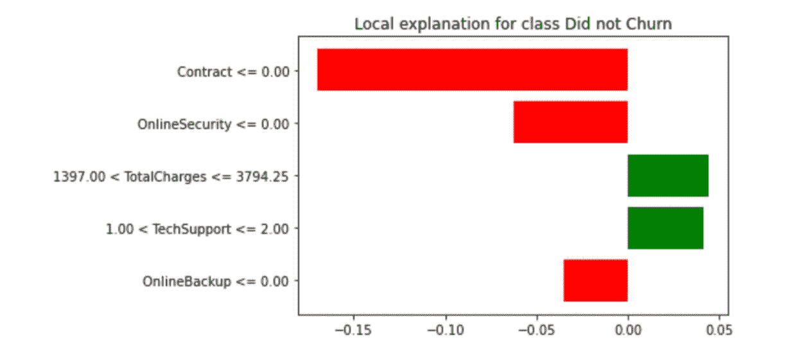

# 如何使用 LIME 解释黑盒模型(本地可解释的模型不可知解释)

> 原文：<https://www.freecodecamp.org/news/interpret-black-box-model-using-lime/>

机器学习模型是黑盒模型。通过给这些模型输入，我们可以根据我们使用的特定模型得到输出。

人类解释事物的方式与机器解释事物的方式不同。因此，使用可以将某些机器学习模型的输出转化为人类或非技术用户可以理解的东西的工具是有帮助的。

在业务环境中，模型的解释在做出数据驱动的决策时扮演着重要的角色。我们对输出解释得越好，非技术用户就越容易理解输出。

因此，在本教程中，我将解释一个最流行的包，您可以使用它来解释输出的黑盒模型——一个名为 LIME(本地可解释模型不可知解释)的包。

## 什么是生活

LIME 是一个模型不可知的机器学习工具，可以帮助你解释你的 ML 模型。术语**模型不可知**意味着在训练数据和解释结果时，你可以将 LIME 与任何机器学习模型一起使用。

LIME 使用“固有的可解释模型”，如决策树、线性模型和基于规则的启发式模型，以可视化的形式向非技术用户解释结果。你可以用回归和分类问题来解释你的黑盒模型。

## 收集数据

在本教程中，我们将使用流失数据集来研究分类问题。我们将通过查看数据集中的一些特征来对客户是否会继续使用产品进行分类(流失率)。

你可以点击这里下载 Kaggle [电信客户流失数据集。](https://www.kaggle.com/datasets/blastchar/telco-customer-churn/code)

## 数据预处理

因为本教程关注的是 LIME 作为可解释性工具的实现，所以我们将只对各种特性做一些预处理步骤。

我们通过检查与目标结果(客户流失)不相关的列来开始预处理。您可以使用以下代码删除 CustomerID:

```
# Dropping all irrelevant columns
df.drop(columns=['customerID'], inplace = True)
```

Dropping CustomerID column

我们还有一些没有正确输入的缺失值。为了简单起见，我们使用以下代码删除了缺失的值:

```
# Dropping missing values
df.dropna(inplace=True)
```

Figure 2\. Dropping Missing Values

我们应该做的另一个预处理步骤是查看分类列。绝大多数机器学习模型不能处理分类特征。所以我们必须将这种类型的特征预处理成数字表示。

我们可以进行各种转换，例如标签编码、散列技巧、一次热编码、目标编码、顺序编码和频率编码。

对于本教程，我们将使用 scikit-learn 库来使用标签编码技术，如以下代码所示:

```
# Label Encoding features 
categorical_feat =list(df.select_dtypes(include=["object"]))

# Using label encoder to transform string categories to integer labels
le = LabelEncoder()
for feat in categorical_feat:
    df[feat] = le.fit_transform(df[feat]).astype('int')
```

Figure 3\. Label Encoder

值得注意的是，当您处理实际的 ML 问题/数据集时，您会希望确保执行适当的预处理、特征工程、交叉验证、超参数调整等，以获得更好的预测。

## 用 XGBoostClassifier 建模和 LIME 实现

XGBoostClassifier 是一种 XGBoost 算法，可用于解决分类问题。它的工作原理是将数据构建到决策树中，并使用残差按顺序再次构建到下一个决策树中。

该算法可帮助您提高模型预测的性能，使其更接近实际情况。这是因为它通过帮助错误分类的预测(弱学习者)成为强学习者来改善它们。它通过学习在下一个决策树的下一次迭代中使用的错误分类预测来做到这一点。

您可以查看下图，了解该算法是如何工作的:



Figure 4\. Simplified XGBoost ([source](https://www.researchgate.net/figure/Simplified-structure-of-XGBoost_fig2_348025909))

我们可以在对我们的训练数据完成训练过程之后实施 LIME。

我们通过将数据分成训练和测试数据集来开始训练过程，以避免过度拟合。我们可以使用 scikit-learn 中提供的拆分方法，如以下代码所示:

```
features = df.drop(columns=['Churn'])
labels = df['Churn']
# Dividing the data into training-test set with 80:20 split ratio
x_train,x_test,y_train,y_test = train_test_split(features,labels,test_size=0.2, random_state=123)
```

Figure 5\. Splitting the data

我们选择特性和目标结果( **churn** )，并将数据分成训练和测试数据。然后，我们可以通过基于我们正在使用的机器学习模型的实例化对象来拟合 **X_train 和 y_train** 来开始训练。在本教程中，我们使用 XGBoostClassifier。

为了简化训练过程，我们初始化了 n 个估计量(决策树的数量)和随机状态。在一个真实的数据科学项目中，为了最大化该算法的能力，您需要调整许多参数。可以参考 [**XGBoost 参数**](https://xgboost.readthedocs.io/en/stable/parameter.html) 了解更多。

```
model = XGBClassifier(n_estimators = 300, random_state = 123)
model.fit(x_train, y_train)
```

Figure 6\. Training Process

在通过训练过程拟合数据之后，我们将致力于解释本地可解释性。本地可解释性包括分析特定数据实例的每个特征。我们可以选择一个特定的实例/样本，根据特定的样本来检查特性如何与目标结果相关联。

```
np.random.seed(123)
predict_fn = lambda x: model.predict_proba(x)
# Defining the LIME explainer object
explainer = lime.lime_tabular.LimeTabularExplainer(df[features.columns].astype(int).values,                                               mode='classification',
class_names=['Did not Churn', 'Churn'],                                                 training_labels=df['Churn'],                                                  feature_names=features.columns)
# using LIME to get the explanations
i = 5
exp=explainer.explain_instance(df.loc[i,features.columns].astype(int).values, predict_fn, num_features=5)
exp.show_in_notebook(show_table=True)
```

Figure 7\. LIME Implementation

为了获得对特定实例的解释，我们首先定义一个函数作为将在 LIME 框架上使用的概率得分。我们还实例化了 LIME explainer 对象。

LIME 有一个属性 lime_tabular，它可以解释特征如何与目标结果相关联。我们还可以指定分类的模式、目标结果(客户流失)的 training_label 以及我们在训练过程中选择的特征。

我们选择样本 5，我们将得到这个特定样本的解释。我们还在 num_features 参数上选择了对目标结果贡献最大的 5 个最重要的特性。

这些特征也称为特征重要性。要素重要性是检查输入要素和目标要素之间相关性的要素。该特征在特征重要性图中的分数越高，该特征就越重要以适合机器学习模型。

## 如何解释本地可解释性



Figure 8\. Local Interpretability Prediction

上图显示了三个图表，每个图表都显示了关于我们的客户及其流失率的重要信息。

左图显示，数据中的样本 5 显示的置信区间表明该数据有 99%流失，而只有 1%表明该实例没有流失。

中间的图表显示了这个特定样本的特性重要性分数，其中**月费**具有 **21%的特性重要性分数**，随后是**合同**具有 **19%** 和**任期**具有 **11%** 。这些特性是有意义的，因为我们相信客户倾向于在**月费用越高时流失越多。**

右图显示了前五项功能及其各自的价值。以橙色突出显示的特征有助于**类** **1(流失)**，而以蓝色突出显示的特征有助于**类 0(非流失)**。

我们还可以绘制第二个图形的另一个版本，如下图所示。它显示了样本 5 的本地可解释性预测范围，其中该特定样本的月度费用大于 89，合同费用小于 0，总费用大于 401 且小于 1397。



Figure 9\. The range of Local Interpretability Prediction 

## 如何解读全球可解释性

LIME 还通过 SP-LIME 算法提供了另一种解释，该算法采用代表性样本从黑盒模型中提取全局视角。

这种技术不仅帮助非技术用户理解特定实例中的数据(本地可解释性)，还帮助他们从整体上理解数据。通过理解许多有代表性的示例及其解释，非技术用户可以从全局角度捕捉数据实例。

```
# Let's use SP-LIME to return explanations on a few sample data sets 
# and obtain a non-redundant global decision perspective of the black-box model
sp_exp = submodular_pick.SubmodularPick(explainer, 
                                        df[features.columns].values,
                                        predict_fn, 
                                        num_features=5,
                                        num_exps_desired=5) 
```

Figure 10\. SP-LIME Implementation

我们使用 SP-LIME 上可用的子模块属性来获得数据实例的全局视角。然后，我们使用以下代码将数据可视化为 SP-LIME 算法提取的可视化全局代表性样本:

```
[exp.show_in_notebook() for exp in sp_exp.sp_explanations]
print('SP-LIME Explanations.') 
```

Figure 11\. SP-LIME visualization 



Figure 12\. The range of global interpretability Prediction

您可以看到 SP-LIME 如何为每个**代表性样本构建区间值。**例如，第一个代表性样本显示置信区间为 81%流失，而 19%表示实例没有流失。

影响这个实例如何变动的特性有**每月费用、合同、任期、在线安全和技术支持**。您可以在下面第一个代表性样本的特征重要性柱状图中看到这一点。我们还可以使用以下代码绘制上图中每个代表性样本的中间图的另一个版本:

```
[exp.as_pyplot_figure(label=exp.available_labels()[0]) for exp in sp_exp.sp_explanations]
print('SP-LIME Local Explanations')
```

Figure 13\. SP-LIME Feature Importance



Figure 14\. First and Second Representative samples

在图 12**上的第二个代表性样本上，**置信区间为 100%不流失。影响该实例如何不流失的特征是**合同、任期、每月费用、总费用和在线安全**，如下面第二个代表性样本的特征重要性条形图所示。



Figure 15\. Third representative sample

在**图 12** 上的第三个代表性样本上，置信区间为 100%不流失。影响该实例如何不流失的特征是**契约、在线安全、**和**在线备份**，如上面第三个代表性样本的特征重要性图所示。

看这个笔记本就能看到数据[上 LIME 和 SP-LIME 的实现。](https://nbviewer.org/github/naiborhujosua/Blog_Notes/blob/main/notebook/interpreting-black-box-models.ipynb)

这里有一篇关于信任模特的有趣文章。

# 感谢您的阅读！

真的很感谢！🤗。我写与机器学习和深度学习相关的主题。我尽量让我的帖子简单而精确，总是提供可视化和模拟。