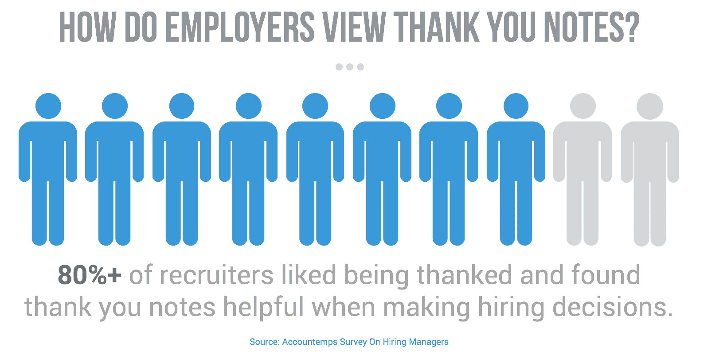
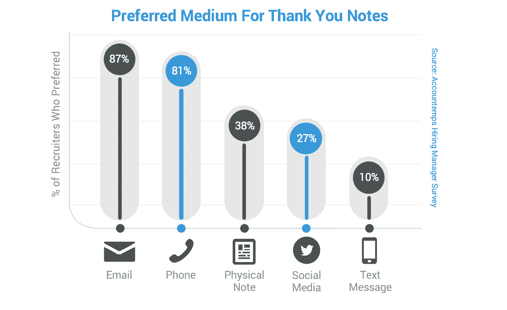

# 这是最有效的面试后感谢邮件

> 原文：<https://www.freecodecamp.org/news/interview-thank-you-email/>

**“今天和你谈话很愉快。感谢你推荐阅读《更少的力量》，也许我们可以在你看完部落后交换笔记！我们将很快就下一步行动保持联系。”**

这是我写给一位销售副总裁的面试后感谢信的一部分。收到回复四个小时后，我接到招聘人员的电话，向我提供了一份工作。

在我被录用一个月后，我和那个副总裁进行了一次一对一的谈话，她问我的第一个问题是关于我们互相推荐的书。

在收到感谢邮件之前，我们花了 40 分钟在电话上讨论介绍、行为问题和案例研究，看看我是否适合这个角色。虽然那次谈话是做出决定的因素之一，但我的回答在她看来并不突出。

留下深刻印象的是个人风格。

作为一名求职者，在求职过程中你需要关注两件事:

1.  **我如何与那些能影响招聘决策的人建立关系**
2.  我怎样才能从所有竞争这份工作的候选人中脱颖而出

面试后的感谢邮件是一个非常有效(而且非常简单)的策略，涵盖了这两个方面。76%的求职者也忽视了这一点。谈低挂水果！

在面试了几十家超过 100 人的公司后，我有机会发送(并测试)大量的感谢信。这篇文章将带你浏览我发现的最有效的模板，它帮助我在谷歌、微软、Twitter 等领先公司找到了工作。

## ****为什么面试后的感谢很重要****

在我们进入技术层面之前，首先理解为什么写一封感谢信很重要是很重要的。

大多数人走出大楼的时候都认为他们的面试已经结束了。不管是他们彻底粉碎了还是事情没有按计划进行，现在都不在他们的掌控之中了，对吗？

别这么快。

顶级公司的招聘经理非常关注候选人如何以及何时跟进。大多数人都希望得到某种形式的感谢，而不表示感谢实际上可能会让你丢掉工作。

数据显示，近 80%的招聘经理认为感谢信在决定候选人时很有帮助。22%的雇主是不太可能雇佣一个做 ****不做**** 的求职者发一个感谢和 [91%实际上 **喜欢** 被感谢](http://rh-us.mediaroom.com/2012-06-14-Survey-Reveals-Email-Phone-Call-Are-Preferred-Methods-for-Post-Interview-Follow-Up)(想象一下！).

除了迎合你潜在雇主的期望，感谢信也是一种从竞争中脱颖而出的简单方法。尽管有上述数据，但只有 24%的求职者会在面试后花时间发一封感谢信。

## ****第一部分:一封出色的感谢邮件的基本知识****

在我们深入了解面试后感谢信的模板和例子之前，我们先来看看发送感谢信的基本原则，这会增加你获得工作机会的几率。

### 我应该给他们发邮件、打电话，还是在 Twitter 上联系他们？

如果你在谷歌上搜索“面试感谢信”，你会得到各种推荐的发送方式——电子邮件、电话、推特、短信，甚至手写的感谢信。

所有这些都可以完成工作，但我们希望选择一种方法，让另一端的面试官快速轻松地完成工作。

数据显示，面试官更喜欢通过电子邮件收到感谢信(电话紧随其后)，而不是滑入他们的 DMs 系统:

当你在面试当天在房间里时，问别人要电子邮件比要电话号码要自然得多。除此之外，电子邮件允许你花时间构思你的回复，你可以使用像 [Yesware](http://www.yesware.com/) 这样的工具来跟踪你的回复，以帮助衡量你的兴趣。

出于这些原因，我建议通过电子邮件发送所有的感谢信。

**“但是如果我忘记要他们的邮箱而没有呢？”**

没问题！有很多工具可以让追踪某人的电子邮件地址变得非常容易。我最喜欢的两个是 [Hunter.io](http://www.hunter.io/) 和【VoilaNorbert.com】T2。你只需要这个人的全名和他们公司网站的链接(所以如果他们在特斯拉工作，应该是 www.tesla.com)。

当你拿到他们的电子邮件后，去[邮件测试器](http://www.mailtester.com/)并插入它来验证它是否存在于公司的电子邮件服务器上。如果是的话，你就可以走了！

如果所有这些都失败了，你可以给招聘人员发电子邮件，向他们要这个人的联系方式。当然，最好提前发一封，但是你最好忍气吞声发一封感谢邮件，而不是什么都不发。

### 什么时候是表达谢意的最佳时机？

这是我经常遇到的问题。

当谈到与招聘经理跟进、在社交媒体上发布文章或向联系人发送突发新闻时，时机就是一切，这背后有一门科学。

说到感谢信，黄金法则很简单:

> 尽可能快地发送感谢邮件，同时给自己留出足够的时间来撰写一封高质量的邮件。

如果你是一个喜欢数字的人，在面试后的两个小时内拍摄 30 分钟，但是如果你在当天晚些时候才能把头发拿出来，就不要拔头发。生活是一种阻碍，晚一点发送比根本不发送重要得多。

### 你应该用什么主题来写感谢信？

有时候，想出一个主题行可能是写电子邮件最难的部分！在这种情况下，你不需要发疯——简短扼要就可以了。我的建议是:

*   [姓名]感谢您今天抽出时间
*   从我们今天的采访继续
*   和你谈话很愉快
*   谢谢大家！

这些中的任何一个都可以达到目的！

### 最后，校对一切！

最后，但肯定不是最不重要的，在你发送感谢邮件之前，校对每一个细节！

如果你在 Gmail 之类的网站上写感谢信，我强烈建议你安装一个插件，比如语法插件 T1 或者 T2 海明威 T3。他们会找出任何拼写错误 **和** 提出更好的语法建议来帮助提高你的写作。

一旦你面前有了你的终稿，大声读出来！然后发给朋友，得到双重确认。如果之后一切正常，就可以发送了！

> ****Pro 提示:**** 为了帮助你以后节省时间和减少错误，你可以使用像 RightInbox 这样的工具，从你的消息中创建一个预先制作好的[邮件模板](https://www.rightinbox.com/blog/how-to-set-up-email-templates-in-gmail)。这是一个巨大的时间节省，因为你只需要填写特定的领域，不必担心错误弹出从复制，粘贴和编辑。

## ****第二部分:面试后感谢邮件模板&示例****

既然我们已经介绍了优秀感谢信的基本知识，我们可以深入到写一封脱颖而出并让你被录用的感谢信背后的科学。

首先，我们将说出两种常见的感谢信模板，你应该避免使用**。这些是每个人最终都会使用的电子邮件模板，因为它们简单而普通。我们的目标是脱颖而出——在其他人都摇摆不定的时候摇摆不定——这意味着我们不想要乏味的样板。**

**接下来，我将向你介绍我的感谢邮件策略背后的方法论。我将向你展示如何撰写一封邮件，让你在竞争中脱颖而出，并在面试官的候选名单中名列前茅。然后你可以得到一份我的面试后感谢信模板，以及几封来自我所在社区的真实人物的感谢信。**

### **避免使用两种常见的感谢邮件模板**

**既然你已经知道了发送感谢邮件的原因、时间和方式，那就让我们深入了解一下制作一封邮件背后的科学原理，它能帮助你与面试官建立关系，并从其他应聘者中脱颖而出。**

**我们先来看看大多数应聘者在面试后发送感谢邮件时会犯的错误。**

**说到致谢，最常见的形式有两种:**

******坏邮件#1(不要用这个！)******

> ****尊敬的先生姓氏:****

> **今天，我很高兴与您谈论[公司]的助理客户经理职位。 **这份工作似乎非常符合我的技能和兴趣。****

> **除了我的热情之外，我还将把出色的写作技巧、自信和鼓励他人与部门合作的能力带到这个职位上。**

> **感谢您抽出时间来面试我。我非常有兴趣为您工作，并期待您对该职位的回复。**

> ****真诚，****

> ****名称****

**这封邮件展示了零个性，而且非常正式，以至于看起来很不专业。你刚刚在一个房间里花了一个小时试图与这个人建立关系，你希望你的感谢信是你们谈话的反映！**

**下面是第二常见的电子邮件:**

******不良邮件#2(也不要用这个！)******

> ****喜名，****

> ****感谢您今天抽出时间来见我。我真的很高兴能与你谈论这个职位，并期待着下一步的行动。****

> ****最好，****

> ****你的名字****

**虽然这比第一封邮件好得多，但它留下了很多问题。同样，在和某人聊了一个小时后，你应该比 **有更多的话要说，“谢谢，希望尽快收到你的来信！”****

**记住，你的感谢信是一个让你脱颖而出的大好机会，可以继续与面试官建立关系，巩固他们心中的积极联系。**

**我们要确保尽我们所能利用这三件事。**

## ******一封很棒的感谢信在面试时开始******

**为了最大化我们的感谢信的价值，我们需要在面试中收集尽可能多的信息。**

**这些细节来自你在面试开始前的闲聊，你的答案或简历引发的对话，以及你问面试官的问题。**

**这与其说是一门科学，不如说是一门艺术，真是熟能生巧。以下是一些帮助你开始的建议:**

*   **在面试开始前，总会有几分钟的闲聊——利用这段时间来引发一场谈话。例如，如果是星期一或星期二，问问他们的周末过得怎么样。如果是周三到周五，询问他们是否对即将到来的周末有计划。**
*   **如果他们开始说话，问后续问题。你让他们继续的时间越长，你获得的信息就越多，他们在大脑中与你产生积极联系的几率就越大。**
*   **面试结束时，准备好问题([这是我最喜欢的问题清单](https://cultivatedculture.com/5-questions-to-ask-in-an-interview/))。我总是在采访结束时问他们工作之外的私人生活。**

**你在面试中获得的个人信息越多，你在感谢信中包含的信息就越多。**

**还记得我在这篇文章开篇引用的回应吗？**

**那位副总裁问我最近读的一本书对我有什么影响。我一回答，就问了她同样的问题。我没有读过她提到的那本书，但我对作者(赛斯·戈丁)非常熟悉。**

**我接着问她喜欢读什么( **)“你是那种只看非小说的人吗？”** )以及她如何在疯狂的日程安排下找到时间阅读。**

**这两个后续问题引发了持续 15 分钟的对话，帮助我建立了融洽的关系。**

**在我的感谢信中，我提到我订购了这本书，并感谢推荐。一周后(读完之后)，我又跟她联系了一下，提到了作者提出的我最喜欢的两点。**

**感谢信中的提及帮助我获得了这份工作，后续工作帮助我在一位高层管理人员的支持下开始了新的职业生涯。**

## ******最有效的感谢邮件模板******

**如上所述，在我找工作的过程中，我参加了 50 多次面试，和 100 多人交谈过。这意味着大量的感谢信，更好的是，有大量的机会来测试哪种格式效果最好。**

**毕竟，下面的模板是我的数据显示最有效的。我用回答的人的百分比以及我在下一轮面试中获得一个职位(或获得聘用)的成功率来衡量“有效性”。**

**这就是它工作的原因。**

**首先，我们以“谢谢你”开始这听起来很愚蠢，但是你会惊讶于有多少人没有在他们的便条上写上“谢谢”(说真的，我在我辅导的人身上看到了惊人的数量)。他们不是真的说出来，而是通过说“和你聊天很愉快”之类的话来暗示(T2)**

**人们都很忙，尤其是当你在食物链上走得更远的时候。他们的时间是宝贵的，承认这一点大有帮助。不要只是暗示，把话写出来！**

**接下来，我们要向他们表明我们倾听并理解了他们。**

**在今天的世界上，全神贯注是很少见的，像面试官这样的人希望从你身上得到注意力。通过概括你在谈话中谈到的一点，这表明你在倾听和参与。**

**如果你在谈话的基础上增加了一个行动，或者分享了一个相关的(和高质量的)内容，你会得到加分！**

**然后，在邮件的最后，我们在 PS 中以个人角度做完全相同的事情。为了获得最好的结果，提及对面试官给你的建议采取行动，说明你的结果，并以一个后续问题结束。**

**这有助于巩固你在面试官心目中的参与度，并为继续对话和建立关系敞开大门。**

**既然你已经理解了为什么感谢信的每一部分都很重要，那么让我们来看看几个例子，看看一封出色的面试后感谢信是什么样的:**

### ******我的面试后感谢邮件模板&示例******

**[**点击这里免费获得我的经过验证的感谢信模板**](https://cultivatedculture.com/thank-you-email-template/) ，以及实用的感谢信实例和其他面试技巧。**

**你所需要做的就是复制、粘贴、填空，然后点击发送！**