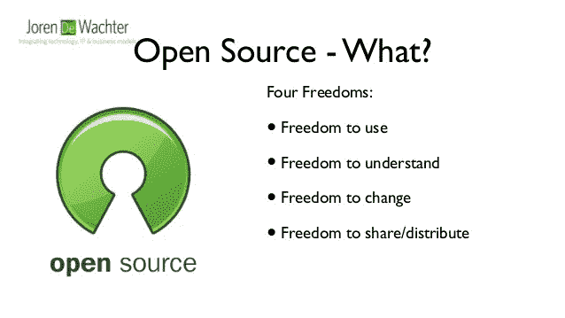
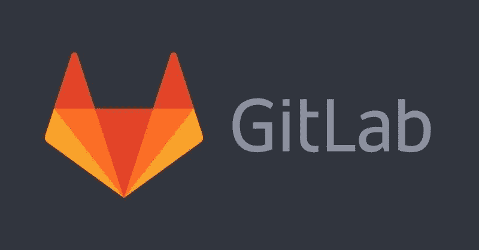

# 采访 Gitlab 发行工程师和 Debian 开发者 Balasankar C

> 原文：<https://www.freecodecamp.org/news/interview-with-gitlab-distribution-engineer-and-debian-developer-balasankar-c-4c9bce476b65/>

作者:库里安·贝诺伊

# 采访 Gitlab 发行工程师和 Debian 开发者 Balasankar C

这是我们采访在开源世界工作的了不起的人的系列的另一章。

Balasankar C

Balasankar(巴鲁)C 是一名活跃的自由开放源码(FOSS)贡献者。在过去的 9 年里，他一直在为各种自由/开源软件组织做贡献，如 [Debian](https://wiki.debian.org/Balasankar%20C) 、 [Gnome](https://www.gnome.org/) 、 [Firefox](https://mozillians.org/en-US/u/balasankarc/) 、[Swathanthra Malayalam Computing](https://smc.org.in/)、Diaspora 和 [WikiGrandhashala](https://ml.wikisource.org/wiki/%E0%B4%AA%E0%B5%8D%E0%B4%B0%E0%B4%A7%E0%B4%BE%E0%B4%A8_%E0%B4%A4%E0%B4%BE%E0%B5%BE) 。他的贡献范围从语言计算到软件打包和软件开发。他是 Debian 开发者、Gnome 基金会成员和 Mozillian。除了在 Gitlab 的日常工作之外，他还将大部分时间用于开源项目。

#### 关于该系列:

我一直致力于 CloudCV 和 FOSSASIA 等组织的许多开源项目。对我个人来说，这是一次美妙的学习经历，我遇到了许多了不起的导师。

这个采访系列的主要目的是激励更多的人在听到这些故事后为自由/开源软件项目做出贡献。我希望你能从这些了不起的人身上看到一些激励你为开源项目做贡献的模式。正如 FOSSASIA 联合创始人马里奥贝林(Mario Behling)所说:只要做出贡献，机会就会向你飞来。

所以不多说了，这是采访的文字记录。

**Kurian Benoy:** 你好，巴鲁，感谢你在高知脸书开发者圈的精彩演讲后抽出时间接受我们的采访。

**Balasankar C:** 没问题。很高兴成为这个系列的一部分。

Kurian Benoy: 开源和自由软件有什么区别？有人说这只是政治，新手不应该在意。你有什么感觉？

假设这里放了一支黄色的铅笔。考虑到它的功能性，你可能会说它是一支锋利的铅笔。考虑到它的外观，Nithin 可能会说它是一支黄色的铅笔。当你想到开源软件和自由软件时，这就是它们的区别。自由软件和开源软件都是基于四大自由的。

自由软件哲学重视自由。开源认为它是一种开发方法，多人共享和查看代码。这样，错误很容易被修复。正如莱纳斯·托沃兹(Linus Torvalds)所言:“有了足够多的眼球，所有的 bug 都是肤浅的”。

开源方法论认为，通过提供这些自由，产品本身会变得更好。开源强调协作开发，当具有不同专业知识和多样性的多人查看代码时，它最终会形成一个伟大的产品。

Four freedoms [source:Slideshare]

自由软件认为自己是社会的延伸。如果你看看世界是如何进步的，你会发现这是通过共享自然资源、知识、技术等实现的。

当你编码的时候，更多的时候你是在扩展或者基于现有的知识。你可以获得这些知识，因为它的最初创造者没有在你的道路上设置障碍。因此，从伦理上讲，你锁定你的创造，从而阻止其他人利用它做出更好的东西，是完全错误的。

想象一下，如果你买了一辆自行车，公司告诉你不能倒蹬自行车或者不能改变自行车的颜色，这似乎不合逻辑。因为你对自行车有一种拥有感，因此知道你有自由骑自行车而不受公司的限制。同样，在软件的情况下，你有权了解它是如何工作的。所以说买了软件不能修改是不合逻辑的。

回答你的问题，不，初学者不应该关心这个。我尊重斯托曼，理解他的眼光。开源没有犯任何错误。他关于工作的政治和哲学是必要的，我们的社会实际上是建立在分享文化之上的。我们的最终目标仍然是一个自由软件世界，我们应该关心哲学。然而，我们需要一步一步地朝着这个目标努力。这样一个折中的办法就是开源软件。作为一个初学者，你不需要关心像自由软件、自由/开源软件或 FLOSS 这样的术语。作为初学者，要明白自由很重要，这一切都是建立在四大自由的基础上的。

在我自由软件之旅的最初几年，我是一个坚定的自由软件倡导者，并且对开放源码这个术语直言不讳。但是，从我在旅途中获得的经验来看，我的观点已经改变，我对整个局势有不同的看法。

因此，初学者不必担心从一开始就把它做好。你在与他人交谈和从事项目时获得这些知识。重要的是你为项目做贡献。

Kurian Benoy: 开始为开源组织做贡献的最佳实践是什么？

Balasankar C: 你对各种开源项目做出贡献的方式取决于项目的类型以及组织运作的方式。我要说的是如何做出贡献的一般工作流程:

*   阅读贡献者指南和项目的自述文件。
*   检查项目的问题列表。
*   阅读代码风格和要遵循的代码指南。例如，请不要让你的代码不缩进。？
*   阅读项目的源代码，经常可以在 GitLab 或者 GitHub 中找到。
*   尝试解决问题。如果不能，试着加入与项目相关的 IRC/Gitter 房间，或者任何其他开发者论坛。不要犹豫问问题。
*   打开一个拉取请求。
*   如果你发现一个问题，继续发送电子邮件或在 Gitter 等论坛上互动。与贡献者展开良好的对话。
*   继续为项目做贡献。贡献可以是任何东西，比如修复 bug、文档、特定服务的本地化或代码贡献。

Kurian Benoy: 你对 Hacktoberfest 等开源激励措施有什么看法？除了获得 t 恤，人们还应该关注这些计划的哪些方面？仅仅一个黑客啤酒节就能成为开源贡献者吗？

在我看来，Hacktoberfest 的整个想法是好的，对许多人来说，得到一件 t 恤是一个巨大的动力。买一件 t 恤从来都不是问题。毕竟，公司喜欢给你免费赠品。重要的是，你在 Hacktoberfest 之后做了什么。您是否跟进了处于反馈阶段的待定 PRs？你还在继续为开源做贡献吗？这些才是真正的问题。如果你从 Hacktoberfest 中得到的唯一东西是一件 t 恤，那么你的 t 恤就变得毫无意义。

本质上，如果你没有发现任何对自由/开源软件项目有贡献的热情，任何关于这个项目的想法，你基本上浪费了你的时间(项目维护者至少从你那里得到了贡献/修正)。？

对我来说，重要的是在这个项目中工作如何激发了你。如果它让你对解决你正在处理的问题感到好奇，或者让你有兴趣了解更多关于这个项目的信息，这是值得花时间的。我没有看到这种情况的一个常见例子是谷歌代码之夏。大多数时候，参与者在 GSoC 之后停止对项目的贡献，这经常引起关注——“GSoC 中的人只是为了钱吗？”

所以，买一件 t 恤很有趣。这不是禁忌。但是，如果它让你走上了贡献的道路，它就变得有价值了。

除了获得奖品，人们这样做的一个原因是声称自己是“开源贡献者”。有趣的是，他们中的大多数人并没有意识到对自由/开源软件项目做出适当的、持续的贡献并不需要那么多。基本的英语学习，和求知欲，你可以成为一个非常成功的贡献者，而不需要依靠任何噱头。

如果你的思维过程是“工业界的人很乐意雇佣开源人员，所以我的帽子上有这些羽毛会很棒”，那就有点小问题了。是的，自由/开源软件贡献者在这个行业有很好的机会。但是，在招聘的时候，检查你是否是一个合适的贡献者并不困难——你是否适合公司。公司通常会做这样的检查。？

**库里安·贝诺:**[GitHub](https://github.com/)和 [GitLab](https://about.gitlab.com/) 有什么区别。为什么要用 GitLab？

**Balasankar C:** 我先说 GitHub 的好话。GitHub 已经存在了大约 12 年，许多主要的自由/开源软件项目都使用 GitHub 进行代码托管。GitHub 推广了协作开发，并对开源方法论有很大帮助。

然而，我发现 GitLab 更胜一筹，无论是从哲学角度还是实践角度。从哲学上讲，即使 GitHub 为 FOSS 做出了相当大的贡献，但他们的核心代码库仍然是专有的。然而，GitLab 的大部分代码都是在 MIT 许可下发布的，甚至代码库的专有部分也是“源代码可用的”(这意味着你可以阅读代码，甚至克隆回购协议。你就是不能违反许可)。

从实用的角度来看，作为一个用户，我发现 GitLab 拥有比 GitHub 更多的功能。对 GitLab 页面中所有静态站点生成器的持续集成和持续部署(CI/CD)支持等特性对许多用户都很有用。

我认为 GitHub 主要是一个“具有审查能力的代码共享平台”，而 GitLab 涵盖了整个 DevOps 生命周期。

现在，稍微深入一下 GitLab 的特性，我上面提到过它覆盖了整个 DevOps 生命周期。这意味着，从有想法并与同行讨论，到在 IDE 中实现代码，再到将代码部署到不同的环境并监控这些部署，GitLab 为您提供了在同一界面中完成所有这些工作的工具。因此，不像其他解决方案，你必须在多个服务之间跳转来执行所有这些，你可以只使用 GitLab。

我提到过 GitLab 也有专有部分。这主要涉及对较大公司(比如，超过 250 名员工)有意义的特性——像史诗、路线图、或多组发布板等特性。

普通用户甚至中小企业需要的大部分代码都可以作为自由软件获得。正因为这个原因，我认为 GitLab 对自由软件有更友好的态度和承诺。

库里安·贝诺伊:我们绝对热爱[德比安](https://www.debian.org/)！你认为 Debian 的未来会怎样？

**Balasankar C:**Debian 的未来取决于 Linux 的未来。如果问题是关于 Debian 包(这里有 Snaps、Flatpaks 和 Docker 容器)，我不认为任何剧烈的变化会很快发生。我们谈论的是一个拥有大约 70，000 个软件包的巨大存储库。

Debian 周围的技术栈(包、构建工具、工作流等等)。)变化也取决于它的衍生品，主要是 Ubuntu。不管我对 Ubuntu 有什么问题，不可否认的事实是 Ubuntu 是最常用的 GNU/Linux 发行版。因此，该公司如何推进项目将对 Debian 和其他衍生项目产生严重影响。

在我看来，就像 RedHat 如何让“企业 Linux”成为一个东西一样，Ubuntu 向家庭用户介绍了 GNU/Linux。无论是通过他们的营销技巧，还是设计决策，他们都对 GNU/Linux 的流行产生了严重的影响。

我个人认为 Debian 作为一个操作系统非常需要一些营销。我不是说没有它我们会死，但我认为它肯定会有帮助。我没有看到 Debian 做任何适当的宣传努力，或者试图让它在家庭用户中更受欢迎。由于其传奇般的稳定性，它在系统管理员中大受欢迎，因此在市场中的地位是稳固的。但是，如果我们要扩大视野，我们就必须用不同的方式思考。

Kurian Benoy: 你对麻省理工学院和 GPLv3 这样的开源许可怎么看？

Balasankar C: 这和我之前提到的某件事有关。我认为一个所有软件都免费的社会是一个光荣的最终目标——作为自由/开源软件的传播者，我们都应该为之努力并争取实现。而 GPL 是这样一个社会的最佳选择。

然而，为了达到最终目标，我们必须走得更远，并努力让所有部门都理解原因。这肯定包括工业。GPL 不受工业界的欢迎并不奇怪，因为它自动地使任何相关的代码在 GPL 下发布(除了在简单聚合下的情况，这种情况允许你将一个 GPL 许可的软件的二进制代码嵌入到另一个软件中，而不用在 GPL 许可下发布整个代码)。工业，就其本质而言，有一种追求利润的心态，对任何可能影响利润的事情都保持警惕。所以，“发布你做的所有东西，让其他人可以自己修改和发布”对他们来说有点吓人。他们是对是错是另一个讨论，但事实是这样一个问题是存在的。

在我看来，许可许可证迎合了这个问题。他们在确保直接用户获得所有四种自由的同时，不会对开发人员施加进一步的限制。我认为它们是当前社会经济形势下的必要妥协。我看到的主要优势是，它导致公司使用自由/开源软件项目并在这些许可证下发布他们的大多数库——因此使他们成为自由软件。所以，总的来说，它导致了世界上更多的自由软件。是的，不理想，但无法避免。

(就我个人而言，我最近开始在 copyleft 和 MIT 两种许可下许可我所有的个人代码。我告诉我的用户，我更喜欢他们使用 copyright left 许可证并为此做出贡献，但是我把决定权留给了用户。)

**Kurian Benoy:**FOSS 爱好者和大学毕业的普通人有什么区别？

Balasankar C: 这是我经常遇到的一个问题——作为一名学生，我为什么要为自由/开源软件做贡献。以我个人的经验，我可以向你保证。当参加校园安置面试时，如果你是一个自由/开源软件的贡献者，你将在你的同龄人中脱颖而出。这是因为作为自由/开源软件的贡献者给了你一些特殊的、独特的技能，这是所有雇主都想要的。

*   ***解决问题的心态***——你对自由/开源软件项目做出贡献不是因为有人强迫你，也不是因为有人向你承诺了什么。你这样做是因为你对一个问题或争论很好奇，并且有坐下来花些时间解决问题的想法。不管修复的只是拼写错误还是实现主要功能的 100 行代码。重要的是，有一个问题，你努力去解决这个问题，主要是因为你有这样做的热情。雇主喜欢有激情的人，因为正是这种激情推动了创新，带来了效率。
*   ***编码礼仪*** *-* 在为一个自由/开源软件项目做贡献的时候，经常和你互动的人都是已经做了相当一段时间的人。这种体验将会反映在他们对你的反馈中，并最终反映在你的工作中。例如，在印度，大学培训学生正确的编码实践或给出编码指南是很少见的。但是，工业界希望程序员遵循标准的指导方针、适当的风格等。他们通常通过向新员工提供培训课程来弥合这一差距。但是，如果你是一个自由/开源软件的贡献者，你已经知道所有这些的机会是相当高的，这使得雇主的工作更容易。
*   ***团队合作和工具*** *-* 就像编码标准一样，你在为自由/开源软件项目做贡献时所熟悉的另一件事就是团队合作。大多数自由/开源软件项目都涉及到来自世界各地的贡献者，你经常与这些多样化的劳动力交流和互动。没有比这更好的机会来了解如何与团队合作。

Kurian Benoy: 非常感谢你接受采访。

Me interviewing Balasankar C (source: Nikhil Vasanth)

谢谢你和我一起探索这次采访。如果你发现它足智多谋，在**形式的鼓掌中升值，股票会真正升值！**

另外，您的反馈有助于我在未来更好地改进这个系列，所以如果有的话，也请发表相同的评论。直到我们采访的下一个开源英雄，再见，继续为开源做贡献！