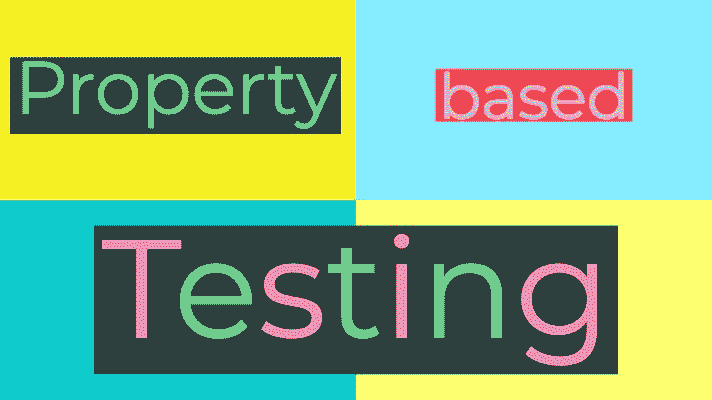
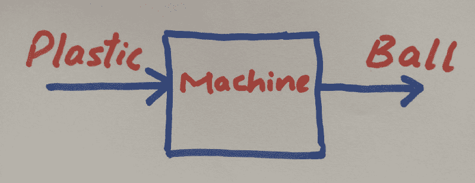
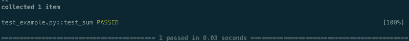
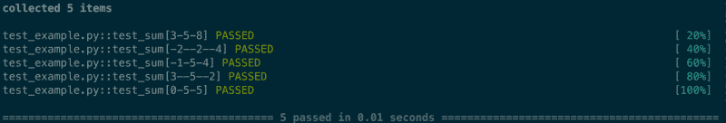
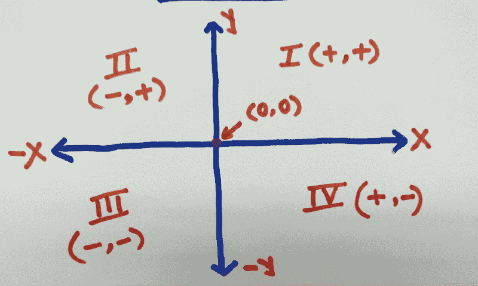
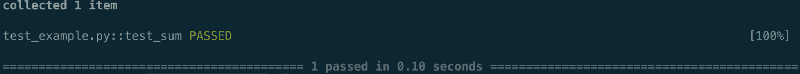
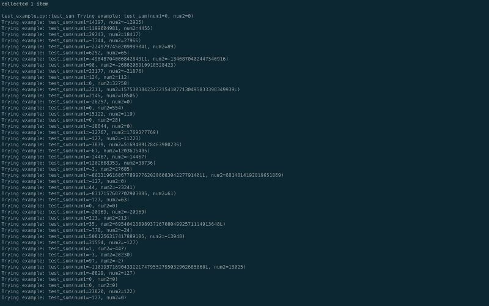
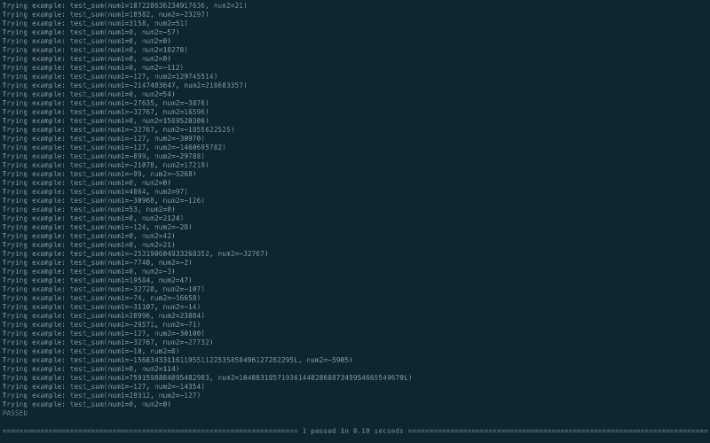
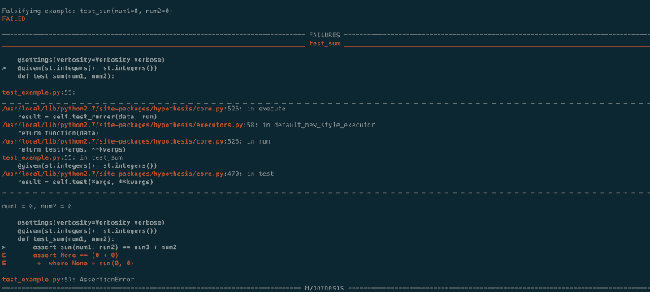
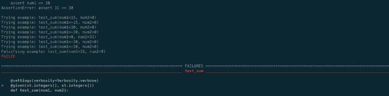

# Python 中基于属性的测试简介

> 原文：<https://www.freecodecamp.org/news/intro-to-property-based-testing-in-python-6321e0c2f8b/>

作者沙希·库马尔·拉贾

# Python 中基于属性的测试简介



在本文中，我们将学习一种独特而有效的测试方法，称为基于属性的测试。我们将使用[**Python**](https://www.python.org/)[**pytest**](https://docs.pytest.org/en/latest/)和 [**假设**](https://github.com/HypothesisWorks/hypothesis/tree/master/hypothesis-python) 来实现这种测试方法。

本文将使用**基本 pytest 概念**来解释基于属性的测试。我推荐你[阅读这篇文章](https://medium.com/testcult/intro-to-test-framework-pytest-5b1ce4d011ae)来快速温习你的 pytest 知识。

我们将从我们大多数人使用的常规单元/功能测试方法开始，称为**基于实例的测试** — 。我们试图找到它的缺点，然后转移到基于属性的方法来消除这些缺点。

每一个伟大的魔术都由三部分组成。第一部分叫做“质押”。**魔术师向你展示一些普通的东西**:一副牌、一只鸟或一个人。他给你看了这个东西。也许他要求你检查它，看看它是否真的是真实的、未改变的、正常的。但是当然…很可能不是。

### 第 1 部分:基于实例的测试

基于示例的测试方法有以下步骤:

*   给定测试输入 **I**
*   当传递给被测函数时
*   应返回一个输出 **O**

所以，基本上我们给定一个固定的输入，期望一个固定的输出。

通俗地理解这个概念:



A machine under test

假设我们有一台机器，它把任何形状和任何颜色的塑料作为输入，生产出一个颜色相同的完美圆形塑料球作为输出。


Photo by [Greyson Joralemon](https://unsplash.com/photos/9IBqihqhuHc?utm_source=unsplash&utm_medium=referral&utm_content=creditCopyText) on [Unsplash](https://unsplash.com/search/photos/ball?utm_source=unsplash&utm_medium=referral&utm_content=creditCopyText)

现在，为了使用基于示例的测试来测试该机器，我们将遵循以下方法:

1.  取一个蓝色的生塑料(**固定测试数据**
2.  将塑料送入机器
3.  期望蓝色塑料球作为输出(**固定测试输出**)

让我们以编程的方式来看看同样的方法。

**先决条件:**确保你已经安装了**Python**(2.7 版或以上)和 **pytest** 。

创建如下所示的目录结构:

```
- demo_tests/    - test_example.py
```

我们将在文件`test_example.py`中编写一个小函数`sum`。它接受两个数字——`num1`和`num2` ——作为参数，并返回两个数字相加的结果。

```
def sum(num1, num2):    """It returns sum of two numbers"""    return num1 + num2
```

现在，让我们按照常规方法编写一个测试来测试这个 sum 函数。

```
import pytest
```

```
#make sure to start function name with testdef test_sum():    assert sum(1, 2) == 3
```

这里你可以看到，我们正在传递两个值`1`和`2`，并期望总和返回`3`。

通过遍历到`demo_tests`文件夹，然后运行以下命令来运行测试:

```
pytest test_example.py -v
```



1 test case passing

**该测试是否足以**验证`sum`功能的功能性？

你可能会想，当然不是。我们将使用`[pytest parametrize](https://docs.pytest.org/en/latest/reference.html#pytest-mark-parametrize-ref)`特性编写更多的测试，它将为所有给定值执行这个`test_sum`函数。

```
import pytest
```

```
@pytest.mark.parametrize('num1, num2, expected',[(3,5,8),              (-2,-2,-4), (-1,5,4), (3,-5,-2), (0,5,5)])def test_sum(num1, num2, expected):        assert sum(num1, num2) == expected
```



All 5 test passes

使用五个测试给了功能更多的信心。所有这些逝去的感觉都像是天赐之福。

**但是**，如果你仔细看，我们做的和上面一样，但是有更多的值。我们仍然没有涵盖几个边缘案例。

因此，我们发现了这种测试方法的第一个难点:

#### 问题 1:测试的详尽性取决于编写测试的人

他们可能选择编写 5 或 50 或 500 个测试用例，但是仍然不确定他们是否已经安全地覆盖了大多数(如果不是全部)边缘用例。

这给我们带来了第二个难题:

#### 问题 2——由于对需求的理解不清楚/不明确，导致测试不可靠

当我们被告知要写我们的`sum`函数时，传达了哪些具体细节？

我们被告知:

*   我们的函数应该期待什么样的输入？
*   我们的函数在意外的输入场景中应该如何表现？
*   我们的函数应该返回什么样的输出？

更准确地说，如果你考虑我们上面写的`sum`函数:

*   我们知道`num1`、`num2`应该是`int`还是`float`吗？它们也可以作为类型`string` 或任何其他数据类型发送吗？
*   我们应该支持的`num1`和`num2`的**最小值**和**最大值**是多少？
*   如果我们得到`null`输入，函数应该如何表现？
*   sum 函数返回的输出应该是`int`或`float`或`string`还是其他任何数据类型？
*   在什么情况下应该显示错误信息？

此外，上述测试用例编写方法的**最坏情况场景**是这些测试用例可能会被有缺陷的函数骗过**。**

让我们重新编写我们的`sum`函数，这样会引入错误，但是我们到目前为止编写的测试仍然通过。

```
def sum(num1, num2):    """Buggy logic"""       if num1 == 3 and num2 == 5:        return 8    elif num1 == -2 and num2  == -2 :        return -4    elif num1 == -1 and num2 == 5 :        return 4    elif num1 == 3 and num2 == -5:        return -2    elif num1 == 0 and num2 == 5:        return 5
```


All tests are still passing

现在让我们深入基于属性的测试，看看这些痛点是如何减轻的。

第二幕叫做“转折”。魔术师把普通的东西变得不同寻常。现在你在寻找秘密……但你不会找到，因为你当然没有真正在寻找。你不会真的想知道的。你想被愚弄。

### 第二部分:基于属性的测试

#### 介绍和测试数据生成

基于属性的测试最初是由 [**快速检查**](https://en.wikipedia.org/wiki/QuickCheck) 框架在 [**Haskell**](https://en.wikipedia.org/wiki/Haskell_(programming_language)) 中引入的。根据另一个基于属性的测试库的文档

> 基于属性的测试框架检查属性的真实性。属性是这样的陈述:

> *for all (x，y，…)*

> *如前提条件(x，y，…)成立*

> *属性(x，y，…)为真*。

为了理解这一点，让我们回到我们的塑料球发生机的例子。

该机器的基于性能的测试方法是:

1.  选择大量塑料作为输入(`all(x, y, …)`)
2.  确保它们都是彩色的(`precondition(x, y, …)`)
3.  输出满足以下特性(`property(x, y, …)` ) -


Photo by [Melanie Magdalena](https://unsplash.com/photos/wJ0tVIs09N8?utm_source=unsplash&utm_medium=referral&utm_content=creditCopyText) on [Unsplash](https://unsplash.com/search/photos/ball?utm_source=unsplash&utm_medium=referral&utm_content=creditCopyText)

*   **输出为圆形/球形**
*   **输出是彩色的**
*   **输出的颜色是色带**中的一种颜色

注意我们是如何从输入和输出的固定值中**归纳出**我们的测试数据和输出，使得**属性对于所有有效的输入都应该为真**。这是基于属性的测试。

此外，请注意，当考虑属性时，我们必须更加努力，以不同的方式思考。就像当我们想到既然我们的输出是一个球，它应该是圆形的，你会想到另一个问题- **球应该是空心的还是实心的**？

因此，通过让我们更加努力地思考和质疑需求，基于属性的测试方法使得我们的需求实现更加健壮。

现在，让我们回到 sum 函数，并使用基于属性的方法来测试它。

这里出现的第一个问题是:`sum`函数的输入应该是什么？

在本文的范围内，我们将假设整数集中的任何**整数**的**对**都是有效的输入。



**Cartesian coordinate system**

因此，位于上述坐标系中的任何一组整数值都将是我们函数的有效输入。

**下一个问题**是:如何获取这样的输入数据？

这个问题的**答案**是:一个基于属性的测试库为您提供了在一个前提条件下生成大量所需输入数据的特性。

在 Python 中， [**假设**](https://github.com/HypothesisWorks/hypothesis/tree/master/hypothesis-python) 是一个属性测试库，它允许你和 pytest 一起编写测试。我们将利用这个图书馆。

假设的整个文档写得很漂亮，可以在这里找到➡️[](https://hypothesis.readthedocs.io/en/latest/quickstart.html)****，我推荐你去浏览一下。****

****要安装假设:****

```
**`pip install hypothesis`**
```

****并且我们很好地将假设与 pytest 结合使用。****

****现在，让我们用假设生成的新数据集重写我们之前编写的`test_sum`函数。****

```
**`from hypothesis import given`**
```

```
**`import hypothesis.strategies as st`**
```

```
**`import pytest`**
```

```
**`@given(st.integers(), st.integers())def test_sum(num1, num2):    assert sum(num1, num2) == num1 + num2`**
```

*   ****第一行简单地从假设中导入了`given`。`[**@given**](https://hypothesis.readthedocs.io/en/master/details.html#hypothesis.given)`装饰器获取我们的测试函数，并将其转换成参数化的函数。当被调用时，它将在大范围的匹配数据上运行测试函数。这是假说的主要切入点。****
*   ****第二行从假设导入`[**strategies**](https://hypothesis.readthedocs.io/en/master/data.html#module-hypothesis.strategies)`。**策略提供了生成测试数据**的功能。Hypothesis 为大多数内置类型提供了约束或调整输出的策略。同样，可以组合更高阶的策略来生成更复杂的类型。****
*   ****您可以使用策略生成以下任何内容或其组合:****

```
**`'nothing','just', 'one_of','none','choices', 'streaming','booleans', 'integers', 'floats', 'complex_numbers', 'fractions','decimals','characters', 'text', 'from_regex', 'binary', 'uuids','tuples', 'lists', 'sets', 'frozensets', 'iterables','dictionaries', 'fixed_dictionaries','sampled_from', 'permutations','datetimes', 'dates', 'times', 'timedeltas','builds','randoms', 'random_module','recursive', 'composite','shared', 'runner', 'data','deferred','from_type', 'register_type_strategy', 'emails'`**
```

*   ****这里，我们使用策略生成了`integers()`集合，并将其传递给`@given`。****
*   ****因此，我们的`test_sum`函数应该为给定输入的所有迭代运行。****

****让我们运行它，看看结果。****

********

****你可能会想，我看不出有什么不同。这次跑步有什么特别之处？****

****好吧，为了看到神奇的不同，我们需要通过设置`verbose`选项来运行我们的测试。不要将这种冗长与 pytest 的`-v`选项混淆。****

```
**`from hypothesis import given, settings, Verbosity`**
```

```
**`import hypothesis.strategies as stimport pytest`**
```

```
**`@settings(verbosity=Verbosity.verbose)@given(st.integers(), st.integers())def test_sum(num1, num2):    assert sum(num1, num2) == num1 + num2`**
```

****`[settings](https://hypothesis.readthedocs.io/en/latest/settings.html?highlight=verbosity#hypothesis.settings)`允许我们调整假设的默认测试行为。****

****现在让我们重新运行测试。这次还包括`-s`来捕获 pytest 中的流输出。****

```
**`pytest test_example.py -v -s`**
```

************

Zoom and see the generated cases**** 

****看看生成和运行的测试用例的数量。你可以在这里找到各种情况，比如 0，大数，负数。****

****你可能会想，令人印象深刻，但是我在这里找不到我最喜欢的测试用例对 **(1，2 )** 。如果我想让它运行呢？****

****嗯，不用担心，假设允许你通过使用`@[example](https://hypothesis.readthedocs.io/en/latest/reproducing.html#hypothesis.example)` 装饰器，每次运行一组给定的测试用例。****

```
**`from hypothesis import given, settings, Verbosity, example`**
```

```
**`import hypothesis.strategies as stimport pytest`**
```

```
**`@settings(verbosity=Verbosity.verbose)@given(st.integers(), st.integers())@example(1, 2)def test_sum(num1, num2):    assert sum(num1, num2) == num1 + num2`**
```

****

An example is always included in the test run.**** 

****另外，注意每次运行都将**总是**按照测试生成策略生成一个新的混杂的测试用例，从而使测试运行随机化。****

****因此，这解决了我们的第一个痛点——测试用例的详尽性。****

#### ****努力想出要测试的属性****

****到目前为止，我们看到了基于属性的测试的神奇之处，它可以动态地生成所需的测试数据。****

****现在让我们到了需要努力思考的部分，以不同的方式创建这样的测试，它们对所有测试输入**都有效，但对`sum`函数唯一的**有效。****

```
**`1 + 0 = 10 + 1 = 15 + 0 = 5-3 + 0 = -38.5 + 0 = 8.5`**
```

****嗯，很有意思。似乎将`0`加到一个数上会得到与 sum 相同的数。这叫做加法的**恒等性质。******

****让我们再看一个:****

```
**`2 + 3 = 53 + 2 = 5`**
```

```
**`5 + (-2) = 3-2 + 5 = 3`**
```

****看来我们又找到了一处独特的房产。此外，参数的顺序并不重要。放在+号的左边或右边，结果是一样的。这被称为加法的**交换性质。******

****还有一个，但我希望你能提出来。****

****现在，我们将重写我们的`test_sum`来测试这些属性:****

```
**`from hypothesis import given, settings, Verbosity`**
```

```
**`import hypothesis.strategies as stimport pytest`**
```

```
**`@settings(verbosity=Verbosity.verbose)@given(st.integers(), st.integers())def test_sum(num1, num2):    assert sum(num1, num2) == num1 + num2`**
```

```
 **`# Test Identity property    assert sum(num1, 0) = num1     #Test Commutative property      assert sum(num1, num2) == sum(num2, num1)`**
```

****

All tests passed.**** 

****我们的测试现在是详尽的——我们还转换了测试，使它们更加健壮。因此，我们解决了第二个痛点:**非健壮测试用例**。****

****出于好奇，让我们试着用之前用过的错误代码来欺骗这个测试。****

****

Ain’t no fooling this time.**** 

> ****正如一句古老的谚语所说——愚弄我一次，可耻的是你，愚弄我两次，可耻的是我。****

****您可以看到它捕获了一个错误。这仅仅意味着我们的预期属性对于这些测试用例对不成立，因此失败了。****

****但你还不会鼓掌。因为让东西消失是不够的；你必须把它带回来。这就是为什么每一个魔术都有第三步，也是最难的一步，我们称之为“声望”。****

### ******第三部分:收缩故障******

****[**收缩**](https://hypothesis.readthedocs.io/en/master/data.html?highlight=shrink) 是假设发现失败时，试图产生人类可读例子的过程。它把一个复杂的例子变成一个简单的例子。****

****为了演示这个特性，让我们给我们的`test_sum`函数再添加一个属性，它表示`num1`应该小于或等于`30.`****

```
**`from hypothesis import given, settings, Verbosity`**
```

```
**`import hypothesis.strategies as stimport pytest`**
```

```
**`@settings(verbosity=Verbosity.verbose)@given(st.integers(), st.integers())def test_sum(num1, num2):    assert sum(num1, num2) == num1 + num2`**
```

```
 **`# Test Identity property    assert sum(num1, 0) = num1     #Test Commutative property      assert sum(num1, num2) == sum(num2, num1)    assert num1 <= 30`**
```

****运行这个测试后，您将在终端上得到一个有趣的输出日志，如下所示:****

```
**`collected 1 item`**
```

```
**`test_example.py::test_sum Trying example: test_sum(num1=0, num2=-1)Trying example: test_sum(num1=0, num2=-1)Trying example: test_sum(num1=0, num2=-29696)Trying example: test_sum(num1=0, num2=0)Trying example: test_sum(num1=-1763, num2=47)Trying example: test_sum(num1=6, num2=1561)Trying example: test_sum(num1=-24900, num2=-29635)Trying example: test_sum(num1=-13783, num2=-20393)`**
```

```
**`#Till now all test cases passed but the next one will fail`**
```

```
**`Trying example: test_sum(num1=20251, num2=-10886)assert num1 <= 30AssertionError: assert 20251 <= 30`**
```

```
**`#Now the shrinking feature kicks in and it will try to find the simplest value for which the test still fails`**
```

```
**`Trying example: test_sum(num1=0, num2=-2)Trying example: test_sum(num1=0, num2=-1022)Trying example: test_sum(num1=-165, num2=-29724)Trying example: test_sum(num1=-14373, num2=-29724)Trying example: test_sum(num1=-8421504, num2=-8421376)Trying example: test_sum(num1=155, num2=-10886)assert num1 <= 30AssertionError: assert 155 <= 30`**
```

```
**`# So far it has narrowed it down to 155`**
```

```
**`Trying example: test_sum(num1=0, num2=0)Trying example: test_sum(num1=0, num2=0)Trying example: test_sum(num1=64, num2=0)assert num1 <= 30AssertionError: assert 64 <= 30`**
```

```
**`# Down to 64`**
```

```
**`Trying example: test_sum(num1=-30, num2=0)Trying example: test_sum(num1=0, num2=0)Trying example: test_sum(num1=0, num2=0)Trying example: test_sum(num1=31, num2=0)`**
```

```
**`# Down to 31`**
```

```
**`Trying example: test_sum(num1=-30, num2=0)Falsifying example: test_sum(num1=31, num2=0)FAILED`**
```

```
**`# And it finally concludes (num1=31, num2=0) is the simplest test data for which our property doesn't hold true.`**
```

****

Shrinking in action.**** 

****还有一个更好的特性——**它将记住这次测试的失败**，并将在未来的运行中包括这个特定的测试用例集，以确保不会出现同样的回归。****

****这是对基于属性的测试的魔力的一个温和的介绍。我建议大家在日常测试中尝试这种方法。几乎所有主流编程语言都支持基于属性的测试。****

****您可以在我的？ithub 回购。****

****如果你喜欢的内容显示一些❤️****