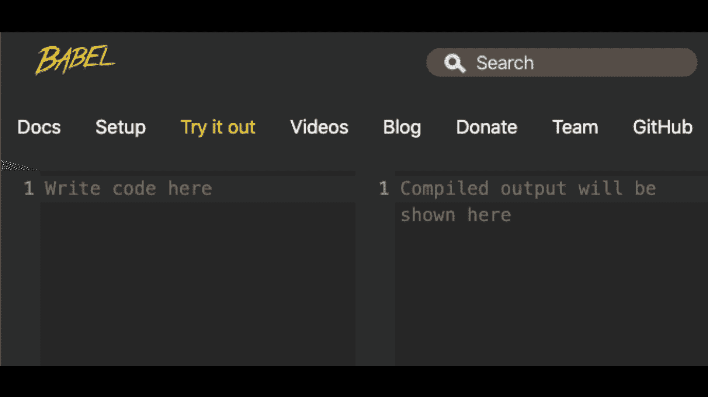

# 为什么应该使用 React 组件而不是 HTML

> 原文：<https://www.freecodecamp.org/news/intro-to-react-components/>

HTML 是网络的语言，但是仅仅用 HTML 创建整个网站可能是重复的，并且很难管理。

在本文中，我们将了解如何使用 JavaScript 库 React 来为我们的网站增加便利性和可重用性。

React 是一个强大的工具，适用于任何了解 HTML 并希望更快地构建更有组织性和动态网站的开发人员。

我们开始吧！

> 想要完整的指南从头到尾成为一名专业的 React 开发人员？看看 React 训练营。

## 为什么我应该使用 React 而不是 HTML？

React 于 2013 年问世，是用 JavaScript 构建网络应用的一种更好的方式。它通常被称为构建 ui 的库，是“用户界面”的缩写。

React 之所以是一个值得学习的库，是因为它没有取代 HTML。

它利用了 HTML 作为最流行的编程语言的流行性和优势，允许您使用与 HTML 非常相似的语法来构建界面，并使用 JavaScript 为其添加动态特性。

## 如何用 HTML 构建用户界面

鉴于 React 的多功能性，我们可以重新创建我们在网络上看到的任何网站或用户界面。

在这节课中，让我们重新制作一个你可能每天都会用到的应用程序的一部分——谷歌搜索。


如果您是反应的新手，这可能看起来有些雄心勃勃，但是它只需要了解两个简单的概念:HTML 和基本的 JavaScript 函数。

在不了解 React 甚至 JavaScript 的情况下，如何构建一个用户界面？

通过使用 HTML 元素作为简单 HTML 文档的一部分。

以下是当你在谷歌中搜索“reactjs”时，我们将如何显示出现的前三个结果。

```
<!DOCTYPE html>
<html>
  <head>
    <title>reactjs Search Results</title>
  </head>

  <body>
    <section>
      <div>
        <a href="https://reactjs.org"
          >React - A JavaScript Library for Building User Interfaces</a
        >
        <div>
          <h3>reactjs.org</h3>
        </div>
        <div>
          React makes it painless to create interactive UIs.
        </div>
      </div>
      <div>
        <a href="https://en.wikipedia.org/wiki/React_(web_framework)"
          >React (web framework) - Wikipedia</a
        >
        <div>
          <h3>https://en.wikipedia.org › wiki › React_(web_framework)</h3>
        </div>
        <div>
          React is a JavaScript library for building user interfaces.
        </div>
      </div>
      <div>
        <a href="https://twitter.com/reactjs?lang=en"
          >React (@reactjs) | Twitter</a
        >
        <div>
          <h3>https://twitter.com › reactjs</h3>
        </div>
        <div>
          The latest Tweets from React (@reactjs).
        </div>
      </div>
    </section>
  </body>
</html> 
```

如果我们只需要显示几个链接，单独使用静态 HTML 就可以了。

但是，我们如何像搜索引擎可能需要做的那样，以这种方式显示 100 或 1000 个链接，所有的链接都有不同的数据呢？

有什么更好的，也就是更简单更可扩展的写法？

单靠 HTML 是无法解决问题的。我们需要一种方法来使我们的网站更加动态，以显示尽可能多的链接。

当涉及到给站点添加行为时，我们需要 JavaScript。因为我们的目标是用 JavaScript 构建优秀的应用程序，所以我们知道使用 React。

## 如何将任何 HTML 网站升级到 React 应用程序

让我们把静态的 HTML 变成一个动态的 React 应用程序。

听起来很难？比你想象的简单。

我们可以用一个 HTML 文档构建一个 React 应用程序。我们所要做的就是用下面的外部脚本引入 React。*

```
<script src="https://unpkg.com/react@16/umd/react.development.js"></script>
<script src="https://unpkg.com/react-dom@16/umd/react-dom.development.js"></script>
<script src="https://unpkg.com/babel-standalone@6.26.0/babel.js"></script> 
```

第一个用于构建 React 应用程序，第二个用于在浏览器中显示或呈现 React 应用程序。

第一个是**反应**，第二个是**反应**。

第三个脚本是引入一个名为 **Babel** 的工具。我们一会儿会谈到它的作用。

下面是我们的代码此时的样子:

```
<!DOCTYPE html>
<html>
  <head>
    <title>reactjs Search Results</title>
    <script src="https://unpkg.com/react@16/umd/react.development.js"></script>
    <script src="https://unpkg.com/react-dom@16/umd/react-dom.development.js"></script>
    <script src="https://unpkg.com/babel-standalone@6.26.0/babel.js"></script>
  </head>

  <body>
    <!-- our script must have type="text/babel" for Babel to work -->
    <script type="text/babel">
      // React code will go here
    </script>
  </body>
</html> 
```

...而且几乎是 React app。

注意，我们有一个可以编写 React 代码的脚本，但是没有 HTML。

让我们解决这个问题。

## 如何创建和渲染我们的 React 应用

每个 React 应用都必须有一个入口点。

**入口点**是一个 HTML 元素，我们在这里将 React 应用程序插入页面。

传统的入口点是一个 id 为 root ( `<div id="root"></div>`)的 div。

我们将添加它，然后使用 ReactDOM 的`render()`函数来完成应用程序的渲染工作。

第一是 app 本身，意思是我们之前的 HTML，第二必须引用我们的入口点。我们可以通过说`document.getElementById('root')`来创建引用。

因此，现在我们拥有了运行 React 应用程序所需的一切:

```
<!DOCTYPE html>
<html>

  <head>
    <title>reactjs Search Results</title>
    <script src="https://unpkg.com/react@16/umd/react.development.js"></script>
    <script src="https://unpkg.com/react-dom@16/umd/react-dom.development.js"></script>
    <script src="https://unpkg.com/babel-standalone@6.26.0/babel.js"></script>
  </head>

  <body>
    <div id="root">

    </div>
    <!-- our script must have type="text/babel" for Babel to work -->
    <script type="text/babel">
      ReactDOM.render(
      <section>
      <div>
        <a href="https://reactjs.org"
          >React - A JavaScript Library for Building User Interfaces</a
        >
        <div>
          <h3>reactjs.org</h3>
        </div>
        <div>
          React makes it painless to create interactive UIs.
        </div>
      </div>
      <div>
        <a href="https://en.wikipedia.org/wiki/React_(web_framework)">React (web framework) - Wikipedia</a>
        <div>
          <h3>https://en.wikipedia.org › wiki › React_(web_framework)</h3>
        </div>
        <div>
          React is a JavaScript library for building user interfaces.
        </div>
      </div>
      <div>
        <a href="https://twitter.com/reactjs?lang=en">React (@reactjs) | Twitter</a>
        <div>
          <h3>https://twitter.com › reactjs</h3>
        </div>
        <div>
          The latest Tweets from React (@reactjs).
        </div>
      </div>
    </section>, document.getElementById('root'))
    </script>
  </body>

</html>
```

如果我们看看我们的结果，它像以前一样工作。完美！


现在让我们使用 React 通过动态显示我们的链接来改进我们的站点。

## 如何使用 React 组件使 HTML 可重用

如果我们检查我们的 HTML 结构，每个链接都由相同的部分组成。每个都有一个 URL、一个标题、一个较短的 URL 和一个摘录。对于每个链接，我们必须一次又一次地重复相同的 HTML 元素。

在编程中，如果你不得不大量重复自己，这可能是一个信号，表明你的代码可以以某种方式简化和缩短。作为程序员，我们总是努力尽可能少地重复自己。

我们尽量写干巴巴的代码，在那里你“不要重复自己。”

React 的核心是 JavaScript 和一些帮助我们构建应用的特性。

既然我们使用的是 JavaScript，那么 JavaScript 有什么特性可以让我们随心所欲地创建或输出任何东西呢？

一个功能。

让我们在这里创建一个，我们称之为链接。

```
function Link() {
  // create link HTML output
} 
```

原因是我们希望这个函数在每次调用时返回或输出一个链接的 HTML。

为此，让我们返回第一个链接的 HTML:

```
function Link() {
  return (
    <div>
      <a href="https://reactjs.org">
        React - A JavaScript Library for Building User Interfaces
      </a>
      <div>
        <h3>reactjs.org</h3>
      </div>
      <div>React makes it painless to create interactive UIs.</div>
    </div>
  );
} 
```

所以现在让我们用它来显示它返回的每个链接。

为此，在 React 中，我们可以像编写 HTML 元素`<Link />`一样编写它，而不是像调用`Link()`一样调用它。

如果你第一次看到这个，它可能会让你的大脑有点弯曲。

这里我们使用 HTML 语法，但是我们调用的是 JavaScript 函数！随着你越来越多地看到这种情况，你会对它感到舒服的。

(另外，你有没有注意到我们不需要使用开始和结束标签，就像它是一个普通的 HTML 元素一样？一会儿会有更多的内容。)

React 是如何将 HTML 格式的语法转换成 JavaScript 的？

它是在一个叫做 Babel 的特殊工具的帮助下完成的，这是我们添加的第三个脚本。你可以在这里看到它是如何工作的:



发生什么事了？

Babel 是一种叫做编译器的 JavaScript 工具，它将这些看起来像 HTML 的代码转换(“编译”)成有效的 JavaScript。

## 这种类似 HTML 的语法是什么？JSX

这个 HTML 实际上是 JavaScript，叫做 **JSX** ，代表“JavaScript XML”

如果你不熟悉的话，XML 是一种稍微严格的 HTML 编写方式。

更严格意味着我们需要对只有一个标签的元素使用结束正斜杠。例如:`<input>`在 HTML 中作为有效的 JSX 是`<input />`。

所以重申一下，JSX 是*而不是*有效的 JavaScript 代码。

也就是说，你不能把 JSX 放在浏览器里，还指望它能工作。我们既需要一个编译器，比如 Babel，将它转换成有效的 JavaScript，然后使用创建的 JavaScript。

现在，为了使用我们的自定义链接元素，我们删除了所有三个链接的 HTML，并用三个链接替换它们，如下所示:

```
<!DOCTYPE html>
<html>
  <head>
    <title>reactjs Search Results</title>

    <script src="https://unpkg.com/react@16/umd/react.development.js"></script>
    <script src="https://unpkg.com/react-dom@16/umd/react-dom.development.js"></script>
    <script src="https://unpkg.com/babel-standalone@6.26.0/babel.js"></script>
  </head>

  <body>
    <div id="root"></div>

    <script type="text/babel">
      ReactDOM.render(
        <section>
          <Link />
          <Link />
          <Link />
        </section>,
        document.getElementById("root")
      );
    </script>
  </body>
</html> 
```

如果我们看看我们的结果，我们确实有三个链接。

这就是 React 的强大之处:它继承了 JavaScript 函数的可重用性，但允许我们像使用 HTML 一样使用它们。

我们将这些用 JavaScript 制作的定制元素称为**组件**。

因此，通过使用组件，我们在这里获得了大量的可读性。如果我们已经很好地命名了我们的组件，我们就不会对我们正在看的东西有任何困惑。无需通读大量 HTML 元素来查看应用程序显示的内容。

我们立即看到我们有三个自定义链接。

## 功能组件的剖析

现在我们知道了组件是如何工作的，让我们再来看看我们的链接函数组件:

我们的代码可能看起来非常简单，但是这里有一些微妙的事情您应该注意:

```
function Link() {
  return (
    <div>
      <a href="https://reactjs.org">
        React - A JavaScript Library for Building User Interfaces
      </a>
      <div>
        <h3>reactjs.org</h3>
      </div>
      <div>React makes it painless to create interactive UIs.</div>
    </div>
  );
} 
```

功能组件名称大写:link 而不是 Link。这是 React 组件必需的命名约定。我们用一个大写的名字来区分组件和普通功能。注意，返回 JSX 的函数不同于普通的 JavaScript 函数。

注意我们返回的 JSX 是如何被一组圆括号括起来的。当您第一次编写 React 代码时，很容易忘记这些括号，这将导致错误。如果 JSX 超过一行，请用括号括起来。

最后，我们的链接函数返回一些 JSX。每个 React 组件必须返回 JSX 元素或其他 React 组件。是的，React 组件可以返回其他组件。

所以既然 React 组件可以返回其他 React 组件，我们就可以做一个 App 组件。

这个应用程序组件将包含我们的整个集合或组件的**树，并将显示我们的应用程序由什么组成。**

有了应用程序组件，这使得我们的渲染方法更容易阅读:

```
<!DOCTYPE html>
<html>

  <head>
   ...
  </head>

  <body>
    <div id="root"></div>

    <script type="text/babel">
      function Link() {
        return (
          <div>
            <a href="https://reactjs.org">
              React - A JavaScript Library for Building User Interfaces
            </a>
            <div>
              <h3>reactjs.org</h3>
            </div>
            <div>React makes it painless to create interactive UIs.</div>
          </div>
        );
      }

      function App() {
        return (
          <section>
            <Link />
            <Link />
            <Link />
          </section>
        );
      }

      ReactDOM.render(<App />, document.getElementById("root"));
    </script>
  </body>

</html>
```

我们从这段代码中看到，React 组件像 HTML 元素一样具有层次结构或顺序。因此，我们可以将组件树的不同部分称为**父**或**子**。

在这种情况下，例如，对于每个呈现的链接组件，App 是父组件。对 App 来说，这三个链接都是它的孩子。

请注意，每当我们渲染或返回 JSX，只能有一个父组件。但是一个父组件可以根据需要拥有任意数量的子组件(以及元素)。

当我们查看代码的输出时，您可能会注意到以下问题:

我们有三个相同链接的实例！这是因为我们创建的每个链接都使用相同的数据。但是我们知道每个链接都有不同的数据——不同的标题、URL、短 URL 和摘录。

那么，我们如何向组件传递唯一的数据呢？

## 如何将动态数据传递给组件:Props

如果我们想将一些标题文本传递给一个普通的 JavaScript 函数，我们可以这样做:

```
Link("Our link title here"); 
```

但是我们如何将数据传递给**功能组件**？

普通的 HTML 元素接受属性形式的数据。但是与 HTML 属性不同，React 组件不能识别属性。数据并不停留在组件本身上。他们去哪里了？

作为函数组件的参数。同样，这是我们熟悉的东西，因为我们知道函数的基础。

我们知道函数使用`return`输出数据，并接受带有*参数*的数据。

如果我们有一个 HTML 元素，比如说一个具有“title”属性的 div，这段代码将是无效的。HTML 的任何元素都没有标题属性:

```
<div title="Our link title here"></div> 
```

但是如果我们在链接组件上创建了这个标题“属性”:

```
<link title="Our link title here" /> 
```

这是有效的。因为我们把 title 写成了组件的一个属性，所以它作为一个名为“title”的参数传递给了 Link 函数。

在代码中，我们可以这样想:

```
const linkData = { title: "Our link title here" };

Link(linkData); 
```

请注意，linkData 参数是一个对象。

React 收集并组织作为单个对象传递给给定组件的数据。

传递给组件的数据的名称，比如 title，是 **props** 。

所有 prop 值都存在于 props 对象的函数组件本身中。

由于我们的目标是在链接组件中使用标题道具，我们可以编写以下代码:

```
function Link(props) {
  return <a>{props.title}</a>;
} 
```

我们使用花括号`{}`语法将 props.title 中的标题 prop 插入到我们想要的任何位置。这同样适用于传递给组件的任何其他属性。

这些花括号允许我们在任何需要的地方插入或插入动态值。

现在我们有了修复链接所需的一切。对于每个链接组件，我们需要将它们的标题、URL、短 URL 和摘录作为单独的道具传递下去:

```
<!DOCTYPE html>
<html>
  <head>
    <title>reactjs Search Results</title>

    <script src="https://unpkg.com/react@16/umd/react.development.js"></script>
    <script src="https://unpkg.com/react-dom@16/umd/react-dom.development.js"></script>
    <script src="https://unpkg.com/babel-standalone@6.26.0/babel.js"></script>
  </head>

  <body>
    <div id="root"></div>

    <script type="text/babel">
      function Link(props) {
        return (
          <div>
            <a href={props.url}>{props.title}</a>
            <div>
              <h3>{props.shortUrl}</h3>
            </div>
            <div>{props.excerpt}</div>
          </div>
        );
      }

      function App() {
        return (
          <section>
            <Link
              title="React - A JavaScript Library for Building User Interfaces"
              url="https://reactjs.org"
              // props consisting of two or more words must be written in camelcase
              shortUrl="reactjs.org"
              excerpt="React makes it painless to create interactive UIs."
            />
            <Link
              title="React (web framework) - Wikipedia"
              url="https://en.wikipedia.org/wiki/React_(web_framework)"
              shortUrl="en.wikipedia.org › wiki › React_(web_framework)"
              excerpt="React is a JavaScript library for building user interfaces."
            />
            <Link
              title="React (@reactjs) | Twitter"
              url="https://twitter.com/reactjs"
              shortUrl="twitter.com › reactjs"
              excerpt="The latest Tweets from React (@reactjs)."
            />
          </section>
        );
      }

      ReactDOM.render(<App />, document.getElementById("root"));
    </script>
  </body>
</html> 
```

查看我们的输出，我们仍然得到相同的结果。

但是这里有一点权衡。通过 props，我们能够使我们的链接组件更具可读性。

现在，我们可以根据提供给它任何(有效)适当数据来创建任何链接。

但是现在你可以看到，我们的应用程序组件通过在每个链接上立即提供适当的值变得更大了。

有没有一种方法可以将这些数据转移到其他地方？

## 如何将数据与接口分离

让我们将数据移出组件树，放在一个更方便的地方，但是仍然需要使用数据。

为此，我们将创建一个包含链接数据的对象数组，通过 props 传递给链接组件。

这使得我们可以将数据放在任何我们想要的地方，甚至放在另一个 JavaScript 文件中。好处是它不会再弄乱我们的组件。

```
<!DOCTYPE html>
<html>
  <head>
    ...
  </head>

  <body>
    <div id="root"></div>

    <script type="text/babel">
      const linkData = [
        {
          title: "React - A JavaScript Library for Building User Interfaces",
          url: "https://reactjs.org",
          shortUrl: "reactjs.org",
          excerpt: "React makes it painless to create interactive UIs."
        },
        {
          title: "React (web framework) - Wikipedia",
          url: "https://en.wikipedia.org/wiki/React_(web_framework)",
          shortUrl: "en.wikipedia.org › wiki › React_(web_framework)",
          excerpt: "React is a JavaScript library for building user interfaces."
        },
        {
          title: "React (@reactjs) | Twitter",
          url: "https://twitter.com/reactjs",
          shortUrl: "twitter.com › reactjs",
          excerpt: "The latest Tweets from React (@reactjs)."
        }
      ];

      function Link(props) {
        return (
          <div>
            <a href={props.url}>{props.title}</a>
            <div>
              <h3>{props.shortUrl}</h3>
            </div>
            <div>{props.excerpt}</div>
          </div>
        );
      }

      function App() {
        return (
          <section>
            <Link title="" url="" shortUrl="" excerpt="" />
            <Link title="" url="" shortUrl="" excerpt="" />
            <Link title="" url="" shortUrl="" excerpt="" />
          </section>
        );
      }

      ReactDOM.render(<App />, document.getElementById("root"));
    </script>
  </body>
</html> 
```

现在，我们如何使用 linkData 数组显示每个链接及其数据？

如果你以前用过数组，为了得到每个元素，我们循环或者迭代数组。这里，对于每个循环，我们可以再次将道具数据传递给链接组件。

这种模式在 React 中非常常见。以至于有一个特殊的数组方法，我们可以用来执行这种迭代，称为。地图()。它与常规 JavaScript 中的 map 方法不同，它只用于处理 JSX 和组件。

```
<!DOCTYPE html>
<html>

  <head>
    ...
  </head>

  <body>
    <div id="root"></div>

    <script type="text/babel">
      const linkData = [
        {
          title: "React - A JavaScript Library for Building User Interfaces",
          url: "https://reactjs.org",
          shortUrl: "reactjs.org",
          excerpt: "React makes it painless to create interactive UIs."
        },
        {
          title: "React (web framework) - Wikipedia",
          url: "https://en.wikipedia.org/wiki/React_(web_framework)",
          shortUrl: "en.wikipedia.org › wiki › React_(web_framework)",
          excerpt: "React is a JavaScript library for building user interfaces."
        },
        {
          title: "React (@reactjs) | Twitter",
          url: "https://twitter.com/reactjs",
          shortUrl: "twitter.com › reactjs",
          excerpt: "The latest Tweets from React (@reactjs)."
        }
      ];

      function Link(props) {
        return (
          <div>
            <a href={props.url}>{props.title}</a>
            <div>
              <h3>{props.shortUrl}</h3>
            </div>
            <div>{props.excerpt}</div>
          </div>
        );
      }

      function App() {
        return (
          <section>
            {linkData.map(function(link) {
              return (
                <Link
                  key={link.url}
                  title={link.title}
                  url={link.url}
                  shortUrl={link.shortUrl}
                  excerpt={link.excerpt}
                />
              );
            })}
          </section>
        );
      }

      ReactDOM.render(<App />, document.getElementById("root"));
    </script>
  </body>

</html>
```

通过将数据移出 UI 并使用。map()，我们有一个简单得多的 React 应用程序，可以接受我们选择的任意多个链接。

最后，请注意，在我们的代码中，当我们映射 linkData 时，整个表达式都被花括号括起来。请注意，JSX 允许我们在花括号之间插入任何有效的 JavaScript 表达式。

## 如何以“反应”的方式构建应用程序

讨论这些不同的模式有什么意义呢？

不仅介绍 JSX 的基础知识以及 React 如何结合 HTML 和 JavaScript，还向您展示 React 开发人员的思维方式。

你如何像一个 React 开发者那样思考？通过了解如何将用户界面分解成可重用的组件。

当 React 开发人员计划出他们想要制作的应用程序时，他们首先要确定应用程序的所有独立部分，并查看哪些部分可以制作成可重用的组件。

我们通过查看每个部分是否具有相同的视觉(HTML)结构并接受相同或非常相似的数据集(通过 props)来做到这一点。

现在回到正题，让我们重新看看我们在开始时想要重新创建的初始 UI。

如果我们像 React 开发人员一样看待这个问题，它可能是这样的:


你对组件的使用越好，你就能越快地轻松构建自己的网站和应用程序。

## 喜欢这篇文章吗？加入 React 训练营

**[React 训练营](http://bit.ly/join-react-bootcamp)** 将你应该知道的关于学习 React 的一切打包成一个全面的包，包括视频、备忘单，外加特殊奖励。

获得数百名开发人员已经使用的内部信息，以掌握 React、找到他们梦想的工作并掌控他们的未来:

[](http://bit.ly/join-react-bootcamp) 
*打开时点击此处通知*