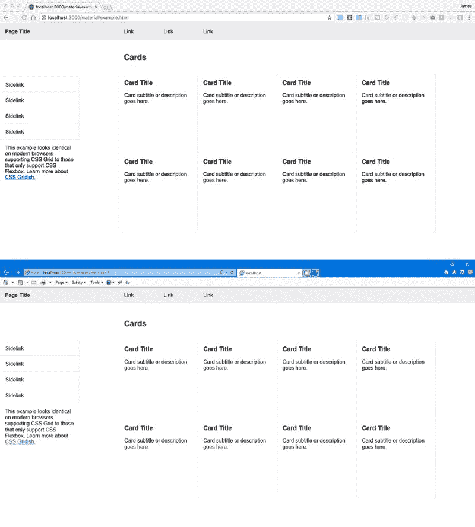
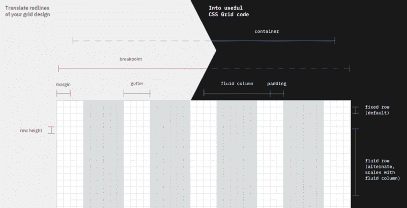

# 介绍 CSS Gridish:一个帮助您的团队适应 CSS 网格的开源工具

> 原文：<https://www.freecodecamp.org/news/introducing-css-gridish-helping-teams-to-adapt-css-grid-today-3e031ab222de/>

今天，我很兴奋地向大家介绍一款来自 IBM 的新开源工具，名为 [CSS Gridish](https://github.com/ibm/css-gridish) ！

CSS Gridish 获取产品网格的设计规格，并为您的团队构建几个资源:

*   为设计师提供的包含画板和网格/布局设置的草图文件
*   使用 CSS 网格的 CSS/SCSS 代码，为开发人员提供 CSS Flexbox 后备
*   一个谷歌 Chrome 扩展,任何人都可以用来检查网页的对齐情况

目标是帮助团队更快地适应 CSS 网格，并支持更复杂的布局。为了展示这个工具的多功能性，这里有一些来自 [Bootstrap](https://github.com/IBM/css-gridish/tree/master/examples/bootstrap) 、 [Carbon Design System](https://github.com/IBM/css-gridish/tree/master/examples/carbon) 和 [Material Design](https://github.com/IBM/css-gridish/tree/master/examples/material) 的网格示例。

### 为什么 IBM 的开发人员做了这个

新的 CSS 网格规范非常适合网页设计。现在，设计师可以像过去关注 x 轴一样关注 y 轴。项目[左边](https://slack.engineering/rebuilding-slack-com-b124c405c193)和[右边](https://open.nytimes.com/bootstrap-to-css-grid-87b3f5f830e4)开始记录他们向 CSS 网格的过渡。

许多 IBM 团队都渴望使用 CSS Grid，但是要克服一些障碍。CSS Gridish 有助于解决这些障碍。



The top screenshot is a page loading on Chrome using CSS Grid. The bottom screenshot is the same page on IE 11 using CSS Flexbox. ([Source](https://ibm.github.io/css-gridish/examples/material/example.html))

#### 浏览器兼容性

CSS Grid 目前拥有强大的浏览器支持(约 75%)。然而，许多产品仍然需要服务于其余的浏览器。例如，ibm.com 仍然有 10%的流量来自 Internet Explorer。支持那些老版本的浏览器需要做很多额外的工作。

虽然 CSS Gridish 总是构建使用 CSS Grid 的`yourGrid.css`，但它也构建一个我们称为`yourGrid-legacy.css`的文件。如果浏览器支持，这个遗留文件仍然只提供 CSS 网格代码。如果浏览器不支持 CSS 网格，用户将获得 flexbox 回退服务。为`yourGrid-legacy.css`添加额外的类，你就增加了向后兼容性！

如果您不再需要支持旧的浏览器，您会怎么做？只需要切换到`yourGrid.css`就可以从体验中抹去宝贵的千字节。

#### 桥接设计和代码

伟大的工具已经出现，它们为设计和代码创造了单一的真理来源，如 [React Sketchapp](https://github.com/airbnb/react-sketchapp) 和 [Lona](https://github.com/airbnb/Lona) 。这些工具确保设计人员和开发人员使用相同的组件。


Use the [Chrome extension](https://chrome.google.com/webstore/detail/css-gridish/ebhcneoilkamaddhlphlehojpcooobgc) for CSS Gridish to review webpages with the same grid and layout settings on your Sketch artboards.

我们希望将同样的团队团结带到发车区。用于 web 开发的草图和代码的画板从同一个配置文件中生成。虽然网格配置文件并非完美无缺，但我们希望 CSS Gridish 能够引发一场关于类似工具中网格标准的讨论。

此外，设计细节很容易在向开发的过渡中丢失。因此，这就是为什么我们建立了一个谷歌浏览器扩展来审查你的编码工作。Chrome 扩展可以设置为您团队的网格配置文件，以便使用相同的快捷方式(CTRL+G 和 CTRL+L)从草图文件中查看相同的网格和布局。开发人员喜欢在打开的草图文件中使用扩展。设计师喜欢用它来检查编码网页。

#### 尊重整页

使用 CSS 网格，开发人员可以在 HTML 的第一层开始时遵循网格设计。但是当开发人员不得不在不同的部分和其他节点内部工作时，事情就变得更加困难了。这是因为`display: subgrid`仍在获得[浏览器的支持。](https://caniuse.com/#feat=css-display-contents)

CSS Gridish 通过依赖视口宽度单位而不是相对百分比单位来解决这个问题。您可以在彼此内部嵌入尽可能多的`.yourGrid-grid`元素，但仍然尊重页面的列和行。我们发现这样做的唯一缺点是浏览器对待滚动条的方式不同。这可以通过在你的网格上留边来避免。

### 它是如何工作的

CSS Gridish 需要的唯一输入是一个名为`css-gridish.json`的 json 文件。该文件接受您的网格设计规范以及输出文件保存位置/保存方式的选项。目前，CSS Gridish 对您的网格设计做了一些假设:

*   外部水槽的尺寸是内部水槽的一半
*   你的主栏是流动的，而不是固定的宽度

**提示:**为了在草图中获得最佳效果，我们建议您使网格断点、边距和装订线可被行高整除。



While the grid’s designer specifies the dimensions in red (plus number of columns), a developer is provided with the helpful values in blue.

CSS Gridish 然后在命令行中运行，只有`npx css-gridish`。然后，您应该会看到一个文件夹，其中包含您的团队使用您的网格所需的所有文件！CSS Gridish 的伟大之处在于，它让初次使用 CSS Grid 的用户变得非常容易。在用户学习了文档中详细描述的类之后，他们通常只使用两个规则:

```
.myElement {    grid-column: 1 / span 4; // Span four columns from first row    grid-row: 4 / span 8; // Span eight rows from fourth row}
```

flexbox 回退代码的工作方式类似于大多数网格框架，具有可识别的 BEM 类命名。

默认情况下，代码适用于流动列和固定行。它也允许反过来使用有用的修饰符类。您将使用 fluid row 类来创建像正方形这样的形状，这些形状随用户的屏幕宽度而缩放。

使用 CSS Gridish 代码的一个问题是，我们没有利用 CSS Grid 的 gap 属性来设置间距。取而代之的是，有一些填充类，其大小是您应用的装订线大小的一半，以尊重装订线。这是因为无法忽略背景颜色和全尺寸媒体等情况下的间隙。希望 CSS 网格规范的下一个版本能够解决这个问题。

### 未来

CSS Gridish 旨在让更多的产品更快地采用 CSS Grid，并使用户和团队的过渡更容易。

从长远来看，我们希望这能鼓励一种叫做二维组件库的想法。业界有一个强大的组件库时代，它填充了用户放置组件的宽度。现在有了 CSS Grid，我们可以创建同样填充它们所在高度的组件。这为那些设计系统的人提供了更多创造性的可能性，也为使用它的团队提供了更多的灵活性。

同时，请使用 CSS Gridish 并向其反馈。还有很多工作要做！

如果对你有帮助，请留下 [CSS Gridish](https://github.com/ibm/css-gridish) a 星！

詹姆斯·Y·劳胡特( [@seejamescode](https://twitter.com/seejamescode) )是一名在 IBM Design 工作的 ATX 设计师。他爱编码，爱研究，爱为神尽力。以上文章为个人观点，不一定代表 IBM 的立场、策略或观点。

特别感谢 [Hayley Hughes](https://twitter.com/hayhughes) 的 discotastic 标志。此外，以下人员对项目本身也有很大的帮助:[特雷弗·黄](https://github.com/electrostaticfleece)，丹尼尔·库恩，[赛斯·约翰逊](https://twitter.com/sethrrr)，赵秋平[詹·唐斯](https://github.com/jendowns)，[乔希·布莱克](https://twitter.com/__joshblack)，[杰西卡·特伦布莱](https://twitter.com/poofichu)，[马兰达·博达斯](https://twitter.com/Maranda_Bodas)，[沃尼尔·苏](http://www.wonilsuh.com/)，[昆西·拉森](https://twitter.com/ossia)，以及整个 FED@IBM 社区