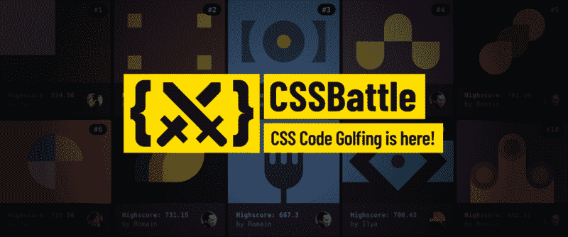
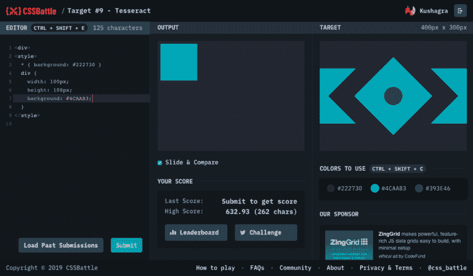

# 介绍 CSS battle——第一个 CSS 代码——高尔夫游戏

> 原文：<https://www.freecodecamp.org/news/introducing-cssbattle-the-first-css-code-golfing-game-88b7518df618/>

kushagra gour

# 介绍 CSS battle——第一个 CSS 代码——高尔夫游戏

如果你正在学习 Web 开发，或者已经是一名专业的 Web 开发人员，那么很有可能你一生中至少编写过一次 CSS。它是任何网页的一个非常基本的组成部分。在所有的讨论和对 CSS 的爱与恨中，我们为大家呈现了？⚔️

CSSBattle 是我和我的朋友 [Kushagra Agarwal](https://twitter.com/kushsolitary) 为 CSS 爱好者创建的第一个[代码高尔夫](https://en.wikipedia.org/wiki/Code_golf)平台。这个游戏的目的很简单——你有一个图像目标，你需要用尽可能少的 CSS 代码(如果你愿意，也可以用少量的 HTML 代码)来复制它。更多的视觉匹配和更少的字节让你得到更高的分数。这就是你在 CSSBattle 中爬上排行榜的方法。下面是一个目标屏幕示例:

Target #9 play screen

### 一些有趣的数据

写这篇文章的时候，距离我们发布已经 10 天了。以下是我们收集的一些有趣的数据:

*   全球 13000 多名玩家
*   超过 10 万份代码提交
*   目标上使用的最小字节数:[只有 54 字节](https://cssbattle.dev/play/1)！？
*   一个可爱的[社区论坛](https://spectrum.chat/css-battle)有 140 多名玩家和 40 多个对话

### 产品开发

我们决定在一个月内构建并发布 CSSBattle，以防止我们陷入添加和完善功能的无限循环。我们列出了发布时绝对必要的项目，并对其进行了重点关注。

在开发过程中，我们想出了大量的新点子来在网站上实现，并一直记下来。我很自豪我们能够抑制住冲动，在一个月内完成这些令人兴奋的想法并最终发布！

#### 技术堆栈

我们的技术堆栈是当今产品的标准。我们在前端部署了 [React](https://reactjs.org/) (使用 create-react-app 作为启动程序)，现在部署在[Zeit](https://zeit.co/now)上。对于后端，我们使用 [Firebase](https://firebase.google.com/) 。由于我们主要都有前端/设计经验，Firebase 被证明是一个惊人的选择，可以轻松实现我们所想的一切，同时获得最佳的可扩展性和安全性，而无需管理任何服务器！

#### 计分算法

开发 CSSBattle 最有趣的事情之一是设计评分算法。我们一连几天坐着讨论和尝试各种方案。我们希望更多的视觉匹配总是能带来更高的分数。当然，对于相同的匹配百分比，分数应该随着代码字节的减少而增加。此外，我们希望在你达到 100%匹配时，分数能更快地向更低的字节前进，以使那些为每删除一个字节而付出汗水的玩家得到更多的回报。

最后，我们对自己的想法感到满意。也许我们会单独写一篇关于评分算法的文章:)

### 发布会

我们原本计划在 4 月 5 日发布，但我们不得不提前一天发布。在公开之前，我们邀请了许多著名的 CSS 开发者来试用 CSSBattle。“幸运的是”[乔纳森·史努克](https://twitter.com/snookca) [在我们计划发布的前一天发了关于我们的推特](https://twitter.com/snookca/status/1113480096713793542?s=20)，为游戏带来了大量的开发者！因此，我们决定突出我们的发布:)

我们首先在 [ProductHunt](https://www.producthunt.com/posts/cssbattle) 上宣布 CSSBattle 是当天的头号产品。紧随其后的是 [Reddit rush](https://www.reddit.com/r/web_design/comments/b9e23w/we_just_launched_cssbattlethe_first_ever_css/) 。然后，Lea Verou 发了一条非常鼓舞人心的微博:

从那以后，我们都经历了一段疯狂的旅程，见证了社区的成长、游戏、学习和竞争！每天我们都看到玩家用 CSS 打破创造力和想象力的极限！

### 来加入我们吧

我们在 Spectrum 上有一个非常可爱的社区,由极具创造力和谦逊的开发者组成，你可以在那里闲逛并学习一些 CSS 技巧。

那么，你还在等什么？如果你曾经写过 CSS，现在就玩——[https://CSS battle . dev](https://cssbattle.dev)
(我们也见过有人想学 CSS 只是为了玩这个游戏！)

### 公平警告

CSSBattle 非常有趣并且令人上瘾。我们已经看到人们[失眠](https://twitter.com/LeaVerou/status/1114735776766595073)，[做怪梦](https://twitter.com/alexzaworski/status/1114742512067862529)，[见朋友迟到](https://twitter.com/LeaVerou/status/1114953009061072896)，[咒骂](https://twitter.com/kevinnewcombe/status/1113808767907295233?s=20)，[跳过项目期限](https://twitter.com/trangcongthanh/status/1114164655448924160?s=20)，[什么不是](https://twitter.com/hashtag/CSSBattleChallenge)。请自担风险进入！？

此外，我们认为我们有责任强调，除了创造性的方法，CSSBattle 还要求你利用浏览器如何解析 CSS(和 HTML)。重要的是要明白你在这里写的 CSS 不是你在真实项目中写的方式。你在这里学到的技巧和窍门肯定会让你更好地理解 CSS，但要时刻保持警惕，好奇什么是黑客，什么不是。

祝你玩得开心！