# 介绍免费代码营讲座:令人敬畏的技术讲座，你可以免费观看

> 原文：<https://www.freecodecamp.org/news/introducing-freecodecamp-talks-awesome-tech-talks-you-can-watch-for-free-55e5d96e2fa5/>

开发人员每年在世界各地的会议上进行数千次技术演讲。现在，您可以舒舒服服地坐在沙发上，在一个地方观看这些视频中的精华。

今天，freeCodeCamp 社区推出了一个新的 YouTube 频道，叫做 [freeCodeCamp Talks](https://fcc.im/fcctalks) 。

该频道由 freeCodeCamp 社区管理。所有的视频都是完全免费的，我们甚至不会在上面显示任何广告。

我们已经在那里发布了一些视频:

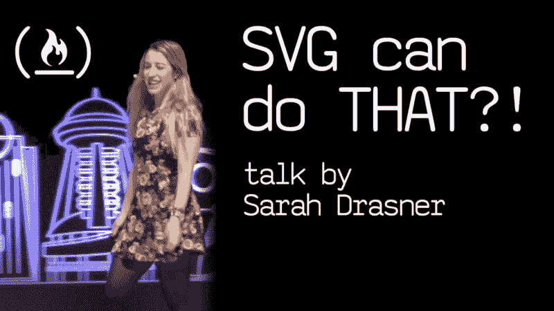

[SVG can do THAT?! by Sarah Drasner](https://fcc.im/2iAm5ES)

[How to Write Technical Blog Posts, by Quincy Larson (that’s me)](https://fcc.im/2hKUbq0)

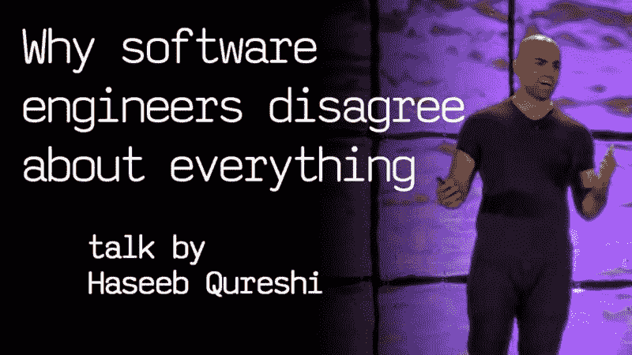

[Why software engineers disagree about everything, by Haseeb Qureshi](https://fcc.im/2zxO9AN)

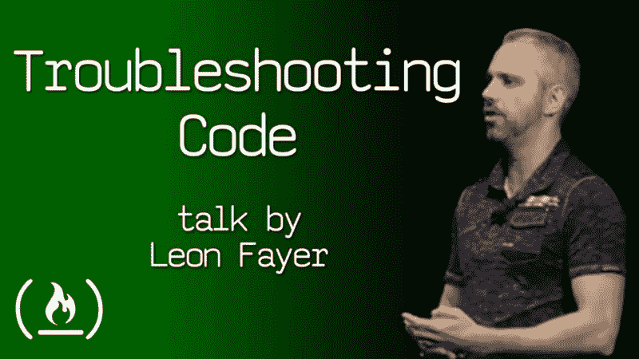

[Troublshooting Code: A Lost Art, by Leon Fayer](https://fcc.im/2iArVG9)

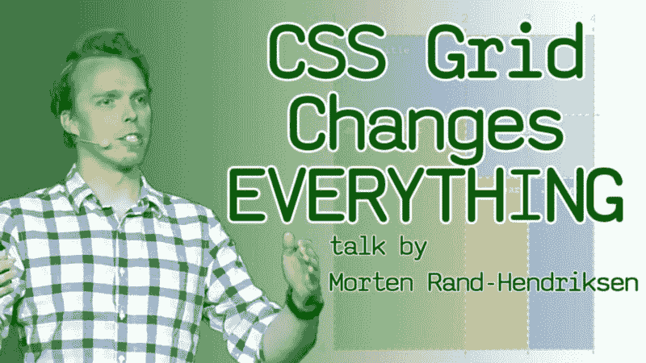

[CSS Grid Changes EVERYTHING, by Morten Rand-Hendriksen](https://fcc.im/2zsLDxt)

我们每周都会发布关于软件开发、设计和数据科学的新讲座。

如果你正在学习编码，你可以[免费订阅这个频道](https://fcc.im/fcctalks)。另外，一定要点击小“铃”来打开通知，当我们发布新视频时，YouTube 会通知您。

### 常见问题

#### 所有关于自由代码营的视频都是知识共享许可的吗？

大多数关于自由代码营的视频都是知识共享许可的。对于所有其他视频，我们从它们的创作者那里获得特别许可来发布它们。

#### 我在[会议]上做了报告。可以发表在 freeCodeCamp Talks 上吗？

我们也许能出版它！在 submit+youtube@freecodecamp.org 给我们发电子邮件。

#### 我们在定期的 freeCodeCamp 学习小组活动中录制演讲。你能发表这些吗？

在 submit+youtube@freecodecamp.org 给我们发电子邮件。我们将优先考虑营员的优秀演讲！

#### 最近看了一个很惊艳的演讲。怎么给渠道推荐呢？

如果它是知识共享许可的，[给我们发一个 submit+youtube@freecodecamp.org 演讲的链接](http://submit+youtube@freecodecamp.org)。如果不是，我们仍然可以找到会议组织者，并尝试从他们那里获得许可。

#### 谁负责 freeCodeCamp 会谈？

长期为 freeCodeCamp 撰稿的 Beau Carnes 正在运营这个新频道。Beau 是密歇根的一名教师，后来成为软件开发人员，是三个孩子的父亲。

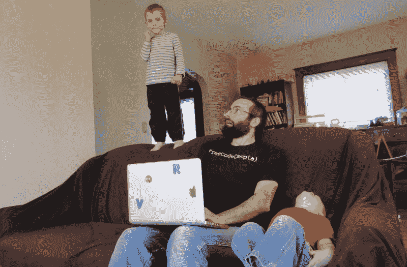

Beau 正在编辑这些视频，创建它们标志性的缩略图，并将其发布在自由代码营谈话频道上。

#### 原来的 freeCodeCamp YouTube 频道呢？

还在继续坚挺！我们每周都会在那里发布几个视频，包括很多循序渐进的编程教程。你可以在这里免费订阅。

#### 我还能如何为 freeCodeCamp Talks 频道做贡献？

为频道做贡献的最简单的方法是为这些演讲提供字幕和翻译。

尽管到目前为止所有这些演讲都是用英语进行的，但是 freeCodeCamp 社区中的许多人并不把英语作为他们的第一语言。还有，有不少学编码的人是全聋的。

YouTube 会自动为视频创建标题，但效果不太好。一些 freeCodeCamp 社区的聋人成员开玩笑地称这些自动字幕为“废话”

通过添加字幕，您将帮助这些开发人员更好地理解这些视频。您还可以让其他贡献者更容易地将这些标题翻译成其他语言。

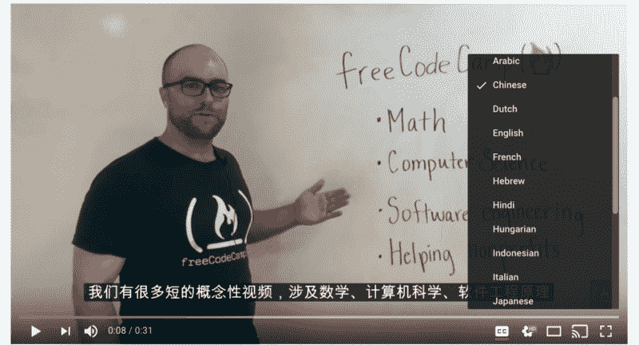

提供字幕或翻译的第一步是导航到您想要帮助的特定视频。接下来，单击视频右下角的齿轮图标。选择“字幕/抄送”，然后选择“添加字幕/抄送”

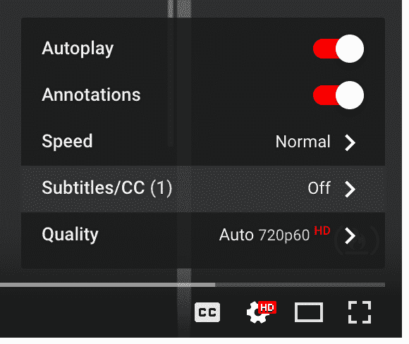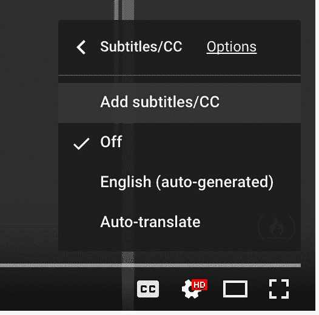

此时，您选择一种语言。这通常是英语，除非你想提供另一种语言的翻译。

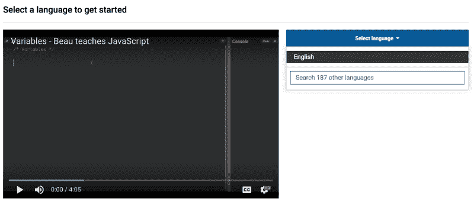

如果 YouTube 有自动生成的字幕，它们就会显示出来。你所需要做的就是观看视频，编辑自动生成的字幕(或空白文本框)，使其更加准确。

完成后，只需点击“提交贡献”

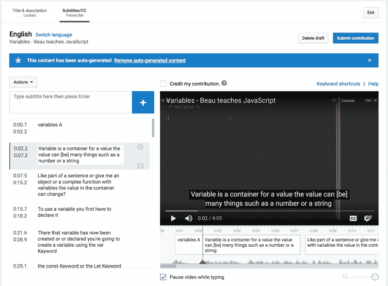

我希望你和我一样从这些演讲中学到很多。最后一个提示:如果你赶时间，你可以加快这些演讲的速度，用一半的时间观看。

只需点击 YouTube 视频上的齿轮图标，选择“速度”，然后设置成你想要的倍数。

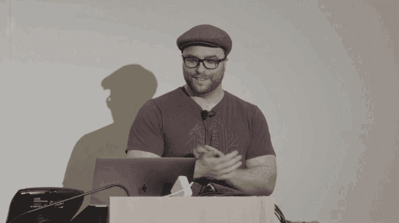

祝您度过一个有趣、高效的一周，并祝您编码愉快！