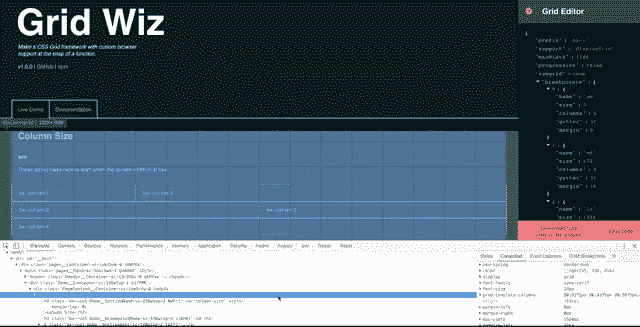
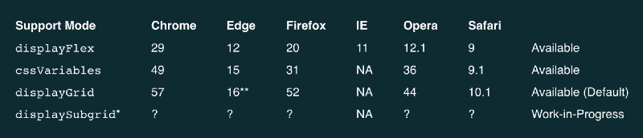
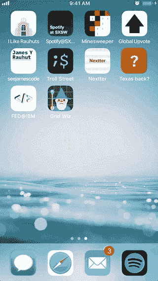

# 介绍网格向导:用自定义浏览器支持的 CSS 网格框架在快照…

> 原文：<https://www.freecodecamp.org/news/introducing-grid-wiz-make-a-css-grid-framework-with-custom-browser-support-at-the-snap-of-a-74e5c0a2e77/>

今天，我很高兴与大家分享一个新的、灵活的网格框架生成器:Grid Wiz！

对于跨越许多代码库以保持布局一致的体验来说，网格框架是必不可少的。当用户进入体验中的不同页面时，网格以特定的维度保存列。

在 IBM 的时候，我[介绍了 CSS Gridish](https://medium.freecodecamp.org/introducing-css-gridish-helping-teams-to-adapt-css-grid-today-3e031ab222de) 。它有一个简单的前提:给出一个网格设计的配置文件，并取回 CSS Flexbox 和 CSS Grid。这有助于团队在用户的[浏览器支持最终规范](https://developer.mozilla.org/en-US/docs/Web/CSS/display#Browser_compatibility)时过渡到 CSS 网格。

CSS Gridish 中有两个基本决定困扰着我:使用`vw`单元和节点 Sass。单元制造了比它解决的更多的错误和糟糕的开发体验。Node Sass 功能强大，被很多 IBM 使用，但是限制了包的环境灵活性。

因此，对于我的下一个个人项目，我开始研究 Grid Wiz。让我们来看看为什么我对这个项目更感兴趣…

### 利益

#### 灵活的浏览器支持

基于用户的访问，不同的体验有不同的浏览器需求。您的网格框架还应该以最少的代码量来实现高性能。通过特定的浏览器兼容性，您可以用最少的代码支持正确的浏览器。



Here is a demonstration of flipping between `displayFlex` and `displayGrid` mode with no visual changes.

需要一直支持浏览器到 Internet Explorer？使用代码最多的 Flexbox 模式。不需要 Internet Explorer，但需要覆盖一些稍旧版本的浏览器吗？CSS 变量模式将为您节省大量的代码，并提供完全相同的视觉输出。当用户群最终为 CSS Grid 做好准备时，您将会用最少的代码获得额外的功能。

以下是您可以切换的支持模式的分类:



Switch between these support modes [on the live demo](https://grid-wiz.now.sh) to watch the size of the CSS change.

#### **嵌套网格**

HTML 不是一层一层写的。一个好的网格框架应该允许您在 div 中嵌入 div，但是仍然记得有多少列是可用的。

如果没有“子网格”，网格框架的用户很可能会意外地违反设计规范。

CSS Grid 的下一次更新将包含原生的子网格。然而，Grid Wiz 允许您现在就开始使用子网格。一旦浏览器更新到 CSS Grid 的未来特性，将会为性能增加一个新的支持模式。

#### 环境灵活性

用同构 JavaScript 编写源代码为 Grid Wiz 创造了许多可能的用例。以下是使用网格向导的一些方法:



The Grid Wiz website is unapologetically a progressive web app. Save it to your phone and edit grids while you’re on a plane if you’re weird like that.

*   在[现场演示](https://grid-wiz.now.sh)中直接编辑你的网格，然后将 CSS 直接复制到你的代码库中。对于那些刚接触 web 开发的人来说，这是一个很好的方法。
*   用一个节点包将你的网格分布到多个项目中。 [添加 Grid Wiz 作为依赖](https://www.npmjs.com/package/grid-wiz)，用 Gulp、Webpack、Rollup 或者其他什么编译。
*   在你的应用程序构建过程中直接编译网格。这听起来可能不负责任，但并不会真正影响服务器端渲染应用程序，如[Grid Wiz 网站](https://grid-wiz.now.sh)本身。(大喊到 [Next.js](https://nextjs.org/) 让 SSR 变得简单。)

### 如何使用网格向导

Grid Wiz 是如何工作的？越简单越好。

只需提供网格的设计规范作为对象，并获得一串 CSS:

```
// Check out https://grid-wiz.now.sh for more info
const gridWiz = require("grid-wiz");

var yourGridCSS = gridWiz({
  prefix: "bx--", // Prefix for all CSS class names. Can be empty.
  support: "displayGrid", // `displayFlex`, `cssVariables`, or `displayGrid`
  maxWidth: 1584, // Max-width of entire grid in pixels. Optional.
  progressive: false, // Include all browser support fallbacks older than selected support
  subgrid: true, // Embedded grids and rows know the remaining amount of columns available.
  breakpoints: [
    {
      name: "sm", // Class name prefix fot the breakpoint.
      size: 0, // Starting screen width in pixels of the breakpoint.
      columns: 4, // Amount of columns available.
      gutter: 32, // Space between content of adjacent columns in pixels.
      margin: 0 // Space on outside of entire grid in pixels.
    },
    {
      name: "md",
      size: 672,
      columns: 8,
      gutter: 32,
      margin: 16
    },
    {
      name: "lg",
      size: 1056,
      columns: 16,
      gutter: 32,
      margin: 16
    }
  ]
});
```

### 结论

Grid Wiz 平稳地将团队从旧的浏览器规范过渡到 CSS Grid，然后过渡到尚未发布的特性。

我很高兴在未来支持这个开源项目，并希望你也能有所贡献。如果您遇到任何问题，请不要犹豫，在 [GitHub repo for Grid Wiz](https://github.com/seejamescode/grid-wiz) 上创建一个新问题！

如果 Grid Wiz 帮了你，请给 GitHub repo 留个星吧！你也可以在[推特](https://twitter.com/seejamescode)上关注我。


Thanks to Twitter for open-sourcing their [Twemoji](https://github.com/twitter/twemoji) library!

特别感谢[迭戈·埃尔南德斯](https://github.com/diego-codes)、[珍·唐斯](https://github.com/jendowns)和[乔希·布莱克](https://twitter.com/__joshblack)的反馈，正是他们的反馈塑造了这个项目。也感谢 [Babel](https://babeljs.io/) 、 [Next.js](https://nextjs.org) 、 [Rollup](https://rollupjs.org) 的维护者们让项目变得简单。

一如既往，感谢 freeCodeCamp 和社区作为一个伟大的平台来分享这些工具。