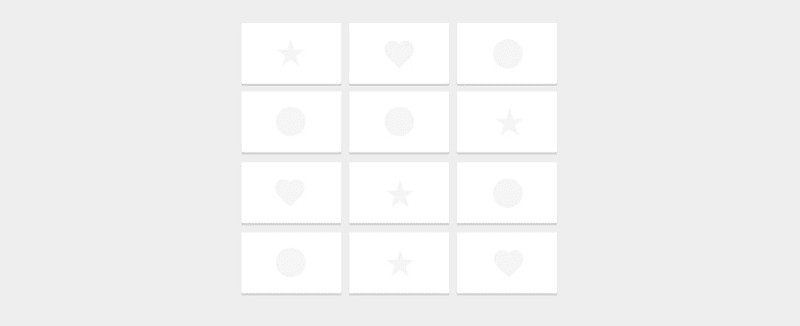
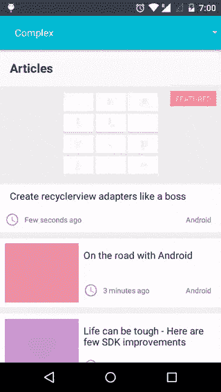
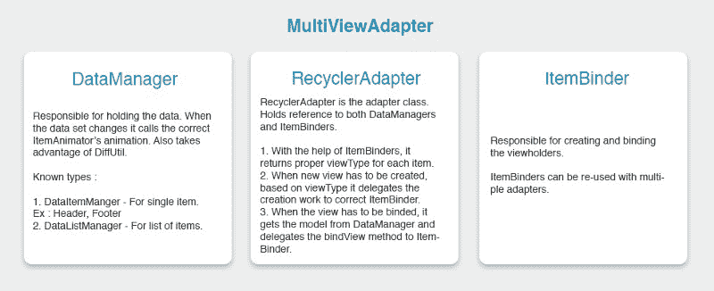
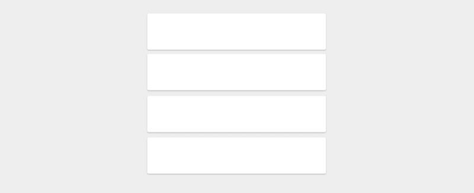
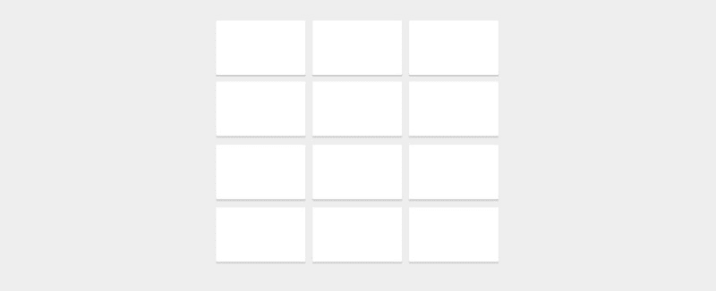
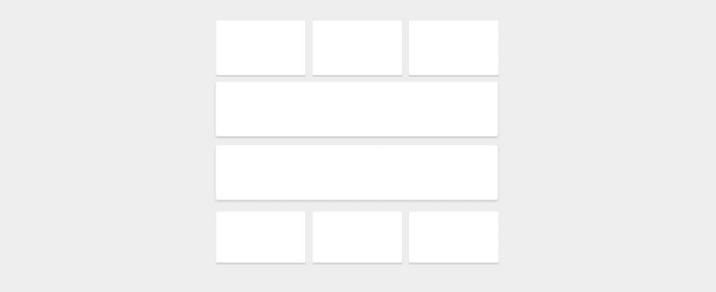
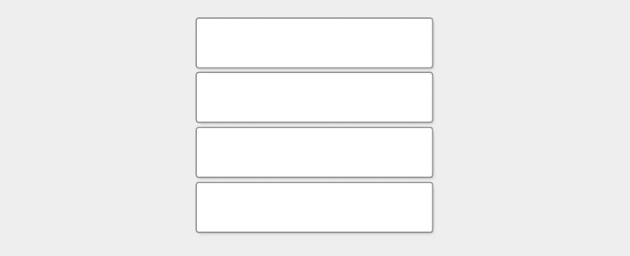
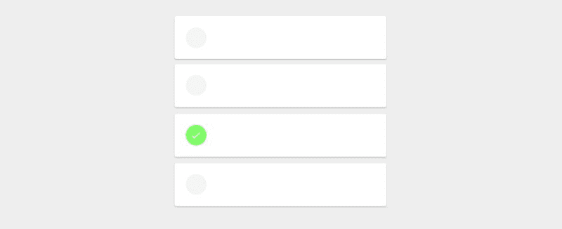

# 创建 Android Recyclerview 适配器，就像一个带有多视图适配器的老板

> 原文：<https://www.freecodecamp.org/news/introducing-multiviewadapter-7f77e5758d3f/>

作者:Riyaz Ahamed

# 创建 Android Recyclerview 适配器，就像一个带有多视图适配器的老板

Library for creating composable recyclerview adapters

RecyclerView 是 Android 框架中的一个重要的小部件，大部分 Android 应用程序都使用它。这是一个强大的工具，涵盖了许多通用用例。然而，由于这种灵活性，创建适配器需要做一些工作。

支持多种视图类型是 RecyclerView 优于传统 listview 的优势之一。但是显示多个视图类型需要大量样板代码。如果你有三种以上的视图类型，情况会很快失控。您可能有多个 if-else 条件、切换用例等等。不幸的是，没有简单的方法来重用视图持有者的创建和绑定代码。

MultiViewAdapter 就是为了解决这个问题。已经有许多可用的解决方案，但是这样的库有一些限制:

1.  您的数据对象应该有一个共同的父对象，这可能会干扰您的对象建模。
2.  您必须将布局资源 ID 保存在模型类本身中。同样，这打破了依赖层次。
3.  您可以自己管理视图类型 ID。通常，布局资源 ID 作为视图类型返回。因此，您不能对两种不同的视图类型使用相同的布局文件。
4.  他们不利用困难。
5.  如果你想为不同的视图类型有不同的项目装饰/span-size/选择模式，你必须编写切换用例。

MultiViewAdapter 解决了所有这些需求。该库是专门设计的，不会干扰您的对象建模和层次结构。

### 源代码

[**DevAhamed/multive Adapter**](https://github.com/DevAhamed/MultiViewAdapter)
[*multive Adapter-recycler view 适配器库创建可组合视图保持器*github.com](https://github.com/DevAhamed/MultiViewAdapter)

这里先睹为快，看看你可以用这个库实现什么。

Multiple view types, custom item decorations for different viewtypes, diffutil etc.,

### 特征

1.  对如何建模对象类及其层次结构没有限制。
2.  对 DiffUtil 的现成支持。
3.  支持单选和多选。
4.  每种视图类型都可以有自己的 span count 或 ItemDecoration 等等。你不需要 switch cases 或者 if-else 条件。

### 如何使用它

在应用程序的 gradle 文件中添加依赖关系。

### 多视图适配器背后的概念

1.  **RecyclerAdapter** —这是适配器类。它可以有多个 ItemBinder 和 DataManagers。它延伸自官方的 RecyclerView。适配器
2.  **ItemBinder** — ItemBinder 的职责是创建并绑定视图持有者。ItemBinder 具有接受需要显示的模型类的类型参数。ItemBinder 需要在 RecyclerAdapter 中注册。ItemBinder 可以注册到多个适配器。
3.  **DataManger** —保存数据并在数据集被修改时调用必要的动画。有两个数据管理器。 **DataListManager** 为物品清单。**数据项管理器**针对单个项目(页眉、页脚等。).

### 创建简单的适配器

MultiViewAdapter with list of items

你有一个对象列表，比如说“汽车”。如果您想显示汽车列表，这里是完整的代码。

现在你可以走了。您可以使用适配器`CarAdapter carAdapter = new CarAdapter();`并将其设置为 recyclerview。就是这样。

您可能已经注意到，在传统方法中，我们总是创建一个单独的类`CarAdapter`。但是在使用这个库的时候，你需要创建两个类——`CarAdapter`和`CarBinder`。这里的想法是你也可以在其他适配器中重用`CarBinder`，比如说`VehicleAdapter`。

### 使用 GridLayoutManager

MultiViewAdapter with grid items

当显示项目网格时，不需要不同的适配器。您可以在 ItemBinder 类中覆盖`getSpanSize(int maxSpanCount)`并返回跨度计数。

现在从适配器中获取 spansize look up，并将其设置为 GridLayoutManager。

### 对于不同的跨度数

Supports different span count for each view types

这里不用担心。默认情况下，每个项目活页夹返回 1 作为跨度计数。因此，如果您想要不同于默认的 span 计数，您可以覆盖 getSpanSize 方法并返回必要的 span 计数。

### 定制项目装饰

Supports custom ItemDecoration for each view type

这是棘手的部分。当你不使用这个库的时候就更难了。为每个视图类型创建项目装饰有三个步骤。

1.  创建从 ItemDecorator 扩展的自定义项目装饰类。

2.创建 ItemBinder 时，通过构造函数传递自定义 item decorator 的对象。

3.现在从适配器中获取项目装饰，并将其添加到 recyclerview 中。

棘手的部分到此为止。唷。

### 差异和自定义有效负载

默认情况下，MultiViewAdapter 会处理 DiffUtil。如果希望在 diffutil 操作期间传递有效负载，则需要通过构造函数传递 PayloadProvider 的对象。要了解更多关于 diffutil 的信息，请阅读此处的。

### **使适配器可选**

Items can be selected

MultiViewAdapter 支持三种不同的选择选项:

1.  单项选择—只能选择一个项目。一旦选择了一个项目，就不能取消选择它，除非选择了另一个项目。
2.  单项选择或无-只能选择一个项目。通过执行相同的选择操作，可以取消选择某个项目。
3.  多选-可以跨不同的数据管理器选择多个项目。

要使适配器可选择，您需要使用适配器、ItemBinder 和 ViewHolder 的“可选择”对应项。例如，您可以使用 SelectableAdapter、SelectableBinder 和 SelectableViewHolder。

让我们以 CarAdapter 为例，并使其可选择。

注意事项:

1.  没有必要让所有的 ItemBinders 都是可选的。例如，如果列表中有标题，它可能是不可选择的。所以从普通的 ItemBinder 扩展 HeaderBinder。
2.  您可以重复使用普通适配器中的任何可选活页夹。它是不可选择的。对于可选择的项目，适配器和绑定器都应该从它们的可选择对应物扩展。
3.  默认情况下，长按会选择一个项目。如果你想让这个项目被选中，你可以在 ViewHolder 里面调用`itemSelectionToggled()`。
4.  您可以使用`getSelectedItems()`和`setSelectedItems(List<E>` 项从 DataListManager 中设置或获取所选项目)

### 听众

视图持有者有两个侦听器:OnItemClickListener 和 OnItemLongClickListener。

DataListManager 具有 ItemSelectionChangedListener 和 MultiSelectionChangedListener。这些侦听器可以与 SelectableAdapter 一起使用。

### **期末笔记**

感谢您的阅读！我希望这篇文章能帮助你开始使用 MultiViewAdapter 库。该库本身正在积极开发中，我计划添加一些令人兴奋的功能。您可以在 GitHub 中查看存储库以接收通知。此外，你可以在 [GitHub](https://github.com/DevAhamed/MultiViewAdapter) 上看看这个库的路线图。

如果你对这个库有任何疑问、问题或功能要求，你可以通过 Twitter 联系我。

为了帮助他人，请点击❤推荐这篇文章，如果你觉得有帮助，就启动[库](https://github.com/DevAhamed/MultiViewAdapter)。

本文和库中出现的所有代码都是根据 [Apache-2.0](http://www.apache.org/licenses/LICENSE-2.0) 授权的。作者:里亚兹·阿哈迈德和❤，来自印度班加鲁鲁。