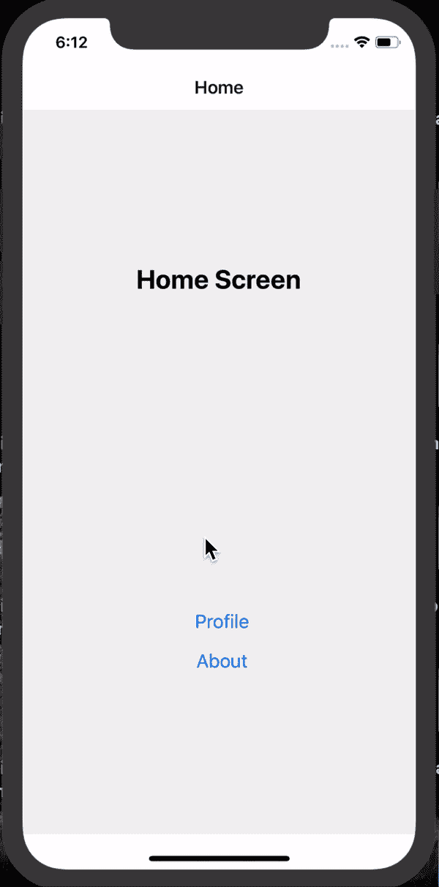
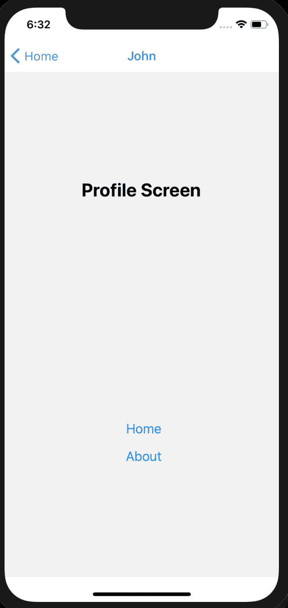

# 如何用 react-navigation 5 处理 React Native 中的导航

> 原文：<https://www.freecodecamp.org/news/introducing-react-navigation-5/>

React-navigation 是当我们谈论 React Native 中的导航时，我想到的导航库。

我是这个库的忠实粉丝，它总是我在 React Native 中处理导航时使用的第一个解决方案。这在一定程度上是因为它有一个很棒很简单的 API，并且非常可定制。

我写这篇文章是因为版本 5 刚刚从测试版进入稳定版。它带来了一些特性变化和新的 API 设计，提供了一种简单而不同的方式来声明路由。

在本文中，我们将介绍新的 API，并研究在我们的应用程序中使用它们的方法。

> 最初发表于[saidhayani.com](https://saidhayani.com/Introducing-react-navigation-5/)

## 安装

与以前的版本(> 4.x)相比，react-navigation 的安装方式有了一些改变:

```
// > 4.x verions
yarn add react-navigation 
```

安装 react-navigation 5 将如下所示:

```
// yarn
yarn add @react-navigation/native
// npm
npm install @react-navigation/native 
```

react-navigation 的最新版本使用了许多第三方库，如[react-native-gesture-handler](https://github.com/software-mansion/react-native-gesture-handler)来制作动画和处理过渡。所以你总是需要安装那些库。

```
// yarn
yarn add react-native-reanimated react-native-gesture-handler react-native-screens react-native-safe-area-context @react-native-community/masked-view
// npm
npm install react-native-reanimated react-native-gesture-handler react-native-screens react-native-safe-area-context @react-native-community/masked-view 
```

## 动态屏幕

新的 API 在初始化路由时引入了动态性。以前它是静态完成的——基本上，我们必须在一个配置文件中定义我们的路由。

```
// @flow
import React from "react";

import { createAppContainer, createSwitchNavigator } from "react-navigation";
import { createStackNavigator } from "react-navigation-stack";

/** ---------Screens----------- */
// import LaunchScreen from "../Containers/LaunchScreen";
import HomeScreen from "../Containers/HomeScreen";

import ProfileScreen from "../Containers/ProfileScreen";
import LoginScreen from "../Containers/LoginScreen";

const StackNavigator = createStackNavigator(
  {
    initialRouteName: "Home"
  },
  {
    Home: {
      screen: HomeScreen
    },
     Login: {
      screen: LoginScreen,
      headerMode: "none",

    },
      Profile: {
      screen: ProfileScreen
    }

);

export default createAppContainer(StackNavigator); 
```

新的 API 带有动态组件。并使导航更加动态。宣布路线的新方法如下所示。

```
import React from "react"
import { SafeAreaView, StyleSheet, View, Text, StatusBar } from "react-native"

import { NavigationContainer } from "@react-navigation/native"
import { createStackNavigator } from "@react-navigation/stack"

const App: () => React$Node = () => {
  return (
    <>
      <StatusBar barStyle="dark-content" />
      <SafeAreaView style={styles.containerStyle}>
        <AppNavigation />
      </SafeAreaView>
    </>
  )
}
const Stack = createStackNavigator()
const AppNavigation = () => {
  return (
    <NavigationContainer>
      <Stack.Navigator initialRouteName="home">
        <Stack.Screen name="home" component={HomeScreen} />
      </Stack.Navigator>
    </NavigationContainer>
  )
}
const HomeScreen = () => {
  return (
    <View style={styles.containerStyle}>
      <Text style={styles.title}>Home Screen</Text>
    </View>
  )
} 
```



这种新方法是动态的，使用起来更简单，有点类似于 react-router API。

## 动态选项

这是社区长期以来最需要的功能。我总是对老方法(静态)有疑问，动态地改变导航行为真的很难。

### 旧方法=> < 4.x

在旧版本的[反应导航](https://reactnavigation.org/)中，我们必须定义静态选项。没有办法动态地改变这一点。

```
 static navigationOptions = {
    title: "Sign In",
    header: null,
    mode: "modal",
    headerMode: "none"
  }; 
```

### 新方法(第 5 版)

React-navigation 附带了一个非常简单的动态方法。我们可以只使用`props`来设置任何屏幕的选项。

```
const AppNavigation = ({}) => {
  let auth = {
    authenticated: true,
    user: {
      email: "user@mail.com",
      username: "John",
    },
  }
  let ProfileScreenTitle = auth.authenticated ? auth.user.username : "Profile"
  return (
    <NavigationContainer>
      <Stack.Navigator initialRouteName="Home">
        <Stack.Screen name="Home" component={HomeScreen} />
        <Stack.Screen
          name="Profile"
          component={ProfileScreen}
          options={{
            title: ProfileScreenTitle,
            headerTintColor: "#4aa3ba",
            headerStyle: {
              backgroundColor: darkModeOn ? "#000" : "#fff",
            },
          }}
        />
        <Stack.Screen name="About" component={AboutScreen} />
      </Stack.Navigator>
    </NavigationContainer>
  )
} 
```



通过动态选项，我可以根据身份验证更改标题。例如，如果用户通过了身份验证，我可以将屏幕标题设置为用户的用户名，或者更改标题的背景色。

这是非常有用的，尤其是当你使用动态主题或者你想在你的应用中实现黑暗模式的时候。

## 钩住

这是我迄今为止最喜欢的功能，它可以节省时间。新的 API 引入了一些定制的钩子来执行某些动作。

例如，在以前的版本中，如果我必须获取活动屏幕的 currentName，我必须创建一些助手来帮我完成这个任务，就像下面这样。

```
export function getCurrentRouteName(): string | null {
  const tag = "[getCurrentRouteNameSync] "
  const navState = getStore().getState().nav
  const currentRoute = getActiveRouteState(navState)
  console.log(tag + " currentRoute > ", currentRoute)
  return currentRoute && currentRoute.routeName ? currentRoute.routeName : null
} 
```

hooks API 帮助我避免了所有这些事情，并使我更容易使用一个钩子通过一行代码访问导航 API。

现在我可以使用`useRoute` Hook 轻松获得 RouteName。

```
import { useRoute } from "@react-navigation/native"
const AboutScreen = ({ navigation }) => {
  const route = useRoute()
  return (
    <View
      style={{
        justifyContent: "space-around",
        flex: 1,
        alignItems: "center",
      }}
    >
      {/*    Display the RouteName here */}
      <Text style={styles.title}>{route.name}</Text>
    </View>
  )
} 
```

我们可以用`useNavigationState`钩子做同样的事情。它让我们可以访问导航状态。

```
const navigationState = useNavigationState(state => state)
let index = navigationState.index
let routes = navigationState.routes.length
console.log(index)
console.log(routes) 
```

React-navigation 还提供了其他挂钩，例如:

*   `useFocuseEffect`:一个副作用钩子，当屏幕被加载时，返回聚焦的屏幕
*   `useLinking`:处理深度链接

我强烈建议你[去看看](https://reactnavigation.org/docs/use-navigation/)。

## 包扎

新的 react-navigation API 无疑从静态转向了动态。这是一个伟大的方向，将绝对改变我们在 React Native 中处理导航的方式。动态路线是 react-navigation 用户的主要要求，这种新方式将帮助我们创造更好的用户导航体验。

### 你可以在这里找到更多关于 [React Native 的内容](https://saidhayani.com/)

> 感谢阅读

*   [推特](https://twitter.com/SaidHYN)
*   [GitHub](https://github.com/hayanisaid)
*   [加入邮件列表](https://webege.us16.list-manage.com/subscribe?u=311846a57d1e1a666287ad128&id=2b386b2ebb)

> 正在为您的项目寻找 React 本地开发人员吗？ **[打我一下](mailto:info.said.dev@gmail.com)** 。