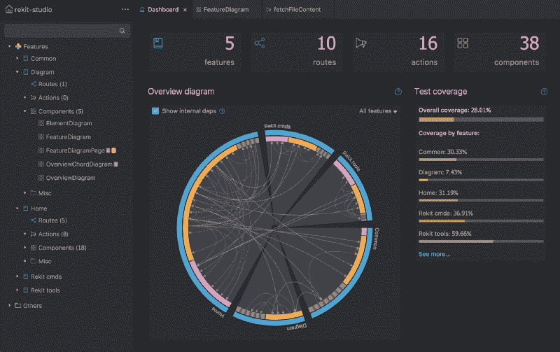
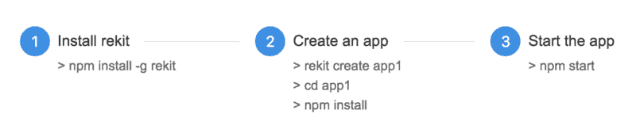
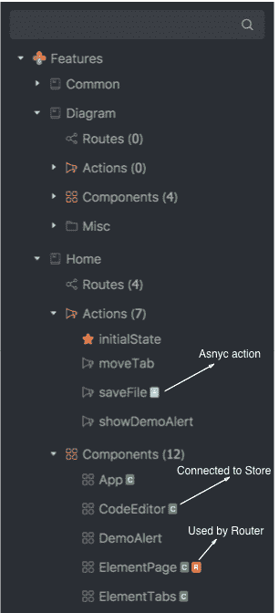
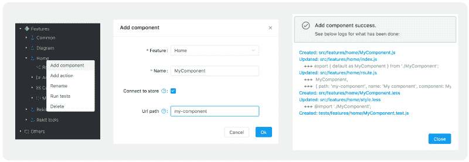
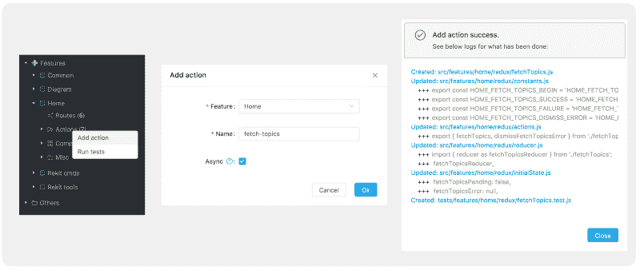
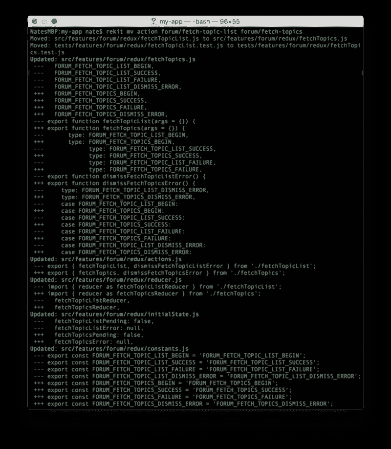
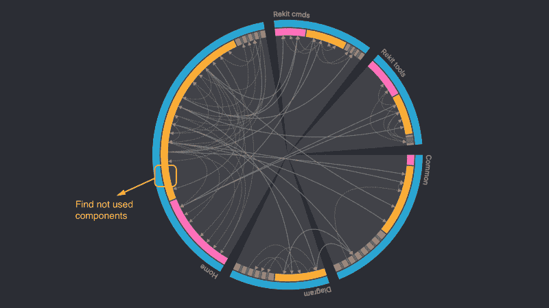
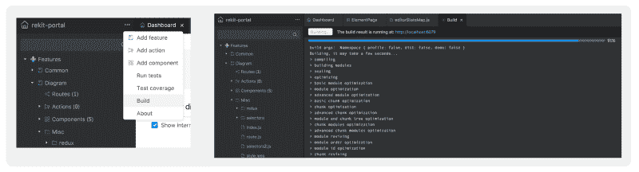
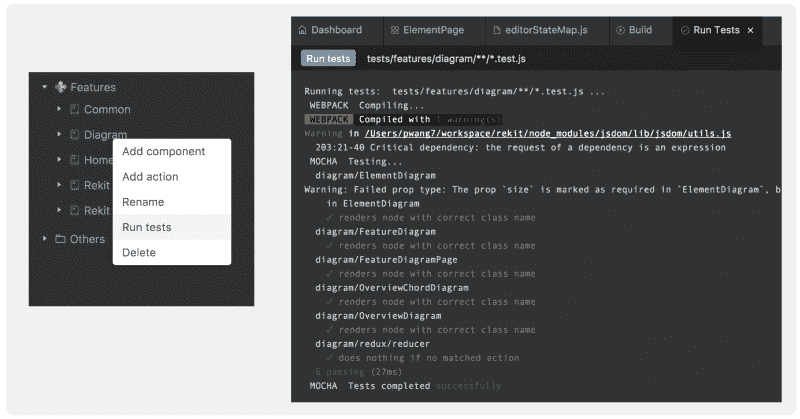
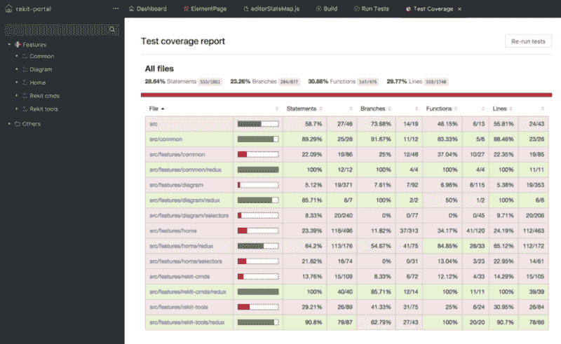

# 介绍 Rekit Studio:React 和 Redux 开发的真正 IDE

> 原文：<https://www.freecodecamp.org/news/introducing-rekit-studio-a-real-ide-for-react-and-redux-development-baf0c99cb542/>

作者奈特·王

# 介绍 Rekit Studio:React 和 Redux 开发的真正 IDE

我们非常兴奋地宣布 [Rekit Studio](https://github.com/supnate/rekit) 的稳定发布，这是一个用于 React、Redux 和 React 路由器开发的完整 IDE！虽然它对你们中的一些人来说可能是新的，但它已经帮助我们构建复杂的 web 应用程序一年多了。

Rekit Studio

Rekit Studio 之前的版本是 Rekit Portal，没有编辑代码的能力。现在多亏了[摩纳哥编辑器](https://microsoft.github.io/monaco-editor/)(它也支持 [VS 代码](https://code.visualstudio.com/))和[更漂亮](https://prettier.io/)(一个格式化代码的神奇工具)，Rekit Studio 为编码提供了很好的体验。这也是我们将它从“门户”更名为“工作室”的原因

作为一个 IDE，除了代码编辑之外，Rekit Studio 还提供了代码生成、依赖关系图绘制、重构、构建、单元测试以及有意义的代码导航方式。

您将不再关心如何设置项目、配置 webpack 或组织您的文件夹结构。Rekit Studio 提供了管理整个项目的集成方式。这就是 Rekit Studio 区别于 Sublime Text 和 VS Code 等其他代码编辑器的地方。

### 查看快速演示

在介绍之前，您可能想看一个关于如何使用 Rekit Studio 管理 Redux 操作的快速演示视频。

从视频中，我们可以看到，我们所关心的是业务逻辑，而不是冗长的代码样板。

### 现在试试吧

阅读以下介绍的最佳方式是让 Rekit Studio 并行运行，这样您就可以自己实时尝试这些特性。这两种方法都非常简单:

1.  进入现场演示:[http://demo.rekit.org](http://demo.rekit.org)。这是一个以只读模式运行的 Rekit Studio 实例。所以你不能对它管理的项目进行任何更改(Rekit Studio 本身的代码！).
2.  只需 3 个步骤即可创建 Rekit 应用程序:

然后为你的应用访问 [http://localhost:6075](http://localhost:6075/) 。 [http://localhost:6076](http://localhost:6076/) 默认为 Rekit Studio。

是的，Rekit Studio 是您项目中的一个 npm 包，在浏览器中运行。这种机制确保每个应用程序都有自己的 Rekit Studio，因此永远不会出现版本兼容性问题。

### 以有意义的方式展示你的代码

几乎所有的前端开发的 ide 都只是用和文件夹结构一样的方式显示文件。人们抱怨在文件间导航令人沮丧。更糟糕的是，似乎没有办法改进，因为代码编辑器不知道哪个文件是组件，哪个是动作，哪个样式文件属于哪个组件，路由规则在哪里定义等等。当项目结构处于自由风格时，它将永远不会被改进。

现在，Rekit 遵循了可伸缩 web 应用程序的组织模式。基于这一点，Rekit Studio 理解了你的项目。我在[两篇](https://medium.com/@nate_wang/a-new-approach-for-managing-redux-actions-91c26ce8b5da) [之前的](https://medium.com/@nate_wang/feature-oriented-architecture-for-web-applications-2b48e358afb0)文章中介绍了这些做法。

基于该模式，Rekit Studio 知道哪些文件是组件，哪些是操作，路由规则在哪里定义，等等。然后，项目浏览器可以以有意义的方式显示项目结构，如下所示:

Project Explorer

Rekit Studio 知道那些项目元素的特性，比如哪些动作是异步的(带有蓝色标记“A”)，哪些组件连接到 Redux store(带有绿色标记“C”)，以及哪些组件由 React 路由器管理(带有橙色标记“R”)，这些组件在一些路由规则中使用。

使用这个项目浏览器，您可以轻松地在项目元素之间导航。您也可以在不打开元素并查看代码的情况下获得关于元素的更多信息。

有一点要指出的是，项目浏览器只显示项目中 src 文件夹下的文件，这样它有很好的性能。所以如果你想在 src 文件夹之外编辑文件，比如 package.json，或者。gitignore，你可能需要一些其他的文本编辑器。

### 代码生成

就像其他真正的 ide 一样，比如 Eclipse for Java，或者 Visual Studio for。Net，Rekit Studio 通过其直观的 UI 帮助创建代码样板，而无需任何学习成本。例如，要创建一个组件，在项目浏览器中右键单击一个特性节点，然后单击` *Add Component* `。

Add a component

除了给它一个名称，您还可以设置它是否连接到 Redux 存储，或者是否在 React 路由器规则中使用它。点击“确定”后，它将生成所有必要的代码和配置。你可以通过操作日志看到它在后面做什么。它创建了一个 less/scss 文件用于样式化，一个测试文件用于测试，它添加了一个 React 路由器规则来通过 URL 访问它(如果设置了 url path)，等等。

这背后没有魔法——Rekit Studio 只是帮助你自动完成以前需要手动完成的工作。通过检查日志，您总能知道发生了什么。

为了创建 Redux 异步操作，Rekit Studio 默认使用 redux-thunk 来创建 redox 和操作:

Add an async action

或者，您可以通过安装“rekit-plugin-redux-saga”插件，使用“redux-saga”创建异步操作。更多介绍见插件一章。

Rekit 生成的所有文件名、函数名或变量名都必须遵循预定义的规则，如这里的[所述](http://rekit.js.org/docs/namings.html)。因此，即使您在 name 字段中输入一个名称，如“my component ”, Rekit 也会将其转换为“my component”。通过这种方法，项目中的所有名称总是一致的。

这些代码样板是按照一般的最佳实践创建的。您只需要在其中填充业务逻辑，而不必手动编写冗长的代码。代码一旦生成，就可以免费编辑。

### 重构很重要

当创建一个大的应用程序时，重构对于使代码变得干净、可读和可维护非常重要。重构的一些主要部分是重命名、移动和删除项目元素。借助现代前端技术，这项工作变得异常困难。

例如，如果我们想重命名一个异步动作，它通常需要接触几个文件，并在不同的地方修改几十个代码。假设我们想将一个异步操作从“fetchTopics”重命名为“fetchTopicList ”,它需要这些修改:

这看起来太疯狂了，你绝不会想要手动操作，对吗？同样的痛苦存在于移动和删除组件和动作中。如果没有工具的帮助，这种痛苦曾经阻止我们许多人重构代码。这导致我们的项目在短时间内变得难以维护。

现在有了 Rekit Studio，您可以右键单击要移动的组件或动作，并对其进行重命名或删除，就像您使用 Eclipse for Java 或 Visual Studio for .Net 等其他 ide 一样。Rekit Studio 会自动完成所有事情，您可以检查日志来查看它在后面做了什么。

### 使用直观的图表查看您的项目

当你的项目增长时，模块的依赖关系变得复杂。如果您不完全考虑它们，这通常会导致回归问题。保持简单的关系是一个好习惯，这样代码总是可以理解的。Rekit Studio 提供了两种图表供您查看依赖关系:

**1。总览图**
它显示在仪表板页面(主页)上，通过它我们不仅可以看到功能之间的依赖关系(Rekit 应用程序的高级概念)，还可以看到组件和动作等普通模块。因此，您可以很容易地发现哪些模块重构是危险的(有很多 dep ),哪些是容易重构的(dep 较少)。

该图还可以帮助您找到那些未使用的模块，例如，如上图所示，项目中不再使用“home”功能的两个组件。您可以安全地删除它们。删除不必要的代码有助于降低项目的复杂性以及应用程序的捆绑大小。

**2。元件图**

从 project explorer 中打开一个元素，然后您可以在 diagram 选项卡下看到元素图。它为其他人如何创建或使用一个元素提供了一个非常直观的视图。这就是模块的复杂性。

例如，SidePanel 是一个使用许多其他组件和动作的复杂组件。并且它依赖于其他功能。可能是要重构的组件变得简单易懂。

### 构建和测试

作为一个 IDE，Rekit Studio 也可以用直观的 ui 来构建和测试项目。默认情况下，Rekit Studio 将尝试运行“npm run build”命令来构建项目，并将运行“npm test — [test-file-pattern]”来运行单元测试。

要构建项目，请从主菜单中单击“构建”菜单项:

然后你可以看到一个进度条和构建结果。在部署到生产服务器之前，您还可以通过访问 dist 服务器来验证构建结果，dist 服务器默认运行在: [http://localhost:6077](http://localhost:6077) 。

若要运行单元测试，您可以通过单击主菜单中的“运行测试”菜单项来运行所有测试，或者右键单击包含测试的文件/文件夹。Rekit Studio 将自动转换命令来测试文件模式:

以上是“图表”功能的测试结果。如果您运行项目的所有测试，它将生成一个测试覆盖报告。您可以从主菜单访问它:

### 插件系统

我们可以看到 Rekit Studio 可以创建特性、动作和组件的样板文件。如果你想创建一些新的元素，比如选择器，或者你想改变默认的代码样板(比如对于异步操作使用‘redux-saga’而不是‘redux-thunk’)，你可以创建插件来实现。

点击查看更多关于外挂系统[的信息。](http://rekit.js.org/docs/plugin.html)

### 命令行界面

除了 Rekit Studio，还有另一个[命令行接口](http://rekit.js.org/docs/cli.html)用于管理 Rekit 项目。实际上，Rekit Studio 和 Rekit CLI 都使用“rekit-core”来管理项目元素。CLI 系统支持更多种类的插件。而 Rekit Studio 未来也会改进，为插件系统提供统一的 UI。

### 从 Rekit Portal 迁移到 Rekit Studio

如果你现有的项目一直使用 Rekit Portal，那么迁移到 Rekit Studio 是超级容易的，因为 Rekit Studio 完全兼容之前的 Rekit 项目。你所需要做的就是安装 Rekit Studio 并更新脚本在 server.js [这里](https://github.com/supnate/rekit-boilerplate/commit/5186b5c3ec141b5306471c52a8955dfb288598bd)启动它。

### 将您的项目转换为 Rekit 项目

如果您碰巧使用 React、Redux 和 React Router 创建了一个项目，可以将其转换为 Rekit 项目，以便您可以使用 Rekit Studio 来管理它。没那么难，不过题目需要另文适当介绍。如果你想的话，我会写的——请在评论中告诉我。关键是以 Rekit 的方式重新组织你的文件和代码。

### 下一步是什么

Rekit Studio 仍然处于早期阶段，尽管我们已经用它来构建 web 应用程序很长时间了。我们将不断改进它，因为我们都在日常工作中使用它。

下面列出了一些高优先级的候选项:

*   更好的代码语法突出。
*   支持自定义 ESlint 规则。
*   更好的代码自动完成，比如安装模块名。
*   使用 Cmd + P 快速打开文件。
*   支持多个未保存的文件。目前，为了保证代码的安全，只有一个文件可以处于未保存状态。
*   添加更多类型的图表。
*   允许用户创建/重命名/删除除组件和动作之外的普通文件。
*   整合故事书。
*   支持 TypeScript。
*   支持服务器端渲染。

这个列表可能很长，这取决于您的反馈，我们欢迎您的任何反馈。

### 摘要

虽然前端技术发展非常迅速，但 Rekit 作为一个工具包，而不是一个框架，已经非常稳定了两年多。它遵循的实践与技术无关。现在 Rekit Studio 的发布是我们改进编码体验的一个新的里程碑。我们希望你也会喜欢它！

最后，我想指出，Rekit 没有为您的应用程序提供任何 SDK 或 npm 包。它只是一个创建和管理项目的工具。即使没有 Rekit，您也可以使用任何文本编辑器来编写代码，并使用终端来运行 Rekit 项目的脚本。也就是你用 Rekit，但是你不依赖它。