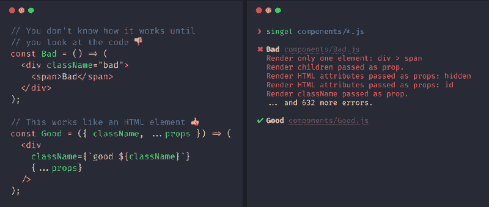
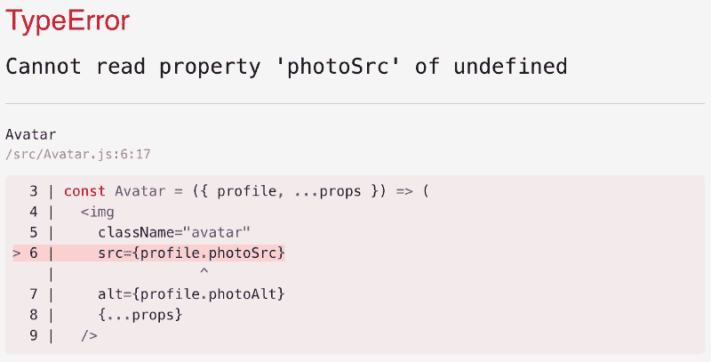
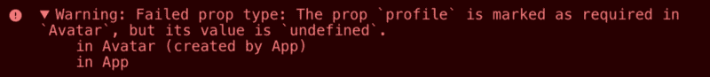
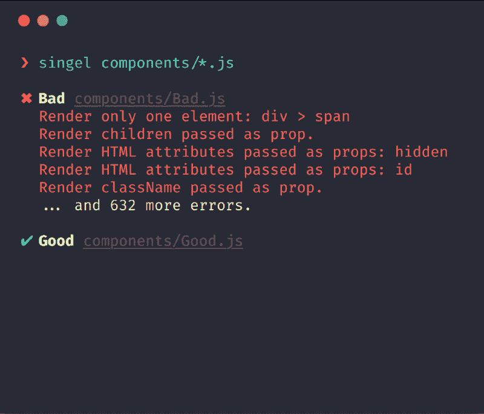

# 介绍单元素模式

> 原文：<https://www.freecodecamp.org/news/introducing-the-single-element-pattern-dfbd2c295c5d/>

作者迭戈·哈兹

# 介绍单元素模式

#### 使用 React 和其他基于组件的库创建可靠构建块的规则和最佳实践。



早在 2002 年，当我开始为 web 构建东西时，包括我在内的大多数开发人员都使用`<tab` le >标签来构建他们的布局。

直到 2005 年，我才开始遵循网络标准。

> 当一个网站或网页被描述为符合 web 标准时，通常意味着该网站或网页具有有效的 HTML、CSS 和 JavaScript。HTML 还应该满足可访问性和语义准则。

我了解了语义和可访问性，然后开始使用适当的 HTML 标签和外部 CSS。我自豪地将这些 W3C 徽章添加到我创建的每个网站上。


我们编写的 HTML 代码与浏览器的输出代码非常相似。这意味着使用 [W3C 验证器](https://validator.w3.org/)和其他工具来验证我们的输出也教会了我们如何编写更好的代码。

时间过去了。为了隔离前端的可重用部分，我使用了 PHP、模板系统、jQuery、Polymer、Angular 和 React。尤其是后者，我已经用了三年了。

随着时间的推移，我们编写的代码与提供给用户的代码越来越不同。如今，我们以许多不同的方式传输代码(例如，使用 Babel 和 TypeScript)。我们编写了 [ES2015+](https://devhints.io/es6) 和 [JSX](https://reactjs.org/docs/introducing-jsx.html) ，但是输出的代码将只是 HTML 和 JavaScript。

目前，即使我们仍然可以使用 W3C 工具来验证我们的网站，它们对我们编写的代码帮助不大。我们仍在追求最佳实践，以使我们的代码更加一致和可维护。如果你正在读这篇文章，我猜你也在寻找同样的东西。

我有东西给你。

### 单元素模式( [Singel](https://github.com/diegohaz/singel)

到目前为止，我不知道我到底写了多少组件。但是，如果我把聚合物、棱角和反应放在一起，我可以有把握地说这个数字超过一千。

除了公司项目，我还维护了一个包含 40 多个示例组件的 [React 样板文件](https://github.com/diegohaz/arc)。此外，我正与[的 Raphael Thomazella](https://github.com/Thomazella) 一起工作，他也为这个想法做出了贡献，开发了一个[的 UI 工具包](https://github.com/diegohaz/reas)，里面有几十个这样的工具包。

许多开发人员有一种误解，认为如果他们以完美的文件结构开始一个项目，他们就不会有问题。然而，事实是，文件结构的一致性并不重要。如果您的组件没有遵循定义良好的规则，这将最终使您的项目难以维护。

在创建和维护了这么多组件之后，我可以确定一些使它们更加一致和可靠的特性，因此，使用起来更加愉快。一个组件越像一个 HTML 元素，它就越可靠。

> 没有什么比一个`<d` iv >更靠谱的了。

使用组件时，您会问自己以下一个或多个问题:

*   问题 1:如果我需要将道具传递给嵌套元素怎么办？
*   问题#2:这会因为某种原因破坏应用程序吗？
*   问题 3:如果我想传递`id`或另一个 HTML 属性怎么办？
*   问题 4:我可以通过`className`或`style`道具来设计它吗？
*   问题 5:事件处理程序怎么样？

**可靠性**在这个上下文中意味着，不需要打开文件并查看代码来理解它是如何工作的。例如，如果你正在处理一个`<d` iv >，你会马上知道答案:

*   规则#1:只渲染一个元素
*   [规则 2:永远不要破坏应用程序](#a129)
*   [规则#3:呈现作为道具传递的所有 HTML 属性](#cbaa)
*   规则#4:总是合并作为道具传递的样式
*   [规则#5:添加所有作为道具传递的事件处理程序](#3646)

这就是我们称之为[单](https://github.com/diegohaz/singel)的一组规则。

### 重构驱动的开发

> 让它工作，然后让它变得更好。

当然，不可能让你的所有组件都遵循 [Singel](https://github.com/diegohaz/singel) 。在某些时候——事实上，在很多时候——你至少要打破第一条规则。

应该遵循这些规则的组件是你的应用程序中最重要的部分:原子、原语、构建块、元素或任何你称之为基础组件的东西。在本文中，我将把它们称为**单元素**。

其中有些很容易马上抽象出来:`Button`、`Image`、`Input`。也就是那些与 HTML 元素有直接关系的组件。在其他一些情况下，只有在开始复制代码时才能识别它们。这很好。

通常，每当您需要更改某个组件、添加新功能或修复 bug 时，您会看到——或开始编写——重复的样式和行为。这是把它抽象成一个新的元素的信号。

与其他组件相比，应用程序中单个元素所占的百分比越高，它就越一致，也越容易维护。

将它们放入单独的文件夹— `elements`、`atoms`、`primitives` —这样，无论何时你从其中导入某个组件，你都会确信它遵循的规则。

### 实际例子

在这篇文章中，我主要关注 React。同样的规则可以应用于任何基于组件的库。

也就是说，考虑我们有一个`Card`组件。它由`Card.js`和`Card.css`组成，其中我们有`.card`、`.top-bar`、`.avatar`以及其他类选择器的样式。


在某些时候，我们不得不把头像放在应用程序的另一部分。我们不是复制 HTML 和 CSS，而是创建一个新的单个元素`Avatar`，这样我们就可以重用它。

#### 规则#1:只呈现一个元素

由`Avatar.js`和`Avatar.css`组成，具有我们从`Card.css`中提取的`.avatar`风格。这使得一辆`<i` mg >:

这就是我们如何在`Card`和应用程序的其他部分使用它:

```
<Avatar profile={profile} />
```

#### 规则 2:永远不要破坏应用程序

如果你没有 p `ass`一个 src 属性，一个`<i` mg >不会破坏应用程序，即使那是一个必需的属性。然而，如果我们不进行 `pass p`剖析，我们的组件将会破坏整个应用程序。



React 16 提供了一个名为`componentDidCatch`的[新生命周期方法](https://reactjs.org/blog/2017/07/26/error-handling-in-react-16.html)，可以用来优雅地处理组件内部的错误。尽管在应用程序中实现错误边界是一个好的做法，但它可能会掩盖单个元素中的错误。

我们必须确保`Avatar`本身是可靠的，并且假设甚至需要的道具也可能不是由一个父组件提供的。在这种情况下，除了在使用前检查`profile`是否存在之外，我们还应该使用`Flow`、`TypeScript`或`PropTypes`对其进行警告:

现在我们可以在没有道具的情况下渲染`<Avatar` / >，并在控制台上看到它期望收到的内容:



通常，我们忽略这些警告，让我们的控制台积累一些警告。这使得`PropTypes`毫无用处，因为当新的警告出现时，我们可能永远不会注意到它们。因此，一定要在警告成倍增加之前解决它们。

#### 规则 3:呈现所有作为道具传递的 HTML 属性

到目前为止，我们的单个元素使用了一个名为`profile`的自定义道具。我们应该避免使用自定义属性，尤其是当它们直接映射到 HTML 属性时。在下面的[建议 1:避免添加定制道具](#c3e6)中了解更多。

我们可以很容易地接受单个元素中的所有 HTML 属性，只需将所有的`props`传递给底层元素。我们可以通过期望相应的 HTML 属性来解决自定义属性的问题:

现在`Avatar`看起来更像一个 HTML 元素:

```
<Avatar src={profile.photoUrl} alt={profile.photoAlt} />
```

这条规则还包括在底层 HTML 元素接受时呈现`children`。

#### 规则 4:总是合并作为道具传递的样式

在应用程序的某个地方，您会希望单个元素具有稍微不同的样式。无论是使用`className`还是`style`道具，你都应该能够定制它。

单个元素的内部样式相当于浏览器应用于原生 HTML 元素的样式。也就是说，当我们的`Avatar`收到一个`className`道具时，不应该替换内部的那个——而是追加它。

如果我们对`Avatar`应用一个内部的`style`道具，使用[对象传播](https://github.com/tc39/proposal-object-rest-spread/blob/master/Spread.md)就可以轻松解决:

现在，我们可以可靠地将新样式应用到我们的单个元素:

```
<Avatar  className="my-avatar"  style={{ borderWidth: 1 }}/>
```

如果你发现自己必须复制新的样式，不要犹豫，创建另一个组成`Avatar`的单个元素。创建一个元素来呈现另一个元素是很好的——而且经常是必要的。

#### 规则 5:添加所有作为道具传递的事件处理程序

由于我们传递了所有的`props`,我们的单个元素已经准备好接收任何事件处理程序。但是，如果我们已经在内部应用了该事件处理程序，我们应该做什么呢？

在这种情况下，我们有两个选择:我们可以用 prop 完全替换内部处理程序，或者两者都调用。这取决于你。只要确保**总是**应用来自道具的事件处理程序。

### **建议**

#### Suggestion #1: Avoid adding custom props

当创建单个元素时——尤其是在应用程序中开发新功能时——您可能会尝试添加自定义属性，以便以不同的方式配置它们。

使用`Avatar`作为一个例子，由于设计者的一些怪癖，假设你的头像有些地方应该是方形的，而有些地方应该是圆形的。你可能认为给`Avatar`加一个`rounded`道具是个好主意。

除非你正在创建一个有良好文档记录的开源库，**抵制那种**。除了引入对文档的需求之外，它不具有可伸缩性，并且会导致不可维护的代码。总是尝试创建一个新的单个元素——比如`AvatarRounded`——来呈现`Avatar`并修改它，而不是添加一个自定义道具。

如果您一直使用唯一的、描述性的名称并构建可靠的组件，您可能会有数百个组件。它仍然很容易维护。您的文档将是组件的名称。

#### 建议 2:接收底层 HTML 元素作为道具

不是每个定制道具都是邪恶的。通常，您会希望更改由单个元素呈现的底层 HTML 元素。添加自定义道具是实现这一目标的唯一方法。

一个常见的例子是将一个`Button`渲染成一个`<`；一个>:

```
<Button as="a" href="https://google.com">  Go To Google</Button>
```

或者作为另一个组件:

```
<Button as={Link} to="/posts">  Posts</Button>
```

如果你对这个特性感兴趣，我推荐你看一下 [ReaKit](https://github.com/diegohaz/reakit) ，这是一个以 Singel 为理念构建的 React UI 工具包。

### 使用 Singel CLI 验证您的单个元素

最后，在阅读完所有这些之后，您可能想知道是否有一种工具可以根据这种模式自动验证您的元素。我开发了这样一个工具， [Singel CLI](https://github.com/diegohaz/singel) 。

如果你想在一个正在进行的项目中使用它，我建议你创建一个新的文件夹，并开始把你的单个元素放在那里。

如果您正在使用 React，您可以安装`singel`到 **npm** ，并以这种方式运行它:

```
$ npm install --global singel$ singel components/*.js
```

输出如下所示:



另一个好方法是将它作为开发依赖项安装在您的项目中，并在`package.json`中添加一个脚本:

```
$ npm install --dev singel
```

```
{  "scripts": {    "singel": "singel components/*.js"  }}
```

然后，运行 **npm** 脚本:

```
$ npm run singel
```

### 感谢您阅读本文！

如果你喜欢它，并且觉得它很有用，你可以做以下事情来表达你的支持:

*   鼓掌吗？此条上的按钮几次(最多 50 次)
*   在 GitHub 上给一个明星⭐️:[https://github.com/diegohaz/singel](https://github.com/diegohaz/singel)
*   在 GitHub 上关注我:[https://github.com/diegohaz](https://github.com/diegohaz)
*   在推特上关注我:[https://twitter.com/diegohaz](https://twitter.com/diegohaz)