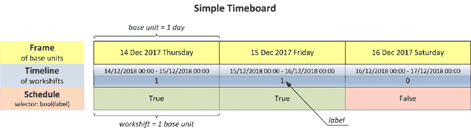
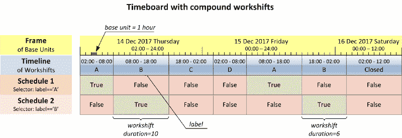

# 使用 Python 库 timeboard 简化复杂的日程安排

> 原文：<https://www.freecodecamp.org/news/introducing-timeboard-a-python-business-calendar-package-a2335898c697/>

马克西姆·马马耶夫

# 使用 Python 库 timeboard 简化复杂的日程安排


`timeboard`是一个 Python 库，它创建工作周期的时间表，并在其上执行日历计算。您可以创建标准的工作日日历以及各种简单或复杂的日程安排。

你可以在这里找到文档[。](http://timeboard.readthedocs.io/en/latest/)

**点击查看 GitHub 回购[。](https://github.com/mmamaev/timeboard)**

在 PyPI [这里](https://pypi.python.org/pypi/timeboard)可以找到。

### 故事

它始于人数案例。我们公司引入了涉及每个员工收入的 KPI，因此我们需要知道每个团队的平均年度人数。我已经写了 Python 脚本，所以我没有被吓倒。

为了统计人数，我必须计算每个员工一年中在公司工作的天数。我想熊猫会很快处理好的。但是结果表明熊猫不能。

俄罗斯的商务日程很繁琐。他们将工作日与周六或周日互换，以填补假期和周末之间的空白。例如，你必须在二月的某个星期六来上班，然后在五月的某个假日星期二之前的一个免费星期一来报销。

每年的计划都是独一无二的。熊猫的工作日日历只支持假期观察的单向修改。所以，我可以把工作日变成休息日，但不能反过来。

然后呼叫中心有接线员，我的焦虑转向了另一个方向。他们轮班工作，时间长短不一，一班进三班出。为了获得呼叫中心的统计数据，我不需要工作日日历。然而，我必须计算特定操作员在一段时间内的轮班次数。

最后，一个不寻常的问题。在我当地的本田经销店，机械师们每周轮流工作:本周的周一、周二、周六和周日，下周的周三至周五。我想总是由一个特定的机械师来服务，因为另一个人曾经把刹车弄坏了。我想要一种简单的方法来确定“我的”机械师的下一个班次。

这些案件有一个共同的基础。他们的解决方案将依赖于“值班”和“下班”时间表。我们应该能够构建适合不同业务案例的不同结构的时间表。在时间表上运行的查询和计算必须区分“上班”和“下班”期间。

我找不到一个 Python 包来提供构建和查询这种时间表的方法。碰巧的是，我有一些空闲时间自己写。


### 这个概念

`timeboard`是一个 Python 库，它创建工作周期的时间表，并在其上执行日历计算。这些物体本身被称为时间板。

关于时间板的推理有三个主要步骤。

你从一个时间间隔开始，这个时间间隔设定了你的日历的界限。一切都会被限制在这个区间内。它被称为(参考)框架。框架由基本单元组成。基本单位是衡量日历所需的最小时间段。例如，如果您根据工作日进行推理，那么基本单位就是一天。或者，如果您建立了一个多小时轮班计划，则基本单位是一小时。



在下一步中，您将定义将框架标记为轮班的规则。轮班是你关心的时间段。他们组成了你的日历。您要计划或计算的是轮班。在标准工作日日历中，轮班是一天(基本单位也是一天，所以它们是一致的)。

在呼叫中心，轮班是一个特定的操作员轮班值班的几个小时的时间段。基本单位可能是一个小时，并且每个轮班包括(可能变化的)数量的基本单位。

填充该帧的轮班序列称为时间线。

最后，创建一个或多个计划。时间表就像放在时间线上的模板。其目的是区分当班和下班。

时间表需要一些东西来工作，以便声明值班或下班的轮班。这就是为什么您为每个轮班提供一个标签，或者更确切地说，在将帧标记到时间线中时为它们提供一个标记规则。每个调度定义一个选择器函数，该函数检查轮班的标签，并为值班轮班返回 True，否则返回 False。除非您覆盖它，否则时间线会伴随默认计划，其选择器会返回标签的布尔值。

有时，您希望为同一时间线定义多个计划。例如，在一个呼叫中心，将有一个呼叫中心作为一个整体的时间表，和一个单独的时间表，为每个团队的经营者。相同的轮班可能在一些时间表下是值班的，而在其他时间表下是下班的。



时间板=时间线+时间表。更准确地说，*时间板*是基于参照*框架*构建的*轮班*的特定*时间线*的工作*时间表*的集合。

一旦你有了时间板，你就可以进行有用的工作:做日历计算，以解决序言中描述的问题。

使用 timeboard 执行的每个计算都是有责任意识的。被调用的方法只“看到”具有指定职责的轮班，而忽略其他轮班。为了揭示轮班的职责，需要给该方法一个时间表。因此，时间板上的每个计算都用任务和时间表来参数化。

默认情况下，工作是“开”的，时间表是时间板的默认时间表。例如，如果您在 timeboard 的某个时间间隔上调用`count()`而不带参数，您将获得在默认计划下该时间间隔中被声明为值班的轮班数。这些缺省值使生活变得更容易，因为在实践中，您将希望主要处理值班轮班。

### API

完整的时间板文档可在[获得。阅读文档](https://timeboard.readthedocs.io/)。

可以用常用的`pip install timeboard`安装包。

#### 设置一个时间板

最简单的入门方法是使用软件包附带的预配置日历。让我们以美国的常规工作日日历为例。

```
 >>> import timeboard.calendars.US as US >>> clnd = US.Weekly8x5()
```

`clnd`对象是一个时间板(一个`timeboard.Timeboard`类的实例)。它只有一个默认的时间表，选择工作日作为值班轮班，而周末，以及美国联邦假日的观察，被宣布为下班。

在我们了解了如何使用时间板之后，我们将简要回顾一下构建自己的时间板的工具。

#### 玩轮班制

使用单个时间点调用 timeboard 实例`clnd()`会检索包含该时间点的轮班。你怎么有一个轮班你可以查询它的职责:

某个日期是工作日吗？

```
>>> ws = clnd('27 May 2017')>>> ws.is_on_duty()False
```

的确，那是一个星期六。

您还可以从当前轮班中展望未来或过去:

下一个工作日是什么时候？

```
>>> ws.rollforward()Workshift(6359) of 'D' at 2017–05–30
```

返回的轮班的序列号为 6359，代表 2017 年 5 月 30 日，顺便说一下，那天是阵亡将士纪念日假期后的星期二。

如果我们要在 2017 年 5 月 1 日开始的 22 个工作日内完成项目，我们的最后期限是什么时候？

```
>>> clnd('01 May 2017') + 22Workshift(6361) of 'D' at 2017–06–01
```

这与以下内容相同:

```
>>> clnd('01 May 2017').rollforward(22)Workshift(6361) of 'D' at 2017–06–01
```

#### 玩间歇游戏

用一组不同的参数调用`clnd()`会产生一个表示日历上的时间间隔的对象。以下间隔包含 2017 年 5 月的所有轮班:

```
>>> may2017 = clnd('May 2017', period='M')
```

五月份有多少个工作日？

```
>>> may2017.count()22
```

休息几天？

```
>>> may2017.count(duty='off')9
```

多少工作时间？

```
>>> may2017.worktime()176
```

某员工 2017 年 4 月 3 日到 2017 年 5 月 15 日在职。公司欠了他们四月份工资的多少？

注意，用两个时间点的元组调用`clnd()`会产生一个包含这些时间点之间所有轮班的间隔。

```
>>> time_in_company = clnd(('03 Apr 2017','15 May 2017'))>>> time_in_company.what_portion_of(clnd('Apr 2017', period='M'))1.0
```

事实上，2017 年 4 月 1 日和 2 日是周末，因此，从 3 日开始，该员工检查了该月的所有工作日。

五月的哪一部分？

```
>>> time_in_company.what_portion_of(may2017)0.5
```

该员工在五月份工作了多少天？

乘法运算符返回两个区间的交集。

```
>>> (time_in_company * may2017).count()11
```

多少小时？

```
>>> (time_in_company * may2017).worktime()88
```

一名员工在 2016 年 1 月 1 日至 2017 年 7 月 15 日期间在职。这个人在公司工作了多少年？

```
>>> clnd(('01 Jan 2016', '15 Jul 2017')).count_periods('A')1.5421686746987953
```


#### 建立你自己的时间板

出于介绍的目的，我将只讲两个例子。如果看起来太过陡峭，请在[项目文档](https://timeboard.readthedocs.io/en/latest/making_a_timeboard.html)中找到对施工工具的详细讨论。

此部分的导入语句:

```
>>> import timeboard as tb
```

让我回到我在序言中提到的汽车经销商的轮班时间表。一个技工本周在周一、周二、周六、周日工作，下周在周三、周四、周五工作；然后重复两周一次的循环。时间板由以下代码创建:

```
>>> biweekly = tb.Organizer(marker='W',...     structure=[[1,1,0,0,0,1,1], [0,0,1,1,1,0,0]])>>> clnd = tb.Timeboard(base_unit_freq='D', ...     start='01 Oct 2017', end='31 Dec 2018', ...     layout=biweekly)
```

首先研究一下最后一句话是有意义的。它创建了一个名为`clnd`的时间板。前三个参数将帧定义为从 2017 年 10 月 1 日到 2018 年 12 月 31 日的一系列日期(`D`)。`layout`参数告诉如何将帧组织到轮班的时间线中。这项工作委托给了一个名叫`biweekly`的`Organizer`。

第一条语句创建了这个`Organizer`，它有两个参数:`marker`和`structure`。我们用一个`marker`在框架上做标记。这些标记是一种里程碑，将帧分成子帧或“跨度”。在这个例子中,`marker=’W’`在每个日历周的开始做了一个标记。因此，每个跨度代表一周。

`structure`参数告诉如何在每个跨度内创建轮班。`structure`的第一个元素，列表`[1,1,0,0,0,1,1]`，应用于第一个跨度(即我们日历的第一周)。跨度内的每个基本单位(即每天)都成为一个轮班。轮班按顺序从列表中接收标签。

`structure`的第二个元素，列表`[0,0,1,1,1,0,0]`，类似地应用于第二个跨度(第二周)。在这之后，因为我们没有得到更多的元素，一个`structure`被循环播放。因此，第三周由第一个元素`structure`提供服务，第四周由第二个元素提供服务，依此类推。

结果，我们的时间线变成了一系列的日子，当机械师值班时用数字`1`标记，当他或她不值班时用数字`0`标记。我们没有指定任何时间表，因为默认建立的时间表很适合我们。默认时间表考虑标签的布尔值，所以`1`翻译成‘上班’，零翻译成‘下班’。

有了这个时间板，我们可以进行任何类型的计算，就像我们之前用业务日历进行的计算一样。例如，如果一个人从 2017 年 11 月 4 日开始受雇于该计划，并且工资是按月支付的，那么该员工获得了 11 月份工资的哪一部分？

```
>>> time_in_company = clnd(('4 Nov 2017', None))>>> nov2017 = clnd('Nov 2017', period='M')>>> time_in_company.what_portion_of(nov2017)0.8125
```

在第二个例子中，我们将为呼叫中心构建一个时间板。呼叫中心 24 小时轮班工作，时间长短不一:08:00 到 18:00 (10 小时)，18:00 到 02:00 (8 小时)，02:00 到 08:00 (6 小时)。操作员的时间表由一个值班班次和三个下班班次组成。因此，需要四组操作员。它们被命名为“A”、“B”、“C”和“D”。

```
>>> day_parts = tb.Marker(each='D', ...     at=[{'hours':2}, {'hours':8}, {'hours':18}])>>> shifts = tb.Organizer(marker=day_parts, ...     structure=['A', 'B', 'C', 'D'])>>> clnd = tb.Timeboard(base_unit_freq='H', ...     start='01 Jan 2009 02:00', end='01 Jan 2019 01:59',...     layout=shifts)>>> clnd.add_schedule(name='team_A', ...    selector=lambda label: label=='A')
```

与经销商案例有四个主要区别。我们将逐一检查它们。

首先，框架的基本单位现在是一小时(`base_unit_freq='H'`)，而不是代理商日历中的一天。

第二，管理器的参数`marker`的值现在是一个复杂的对象，而不是以前的单个日历频率。这个对象是`Marker`类的一个实例。当简单地将框架划分为统一的日历单元还不够时，它用于定义在框架上放置标记的规则。上面标记的签名几乎是可读的——它说:在每天的 02:00，08:00 和 18:00 在*(‘D’)上做一个标记。*

第三，`structure`的值现在更简单了:它是团队标签的一级列表。当`structure`的一个元素不是标签的可迭代的，而是只有一个标签时，它对一个跨度的应用产生了一个轮班，从字面上看，这个轮班跨越了这个跨度。

在我们的示例中，第一个跨度由六个一小时的基本单位组成，从 2009 年 1 月 1 日凌晨 2、3、4 … 7 点开始。所有这些基本单元都合并到一个轮班中，标签为“A”。第二段由 10 个一小时基本单位组成，从 8、9、10 … 17 点开始。这些基本单位被合并到带有标签“B”的单个轮班中，依此类推。当获取了所有标签后，将重播该结构，因此第五个跨度(2009 年 1 月 1 日 08:00:00–17:59:59)将成为标签为“A”的轮班。

概括地说，如果`structure`的一个元素是一个标签列表，那么 span 的每个基本单元变成一个轮班，并从列表中接收一个标签。如果`structure`的元素是单个标签，则跨度的所有基本单元被组合以形成接收该标签的单个轮班。

最后，我们为团队 a 显式创建了一个时间表。默认时间表不符合我们的目的，因为它返回“始终值班”。这对整个呼叫中心来说是正确的，但对某个特定的团队来说却不是这样。对于新的计划，我们提供名称和选择器函数，对于所有标有“A”的轮班，该函数返回 True。在实际应用中，您还需要为其他团队创建时间表。

这个时间板和其他时间板一样好用。但是，这一次我们必须明确指定我们想要使用的时间表。

```
>>> schedule_A = clnd.schedules['team_A']
```

【2017 年 11 月 A 队操作员坐了几班？

```
>>> nov2017 = clnd('Nov 2017', period='M', schedule=schedule_A)>>> nov2017.count()22
```

总共有多少个小时？

```
>>> nov2017.worktime()176
```

一个人从 2017 年 11 月 4 日开始在 A 队当操作员。工资按月发放。该员工获得了 11 月份工资的多少？

```
>>> time_in_company = clnd(('4 Nov 2017',None), schedule=schedule_A)>>> time_in_company.what_portion_of(nov2017)0.9090909090909091
```

#### 更多使用案例

你可以在[项目文档](https://timeboard.readthedocs.io/en/latest/use_cases.html)的 [jupyter 笔记本](https://timeboard.readthedocs.io/en/latest/_downloads/use_cases.ipynb)中找到更多用例(几乎取自现实生活)。

请随意使用`timeboard`，不要犹豫在 [GitHub](https://github.com/mmamaev/timeboard/issues) 上留下反馈或公开问题。