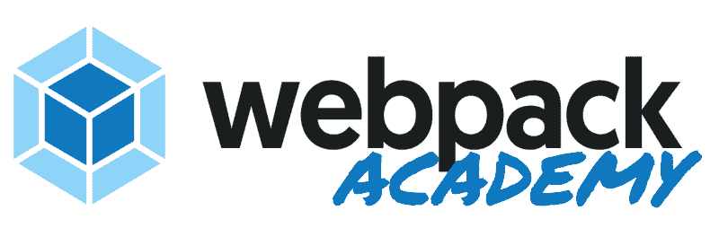
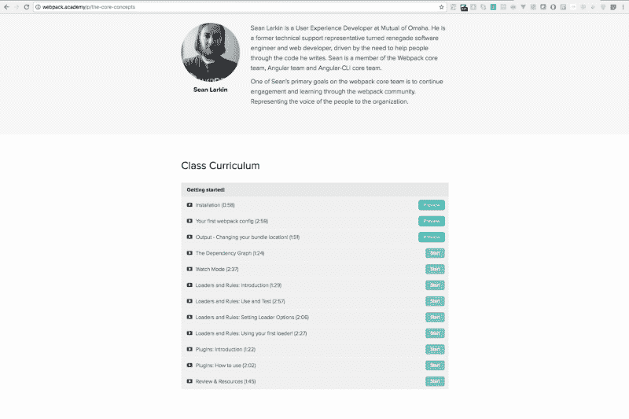
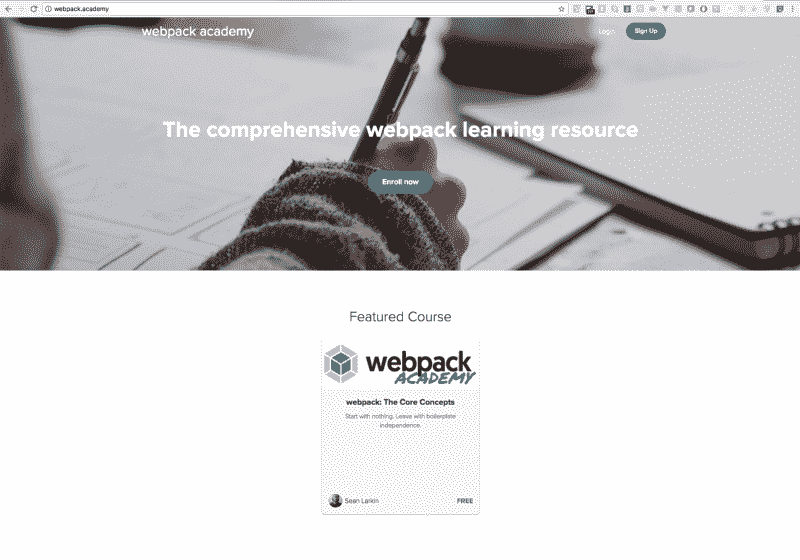

# 介绍 webpack academy！

> 原文：<https://www.freecodecamp.org/news/introducing-webpack-academy-bad0a4e23deb/>

肖恩·拉金

# 介绍 Webpack 学院:全面的 webpack 培训课程

Webpack Academy was made for the webpack community. You are in the driver seat.

几周前，我宣布我将辞职去微软工作。我很快意识到，我会给奥马哈互惠银行的团队留下很多工作。

作为 webpack 的维护者，我知道已经将构建工具推向了极限。通过先进的 webpack 技术，我们的团队能够将[MutualOfOmaha.com](http://www.mutualofomaha.com/)重新设计成一个多页面应用，同时也是一个进步的 Web 应用。

但是当我离开后，谁来接管这个复杂的实现呢？我处理了大部分的 webpack 设置和配置。我是否真的做了足够多的工作来将这些知识传递给我的团队成员，以便其他人能够继续保持这些知识？

这一切让我感到焦虑，也有点内疚。我想回报他们在我追求开源时给予我的所有支持，以及他们对我将 webpack 嵌入网站架构的信任。

我们尝试安排一系列不同的学习课程，但是很难找到时间让每个人都参与进来。所以我查了一下视频。

### 介绍 Webpack Academy

我决定创建 [Webpack 学院](http://webpack.academy)，这是一个培训和教育平台，面向那些想了解更多 Webpack 知识的人。这是一个完美的方式，不仅让我可以回馈我的团队——让他们可以免费访问所有内容——还可以通过与每个人分享这些内容来造福社区。

今天我将发布第一门课程，名为[核心概念](http://webpack.academy/courses/the-core-concepts)。我模仿了我们文档页面的[概念部分。它可以帮助您“只通过命令行”就能入门，并且对 webpack 有一个基本的了解，并有信心使用它。](http://webpack.js.org/concepts)

因为我相信任何人都应该有机会接触到这些知识，这将是一门永远免费的课程。

The [Core Concepts Curriculum](http://webpack.academy/courses/the-core-concepts). At your fingertips.

### 我的开源工作怎么办？

我为第一个课程所做的工作不仅仅是为了 webpack 社区和我在奥马哈互惠银行的团队。这是一个学习平台的跳板。

Webpack Academy homepage (http://webpack.academy)

我已经有了多门课程的计划和大纲。

以下是一些你可以期待的付费课程:

*   Web 应用程序基础(“VanillaJS”)
*   高级 Webpack —环境、部署目标、可扩展性
*   每个主要框架(React、VueJs、Angular、Choo、遗留库)一个系列
*   全面的配置审查
*   编写定制加载器和插件

如果您决定支付这些课程的费用，该平台产生的任何资金的 30%将直接进入我们的 webpack open collective。

没有 webpack，就没有课程。所以你可以通过注册来回馈开源，让它成为一个简单的工作费用。

我在 Webpack Academy 上花费的时间将永远让位于我的 Webpack 开源工作。因此，虽然我可以承诺提供高质量的工作，我只会在我的空闲时间工作。

我正在寻找来自 webpack 社区的反馈和想法，以帮助我决定我们下一步应该重点发布什么。

最后， **Webpack Academy** 开始是为了帮助那些想听的人分享我对 Webpack 的热情和热爱。所以再一次，你坐在驾驶座上！句号。

### 试试吧！

所以，享受核心概念，与你的同事分享，让我在推特上认识 T2，告诉我你的想法。用#webpack 或# webpackAcademy 发推特。