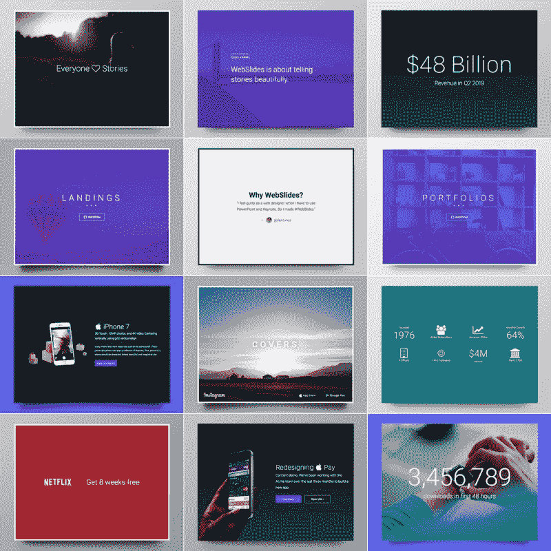
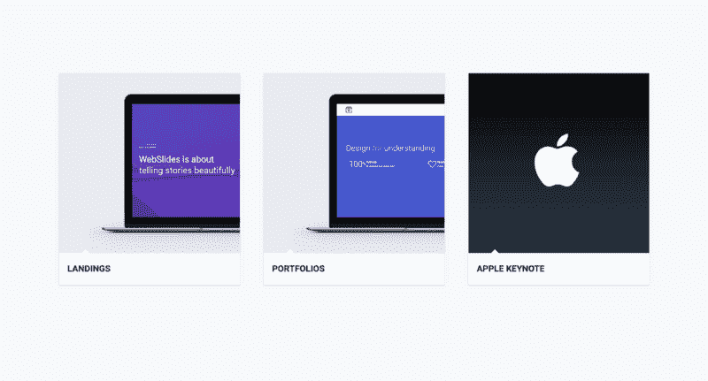
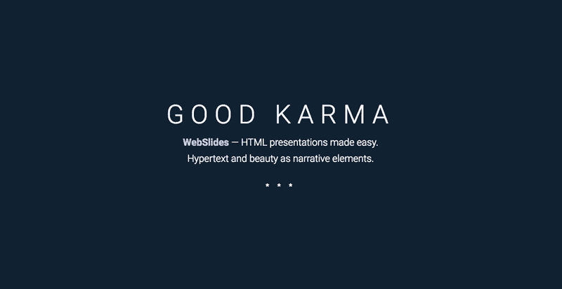

# 网页快讯简介

> 原文：<https://www.freecodecamp.org/news/introducing-webslides-fa7a9e37ff97/>

何塞·路易斯·安特卫普

# *WebSlides:一种新的开源方式，可以在你的浏览器中创建漂亮的演示文稿*


每个人都喜欢故事。人们分享让他们感到鼓舞的内容。我们需要故事来知道我们并不孤单。

幻灯片是讲述这些故事的绝佳方式。已经有很多很好的工具，比如 Powerpoint 和 Keynote。

但是没有人喜欢 HTML 演示。从字面上看，没有人。“我喜欢 HTML 演示文稿”在谷歌搜索中返回零结果。？

我是一名设计师和开发人员，整天在网络这个巨大的平台上工作。对我来说，在我的电脑上加载一个单独的程序，使用 Powerpoint 和 Keynote——以及它们奇怪的专有格式——然后必须通过电子邮件发送给某人，这总是令人尴尬和过时的。

所以我建立了[网络幻灯片](https://webslides.tv)。

网络幻灯片都是关于**讲述一个故事，然后以一种美丽的方式分享:**超文本，干净的标记，可爱的 CSS 作为叙事元素。



在网络幻灯片中设计可以和用 Powerpoint 一样快。对 HTML 和 CSS 有基本了解就可以了。只需选择一个[演示](https://webslides.tv/demos)，分分钟定制。

设计师、开发人员、营销人员和记者现在有了一个 web 原生演示工具，它具有:

*   快速导航键盘快捷键(以及水平和垂直滑动)。
*   将您直接带到特定幻灯片的永久链接。
*   幻灯片计数器。
*   [+40 个组件](https://webslides.tv/demos/components)，包括封面、卡片、报价和表格
*   各种各样的背景:颜色、渐变、图像和视频。
*   具有自动填充和相等高度的灵活块。
*   500+ SVG 图标感谢字体真棒



Demos: [Landings](https://webslides.tv/demos/landings) · [Portfolios](https://webslides.tv/demos/portfolios) · [Keynote](https://webslides.tv/demos/keynote).

### 代码诗

这里有一些 [HTML 源代码](https://webslides.tv)向你展示它是如何做到的。这段代码是干净的、可伸缩的，并且有很好的文档记录。它使用直观的标记和[流行的命名约定](https://webslides.tv/demos/classes)。**没有必要过度使用类或嵌套**。

> i `n the #web` slides 元素上的每个父元素`*<secti*`都是一个单独的幻灯片:

```
<article id="webslides"&gt;  <!-- Slide 1 -->  <section>    <h1>Design for trust</h1>  &lt;/section>  <!-- Slide 2 -->  <section class="bg-primary aligncenter">    <div class="wrap">      <;h2>.wrap = container 1200px</h2>    </div>  </section></article>
```

### **有目的的设计**

WebSlides 是免费的，[开源](https://github.com/jlantunez/webslides)。我建造它是因为我们需要一个平台来讲述美丽的故事。让我们看看发生了什么:

*   [中等](https://medium.com) =美文。
*   字体 =美丽的形式。
*   WebSlides =漂亮的演示文稿和长表格。



Demo: [Why WebSlides?](https://webslides.tv/demos/why-webslides) — Good karma.

我欢迎[对网络幻灯片](https://github.com/jlantunez/webslides/issues)的请求，这样我们就可以不断改进和扩展这个工具。

请将这篇文章分享给任何你认为可能对使用这个工具感兴趣的人。期待您的评论。如果你有任何问题，欢迎[给我发电子邮件](mailto:jlantunez@gmail.com)。

*特别感谢[路易斯·萨克里斯坦](https://twitter.com/luissacristan)和[杰恩·希弗](http://twitter.com/jennschiffer)。*？你也可以关注 T [witter、](https://twitter.com/webslides) D [ribbble、](http://dribbble.com/tags/webslides)和 G [ithub 的更新。](https://github.com/jlantunez/webslides)