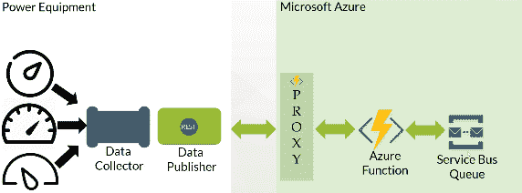
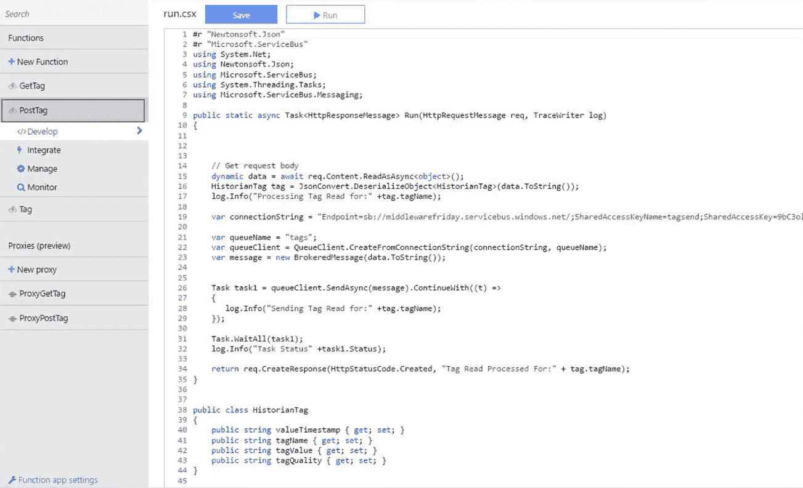
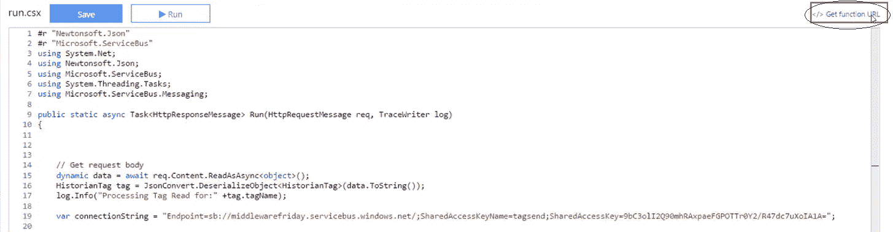

# Azure 函数代理快速介绍

> 原文：<https://www.freecodecamp.org/news/introduction-to-azure-function-proxies/>

在本文中，我们将讨论 Azure 函数代理。它们为 Azure 函数提供了“反向代理功能”。Azure 函数代理与 Azure API 管理非常相似。

这篇文章的灵感主要来自微软 Azure Function 团队的 Matthew Henderson。在他的博客文章中，[Azure Functions Proxies public preview](https://blogs.msdn.microsoft.com/appserviceteam/2017/02/22/azure-functions-proxies-public-preview/)，Matthew 解释了微软提出 Azure Functions proxy 理念背后的原因。

## **什么是 Azure 函数代理？**

Azure 函数代理背后的基本思想是，它们允许我们为多个函数应用程序定义单个 API 表面。现在，任何函数应用程序都可以定义一个端点，作为另一个 API 的反向代理。端点可以是功能应用程序，也可以是其他任何东西。

你正在寻找一个现成的工具来管理和监控你的 Azure 功能吗？在这里免费试用这一款。

## **实现 Azure 功能代理的原因**

对于一些用户来说，很难用单一功能的应用程序来管理大型解决方案。有很多组织在他们的微服务架构中使用 Azure 功能，并在各个组件之间进行部署。在这种情况下，每个功能 app 都有自己的托管，所以需要跟踪许多不同的功能 app。

我们也可以将一些功能应用程序与另一个 API 相结合，但它们可能位于不同的区域。因此，我们最终将大量的复杂性传递给了我们的客户或消费系统。

Azure 功能代理通过提供客户端可以实际使用的统一 URI(统一资源标识符)来解决这个问题。与此同时，我们可以抽象所有不同功能的应用程序或其他 API，这也将使我们能够以更快的速度构建我们的 API。

## **解释**

在上面的解决方案架构图中，我们有一个 Azure 函数代理，后跟后端的 Azure 函数和服务总线队列来存储信息。在图表的另一端，我们有数据发布者。出于讨论的目的，假设 Power 设备生成标签事件，并通过代理将其转发给 Azure 函数。

最初，我们通过从 Azure 门户选择功能选项来创建功能应用。假设我们为 C#创建了一个 HTTP 触发器，其中 HTTP 触发器的功能是通过 HTTP 请求调用一个函数。

现在我们创建两个函数:一个是 PostTag，如果我们想创建一个标签，它代表我们的文章。PostTag 函数的代码如下:

然后，我们创建另一个名为 GetTag 的函数，代码如下所示:

我们使用 GetTag 从队列中提取消息，最后一个标记值返回给客户端。

我们可以选择下面指定的链接来获取这两个函数的 URL。这个链接将为我们提供一个用于授权的安全令牌。

在这一点上，我们转移到函数应用程序设置，并启用具有最新代理运行时版本 0.2 的 Azure 函数代理。因此，我们从 Function App Development 中选择“New Proxy”选项，这使我们能够创建两个代理。它们是代理 GetTag 和代理 PostTag。代理中的可用选项有:

*   代理 URL
*   路线模板
*   后端 URL

对于 GetTag 和 PostTag 事件，代理 URL 中指定的 URL 和路由模板是相同的。代理 GetTag 的后端 URL 将与 GetTag 事件相关，但是对于代理 PostTag，它将与 PostTag 事件相关。

## 总结

Azure 函数代理是模拟和测试 Azure 函数端点的好方法，甚至在实际的后端开发开始之前。此外，当您需要将一个 URI 路由到另一个时，它们甚至可以用于生产。

我想总结一下，Azure 函数代理是 Azure 函数团队提供的最吸引人的走向市场的特性之一。

这篇博客最初发表于 [Serverless360](http://bit.ly/2ZkPmLZ) 。