# 区块链初学者教程——学习用 JavaScript 和 Solidity 编写智能合约

> 原文：<https://www.freecodecamp.org/news/introduction-to-blockchain/>

我第一次尝试学习区块链发展，我感到不知所措。

你正在阅读的这篇教程是我希望能及时发送给自己的。

这将为您的区块链开发打下坚实的基础，并为您成功编写自己的智能合约奠定基础。

除了我的解释和代码示例之外，我还包括了许多视频，您可以使用它们来补充您的学习。

## 先决条件

本教程假设您理解一些基本的编码概念。其中一个特别有用的是面向对象编程(OOP)的概念。

## 什么是区块链？

区块链是一个称为区块的交易或资产网络，其中每个区块都与其他区块相连。这里的每个人都可以平等地访问网络中流通的数据。

[https://www.youtube.com/embed/GvmRSS0vKxE?feature=oembed](https://www.youtube.com/embed/GvmRSS0vKxE?feature=oembed)

你可以把区块链看作是一份保存一群人所做交易细节的文件，每个人都有一份副本。每个人都必须在接受任何更新之前达成一致。

任何未经他人同意试图篡改其文件的人都被视为欺诈，并将遭受预先设定的后果。

例如，假设一群朋友(Njoku、Samson 和 Ebere)决定开设一个点对点储蓄账户，该账户必须运行一段时间才能取款。三人约定，谁也不做老大，每个人对账户有平等的访问权，保证信任。所以他们开了一个账户。

每当他们中的一个人存钱时，每个人都会收到一份新的账户历史文档。每当他们决定添加一个新成员时，这个人就会成为签名者的一部分，并获得一份帐户历史记录。

在提议的日期之外发生撤回之前，每个人都必须同意。不遵守这些条款将导致诸如失去所有个人存款或在支付罚款后退出协会等后果。

区块链被称为一种去中心化的技术，因为数据和权限在网络中的每个人之间平等共享。它不同于公司拥有数据的集中式应用程序，消费者只是希望他们的数据不被滥用。

分散应用的例子包括比特币和以太坊，而集中应用包括脸书和谷歌。

区块链技术属于 **Web 3** 的范畴，只是因为它是互联网的第三阶段，用户可以**读取、写入和拥有数据**。Web 1 是用户只能**读取数据**的阶段。Web 2 出现在 21 世纪初的某个时候，是用户可以**读写数据**的阶段。

## 区块链如何工作

在这一节中，我将解释区块链应用程序在幕后发生了什么。

我们将从理论上看它是如何工作的开始，然后我们如何使用许多开发人员已经知道的编程语言——JavaScript 来复制它。

[https://www.youtube.com/embed/jWXH-49BAPU?feature=oembed](https://www.youtube.com/embed/jWXH-49BAPU?feature=oembed)

### 区块链背后的理论

区块链是许多街区的连接。所以它从一个叫做**创世块**的块开始。其中，一个块包含一个哈希、前一个块哈希和至少一个事务。

区块链中的每个块都保留了自己的散列和前一个块的散列的记录，以保护网络免受黑客攻击。

这意味着黑客要获得访问权并破坏网络，他们需要生成散列并将其匹配到正确的块，而不破坏其他块。这听起来压力很大，几乎不可能。这就是区块链的安全程度。

接下来，网络上的任何用户都可以执行至少一项交易。如果用户一次完成了一组他们需要的事务，他们可以使用这些事务来创建一个块。现在可以将该块添加到其他块中。

添加一个新区块的整个过程被称为**挖掘**。该过程保护并验证块中包含的事务。

挖掘时会生成块的哈希。计算散列的过程被称为**工作证明**。

### 实践中的区块链

让我们使用一些 JavaScript 面向对象编程来演示区块链是如何工作的。我们使用面向对象的方法，因为区块链编程使用相同的模式。

但是在我们开始构建之前，让我们学习如何为区块链中的每个块生成散列。

#### 如何生成块的散列

有许多用于生成块散列的库。但是在本教程中，我们将使用 [SHA256](https://www.npmjs.com/package/sha256) 库。SHA256 是最受欢迎的，被许多知名公司使用。

SHA256 库接受提供给它的任何数据，并返回一个 64 字符长的字符串。传递给 SHA256 库的每个字符串每次都将返回相同的 64 个字符长的字符串。

你可以看看 https://emn178.github.io/online-tools/sha256.html 的界面，看看它是如何工作的。

出于安全原因，区块链不使用任何生成的散列。它指定了哈希被接受前几个字符必须是什么样子。这意味着散列将不得不生成多次，并且每次迭代中的变化记录将被保留以供参考。

例如，区块链可以指定唯一可接受的散列必须在开头包含三个零。

为了计算散列，我们需要给被散列的字符串加上一个数字`nonce`。`nonce`通常从零开始，并在每次生成散列时递增，直到找到以三个零开始的散列。那么散列和`nonce`将被存储以供参考。

下面的代码将计算“man”的散列值:

```
SHA256("man").toString()
```

但是，我们可能会多次运行该函数，以获得开头有三个零的字符串。由于函数总是返回相同的结果，我们需要给字符串加一个数，并递增它，直到得到我们想要的散列。

我们将使用的代码如下所示:

```
let hash = "";
let nonce = 0;

while (hash.substring(0, 3) !== "000") {
  nonce++;
  hash = SHA256("man" + nonce).toString();
}

console.log(nonce);
console.log(hash);
```

该代码将在`5707`次后产生`000d6575d4670dae39df9944e54c27dc4837beab1db23e2de264a7c1a3f38b1a`，而不是`48b676e2b107da679512b793d5fd4cc4329f0c7c17a97cf6e0e3d1005b600b03`。

构建区块链应用程序所采取的这种级别的安全措施使它们非常可靠且可接受。

既然我们了解了散列在区块链是如何产生的，让我们回到演示区块链是如何工作的。

### 区块链如何使用 JavaScript 工作

首先，创建一个名为**区块链简介**的目录。然后在终端中打开目录。

运行以下命令，并在出现所有提示时按 enter 键来初始化项目:

```
npm init
```

创建两个文件:`blockchain.js`和`test.js`:

```
touch blockchain.js test.js
```

我们将使用`blockchain.js`文件来编写模拟区块链如何工作的代码，并使用`test.js` 来测试代码并查看结果。

在`blockchain.js`中，输入以下代码:

```
class Blockchain {
    constructor () {
        this.chain = [this.createGenesisBlock()];
        this.pendingTransactions = [];    
    }
}
```

上面的代码声明了一个名为`Blockchain`的类。`constructor`函数用于初始化`chain`和`pendingTransactions`数组。

`chain`数组将包含添加到网络中的每个事务块或组。`pendingTransactions`数组将保存尚未添加到块中的所有事务。

记住区块链是从创世纪开始的。这就是为什么用一个包含创建 genesis 块的函数的数组来初始化`chain`数组。您也可以将 genesis 块硬编码到链数组中。

我们现在需要构建`createGenesisBlock`函数。使用下面的代码:

```
 createGenesisBlock() {
    return {
      index: 1,
      timestamp: Date.now(),
      transactions: [],
      nonce: 0,
      hash: "hash",
      previousBlockHash: "previousBlockHash",
    };
  }
```

该函数将只执行一次，因为`constructor`函数只运行一次——在程序开始时。

这也是唯一一次使用随机未计算散列或 previousBlockHash，因为它是链中的第一个块，并且不携带任何事务。

接下来要做的是创建一个函数来获取最后一个块。使用下面的代码:

```
 getLastBlock() {
    return this.chain[this.chain.length - 1];
  };
```

此代码将使我们能够访问最近添加的块的详细信息。记住，我们需要跟踪前一个块的散列。

现在让我们添加代码来计算块的散列。

```
 generateHash(previousBlockHash, timestamp, pendingTransactions) {
    let hash = "";
    let nonce = 0;

    while (hash.substring(0, 3) !== "000") {
      nonce++;
      hash = SHA256(
        previousBlockHash +
          timestamp +
          JSON.stringify(pendingTransactions) +
          nonce
      ).toString();
    }

    return { hash, nonce };
  }
```

为了确保这一点，使用以下命令安装`SHA256`库:

```
npm i sha256
```

将其导入到您的`blockchain.js`文件的顶部，如下所示:

```
const SHA256 = require("sha256");
```

我们现在将添加一个函数来创建我们的事务，并将它们添加到挂起事务的列表中。输入以下代码:

```
 createNewTransaction(amount, sender, recipient) {
    const newTransaction = {
      amount,
      sender,
      recipient,
    };

    this.pendingTransactions.push(newTransaction);
  }
```

现在到了我们构建最后一个函数的时候了。它将使我们能够将挂起的事务添加到一个块中，计算散列，并将该块添加到`chain`。在下面键入代码:

```
 createNewBlock() {
    const timestamp = Date.now();
    const transactions = this.pendingTransactions;
    const previousBlockHash = this.getLastBlock().hash;
    const generateHash = this.generateHash(
      previousBlockHash,
      timestamp,
      transactions
    );

    const newBlock = {
      index: this.chain.length + 1,
      timestamp,
      transactions,
      nonce: generateHash.nonce,
      hash: generateHash.hash,
      previousBlockHash,
    };

    this.pendingTransactions = [];
    this.chain.push(newBlock);

    return newBlock;
  }
```

上面的代码使用`getLastBlock`函数来访问前一个块的散列。它计算当前块的散列，将新块的所有细节添加到一个对象中，清除`pendingTransactions`数组，并将新块推入`chain`。

让我们导出`Blockchain`类，以便能够在文件外部访问它:

```
module.exports = Blockchain; 
```

#### 如何测试代码

我们想测试一下我们到目前为止所写的代码，看看它是否如预期的那样工作。我们将导航到`test.js`文件，并开始导入我们刚才导出的`Blockchain`类，如下所示:

```
const Blockchain = require("./blockchain");
```

现在我们已经有了这个类，我们可以创建它的一个实例，并将其命名为`bitcoin`:

```
let bitcoin = new Blockchain(); 
```

你可以随便怎么称呼它，但我会用`bitcoin`因为它很受欢迎。

现在让我们看看默认情况下`bitcoin`中有什么。为此，我们将把它记录到控制台，如下所示:

```
console.log(bitcoin); 
```

我们现在将在终端中打开项目，并运行以下命令:

```
node test
```

它应该输出以下内容:

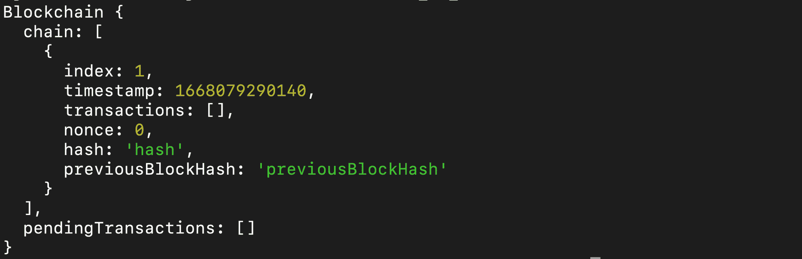

Default Output

在上面的输出中，我们有包含 genesis 块的`chain`数组和不包含任何内容的`pendingTransactions`数组。

您会记得,`constructor`函数包含所有这些数据，它在程序开始时运行一次。

要添加新事务，请使用下面的代码:

```
bitcoin.createNewTransaction(
  "100",
  "0xBcd4042DE499D14e55001CcbB24a551F3b954096",
  "0xa0Ee7A142d267C1f36714E4a8F75612F20a79720"
);
```

第一个参数是`amount`，第二个是`sender`，第三个是`recipient`，正如我们在创建函数时指定的那样。

如果您再次运行`node test`，您应该在`pendingTransactions`数组中有一个条目，如下所示:

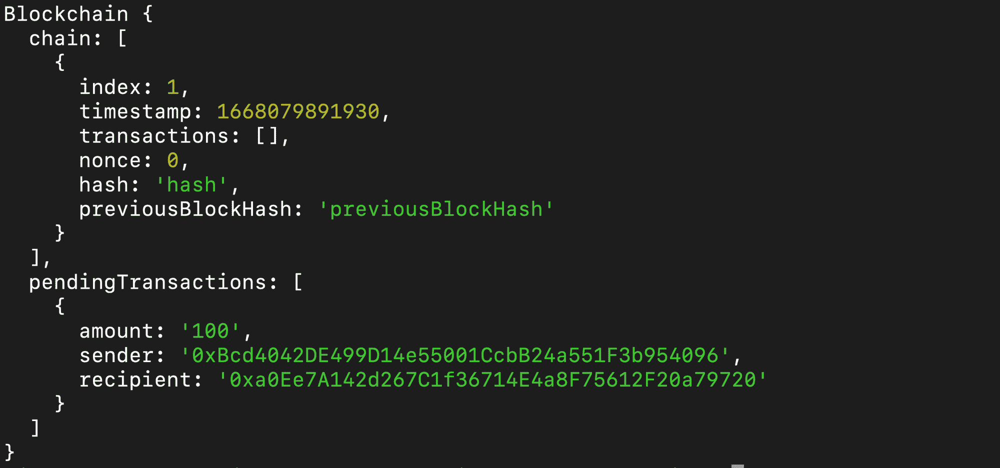

One pending transaction added

要创建或挖掘区块，请输入以下代码:

```
bitcoin.createNewBlock(); 
```

这一次您应该会得到下面的输出:

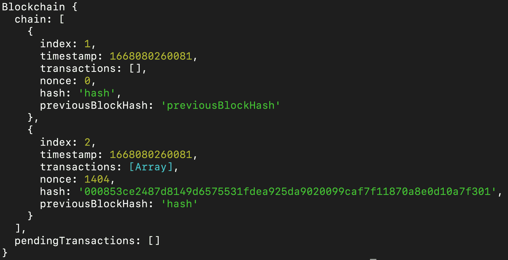

您会注意到链中现在有两(2)个块，并且在`pendingTransactions`数组中不再有事务。

第二个模块中需要注意的是`nonce`和`hash`。这个`nonce`就是`1404`。这意味着需要 1404 次迭代来获得这个块的正确的`hash`。

要查看第二个块中的事务，我们使用以下代码:

```
console.log("\n");
console.log("Second Block Transactions", bitcoin.chain[1].transactions);
```

现在我们有了下面的结果:

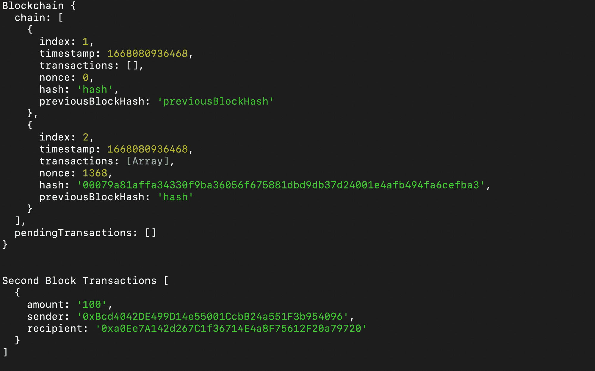

看起来不错！它表明我们所有的功能都按预期工作。这就是许多区块链应用程序的幕后工作。

你刚刚了解了区块链是如何工作的。但是你不应该仅仅基于这个程序的想法来构建区块链应用程序。要让你建立真实世界的 DApp，还有很多东西要学。尽管如此，我们到目前为止所做的将帮助你更深入地学习 web3。

你需要学习的一件事是区块链编程语言，如 Solidity 和其他区块链前端库，如 Web3js 和 Etherjs。

我现在将向您介绍使用 Solidity 的智能合约。

## 如何写一份巧妙的合同

在这一节中，我们将涵盖所有你需要知道的关于智能合约和 Solidity 编程语言的知识。

[https://www.youtube.com/embed/5P-ntj1MVDY?feature=oembed](https://www.youtube.com/embed/5P-ntj1MVDY?feature=oembed)

### 什么是智能合同？

智能合约是存储在区块链上的程序。它包含在执行前必须满足的某些条件。

智能合约效仿传统合约。但它们是不同的，因为它们是由计算机在满足预定条件时自动运行的。

### 什么是扎实？

Solidity 是用于构建大多数智能合约的主要编程语言，因为它是专门为此目的而设计的。它遵循我们使用 JavaScript 演示的 OOP 模式，并借用了 TypeScript 的类型化特性。因此，虽然有些语法可能与您已经知道的有所不同，但掌握起来并不太难。

我们将通过使用它来建立一个智能合约，使用户能够相互发送资金，从而学习 Solidity 的基础知识。

不要担心，你将不必建立另一个项目。我们将使用 [remix playground](https://remix.ethereum.org/) 做一切事情——编写代码、编译、调试和测试。

让我们现在前往 https://remix.ethereum.org/。你应该让下面的屏幕盯着你看一会儿:


Remix welcome page

混音正在为你准备一切。耐心点😊

完成后，您应该会看到以下屏幕:

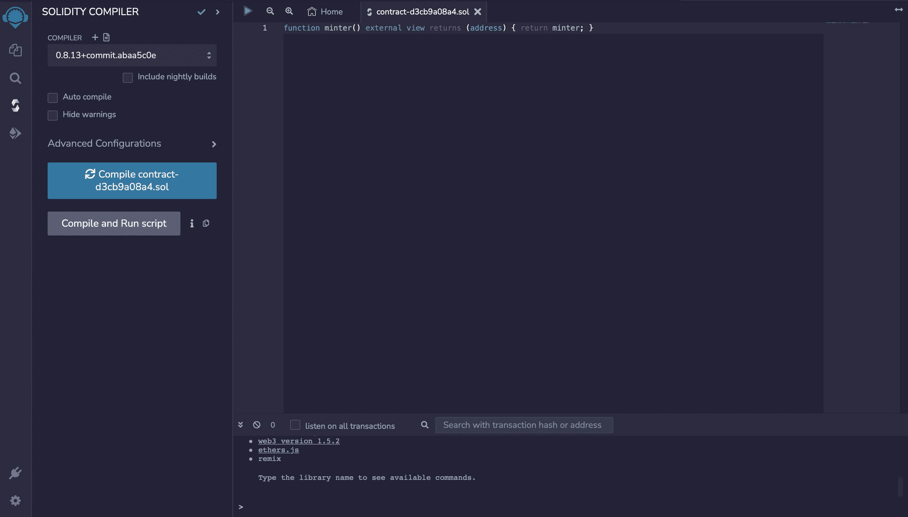

这个游乐场为我们提供了撰写第一份智能合同所需的一切。

让我们首先删除默认情况下为我们创建的文件。要做到这一点，请点击 remix 标志下面的第一个图标。

在浏览器部分右击文件名，并选择`delete`:

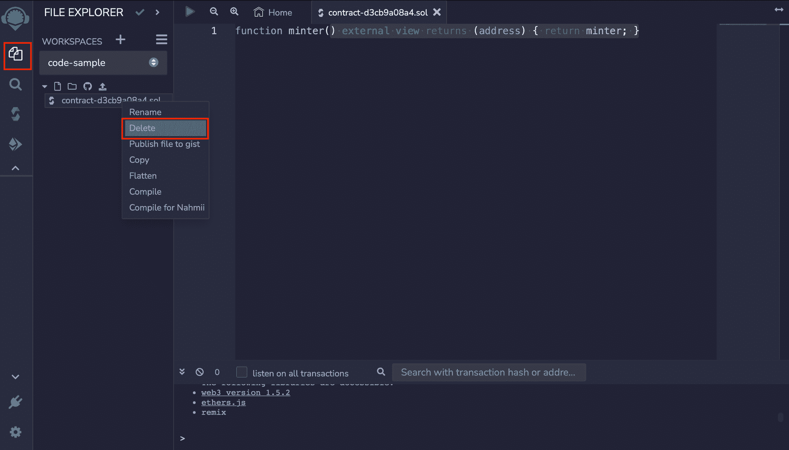

在弹出菜单中点击`OK`。

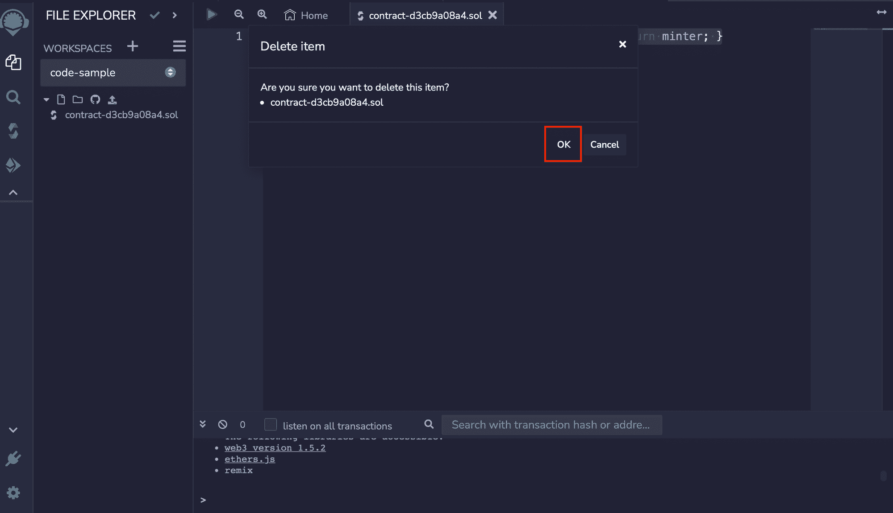

我们现在将创建一个名为`Blockchain.sol`的新文件，方法是单击下图中标记为红色的文档图标，并在提供的空白处键入文件名:

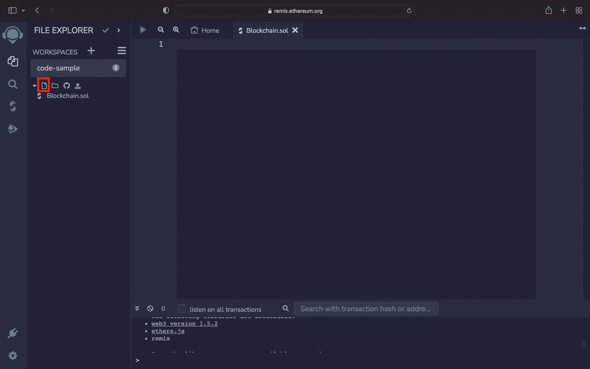

`.sol`是用于实体文件的扩展名。空白处是我们输入代码的地方。

坚固性代码总是以下面一行开始:

```
// SPDX-License-Identifier: UNLICENSED
```

如果没有这段代码，您将会得到一个错误。这就好比说你接受了写作扎实的条款和条件。

接下来要做的就是陈述你要用的 Solidity 版本。我将使用以下代码:

```
pragma solidity ^0.8.7; 
```

脱字符号(^)表示该程序将与 solidity 的更高版本兼容。我们现在可以开始程序了。

首先要做的是定义一个名为`Blockchain`的`Class`。然而，`Class`在 solidity 中的关键词是`contract`。所以我们有:

```
contract Blockchain {

}
```

在上面的契约中，我们将使用下面的代码创建一个名为`BlockStruck`的数据类型:

```
struct BlockStruck {
    uint256 index;
    uint256 timestamp;
    uint256 amount;
    address sender;
    address recipient;
}
```

Solidity 允许我们使用关键字`struct`创建任何我们认为合适的数据类型，关键字是**结构的缩写。**

我们在结构中定义了所有需要值的键。由于 solidity 是一种强类型语言，我们在每个键之前指定了一个数据类型。`struct`类似于 JavaScript 中的`Object`。

`uint`表示变量是整数。在它后面加上一个数字(如`uint256`或`uint18`)指定它应该取的最大大小，但默认情况下`uint`采用`uint256`。

另一方面，`address`表示变量是钱包地址。还有`string`数据类型。

我们要定义的下一个东西是一个`event`。一个`event`通常在一个函数执行结束时被触发，向前端发送数据。你可以像`console.log`一样看它。有些人还把它作为一种廉价的储存方式。

我们想定义一个`BlockEvent`,我们将在向链中添加一个块后触发它。在`BlockStruct`下面输入以下代码:

```
 event BlockEvent(uint256 amount, address sender, address recipient);
```

与`struct`不同，圆括号用于表示`event`，它们的键用逗号(，)分隔。另外，注意`struct`不以分号结尾，但是`event`以分号结尾。

现在我们已经定义了块的结构，让我们用它来设置一个名为`chain`的块数组，如下所示:

```
BlockStruck[] chain; 
```

上面的代码将`chain`定义为`BlockStruct`的数组。和往常一样，我们在变量名前指定数据类型。

接下来，定义一个变量来跟踪`chain`中有多少块:

```
uint256 chainCount;
```

您可以选择在同一行(`uint256 chainCount = 0;`)上给它赋值，或者在`constructor`函数中这样做:

```
constructor() {
    chainCount = 0;
}
```

我们现在将定义三(3)个函数:`addBlockToChain`(向链中添加块)；`getChain`(返回添加到链中的所有块)，以及`getChainCount`(获得添加到链中的块的数量)。

#### addBlockToChain 函数

下面的代码开始该函数:

```
 function addBlockToChain(uint256 amount, address payable recipient) public {

}
```

像您已经知道的函数一样，它以关键字`function`开头，后跟`function`的名称，以及括号中的参数。

其中一个参数(`recipient`)有一个名为`payable`的标志，表示钱包地址有资格接收资金。旁边是函数的可见性标志(`public`)。

可见性定义了谁可以调用函数或变量。可以是`public`、`private`、`internal`或`external`。

1.  任何契约都可以调用一个`public`函数。
2.  函数只能在定义它们的契约中被调用。
3.  只有继承了`internal`函数的契约才能调用它们。
4.  只有其他合同才能使用这些功能。

在`addBlockToChain`中，我们首先将`chainCount`递增 1，如下所示:

```
chainCount += 1;
```

接下来，将事务块添加到链中，如下所示:

```
 chain.push(
            BlockStruck(
                chainCount,
                block.timestamp,
                amount,
                msg.sender,
                recipient
            )
        );
```

定义`struct`时，`BlockStruct`取与键集相对应的值。然后使用`.push`方法将其添加到`chain`数组中。现在我们在`chain`有了一个新的街区。

最后，我们触发我们不久前创建的`BlockEvent`:

```
emit BlockEvent(amount, msg.sender, recipient);
```

`emit`是用来调用事件的关键字。与`BlockStruct`一样，`BlockEvent`在定义它时获取与键集相对应的值。

`addBlockToChain`函数现在看起来像这样:

```
 function addBlockToChain(uint256 amount, address payable recipient) public {
        chainCount += 1;

        chain.push(
            BlockStruck(
                chainCount,
                block.timestamp,
                amount,
                msg.sender,
                recipient
            )
        );

        emit BlockEvent(amount, msg.sender, recipient);
    }
```

#### getChain 函数

这个函数没有参数，但返回一个`BlockStruct`。我们将使用以下代码:

```
 function getChain() public view returns (BlockStruck[] memory) {
        return chain;
    }
```

程序返回`chain`，一个所有块的数组。

在上面的函数中需要注意的是，我们使用了`view`来表明这个函数返回值。我们还指出了我们期望返回的数据类型的种类(`returns (BlockStruck[] memory)`)和要使用的存储类型(`memory`)。

solidity 中主要有两种存储类型:`Storage`和`Memory`。`Storage`是默认的存储类型，用于永久保存程序的数据，而`Memory`是临时的，在气体方面更便宜。

天然气是执行智能合同的费用。不要担心那个。我们有一些虚拟气体，这将使我们能够测试我们的程序。

#### getChainCount function

和`getChain`一样，这个函数也没有参数。它返回到目前为止添加到`chain`的块数。参见下面的代码:

```
 function getChainCount() public view returns (uint256) {
        return chainCount;
    }
```

这就完成了我们想要创建的智能合同。现在代码看起来像这样:

```
// SPDX-License-Identifier: UNLICENSED
pragma solidity ^0.8.7;

contract Blockchain {
    struct BlockStruck {
        uint256 index;
        uint256 timestamp;
        uint256 amount;
        address sender;
        address recipient;
    }

    event BlockEvent(uint256 amount, address sender, address recipient);

    BlockStruck[] chain;
    uint256 chainCount;

    constructor() {
        chainCount = 0;
    }

    function addBlockToChain(uint256 amount, address payable recipient) public {
        chainCount += 1;

        chain.push(
            BlockStruck(
                chainCount,
                block.timestamp,
                amount,
                msg.sender,
                recipient
            )
        );

        emit BlockEvent(amount, msg.sender, recipient);
    }

    function getChain() public view returns (BlockStruck[] memory) {
        return chain;
    }

    function getChainCount() public view returns (uint256) {
        return chainCount;
    }
} 
```

### 如何编制智能合同

我们需要编译代码来检查是否有需要修复的错误。下面的步骤将帮助我们做到这一点。

点击 remix IDE 左侧菜单上的第三个图标:

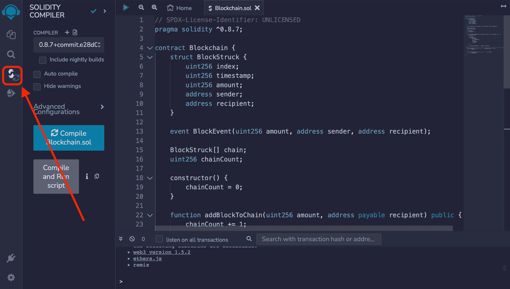

确保所选的 solidity 版本与您在智能合约开始时指定的版本相匹配。然后点击`Compile`按钮:

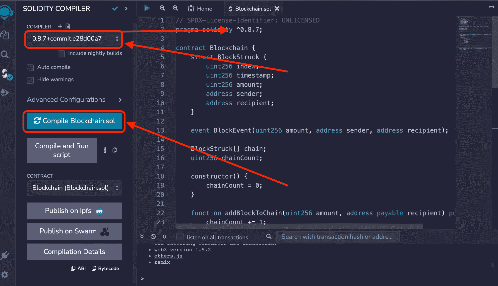

编译成功，因为我们没有错误。美丽的🥰.

### 如何部署智能合同

现在编译成功了，让我们部署契约。

单击侧面菜单中的第四个图标:

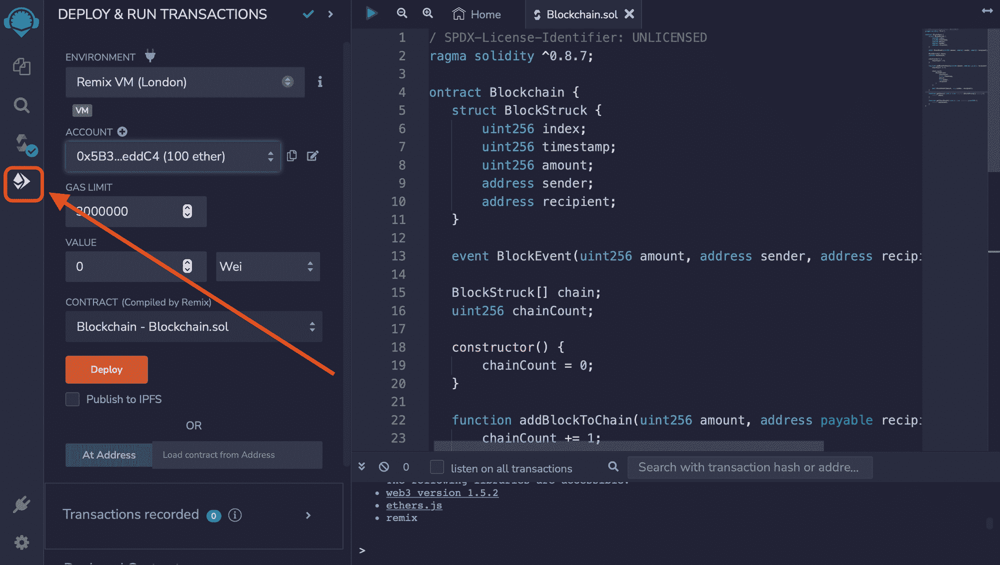

为`ENVIRONMENT`选择`Remix VM (London)`。它有十(10)个帐户，每个帐户有 100 个虚拟醚，您可以用于测试目的。然后点击`Deploy`按钮:

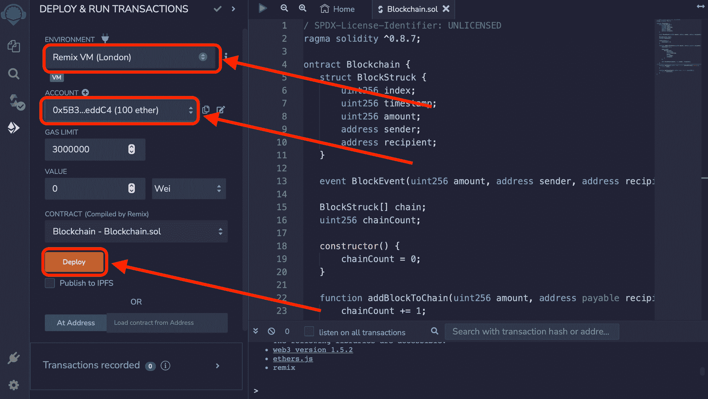

现在，当您滚动到底部时，您将在**已部署合同下找到`Blockchain`合同。**单击已部署合同名称旁边的箭头，查看您可以与之交互的合同功能。

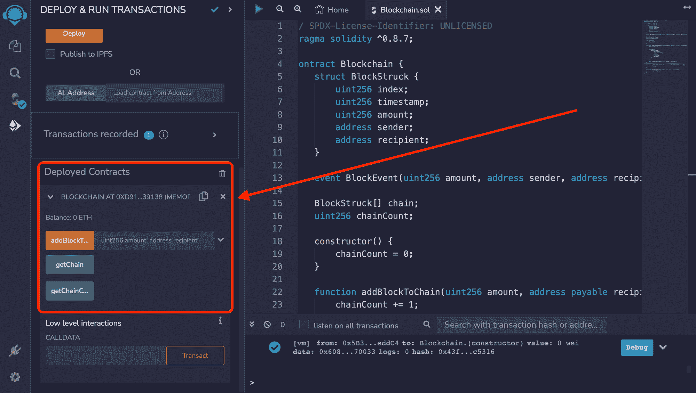

上图中有三(3)个函数与我们在智能合同中定义的三(3)个函数相匹配。Remix 会自动为您创建一个 UI，以便在您部署合同时对其进行测试

### 如何测试智能合同

我们现在将测试我们创建的函数，看看它们如何响应。

#### 如何测试 addBlockToChain 函数

要测试`addBlockToChain`功能，单击功能按钮和输入框旁边的脱字符号(^)图标。下拉一个表格。为`amount`填写`10`，为`recipient`填写 10 个账户地址中的一个:

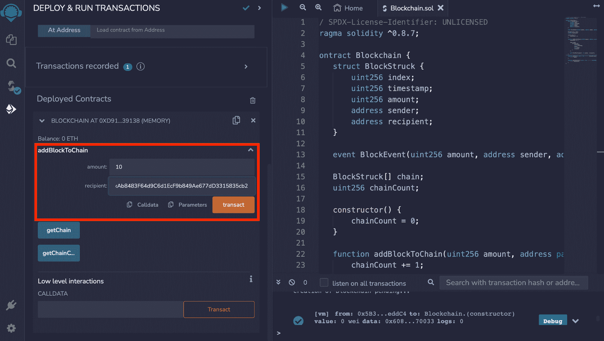

点击`transact`按钮。

请注意，您不能将资金发送到您用于部署合同的同一地址。您必须选择不同的帐户。

#### 如何测试 getChain 函数

点击`getChain`按钮，显示目前为止链中的块:

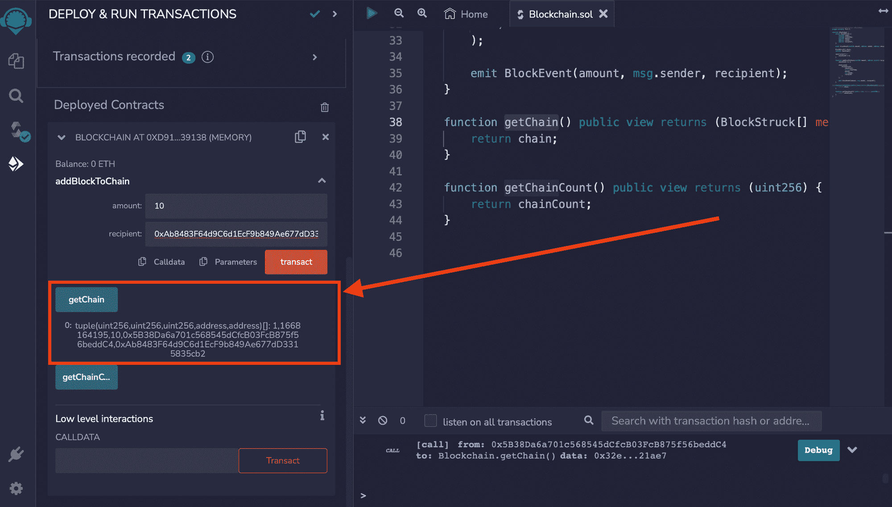

它返回一个`tuple`，是`array`的一种。回想一下，`chain`应该是一个包含块列表的`array`。

#### 如何测试 getChainCount 函数

要获得添加的块数，点击`getChainCount`按钮:

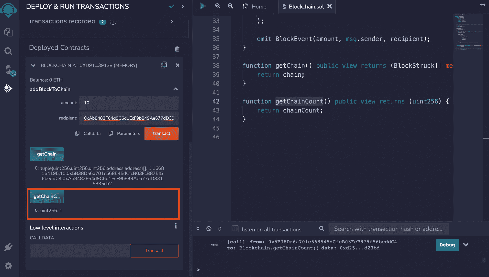

正如我们定义的那样，它返回一个`uint`。现在`chain`中只有一个项目，但是随着你不断添加更多的块，这个数字将会增加。

瓦拉！我们走到这一步了吗？😳多棒啊😍。

恭喜你坚持到本教程结束！

你现在已经准备好去探索你能在区块链身上做的一切。

## 结论

区块链正在重新定义互联网，并已成为定局。我在学习这项新技术的过程中遇到了困难，这促使我写下了这篇初学者友好指南。我希望它能帮助那些还在苦苦挣扎的人。

在本教程中，您了解了什么是区块链，它是如何工作的，以及幕后发生了什么。我们使用 JavaScript 的 OOP 模式演示了它是如何工作的，然后在最后简要介绍了如何使用 solidity 编程语言和 remix IDE 构建智能合约。

我建议您继续学习并更好地构建区块链应用程序，按照列出的顺序(按难度递增)创建以下项目:

```
Hello World
Simple Storage
Voting Smart Contract
Ether Wallets
Multi Send
Time Lock Smart Contract
ERC20 Token
Token Wallet
Air Drop
ICO
```

这些项目将挑战你做研究和提高你的区块链技能。

快乐连锁！