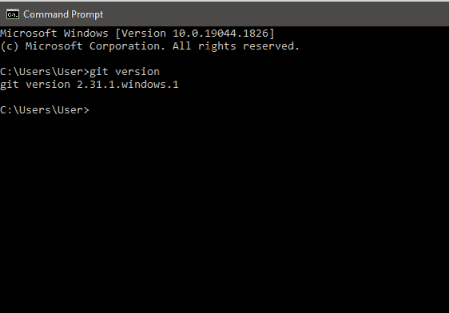
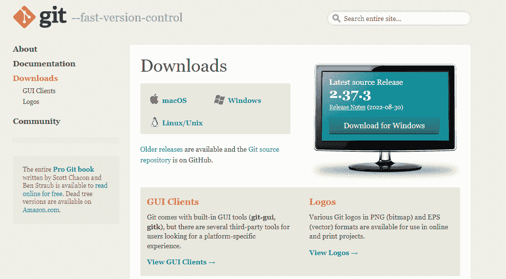
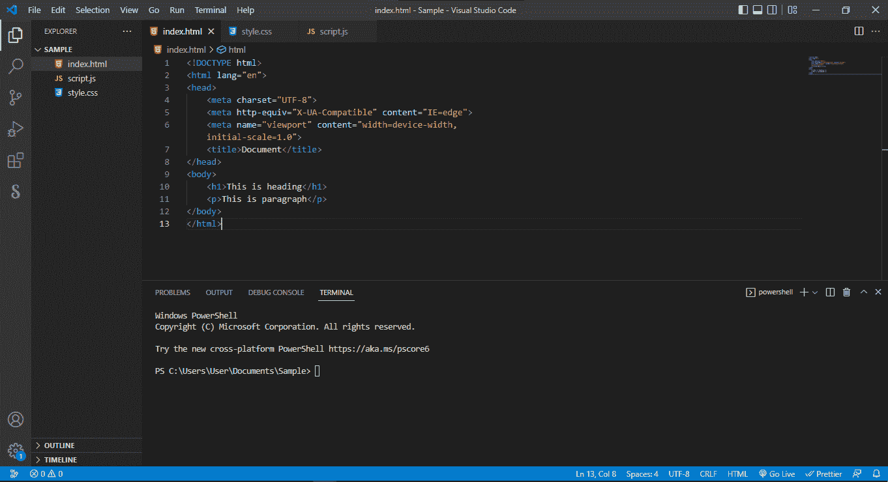
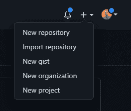
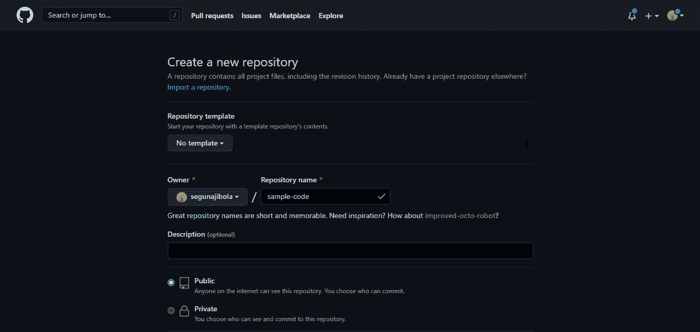
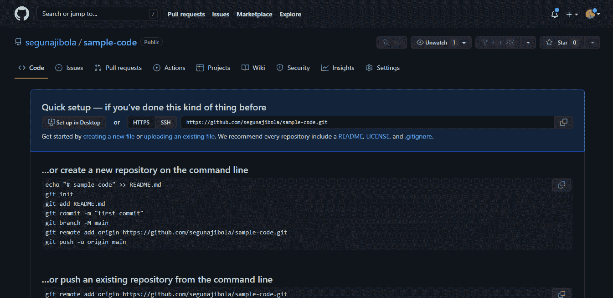
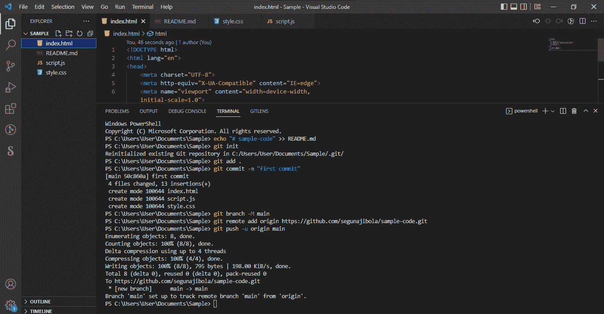
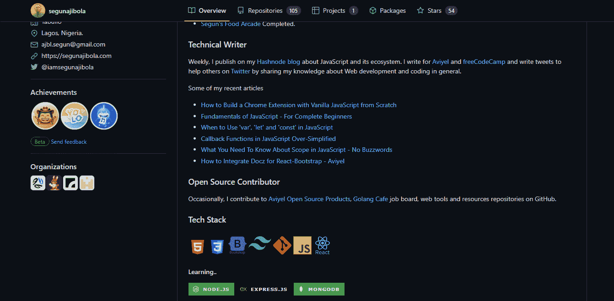

# 如何使用 Git 和 GitHub——初学者入门

> 原文：<https://www.freecodecamp.org/news/introduction-to-git-and-github/>

Git 和 GitHub 是编程中常用的工具。他们帮助您管理不同版本的代码，并与其他开发人员协作。

构建项目是开发人员的核心部分之一。Git 和 GitHub 是与他人一起构建项目时必不可少的工具。

但是如果你以前没有使用过，它们看起来会很复杂。所以我写了这篇文章来简化 Git 和 GitHub 的工作方式。

## 目录

*   [什么是 Git 和 GitHub](#what-are-git-and-github) ？
*   [为什么要学习 Git 和 GitHub](#why-should-you-learn-git-and-github) ？
*   [Git 和 GitHub 的区别](#differences-between-git-and-github)
*   [如何开始使用 Git 和 GitHub](#how-to-start-using-git-and-github)
*   [学习 Git 和 GitHub 的资源](#resouces-to-learn-git-and-github)

## 什么是 Git 和 GitHub？

Git 是由 Linus Torvalds 在 2005 年开发的开源软件，用于跟踪 T2 分布式版本控制系统中的变化。

Git 是开源的，因为除了它的创建者之外，任何人都可以免费修改和使用它的源代码。开源项目是由不同地点的不同开发人员共同构建和维护的。

Git 通过分布式版本控制系统跟踪变更。这意味着 Git 可以在您开发项目时跟踪项目不同版本的状态。它是分布式的，因为您可以从另一台计算机访问您的代码文件——其他开发人员也可以。

当您构建一个开源项目时，您需要一种方法来记录或跟踪您的代码。这有助于组织您的工作，并让您跟踪您所做的更改。这就是 Git 让你做的事情。

但是你也需要一个地方来存放你的代码——这使得控制你的项目的每个版本更加容易和快速。这就是 GitHub 的用武之地。

GitHub 是一个“Hub”(一个地方或平台)，Git 用户在这里一起构建软件。GitHub 也是一个托管提供商和版本控制平台，你可以用它来合作开源项目和共享文件。当你使用 GitHub 时，你是在使用 Git。

## 为什么要学习 Git 和 GitHub？

根据 Techmonitor.ai 的数据，截至 2021 年 11 月，超过 7300 万开发者使用 GitHub。GitHub 社区将在 2025 年达到 1 亿用户。

正如你所看到的，全世界有数百万人使用这些工具，而且这个数字还在不断上升。

正因为如此，越来越多的公司要求新员工知道如何使用 Git 和 GitHub。因此，如果你正在寻找一份开发人员的工作，这些是必须具备的基本技能。

如果你没有使用 Git 和 GitHub，很明显——你应该使用！

## Git 和 GitHub 的区别

Git 是一个管理和跟踪代码的版本控制系统。另一方面，GitHub 是一种让你在互联网上托管、共享和管理你的代码文件的服务。

GitHub 在底层使用 Git，让你在它的平台上轻松管理你的 Git 库或文件夹。

所以 Git 是实际的版本控制系统，GitHub 是托管代码的平台。

如果你想进一步了解这两个工具的区别，你可以[阅读这个教程](https://www.freecodecamp.org/news/git-and-github-overview/)。

## 如何开始使用 Git 和 GitHub

### 步骤 1–安装 Git

Git 预装在一些 MAC 和基于 Linux 的系统中，但是你可以通过在终端键入`git version`来检查你的机器中是否安装了 Git。您可以使用命令提示符来完成此操作。



正如你在上面看到的，我在我的 Windows 电脑上安装了 Git 2 . 31 . 1 版。如果你的电脑没有安装 Git，你就不会得到一个版本。

你可以在这里下载 Git [，然后选择你要下载的操作系统。](https://git-scm.com/download)



遵循必要的安装指南，直到安装完成。打开命令提示符并键入`git version`来验证 Git 是否已成功安装。

### 步骤 2–创建 GitHub 帐户。


要在 GitHub 上创建一个帐户，你将被要求提供一些个人信息，如姓名，确认你的电子邮件，设置用户名和密码，你的帐户应该在几分钟内设置好。

点击在[GitHub.com 上创建账户。](https://github.com/)

### 第三步-将你的 GitHub 账户连接到你的 Git 账户。

您将从您的终端执行此操作。

要设置您的 Git 用户名，请在您的终端中键入以下内容:

```
git config --global user.name "Segun Ajibola"
```

要确认您已经正确设置了 Git 用户名，请键入以下内容:

```
git config --global user.name
```

您应该将“Segun Ajibola”作为输出。

要设置您的 Git 电子邮件，请在您的终端中键入以下内容:

```
git config --global user.email "youremail@gmail.com"
```

要确认您已经正确设置了 Git 电子邮件，请键入以下内容:

```
git config --global user.email
```

您应该将“youremail@gmail.com”作为输出。

您将被要求验证您的 GitHub 帐户，因此只需使用相同的电子邮件登录以进行确认。

### 步骤 4–在本地创建和编辑代码文件



### 步骤 5——在 GitHub 上创建一个存储库

单击右上角的+号创建一个新的存储库。仓库就像你的在线代码文件夹。



您将被提示进入此页面:



命名您的存储库并给它一个描述(这是可选的)。

单击“创建存储库”按钮创建存储库。您将被提示进入此页面:



### 步骤 6–将本地代码推送到 GitHub

你可以使用代码编辑器内置终端，使用 Git 将你的代码推送到 GitHub。点击`ctrl` + `shift` + `'`，在 VSCode 中打开终端。

在你的终端中一个接一个地输入下面的命令。每次输入后，按下`Enter`键继续。



‌ `echo "# sample-code" >> README.md`

`git init`

`git add .`

`git commit -m "first commit"`

`git branch -M main`

`git remote add origin https://github.com/segunajibola/sample-code.git`

`git push -u origin main`

注意，我们在 GitHub 的存储库中有`git add README.md`。但是这里我们有`git add .`，它让 Git 添加我们所有的代码文件，而不是由`echo "# sample-code" >> README.md`创建的`README.md`文件。所以如果你在本地文件夹中创建了其他文件，你需要使用`git add .`来添加所有文件。

请注意，`git remote add origin [https://github.com/segunajibola/sample-code.git](https://github.com/segunajibola/sample-code.git)`将包含到您自己的存储库的链接，并且它将具有您的 GitHub 帐户的名称。

## 需要了解的常见 Git 命令

您可以在终端中使用许多 Git 命令，这可能会让人不知所措。所以我建议先关注一些最受欢迎的。

他们在这里:

让你在你的文件夹中初始化 Git。

`git add [Readme.md](https://readme.md/)`允许您添加自述文件，而`git add .`允许您添加当前文件夹中的所有文件。

`git commit`存储添加的文件。将`-m`用于消息，后跟实际消息。

`git branch`创建一个新的分支，它是添加时出现的存储库的新版本，并且`-M`将名称移动到`main`。

`git remote add origin`最后将本地文件夹连接到 GitHub 上的存储库。其后是存储库的链接。

`git push -u origin main`将代码推送到 GitHub。`-u`标志为分支创建一个跟踪引用，`origin main`将代码放入`main`分支。

这些是您将一直使用的一些主要命令。这是一个初学者和非技术指南，帮助您开始使用 Git 和 GitHub，所以我们不会在这里进行太多的详细介绍。

你越是继续使用 GitHub，你就会越习惯使用这些命令。关键是从小处着手，保持你的动力。

随着您使用 Git 构建小项目并在 GitHub 上托管它们，这最终会变得更容易。

如果您发现很难使用终端在文件夹之间导航，请花些时间练习一下。同样，随着时间的推移和使用，它会变得更容易。

## 如何定制您的 GitHub 个人资料

自定义您的 GitHub 个人资料自述文件有助于您从随机的 GitHub 用户中脱颖而出。

README.md 文件帮助您描述您的 GitHub 个人资料，您可以使用它来展示您目前正在学习的内容以及您的技能和贡献。

GitHub README.md 使用 markdown 来格式化其内容。它有一个简单易学的语法。

[这里的](https://www.freecodecamp.org/news/how-to-write-a-good-readme-file/)是创建和定制 GitHub 账户的简单指南。

这是我的 GitHub 档案的 README.md 文件。



你可以在这里查看其他一些 GitHub README.md 个性化简介。

## 学习 Git 和 GitHub 的资源

如果你想更详细地学习 Git 和 GitHub，下面是一些有用的课程和文章:

1.  [Git 和 GitHub 教程——面向初学者的版本控制](https://www.freecodecamp.org/news/git-and-github-for-beginners/)
2.  [基本 Git 命令——如何在实际项目中使用 Git](https://www.freecodecamp.org/news/how-to-use-basic-git-and-github-commands/)
3.  [Git 和 GitHub 初学者速成班](https://www.youtube.com/watch?v=RGOj5yH7evk)
4.  [Git 简介:它是什么，如何使用它](https://www.freecodecamp.org/news/what-is-git-and-how-to-use-it-c341b049ae61/)
5.  [关于 GitHub](https://github.com/about)

## 结论

如果你读完了这篇文章，你可能会对 Git 和 GitHub 感到不知所措。是的，这是你在科技领域需要学习的另一件大事，但是不要担心。

记住，每当你开始学习新的东西时，起初你似乎不会掌握它。但是经过一段时间的努力，你会变得更舒服。

Git 和 GitHub 也是一样——如果你在一段时间内经常使用它，你会习惯的。

感谢阅读这篇文章。如果你喜欢它，考虑分享它来帮助其他开发者。

你可以通过 [Twitter](https://twitter.com/iamsegunajibola) 、 [LinkedIn](https://www.linkedin.com/in/segunajibola/) 和 [GitHub](https://github.com/segunajibola) 联系我。

快乐学习。