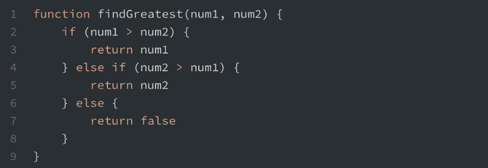
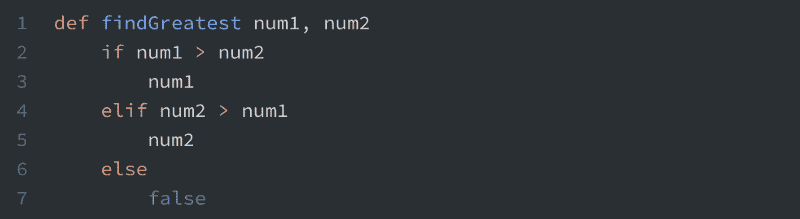
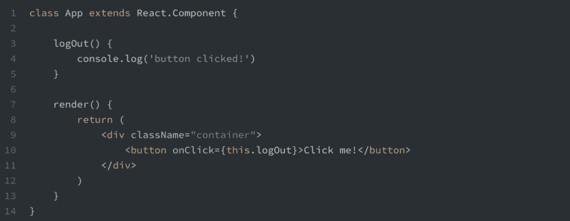
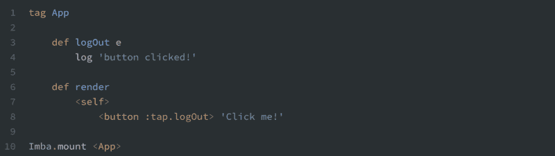
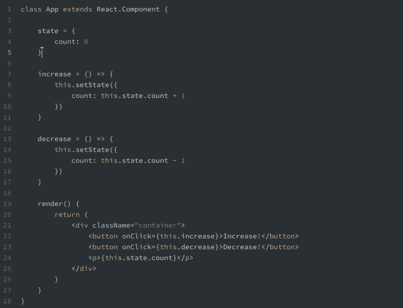
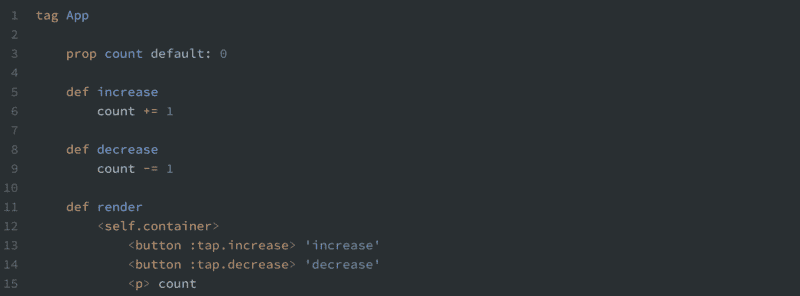
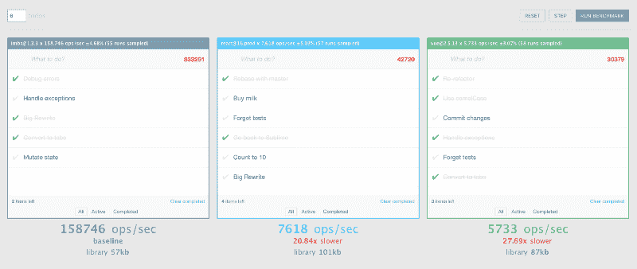

# Imba 简介:用于快速 DOM 更新的 JavaScript 兼容语言

> 原文：<https://www.freecodecamp.org/news/introduction-to-imba-the-alternative-to-javascript-e2aa1e3d1769/>

Imba 是我们专门为构建 web 应用程序而创建的开源编程语言。它编译成 JavaScript 并在现有的 JS 生态系统中工作，这意味着您可以将它与 Node、npm 和 Webpack 一起使用。

Imba 的最大好处是，它能产生比使用 React 和 Vue 等基于虚拟 DOM 的库更快的应用程序。速度的提高得益于 Imba 处理 DOM 更新的方式，我的联合创始人兼 Imba 创建者[辛德雷·奥森·阿萨瑟](https://www.freecodecamp.org/news/introduction-to-imba-the-alternative-to-javascript-e2aa1e3d1769/undefined)T2 在这里解释了这一点。

过去几年我一直在使用 Imba，它确实是一种令人愉快的语言，因为它的语法比 JavaScript 更简洁，这提高了代码的可读性。

在这篇文章中，我将教你如何开始自己开发简单的 Imba 应用程序。在我们继续创建用户界面之前，我们将从一些语法开始。最后，我将帮助您设置您的机器，以便您可以继续自己的黑客活动。

### 使用 Imba 的项目

但是在我们进入代码之前，我想指出这不仅仅是业余爱好项目中使用的一种晦涩的语言。Imba 也为大公司的关键任务应用提供支持。

一个例子是冰岛的鱼类拍卖市场。由于鱼类在冰岛是一件大事，这个市场占该国经济的 1.6%，约为 3.9 亿美元。

> 所以 Imba 实际上处理了冰岛 1.6%的 GDP！


其次，整个学习平台[Scrimba.com](https://scrimba.com/)都是用 Imba 搭建的，前端和后端都是。这是一个复杂的应用程序，高度依赖于 Imba 的快速 DOM 协调。


因此，您今天将学习的语言既可以帮助您构建大规模的生产应用程序，也可以帮助您构建较小的辅助项目。

我们开始吧！

### 语法

Imba 语法与 JavaScript 有很多相似之处，但它也受到 Ruby 和 Python 的影响。一路上很容易捡，先举个例子。下面您将看到一个简单的 JavaScript 函数，它返回两个数字中最大的一个，如果相等，则返回 false:



findGreatest in JavaScript

现在我们把这个翻译成 Imba:



findGreatest in Imba

仅仅通过这两个例子，您就可以推断出 Imba 和 JavaScript 之间的一些核心差异:

1.  **功能→定义。**首先，`function`关键字被重命名为`def`。
2.  **没有括号。**此外，函数参数没有用括号括起来。在 Imba 中，您实际上很少需要括号，但是如果您愿意，您可以使用它。
3.  **凹痕。** Imba 是基于缩进的。这意味着我们不需要使用花括号，这样可以节省空间。
4.  **不归。**在 Imba 中，返回是隐式的，意味着我们不必写`return`。Imba 自动返回函数的最后一个表达式。

这两个都不是 Imba 最重要的方面，但是它们合在一起使得代码没有 JavaScript 那么冗长。随着本文的深入，这种优势将变得更加明显。

### 构建用户界面

让我们继续创建用户界面。这其实就是 Imba 的构建目的。这意味着 DOM 节点作为所谓的*一等公民嵌入到语言中。*

> 如果你来自 React world，你可以把它看作是 Imba 语言中内置了自己版本的 JSX。

考虑 React 中的以下代码，它只是呈现一个按钮，并在它被单击时将一些内容记录到控制台:



如果我们把这个例子重写为 Imba，我们将得到如下结果:



花点时间比较一下这两者。我想让你注意三件事:

1.  **标签是原生的。**`class App extends React.Component`已经被翻译成简单得多的`tag App`。这是因为`tag`是因巴语的本土部分。对于 DOM 标签和自定义标签都是如此。
2.  **没有结束标签。**当我们缩进时，我们不需要关闭我们的标签(例如>上的`</butt`)。这为我们节省了大量的打字和空间。
3.  **简单的类语法。**在 Imba 中添加类很简单。我们简单地给标签本身添加了一个`.container`，而不是繁琐的`className="container"`。

您可能还注意到事件处理程序是不同的。我们做`:tap.logOut`而不是`onClick={this.logOut}`。这只是在 Imba 中处理用户输入的几种方法之一，如果你感兴趣，你可以在文档中读到更多关于[的内容。](http://imba.io/guides/essentials/event-handling#event-handling)

### 处理数据

现在，我们来看看 Imba 是如何处理数据的。在下面的例子中，我修改了我们的应用程序，在`App`组件的状态中包含了一个`count`变量。该变量将根据用户单击的按钮而增加或减少。



Imba 中的重写看起来如下:



最显著的区别是代码量。

> 在代码行数和字符数方面，Imba 示例大约只有一半大小。

虽然代码行肯定是一个肤浅的比较，但代码库的可读性是很重要的。更少的行、更少的字符和更少的符号使得 Imba 例子比 React 更容易阅读。

#### 内隐自我

你可能也注意到了，我们通过`count`直接访问实例变量，而不是 React，React 使用`this.state.count`来获取值。

在 Imba，我们本可以做到`self.count`。然而，`self`是隐式的，所以我们不需要写它。Imba 检查范围内是否有一个`count`变量，或者`count`是否作为一个实例变量存在于`App`本身。

#### 易变性

上面两个例子的另一个很大的区别是它们如何处理状态变化。在 Imba 示例中，状态是可变的，因为我们只是简单地直接改变它——`count`变量。

这遵循了与 React 相反的模式，其中`this.state`被视为不可变的，改变它的唯一方式是通过`this.setState`。

如果你喜欢的话，你可以在 Imba 中使用不可变库。在这个意义上，它实际上是不可知论的。在 Scrimba，我们使用可变性，因为我们认为变得不可变的成本不值得。

### 在本地设置 Imba

既然您已经学习了基础知识，是时候开始为自己编码了，所以让我们在您的本地机器上进行设置。只需遵循这四个步骤，你就可以开始了:

```
git clone https://github.com/somebee/hello-world-imba.git
```

```
cd hello-world-imba
```

```
npm install
```

```
npm run dev
```

导航到 [http://localhost:8080/](http://localhost:8080/) ，你会看到你的项目。打开 *src/client.imba* 开始修改 app。

或者，如果你想在没有本地设置的情况下开始，你可以使用[这个交互式 Scrimba 游乐场。](https://scrimba.com/c/cyW2esn?utm_source=freecodecamp.org&utm_medium=referral&utm_campaign=imba_intro_article)

### Imba 的速度

在我们结束之前，让我们看看 Imba 的速度。它之所以如此之快，实际上是因为它*没有*遵循 React 流行的虚拟 DOM 实现。相反，它使用了一种叫做记忆化 DOM 的东西，这是一种更简单、更直接的方法。

在下面的[基准测试](https://somebee.github.io/dom-reconciler-bench/index.html)中，我们通过与 Vue 和 React 一起执行*现场测试*来计算我们每秒能够完成多少 DOM 操作。这三个库做完全相同的事情，就是修改 todo-list 数千次。



Benchmarking Imba against React and Vue. The result: 20–30 times faster DOM reconciliation.

> 如您所见，Imba 实际上处理的操作比 React 和 Vue 多 20-30 倍。

所以 Imba 很快。非常快。

#### 舍入

关于 Imba 还有很多其他的东西要学，所以我推荐你去看看 [doc。例如，理解它的 getter/setter 和隐式调用的概念是很重要的。学习曲线在开始时可能有点陡峭，但事实就是如此。人生中每一件值得做的事，都需要一点点的痛苦和努力；)](http://imba.io/)

在下一篇文章中，我将介绍一些更高级的特性。[在 Twitter 上关注我](http://bit.ly/perborgen)到时候会通知我。

祝你好运，编码快乐！

* * *

感谢阅读！我的名字叫 Per Borgen，我是最简单的学习编码方法——Scrimba 的联合创始人。如果你想学习建立专业水平的现代网站，你应该看看我们的[响应式网页设计训练营](https://scrimba.com/g/gresponsive?utm_source=freecodecamp.org&utm_medium=referral&utm_campaign=imba_intro_article)。


[Click here to get to the advanced bootcamp.](https://scrimba.com/g/gresponsive?utm_source=freecodecamp.org&utm_medium=referral&utm_campaign=imba_intro_article)