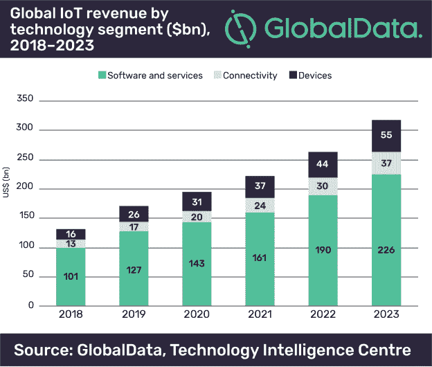
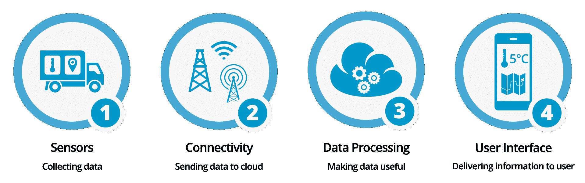
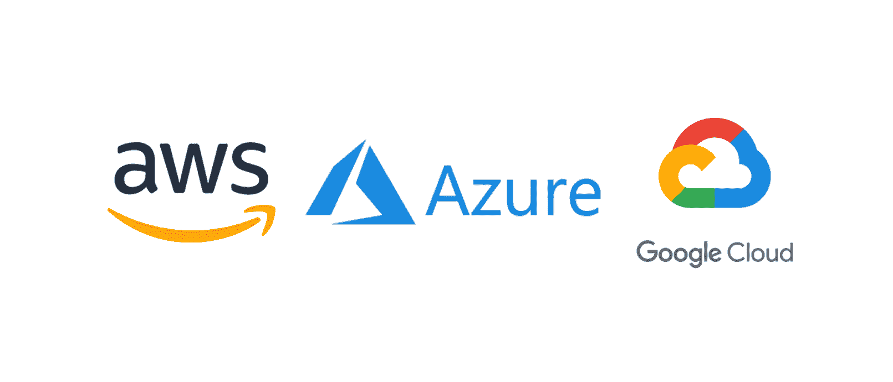

# 物联网简介

> 原文：<https://www.freecodecamp.org/news/introduction-to-iot-internet-of-things/>

## 介绍

在过去几年中，物联网(IoT)设备开始成为我们日常生活中越来越重要的组成部分。物联网设备的一些常见应用包括:

*   智能家居(如智能灯具)
*   可穿戴设备(如智能手表)
*   自动驾驶汽车
*   智能城市
*   智能零售

根据维基百科，物联网设备被定义为:

> “**物联网** ( **物联网**)是互联网连接到物理设备和日常物品的延伸。嵌入了电子设备、互联网连接和其他形式的硬件(如传感器)，这些设备可以通过互联网与他人通信和互动，并且可以远程监控和控制”——维基百科[1]

物联网设备最有趣的特征之一是它们能够产生大量数据。这特别适用于人工智能和机器学习等应用。

事实上，大多数物联网设备可以产生各种各样的时间序列数据，这些数据在人工智能中具有巨大的兴趣。

根据 [Global Data](https://www.globaldata.com/) 进行的一项研究，预计到 2023 年，物联网市场将达到 3180 亿美元的新价值(与前几年相比持续增长)。

Figure 1: IoT markets projections [2].

谷歌和微软等公司投资物联网云平台的兴趣增加，证实了这些预测。

## 物联网设备是如何工作的？

物联网系统由四个主要组件组成:

1.  **传感器:**使设备能够从设备周围的环境中收集数据(如速度、GPS 坐标、温度等...).
2.  **连接:**收集的数据被连续发送到云端(通过 WiFi 或蓝牙连接)。
3.  **数据处理:**一旦云基础设施接收到数据，就可以对其进行处理(例如，检查接收到的数据是否符合要求，以及是否没有提醒用户)。
4.  **用户界面:**一旦数据得到处理，结果就交给 and 用户。

作为一个简单的工作流示例，让我们考虑一个房子里的安全系统。

我们的物联网设备将使用计算机视觉系统(**传感器**)检查我们的房子里是否有任何入侵者。房子的视频记录然后被发送到云端，以查看是否有任何入侵者(**连接**)。随后，数据在云中被处理(**数据处理**)，如果检测到一些入侵者，我们会得到警报(**用户界面**)。

物联网系统可以通过许多不同的方式提醒我们(例如电话/消息或应用程序通知)，在某些情况下，我们可以远程控制系统本身(例如锁门)。

Figure 2: Main Components of an IoT System [3]

## 物联网云平台

我现在将向您介绍一些最有趣的物联网云平台，它们可用于分析和控制物联网设备。

Figure 3: IoT Cloud Platforms [4]

### 谷歌云物联网

谷歌云是目前市场上主要的云解决方案提供商之一。谷歌云为物联网实施提供的一些包包括:

*   **云物联网核心:**用于设置设备，并在设备之间建立安全连接。
*   **云机器学习引擎:**它允许用户从物联网设备收集的数据中创建机器学习模型，以提高和监控性能。
*   **云发布/订阅:**提供物联网设备的实时分析。

### 蔚蓝物联网

微软 Azure 是另一个非常重要的云服务提供商。Azure 能够交付预定制和完全可定制的解决方案。通过这种方式，Azure 能够为物联网初学者和专家提供解决方案。微软 Azure 能够轻松扩展物联网系统，以包括来自不同制造商的设备，并提供分析和机器学习服务支持。

### 亚马逊网络服务(AWS)

AWS 是最受欢迎的云服务解决方案之一。AWS 可以支持端到端地执行物联网项目，并利用以下四个软件包:

*   **AWS 物联网核心:**是可以用来设置物联网设备的基础包。使用物联网核心，我们可以集成不同的设备，通过安全的连接相互通信，使通过云存储交换数据成为可能。
*   **AWS 物联网分析:**用于处理和分析物联网设备产生的所有数据。一旦使用半结构化格式(如 JSON、CSV)存储了所有数据，就可以将其用于机器学习目的(如监控和优化物联网设备之间的交互)。
*   **AWS 物联网设备卫士:**用于构建和个性化物联网设备的安全机制(如选择设备认证和数据加密)。
*   **AWS 物联网设备管理:**支持将新的物联网设备轻松集成到环境中，并监控/更新其功能。

## 结论

物联网设备肯定会在未来的技术进步中扮演非常重要的角色。尽管仍然有同样的问题需要解决。事实上，对物联网设备的主要担忧之一可能是网络安全。

因为大多数物联网设备利用云中心来存储数据并从互联网上收集有用的信息，这使得它们容易受到黑客攻击(产生单点故障)。

为了解决这个问题，可以提高加密标准(降低数据传输速度)或利用人工智能安全技术，如[差分隐私和联邦学习](https://towardsdatascience.com/ai-differential-privacy-and-federated-learning-523146d46b85)。

如果黑客能够访问物联网设备(或整个群组)的控制权，将会有两个相关的主要风险:

*   黑客将能够访问和窃取物联网设备用户的敏感数据。
*   黑客可以远程控制设备本身。

除了之前提供的云服务之外，以下服务也可以被认为是有效的选择: [SAP](https://cloudplatform.sap.com/capabilities/product-info.SAP-Cloud-Platform-Internet-of-Things.48b79cfa-3d49-4a42-9249-e589696691ae.html) 、[甲骨文物联网](https://www.oracle.com/uk/internet-of-things/)、[思科物联网云连接](https://www.cisco.com/c/en/us/solutions/service-provider/iot-cloud-connect/index.html)、 [IBM 沃森物联网](https://www.ibm.com/uk-en/internet-of-things)等...

## 联系人

如果你想了解我最新的文章和项目[，请关注](https://medium.com/@pierpaoloippolito28?source=post_page---------------------------)我并订阅我的[邮件列表](http://eepurl.com/gwO-Dr?source=post_page---------------------------)。以下是我的一些联系人详细信息:

*   [Linkedin](https://uk.linkedin.com/in/pier-paolo-ippolito-202917146?source=post_page---------------------------)
*   [个人博客](https://pierpaolo28.github.io/blog/?source=post_page---------------------------)
*   [个人网站](https://pierpaolo28.github.io/?source=post_page---------------------------)
*   [中等轮廓](https://towardsdatascience.com/@pierpaoloippolito28?source=post_page---------------------------)
*   [GitHub](https://github.com/pierpaolo28?source=post_page---------------------------)
*   [卡格尔](https://www.kaggle.com/pierpaolo28?source=post_page---------------------------)

来自本文的封面照片[。](https://foreignpolicyi.org/blockchain-and-cryptocrypto-solution/)

## 文献学

[1]维基百科，物联网。访问时间:[https://en.wikipedia.org/wiki/Internet_of_things](https://en.wikipedia.org/wiki/Internet_of_things)

GlobalData 表示，到 2023 年，全球物联网市场将达到 3180 亿美元。Michelle Froese，风能工程与开发。访问:[https://www . windpowerengineering . com/business-news-projects/global-IOT-market-to-reach-3180 亿-by-2023-says-globaldata/](https://www.windpowerengineering.com/business-news-projects/global-iot-market-to-reach-318-billion-by-2023-says-globaldata/)

[3]安妮·朱尼拉,《IOT 是如何工作的——摘要——track inno 博客。访问位置:[https://track inno . com/2018/08/09/how-IOT-works-part-4-user-interface/how-IOT-works-summary-001/](https://trackinno.com/2018/08/09/how-iot-works-part-4-user-interface/how-iot-works-summary-001/)

[4]最佳 IOT 平台概述。2019 年选对云方案的小技巧。安娜·达维多娃，埃德森。访问时间:[https://www.edsson.com/en/blog/article?id=iot-platforms](https://www.edsson.com/en/blog/article?id=iot-platforms)