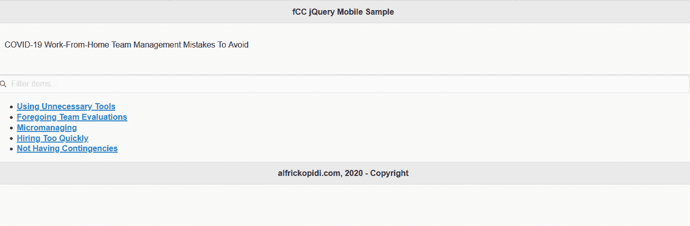

# jQuery 移动框架的简单介绍

> 原文：<https://www.freecodecamp.org/news/introduction-to-jquery-mobile-framework/>

当世界发现网络的时候，一切都是无趣的，没有生命的。例如，构建一个简单的图像鼠标悬停应用程序需要几行代码，并且不能在某些平台上工作。

但是随着 jQuery 的引入，事情变得更好了，因为它允许开发人员创建令人惊叹的 JavaScript 应用程序，可以在各种地方舒适地运行。

在那之后，jQuery 团队通过开发 jQuery UI 更上一层楼，这使得开发人员可以在现有的 jQuery 核心上创建好看的 web 应用程序。

更好的是，2010 年引入了 jQuery Mobile，这使得开发变得更好、更高效。

jQuery Mobile 是一个有效的统一框架，提供了 UI 组件、数据转换和其他令人兴奋的特性。

jQuery Mobile 将 HTML5、CSS3、jQuery 以及 jQuery UI 的功能整合到一个框架中，允许开发人员跨不同平台和设备实现一致性。

## jQuery Mobile 的基本特性

### 1.非常简单易用

jQuery Mobile 框架既简单又灵活。由于框架的配置接口是标记驱动的，开发人员可以很容易地用 HTML 构建完整的基本应用程序接口，只需最少的 JavaScript 代码或不需要 JavaScript 代码。

需要几行 JavaScript 代码的复杂任务，比如 Ajax 调用和 DOM 操作，可以在 mobile jQuery 中用几行代码轻松实现。

例如，如果我们希望用户在 DOM 中创建页面之后，但在增强完成之前点击并隐藏一些文本，我们可以简单地使用 **pagecreate** 事件处理程序。如果没有 jQuery Mobile，这需要几行代码才能完成。

```
$(document).on("pagecreate","#mypagetest",function(){
  $("span").on("click",function(){
    $(this).hide();
  });                       
});
```

在上面的代码中， **#mypagetest** 参数指的是指定页面事件的页面的 id。另外， **on()** 方法用于附加事件处理程序。

此外，它的简单性允许开发人员将他们的应用程序分成多个页面。有了这个框架，开发人员可以“写得更少，做得更多”

### 2.渐进增强和优雅降级

渐进增强和适度降级是推动 jQuery Mobile 敏捷性的关键特性。它们使 it 能够支持高端和功能较弱的设备(例如，那些缺乏 JavaScript 支持的设备)。

该框架允许开发人员构建可以被最广泛数量的浏览器和设备访问的应用程序，无论是 Internet Explorer 6 还是最新的 Android 或 iPhone。

Mobile jQuery 还为开发人员提供了在基本设备上呈现基本内容的能力。更复杂的平台和浏览器将通过使用额外的、外部链接的 JavaScript 和 CSS 而日益丰富。

### 3.支持用户友好的输入

在 jQuery mobile 开发过程中，开发人员可以包含一个简单的 [API](https://blog.api.rakuten.net/what-is-an-api/) 来支持基于触摸、鼠标和光标焦点的用户输入功能。框架中还包含了几种风格简单、易于触摸的表单元素。

示例包括复选框和单选按钮、滑块、搜索过滤和菜单选择元素。此外，每个表单元素都包含一个替代的“迷你”版本，可以很容易地集成到移动网页中。

例如，下面是如何使用 jQuery Mobile 创建一个复选框按钮。请注意，添加了 **data-mini="true"** 属性来创建按钮的迷你版本。

```
<form>
    <input type="checkbox" name="checkbox-mini-0" id="my-checkbox" data-mini="true">
    <label for="checkbox-mini-0">Click here to agree</label>
</form>
```

除此之外，为了确保用户体验在移动设备上得到优化，该框架有一个丰富的 Ajax 驱动的导航系统，允许动画页面无缝转换。

使用 jQuery Mobile 转换事件，您可以将从当前活动页面到新页面的转换制作成动画。

例如，当从一个页面过渡到下一个页面时，可以使用 **pagebeforeshow** 事件(在“到”页面上触发)和 **pagebeforehide** 事件(在“从”页面上触发)。这两个事件都在过渡动画开始之前触发。

让我们看看如何应用它们:

```
$(document).on("pagebeforeshow","#myfirstpage",function(){ 

    // When entering myfirstpage

  alert("myfirstpage is about to appear");

});

$(document).on("pagebeforehide","#myfirstpage",function(){ 

    // When leaving myfirstpage

  alert("myfirstpage is about to disappear");
});
```

### 4.易接近

除了它的跨平台能力，jQuery for mobile 的创建也充分考虑了可访问性。

该框架支持可访问的富互联网应用程序(WAI-ARIA ),以帮助残疾人使用屏幕阅读器和其他辅助技术轻松访问网页。

### 5.轻质尺寸

Mobile jQuery 的轻量级大小(缩小后大约 40KB)增加了它的速度。此外，它采用最少的映像依赖性这一事实也极大地提高了其功能。

### 6.主题和 UI 小部件

jQuery Mobile 有一个内置的主题系统，允许开发人员决定自己的应用程序样式。使用 jQuery Mobile Themeroller，开发人员可以有效地定制他们的应用程序，以适应他们的颜色、品味和偏好。

该框架还附带了各种创新的跨平台小部件，使开发人员能够创建更好定制的应用程序。

一些可用的小部件是持久工具栏、按钮、对话框和常用的弹出小部件。

### 7.响应性

该框架的全面响应能力使相同的底层代码库能够轻松适应不同类型的屏幕，从移动设备到桌面大小的屏幕。

## jQuery Mobile 的基本页面结构

jQuery Mobile 的结构拥有创建用户友好的、功能丰富的移动 web 应用程序和各种网站所需的所有 UI 组件和属性——无论是基本的还是高级的。

您可以使用 jQuery mobile 构建网页、各种类型的列表视图、工具栏、各种表单元素和按钮、对话框以及其他功能。

重要的是，因为 jQuery Mobile 是在 jQuery core 之上创建的，所以它允许开发人员利用 jQuery UI 代码并访问关键设施。这些包括用于网页的健壮的动画和图像效果、DOM 操作、事件处理和用于服务器通信的 Ajax。

让我们感受一下 jQuery 移动开发代码的样子。

例如，在新冠肺炎疫情，当大多数人在家或者在[共同工作空间](https://novelcoworking.com/locations/ohio/cincinnati/hooper-building/)工作时，让我们创建一个简单的网页，展示一些人们会犯的团队管理错误。

代码如下:

```
<!DOCTYPE html>
<html>

<head>
  <title>jQuery Mobile Example</title>
  <meta name="viewport" content="width=device-width, initial-scale=1" />
  <link rel="stylesheet" href="http://code.jquery.com/mobile/1.4.5/jquery.mobile-1.4.5.min.css" />
  <script src="http://code.jquery.com/jquery-1.11.1.min.js"></script>
  <script src="http://code.jquery.com/mobile/1.4.5/jquery.mobile-1.4.5.min.js"></script>
</head>

<body>
  <div data-role="page" date-theme="c">
    <div data-role="header">
      <h1>fCC jQuery Mobile Sample</h1>
    </div>
    <div data-role="content">
      <p>COVID-19 Work-From-Home Team Management Mistakes To Avoid</p>
    </div>
    <p>
    <ul data-role="listview" data-inset="true" data-filter="true"></ul>
    </p>
    <p>
    <ul>
      <li><a href="#">Using Unnecessary Tools</a></li>
      <li><a href="#">Foregoing Team Evaluations</a></li>
      <li><a href="#">Micromanaging</a></li>
      <li><a href="#">Hiring Too Quickly</a></li>
      <li><a href="#">Not Having Contingencies</a></li>
    </ul>
    </p>
    <div data-role="footer">
      <h4>alfrickopidi.com, 2020 - Copyright</h4>
    </div>
  </div>
</body>

</html>
```

下面是在浏览器上打开上述移动 jQuery 代码行时的输出:



值得注意的是，当浏览器缩小或增大时，列表中项目的大小也会相应调整。因此，可以在具有不同屏幕分辨率的各种设备中轻松访问网页，而不用担心缺乏一致性。项目的大小将相应地改变以适合设备的类型。

正如您在上面的代码示例中看到的，该文档是一个简单的 HTML5，包括以下三项内容:

*   来自 jQuery Mobile CSS 的文件(jquery.mobile-1.4.5.min.css)
*   jQuery 存储库中的文件(jquery-1.11.1.min.js)
*   来自 jQuery 移动存储库(jquery.mobile-1.4.5.min.js)的文件

这些文件直接链接到 jQuery CDN。另一种选择是前往[下载页面](http://jquerymobile.com/download/)获取这些文件，并将其托管在一个私有服务器上。

重要的是，在 jQuery mobile 开发期间包含“viewport”元标记指示设备页面宽度和设备屏幕宽度相等(width=device-width)。

标签还指示浏览器放大到 100%(scale = 1)。例如，如果比例变为 2，浏览器会将网页缩放 50%。

对代码的进一步检查揭示了一些奇怪的"*数据-"* 属性分散在代码中。这是 HTML5 的一个改进功能，使开发人员能够在应用程序中传递有组织的数据——例如， *data-role="header"* 属性定义了网页的 head 部分。

上面的例子只是触及了开发人员使用 jQuery Mobile 所能实现的事情的表面。该框架的[文档](https://demos.jquerymobile.com/1.4.5/)易于理解，描述了它的许多特性，包括链接页面、合并动画页面过渡和设计按钮。

## 结论

jQuery for mobile 是一个资源丰富的框架，具有 jQuery、HTML5 和 CSS 功能，可以有效地处理某些跨平台、跨设备和跨浏览器的兼容性问题。

该框架为创建功能强大、响应全面、面向未来的移动和 web 应用程序提供了巨大的机会。

你会试一试吗？