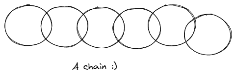
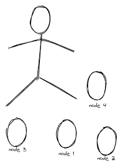
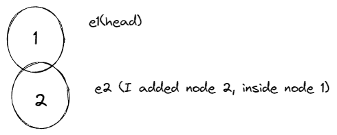
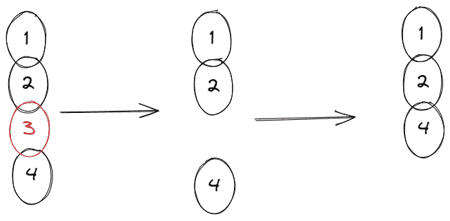
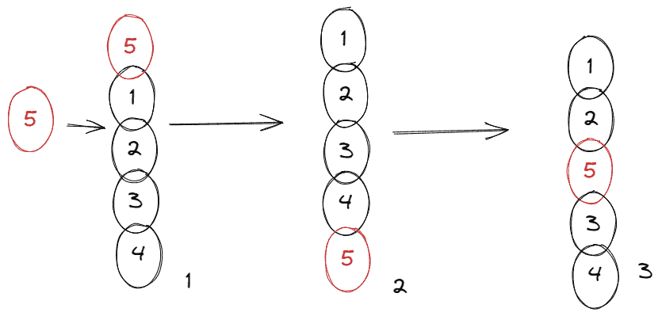

# Python 中的链表——用例子解释

> 原文：<https://www.freecodecamp.org/news/introduction-to-linked-lists-in-python/>

不同的编程语言提供了不同的方式来存储和访问数据。

您可以使用的一些数据结构是集合，例如数组、列表、映射、集合等等。

这些都在存储和访问数据方面做得很好，但有时您可能需要一些不同的东西。另一种常用的数据结构叫做链表。

## 什么是链表？

链表是一种以链的形式存储数据的数据结构。链表的结构是这样的，每一段数据都与下一段数据有联系(有时也与前一段数据有联系)。链表中的每个元素称为一个节点。

你可以把它想象成一个实际的链条，每个环或节点都连接在一起。
类似这样的事情



像所有其他数据结构一样，链表也有它的优点和缺点:

### 链表的优点:

1.  由于链表的链状系统，您可以快速添加和移除元素。与数组或列表不同，这也不需要重新组织数据结构。使用链表实现线性数据结构通常更容易。
2.  由于链表的链状结构，它也不需要固定的大小或初始大小。

### 链表的缺点:

1.  与数组相比，需要更多的内存。这是因为你需要一个指针(占用它自己的内存)来指向下一个元素。
2.  链表上的搜索操作非常慢。与数组不同，您没有随机访问的选项。

## 什么时候应该使用链表？

在下列情况下，应该在数组上使用链表:

1.  你不知道列表中会有多少条目(这是优点之一——易于添加条目)。
2.  您不需要随机访问任何元素(与数组不同，您不能访问链表中特定索引处的元素)。
3.  您希望能够在列表中间插入项目。
4.  您需要在列表中进行固定时间的插入/删除(与数组不同，您不必先移动列表中的每一项)。

在尝试实现链表之前，您应该考虑以下几点。

现在，所有的理论都出来了，是时候实现一个了。我们将使用 Python 来实现这一点，但是我们在这里学到的大部分内容适用于您正在使用的任何语言。最重要的是理解它是如何工作的。

## 如何在 Python 中使用链表

这里有一个创建链表的技巧。它帮助我更好地理解它。

您只需要认识到，您将要添加到列表中的每一项都只是一个节点(类似于链条中的一环)。与**头**(列表中的第一个节点)不同的是，您给了它标题**头**，然后您开始向它添加其他节点。

记住，链表类似于一条链是如何连接在一起的。乔带着一些戒指来了，他会帮助我们。



我会用这个来说明...所以你可以沿着这些思路思考(这不是艺术课——我重复一遍，这不是艺术课:)。

因此，让我们首先创建节点:

```
class Node:    
	def __init__(self,value):        
		self.value = value        
		self.next = None
```

就是这样。我们添加 **`value`** 是因为对于要添加到链表中的任何东西，它至少应该有一些值(例如，除非在极少数情况下，否则不会向数组中添加空字符串，对吗？).

**`next`** 意味着我们可能想要链接其他节点——我的意思是，这是链表的主要目的。

接下来，我们将定义一些基本函数:

```
class LinkedList:
	def __init__(self,head=None):
		self.head = head    
		def append(self, new_node):
            current = self.head
            if current:
                while current.next:
                    current = current.next
                current.next = new_node
            else:
                self.head = new_node
```

`append()`方法允许您向列表中添加一个新节点。让我们来探索它是如何工作的。



如果我有两个值——比如 1 和 2——并且我想将它们添加到列表中，首先要将它们定义为单独的节点(也就是链的环)。我可以这样做:

```
e1 = Node(1)
e2 = Node(2)
```

我现在可以定义一个链表了，因为我已经准备好了我的节点。链表(就像我们看到的链一样——总是有头的，对吗？)，所以我可以用一个 head 值定义我的链表，它基本上就是另一个节点(环):

```
ll = LinkedList(e1)
```

现在从上面的代码来看， **`e1`** 是链表的头，这只是我的链表起点的一种花哨的说法。我可以向它添加更多的条目，由于每个链都必须连接(也就是说，在彼此内部)，我必须首先设置基本情况来检查列表是否有头。

链表之所以成为链表，是因为它有一个起点。如果没有，我们只需要在头部设置新元素。但是如果它已经有了一个头，我就必须遍历整个列表，不断检查是否有任何节点的 **`next`** 为空(即 **`None`** )。

还是那句话，链表就像一条链，对吧？所以每个节点都应该用 **`next`** 指针指向另一个。一旦一个节点有了下一个`none`，这仅仅意味着它是列表的结尾。所以我可以很容易地在那个位置添加新的节点。

让我们创建一个方法来**删除**一个节点。但在此之前，让我们先思考一下。想象一下，你有一条链子，你发现一枚戒指很脆弱。你是做什么的？

你首先找到弱环，然后把它去掉，把它前后的环连在一起。但是如果弱环是第一个，那就简单了——你只需要把它去掉，你真的不需要加入任何东西。第二个环自动成为链的头。试着想象一下。

我们想在这里做同样的事情。因此，我们首先找到弱环——在这种情况下，这将是我们正在寻找的值——然后我们将前一个环和后一个环连接在一起:

```
class LinkedList:    
	def __init(...)    
	def append(...)    
	  def delete(self, value):
        """Delete the first node with a given value."""
        current = self.head
        if current.value == value:
            self.head = current.next
        else:
            while current:
                if current.value == value:
                    break
                prev = current
                current = current.next
            if current == None:
                return
            prev.next = current.next
            current = None
```

因此，我们在这里所做的只是遍历每个节点，看看这是不是我们想要删除的值。但是当我们在列表中移动时，我们必须跟踪之前的值(我们仍然必须将列表重新连接在一起)。我们用 **`prev = current`** 做这个，你可以在上面或者下面看到:)。



因此，当找到节点后，包含它之前的节点的 **`prev`** 可以很容易地切换(即下一个值)到另一个节点——在这种情况下，其他节点连接到我们想要删除的节点。希望这样有道理:)。

让我们在**上工作，将节点**插入到特定的位置。我们将使用我们的链式类比来更好地理解这一点。

当你拿着一条链子，你真的想增加链子的长度，你有三个选择。您可以:

1.  在链的开头添加一个链接(元素)(这应该很简单，对吧？)
2.  将它添加到链的末尾(有点类似于 1)
3.  或者你可以在中间的任何一点添加它(稍微复杂一点)



您应该记住的一点是，无论您决定在哪里添加它，您都必须将其他节点重新加入到它。这只有在你用一个循环跟踪其他节点的情况下才有可能。

让我们看看实际情况:

```
 class LinkedList:   
	def __init(...)    
	def append(...) 
    def delete(...)
    def insert(self, new_element, position):
        """Insert a new node at the given position.
        Assume the first position is "1".
        Inserting at position 3 means between
        the 2nd and 3rd elements."""
        count=1
        current = self.head
        if position == 1:
            new_element.next = self.head
            self.head = new_element
        while current:
            if count+1 == position:
                new_element.next =current.next
                current.next = new_element
                return
            else:
                count+=1
                current = current.next
            # break

        pass
```

在上面的代码中，我们得到了一个插入节点的位置。如果位置是 1，意味着它将是根。既然我们不确定，我们可以初始化一个循环和一个计数器来跟踪这个循环。

如果我们要插入的位置是一个(即根)，只需将当前根存储在一个哑变量中，创建一个新根，然后将之前的根(即整个链)添加到这个新根中。

如果位置不是 1，继续遍历链，直到找到位置。

最后，对于本文，让我们以您想要的任何格式显示我们的链表的值——例如，打印出来或添加到列表集合中。我会把值打印出来。

这非常简单，类似于物理链:您只需查看有节点的所有地方并获得值，然后移动到下一个节点:


```
class LinkedList:   
	def __init(...)    
	def append(...) 
    def insert(...)
	def delete(...)    
	def print(self):
        current = self.head
        while current:
            print(current.value)
            current = current.next 
```

所以现在这些都在链表上！稍后我们将解决一些关于链表的问题。

## 包扎

在本文中，我解释了:

*   链表如何工作
*   链表的利与弊
*   如何用 Python 实现链表

你可以在这里找到这篇文章的代码。感谢您的阅读。