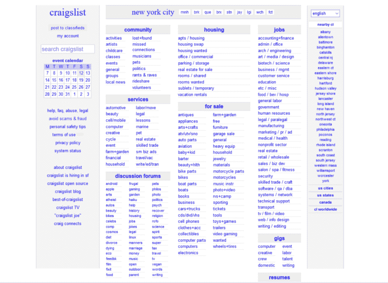
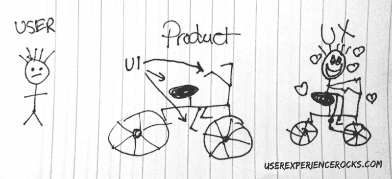
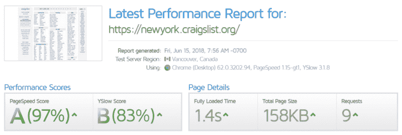
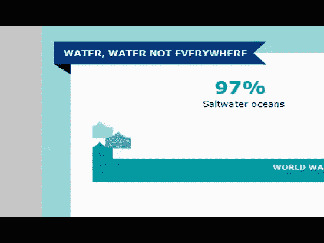
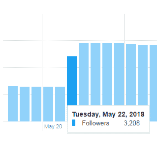

# 建立网站时要考虑的无形(但至关重要)因素

> 原文：<https://www.freecodecamp.org/news/invisible-but-crucial-considerations-to-take-into-account-when-building-a-website-17a64e0e7c57/>

迈克尔·洛斯卡佐

# 建立网站时要考虑的无形(但至关重要)因素

#### 一个网站的成功不仅仅取决于它的美丽

一个丑陋的网站一定会失败，对吗？

不对。

Craigslist

尽管看起来很普通，Craigslist 在 70 个国家运营，每月有 500 亿的页面浏览量。*

怎么会这样呢？使用的字体是 Arial 和 Times New Roman。平淡的配色方案。漂亮的图片在哪里？

Craigslist 是个异数吗？

没有。

第二个例子…

Reddit

很少有人会试图让你相信 Reddit 是万维网上最具视觉吸引力的网站之一。然而，Reddit 是美国第四大访问量网站，全球排名第六。**

作文挤！啊，那些标签和按钮看起来太过时了！

这些充满美学挑战的网站绝对是压倒性的，因为它们在幕后是华丽的，并且它们为访问者提供了独特的价值。

我写这个帖子不是鼓励你抛弃个人的审美感。但是，我想说的是，有时候网站不可见的方面甚至比可见的方面更重要。

[The Invisible Man (1933)](https://www.youtube.com/watch?v=KXMOURHEMpY)

### 从我的错误中学习

2007 年 7 月，当我工作的公司宣布破产时，我突然失去了平面设计师的工作。我曾是内部营销团队的一员，我的职责包括设计传单、明信片、小册子和其他印刷营销材料。

我开始找新工作，发现了一些网页开发方面的空缺。严格来说，我没有太多经验。但是我相信网页设计和印刷设计是一样的。

在过去的十年里，我认识到我大错特错了。

近年来，你可能已经听到了“印刷已死”的宣告。然而，仍有许多人以他们应用于印刷材料的同样心态来处理数字内容，就像我 10 年前所做的那样。

在印刷品中，我们被视觉之美迷住了。我们为良好的字距调整感到自豪，并对我们最喜欢的字体有着强烈的忠诚。我们用点清漆和精心挑选的纸张来装饰我们的设计。当产品看起来很棒的时候，我们可以沉浸在工作完成的喜悦中。

对于数字内容，我们需要意识到我们的产品是互动的。我们需要努力创造形式和功能的结合。别忘了隐形的！

[The Invisible Man (1933)](https://www.youtube.com/watch?v=KXMOURHEMpY)

让我们解开一个伟大网站的五个“无形”元素。需要做出一些重要的决定:

1.  UX 决定
2.  UI 决策
3.  性能权衡
4.  SEO 注意事项
5.  数据驱动的设计决策

### UX 决定

> “用户体验设计(UX、UXD、UED 或 XD)是通过提高产品的可用性、可访问性以及在与产品的交互中提供的乐趣来提高用户对产品的满意度的过程。”***

UX 是一个不断发展的领域，解释起来很复杂。UX 肯定有“视觉”方面。为了简洁起见，让我们简单地认为 UX 是“跨浏览器和设备的功能”。

如果你的内容看起来很漂亮，但是不适合移动设备，那就是糟糕的 UX，因为内容不能被广泛访问。如果你的内容是尖端的，但是只能在一个浏览器中工作，那就是坏的 UX，因为内容不能被广泛使用。

太多时候，大部分的努力花费在视觉效果上，以牺牲足够的测试为代价，而代价是内容对于一些(或所有)用户来说不能发挥预期的作用。

*   **从[尼克·巴比奇](https://uxplanet.org/@101)那里了解更多关于 UX 的事情**
*   **从[杰森·克劳的](https://uxplanet.org/@jclaussftw)坏 UX 综合报道**中获得建议，避免坏 UX
*   **从 [Tubik 工作室](https://uxplanet.org/ux-writing-let-user-interface-speak-774f80c0a94d)了解 UX 写作**

### **UI** 决策

> “用户界面设计(UI)或用户界面工程是用户界面的设计…重点是最大限度地提高可用性和用户体验。”***

和 UX 一样，UI 也有明显的视觉效果。但是当你开发内容的时候，很容易忽略终端用户与内容交互的方式。一致而直观的用户界面对于成功的交互体验至关重要。

Illustration by [Jennifer Aldrich](https://medium.com/@jma245).

请记住，不是每个用户都熟悉现代交互体验。例如，一些用户可能不认为“汉堡菜单”是所有网站导航的接入点。

*   **从[托尼·吉恩斯](https://medium.com/@TGines/designing-user-interfaces-for-your-mother-dd45ec50f7b0)那里了解更多关于 UI 的知识 **

### 性能权衡

[根据谷歌](https://www.soasta.com/blog/google-mobile-web-performance-study/)的数据，53%的移动用户会放弃一个加载时间超过 3 秒的网站。你可以用 [GTmetrix](https://gtmetrix.com/) 免费测试你的网站速度。

craigslist.org receives high marks for speed!

许多公司使用内容管理系统(CMS)来运营他们的网站。CMS 是一个很好的工具，但是它不会帮助你为独特的内容编写干净的代码。例如，下面的波浪动画可以用 GIF 动画来实现，但是使用 CSS 大大减轻了重量。

This “wave” animation utilizes small images repeated across the x-axis. These smaller images and coding approach is part of an effort to reduce the weight of the content.

网站速度直接取决于你的搜索引擎优化和 UX！

*   **从[Nikole Haiar](https://hostway.com/blog/10-ways-to-make-your-website-load-faster/)了解关于提高网站速度的更多信息**

### SEO 注意事项

> “搜索引擎优化(SEO)是影响网站或网页在网络搜索引擎的免费结果中的在线可见性的过程……”——[维基百科](https://en.wikipedia.org/wiki/Search_engine_optimization)

谷歌努力让他们的用户转向安全、相关、[移动友好](https://techcrunch.com/2018/03/26/google-begins-to-roll-out-its-mobile-first-index/)和快速加载的内容。其他搜索引擎以类似的方式运行。别人能找到你牛逼的内容吗？如果你不考虑 SEO，你的排名可以不存在。通常，更高的排名意味着更多的流量。

SEO 是一个涉及很多方面的巨大话题。Patrick Curtis 描述了通过简单的页面搜索引擎优化技术，有机流量增加了 32%。

*   **从[WordStream](https://www.wordstream.com/blog/ws/2015/04/30/seo-basics)了解更多 SEO 知识**

### 数据驱动的设计决策

你如何证明你的设计或活动产生了投资回报？我们现在可以使用一系列工具来帮助我们评估网站内容的关键绩效指标(KPI)。这些指标提供了客观证据，我们不再需要仅仅依靠个人意见。

有一吨的工具！但是这里有一些例子…

*   **谷歌分析:**测量网站、应用、数字和离线数据，以获得客户洞察。
*   社交媒体分析: [、Twitter](https://analytics.twitter.com/) 、脸书和 YouTube 都提供有用的分析工具。

What caused this spike in followers? My Twitter analytics can help me figure out what content and/or actions were effective on May 22, 2018.

不管你的天赋和经验如何，创建一个不需要调整的完美网站几乎是不可能的。您的访问者使用什么类型的设备来查看内容？他们在地理上来自哪里？他们是如何被推荐到网站的？什么内容最受欢迎？我们可以评估指标，形成假设，修改和测试。这个过程可以重复，以完善一个网站。

*   **从 [freeCodeCamp](https://medium.freecodecamp.org/3-takeaways-from-a-data-driven-design-approach-70c6b52540b) 了解更多关于制定数据驱动的设计决策的信息(帖子由我撰写**？)
*   ****从[郑大卫](https://www.crazyegg.com/blog/best-website-kpi/)处了解更多 KPI****

**

[The Invisible Man (1933)](https://www.youtube.com/watch?v=KXMOURHEMpY)** 

**？感谢您的阅读！如果你喜欢这个故事，你可以在推特上关注我。**

***资料来源:[expandedramblings.com](https://expandedramblings.com/index.php/craigslist-statistics/)**

****来源:[https://www.alexa.com/siteinfo/reddit.com](https://www.alexa.com/siteinfo/reddit.com)2018 年 5 月 13 日**