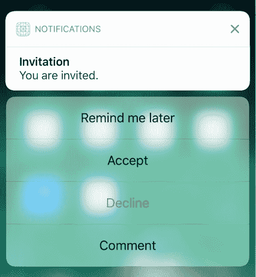
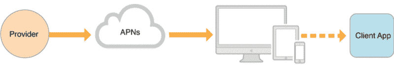
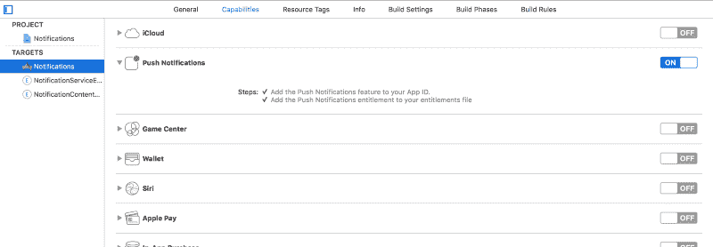
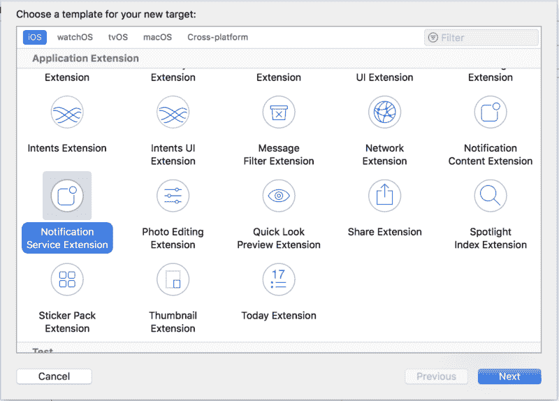
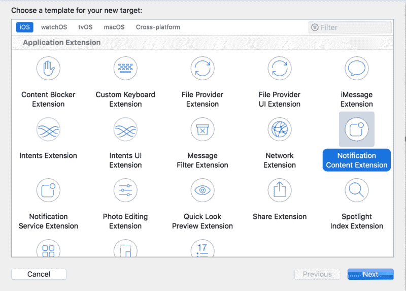
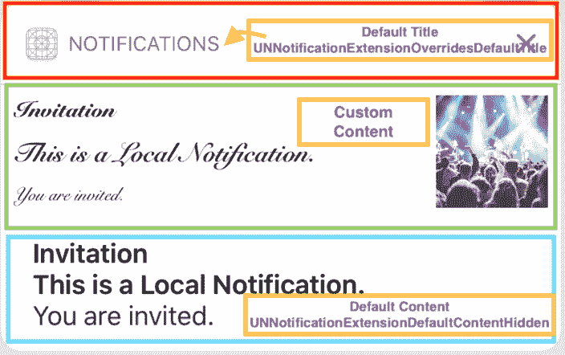
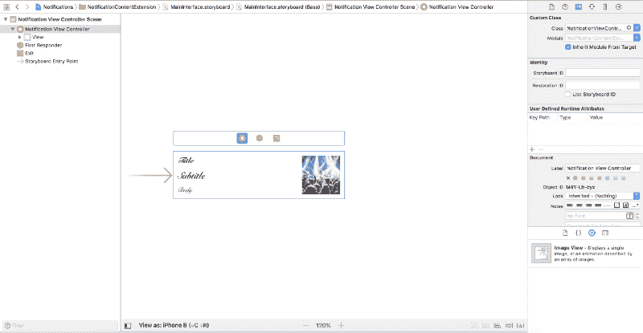
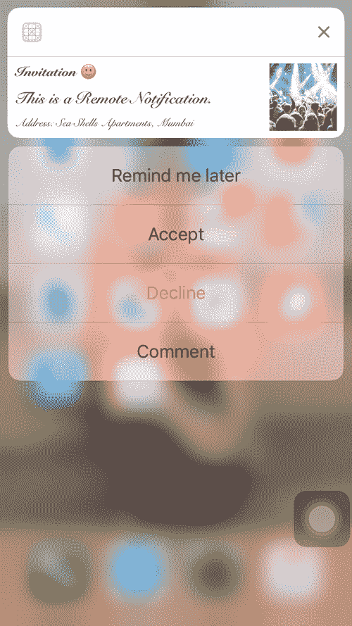

# 关于 iOS 中的通知，你一直想知道的一切

> 原文：<https://www.freecodecamp.org/news/ios-10-notifications-inshorts-all-in-one-ad727e03983a/>

作者帕亚尔·古普塔

# 关于 iOS 中的通知，你一直想知道的一切

#### 非常小的警报..？


通知是一种在应用程序有新数据可用时通知用户的方式，即使应用程序没有在前台运行。

例如，消息应用程序可能会让用户知道新消息何时到达，日历应用程序可能会通知用户即将到来的约会。

随着 **iOS-10 的发布，**苹果推出了全新的框架来支持通知，无论是本地通知还是远程通知。这次发布的重点是**定制通知**。

不浪费任何时间，让我们快速进入细节。

### 通知的类型

我们可以将通知大致分为两类:

*   **本地通知** —应用程序在本地配置通知详细信息，并将这些详细信息传递给系统。然后，当应用程序不在前台时，系统处理通知的传送。
*   **远程通知** *—* 你使用公司的一台服务器，通过苹果推送通知服务(APNs)将数据推送到用户设备。

在本文的后面，我们将看到如何获得这两种通知类型。让我们首先介绍一下这个新的通知框架，我们可以用它来实现我们的目标。

### iOS-10 在通知方面有什么新功能？

随着 **iOS-10** 的发布，苹果引入了两个新的框架来处理通知:

*   [**用户通知框架**](https://developer.apple.com/documentation/usernotifications) —管理本地和远程通知。
*   [**用户通知 UI 框架**](https://developer.apple.com/documentation/usernotificationsui) —定制系统通知界面的外观。

我们将使用这两个框架和一些特定于平台的 API 来配置我们的通知。

与框架一起，还引入了 [**通知服务应用扩展**](https://developer.apple.com/documentation/usernotifications/unnotificationserviceextension) ，允许您在远程通知交付之前修改其内容。

苹果还允许通过 [**通知内容扩展**](https://developer.apple.com/documentation/usernotificationsui/customizing_the_appearance_of_notifications) ***定制你的通知的 UI。***

是不是太多记不住了？是的...当然是。但是，不用担心。我们将一步一步地看相关的代码。放轻松点。？

### 首先，配置它！

#### 请求授权

要让我们的应用程序通知用户任何事情，我们首先需要知道使用它的人是否真的想要这样。也许他们不喜欢他们的手机一直响着并显示提醒？或者也许他们真的想要更新，但不是那种恼人的声音…啊啊啊！☠️

因此，首先我们需要获得我们要通知的用户的许可。这非常简单—只需两行代码，我们就完成了:

您需要在从`AppDelegate’s`方法返回之前在`application:didFinishLaunchingWithOptions:`中编写代码。

**请注意:**因为系统保存了用户的响应，所以在后续启动时调用`[requestAuthorization(options:completionHandler:)](https://developer.apple.com/documentation/usernotifications/unusernotificationcenter/1649527-requestauthorization)`方法不会再次提示用户。

#### 添加类别和操作—可操作的通知

用户通知框架支持向通知添加类别和操作。

**类别** —定义应用程序支持的通知类型，并向系统传达我们希望如何呈现通知。

**动作** —每个类别最多可以有四个相关联的动作。动作基本上是自定义按钮，点击后关闭通知界面，并将选择的动作转发给应用程序进行即时处理。

好吧。那是什么意思..？？？一些代码可能有助于您更好地理解:

在上面的代码中，我们简单地创建了一个名为 INVITATION 的类别，有四个不同的动作——**remind later***，* **接受** *，* **拒绝** *，*和**评论**。

类别和操作由其标识符唯一标识。每当发送具有类别的通知时，一旦用户展开该类别，系统就会显示该通知以及与该类别相关联的所有操作。这就是它的样子:？



在`application:didFinishLaunchingWithOptions:`方法中配置通知的位置下定义所有类别和动作。

在本地或远程安排通知时，包括类别标识符(如邀请)。我们将在下一节中看到如何做到这一点。

### 计划本地通知

现在我们已经完成了通知的配置，让我们看看如何在应用程序中实际安排一个**。**

安排本地通知只需要三个简单的步骤:

1.  准备内容
2.  添加触发器—何时应该触发通知
3.  安排交付

让我们快速地处理代码，这样我们就不会被这里发生的一切弄糊涂了。LOL？

在上面的代码和其他内容中，我们还提供了一个`categoryIdentifier`来支持可操作的通知。如果我们不这样做，系统将采用它的默认行为。

就是这样。这就是所需要的。是的，它绝对有效...呵呵呵。？在继续前进之前尝试一下。您可以从这里下载示例。

**请注意**:每当发送通知时，应用程序在后台和前台状态下的行为会有所不同。

1.  **应用未运行/后台应用** —系统直接向用户显示本地通知。我们在应用程序中没有得到任何回调。
2.  **前台应用** —系统给应用内部处理通知的机会。*系统默认为前台应用静音通知*。

当应用程序在前台发送通知时，我们在`[UNUserNotificationCenterDelegate](https://developer.apple.com/documentation/usernotifications/unusernotificationcenterdelegate)'s`方法— `[userNotificationCenter(_:willPresent:withCompletionHandler:)](https://developer.apple.com/documentation/usernotifications/unusernotificationcenterdelegate/1649518-usernotificationcenter)`中获得回调，您可以决定是静默处理通知还是提醒用户。

不要忘记使`AppDelegate`符合`UNUserNotificationCenterDelegate`协议，并在`application:didFinishLaunchingWithOptions:`中将其设置为`[UNUserNotificationCenter](https://developer.apple.com/documentation/usernotifications/unusernotificationcenter)`共享对象的代表。

```
let center = UNUserNotificationCenter.current()
```

```
center.delegate = self
```

我们现在已经完成了本地通知。让我们继续讨论如何在我们的应用程序之外安排通知。在此之前，让我们看看如何响应自定义操作。

#### 响应用户操作

配置通知？✔计划通知？✔

轻按通知或通知中的任何自定义操作会怎么样？它将走向何方？在这两种情况下，系统都会通知应用程序用户的选择。

每当用户在通知中执行任何操作时，响应都会被发送到`UNUserNotificationCenterDelegate's`方法— `[userNotificationCenter(_:didReceive:withCompletionHandler:)](https://developer.apple.com/documentation/usernotifications/unusernotificationcenterdelegate/1649501-usernotificationcenter)`，在这里我们可以提供针对每个操作的处理。

**请注意:**如果收到响应时应用程序没有运行，系统将在后台启动应用程序来处理响应。

### 远程通知

推送通知或远程通知，不管我们怎么称呼它们，都是最常用的方式之一，有很多用例。

无论是社交媒体、日历还是任何实用程序，我们几乎在任何地方都能看到它们。从通知我们最新内容的新闻应用程序，到提醒我们最新发表文章的媒体本身。

有没有想过他们是怎么做到的？本地通知？？可能是……它做同样的事情——对吗？也许我们可以在本地服务器上做更多的配置，让它正常工作？

例如，Medium 无法访问我们个人设备上的应用程序，那么它如何安排任何通知呢？没错。它不能。这是不同的东西，不仅仅是本地的。

好吧，我们从某一点发送通知，在另一点显示它，这样可以回答我们的问题吗？是的，肯定会的。但是怎么做呢？**远程通知**就是它了。

这正是他们所做的。这就是解决了“保持最新”这个大问题的特性。

#### **术语**

*   [**APNs**](https://developer.apple.com/library/content/documentation/NetworkingInternet/Conceptual/RemoteNotificationsPG/APNSOverview.html#//apple_ref/doc/uid/TP40008194-CH8-SW1)**——**远程通知功能的核心。它是一种云服务，允许安装在苹果设备上的经批准的第三方应用程序通过安全连接从远程服务器向用户发送推送通知。
*   **设备令牌—** 特定于应用程序的令牌，具有全球唯一性，可识别一个应用程序-设备组合。它支持提供商、APN 和设备之间的通信。
*   **提供者—** 实际向 APNs 发送包括设备令牌和其他信息的远程通知的服务器。

**重要提示** : **永远不要在你的应用中缓存设备令牌。**相反，当你需要它们时，从系统中获取它们。

当某些事件发生时，APNs 会向您的应用程序颁发新的设备令牌。设备令牌保证是不同的，例如，当用户从备份中恢复设备时，当用户在新设备上安装您的应用程序时，以及当用户重新安装操作系统时。

当您试图获取一个设备令牌但它没有改变时，fetch 方法会快速返回。

**请注意:**APNs 向未运行的应用程序发送远程通知的能力要求该应用程序至少已启动一次。

#### **实际工作原理**

下面是对上述所有技术如何同步工作以完成远程通知工作流的简短说明。



1.  **App** 向 **APNs** 注册
2.  **APNs** 向**设备**发送设备令牌，然后发送给 **App**
3.  **App** 将此设备令牌发送给**提供商**
4.  **提供商**向 **APNs** 发送带有该设备令牌的通知，APNs 随后将其发送给**设备**，设备随后将其发送给**应用**。

如果您的应用程序的通知在设备开机但应用程序未运行的情况下到达，系统仍然可以显示通知。如果设备在 APNs 发送通知时关机，APNs 会保留通知并稍后重试。

#### 在应用程序中处理

现在，我们已经知道了什么是远程通知，以及让它们工作需要什么，让我们继续讨论如何让我们的应用程序支持它们。因为什么都不会自己发生？。我们需要做一些配置来让它们工作。

为了能够处理远程通知，我们的应用必须:

1.  **在功能**中启用远程通知——只需点击一下，就完成了这一步。在 Xcode 项目的**功能**选项卡中，启用**推送通知**选项。确保将推送通知添加到我们用于项目的应用程序 ID 中。



**2。** **向苹果推送通知服务(APNs)注册，获得一个应用专用的设备令牌**

向 APNs 申请注册又快又简单。在从方法`UIApplicationDelegate’s`返回之前，只需在方法`application:didFinishLaunchingWithOptions:`中添加下面的代码。

```
UIApplication.shared.registerForRemoteNotifications()
```

现在有两种可能:要么我们注册成功，要么这个过程失败。

注册成功后，APNs 通过`UIApplicationDelegate’s`方法— `[application:didRegisterForRemoteNotificationsWithDeviceToken:](https://developer.apple.com/documentation/uikit/uiapplicationdelegate/1622958-application?language=objc)`向设备发送特定于应用的设备令牌。

如果失败，我们会在`UIApplicationDelegate’s`方法— `[application:didFailToRegisterForRemoteNotificationsWithError:](https://developer.apple.com/documentation/uikit/uiapplicationdelegate/1622962-application?language=objc)`中收到一个回调。

**3。将设备令牌发送到通知提供者服务器**

截至目前，我们已经收到来自 APNs *的设备令牌。*现在，我们需要将这个令牌发送给我们的提供商，提供商将使用它向我们的设备推送任何通知。

由于我们没有提供者，现在我们可以使用 [Easy APNs 提供者](https://itunes.apple.com/us/app/easy-apns-provider-push-notification-service-testing-tool/id989622350?mt=12)来测试我们的推送通知。接下来，我们将看到如何准确地使用这个工具。

现在，只需下载并安装在你的 Mac 上。

**4。实现对处理传入远程通知的支持**

我们有自己的设备令牌，我们的提供商也知道它。接下来，提供者将发送通知，其中包括这个令牌和其他信息，我们将在我们的设备上获得它。

现在怎么办？到了会怎么样？它将如何出现在设备上？当我们点击它的时候会发生什么？我们之前配置的所有操作呢？我们能在这里得到他们吗？

太多问题了，❓❓❓Well，别担心。我们将一一解答这些问题。

**当它到来时会发生什么？**我们将在`UIApplicationDelegate’s`方法— `[application(_:didReceiveRemoteNotification:fetchCompletionHandler:)](https://developer.apple.com/documentation/uikit/uiapplicationdelegate/1623013-application)`中得到一个回调。它告诉应用程序，远程通知已经到达，表明有数据要提取。

**它将如何出现在设备上？**会出现默认的通知界面。如果通知的**有效负载**配置了**类别** *，*，它将显示为可操作通知，所有操作都附加到该类别。我们将在下一节讨论有效载荷。

**当我们点击它的时候会发生什么？**与本地通知相同。`UNUserNotificationCenterDelegate's`方法— `[userNotificationCenter(_:didReceive:withCompletionHandler:)](https://developer.apple.com/documentation/usernotifications/unusernotificationcenterdelegate/1649501-usernotificationcenter)`用响应对象调用。

#### 在提供商那里处理它

我们已经介绍了将推送通知集成到我们的应用程序中所需的大部分内容。虽然我们知道如何在应用程序中处理它们，但我们仍然缺乏在提供商上处理它们的能力。

我们有供应商了。它知道使用什么设备令牌，但仅此一项不会在我们的设备上弹出带有一些标题和其他细节的通知。也不会让任何动作出现。

因此，从提供者推送通知需要以下项目:

1.  一个**设备令牌**
2.  **APNs 证书***——*我们可以从开发者账户获取
3.  **有效负载** —您想要发送到您的应用程序的任何自定义数据，包括有关系统应如何通知用户的信息。它只是一个带有一些键值对的 **JSON 字典**。下图可能会帮助你更好地理解它。

让我们看看那个 **JSON 字典**里都有什么:

1.  **aps** **字典***——最重要的一个。包含**苹果定义的按键**，用于确定接收通知的系统应该如何提醒用户。*
2.  ***预警** **字典***——它更多的是一个不言自明的条目。提供通知的内容。**
3.  ****类别** —用于可操作的通知。通知中将提供附加到该类别的所有操作。**
4.  ****内容-可用****——*为了支持后台更新通知，将该键设置为 1。***
5.  ****可变内容**—通过**通知服务 App 扩展**启用通知的修改，置 1。**

**[在这里](https://developer.apple.com/library/content/documentation/NetworkingInternet/Conceptual/RemoteNotificationsPG/CreatingtheNotificationPayload.html#//apple_ref/doc/uid/TP40008194-CH10-SW1)你可以阅读更多关于根据你的需求定制有效载荷的信息。[这个](https://developer.apple.com/library/content/documentation/NetworkingInternet/Conceptual/RemoteNotificationsPG/PayloadKeyReference.html#//apple_ref/doc/uid/TP40008194-CH17-SW1)是对我们可以添加到 aps 字典中的键的引用**

### *****通知服务 App 扩展*****

**至此，我们知道了什么是**远程通知** ，它们是如何工作的，我们需要什么来让它们工作——几乎是一切！因为我们刚刚让他们在 perfectly✌️.工作**

**现在的问题是，如果我们想在设备上呈现之前修改从提供者接收的通知中的一些内容，该怎么办？如果通知包含一些图像链接，我们需要在发送给用户之前下载，该怎么办？我们能用已经知道的东西做到吗？我们无法访问提供商…那我们怎么访问呢？**

**实际上我们不能。我们不能改变我们得到的，但我们绝对可以改变我们呈现的。**

**这就是**通知服务应用扩展**的全部内容——在交付之前修改远程通知的内容。它就像看起来一样简单。没有花哨的代码，什么都没有。真的很简单。**

#### **将 Notification Service 扩展添加到项目中**

**xcode 项目中的扩展被添加为目标。选择**文件** — **新增** — **目标** — **通知服务扩展。****

****

#### **先决条件**

**在我们开始修改内容之前，对于什么时候允许修改内容有一些限制。**

**只有在以下情况下，才能修改内容:**

*   **远程通知被配置为显示警报。**
*   **远程通知的 **aps 字典**包括值设置为 1 的**可变内容**键。**

**我们不能修改静默通知或那些只播放声音或标记应用程序图标的通知。**

**因此，为了支持通知内容的任何修改，必须满足这些条件。**

#### ****修改内容****

**Xcode 提供的默认通知服务扩展目标包含一个`[UNNotificationServiceExtension](https://developer.apple.com/documentation/usernotifications/unnotificationserviceextension)`类的子类，供我们修改。**

**它包含两种方法:**

1.  **`[didReceive(_:withContentHandler:)](https://developer.apple.com/documentation/usernotifications/unnotificationserviceextension/1648229-didreceive)` —对通知进行任何必要的更改，并在完成后通知系统。这个方法只有有限的时间(大约 30 秒)来执行它的任务和所提供的完成块。**
2.  **`[serviceExtensionTimeWillExpire()](https://developer.apple.com/documentation/usernotifications/unnotificationserviceextension/1648227-serviceextensiontimewillexpire)` —告诉我们扩展即将被终止。给我们最后一次机会提交我们的更改。如果我们没有在时间到期前更新通知内容，系统将显示原始内容。**

**让我们看一个例子。我们将把**代码片段 7** 中**有效载荷**中的**正文**改为“*地址:孟买海贝壳公寓*”。**

**这两种方法的所有默认实现都由扩展本身提供。我们只需要做出我们想要的更改，就像上面代码片段中的第 8 行一样。现在只有一行代码。同样，您可以根据需要修改其他字段。**

### **通知内容扩展**

**拥有一个引人注目的 UI 总是比简单的默认 UI 要好。添加一些颜色和一些漂亮的字体从来都不是一个坏主意。我们将对我们的通知做同样的处理，让它们看起来哇！？**

**苹果再次来拯救我们了。**通知内容扩展**正是如此。这为已发送的**本地** **或** **远程**通知提供了一个自定义界面。**

#### **向项目添加通知内容扩展**

**我想我们已经知道如何去做了。不是吗？我们将像添加**通知服务扩展**一样。选择**文件** — **新增** — **目标** — **通知内容扩展。****

****

#### **向扩展的 Info.plist 添加一些键**

**为了支持本地和远程通知的定制 UI，我们需要对 content extension 的 **Info.plist** 文件进行一些修改。**

1.  ****UNNotificationExtensionCategory(reqd。)***——*一串或一组串。每个字符串包含应用程序声明的类别的标识符。**类别**，我必须说，对通知来说真的真的很重要。自定义用户界面只会出现在指定类别的通知中。**
2.  ****UNNotificationExtensionInitialContentSizeRatio(reqd。)** *—* 一个浮点数，表示视图控制器视图的初始大小，表示为其高度与宽度之比**。这是我们将用于定制 UI 的视图控制器。我们将在接下来的部分讨论这一点。****
3.  ****UNNotificationExtensionDefaultContentHidden—如果为真**:仅显示自定义内容。**如果** **假**:显示自定义+默认内容。**
4.  ****UNNotificationExtensionOverridesDefaultTitle—如果为真**:将通知的标题设置为视图控制器的标题。**如果为假**:通知的标题设置为应用程序的名称。**

**这里有一个插图，可以帮助我们更好地理解上述关键。**

****

**在上图中， **Info.plist** 中的键配置为:**

1.  ****UNNotificationExtensionCategory***—*邀请**
2.  ****UNNotificationExtensionInitialContentSizeRatio***—*1**
3.  ****UNNotificationExtensionDefaultContentHidden***—*假**
4.  ****UNNotificationExtensionOverridesDefaultTitle***—*假**

#### **创建自定义用户界面**

**通知内容扩展为我们提供了一个符合`[UNNotificationContentExtension](https://developer.apple.com/documentation/usernotificationsui/unnotificationcontentextension)`协议的`UIViewController`。该控制器呈现通知的界面。扩展中的`Storyboard`文件包含一个 ViewController，我们可以用它来创建我们希望通知呈现的任何 UI。**

****

**一旦我们创建了 UI，我们需要连接`NotificationViewController`中的元素来填充细节。每当带有预期的**类别**的通知到达时，我们就会在`UNNotificationContentExtension’s`方法— `[didReceive(_:)](https://developer.apple.com/documentation/usernotificationsui/unnotificationcontentextension/1648525-didreceive)`中收到一个回调。这是我们可以向自定义 UI 添加细节的地方。**

**我们几乎完成了通知的自定义 UI。还有一件事。由于自定义用户界面附加到通知的“**类别、** 类别，因此可能会附加一些操作。而且…你说得对！？我们将自动获得我们的操作，无需任何自定义处理。太棒了。？**

****内容+漂亮的 UI +自定义动作** —一切搞定。我们还能要求什么？苹果，你太棒了！？**

****

**最后一点:我们也可以在扩展中添加对自定义动作的处理。系统调用`[didReceive(_:completionHandler:)](https://developer.apple.com/documentation/usernotificationsui/unnotificationcontentextension/1845197-didreceive)`方法来响应任何选择的动作。如果我们的视图控制器没有实现该方法，系统会将选择的动作传递给你的应用程序进行处理。**

**如果实现的话，我们需要处理这个方法中所有可能的动作。这里重要的一点是`completion`结束。**

**`completion`:完成动作后要执行的块。您必须在实现过程中的某个时候调用这个块。该块没有返回值。**

**闭包接受类型为`[UNNotificationContentExtensionResponseOption](https://developer.apple.com/documentation/usernotificationsui/unnotificationcontentextensionresponseoption)`的单个参数`dismiss`。我们提供以下选项:**

1.  **`doNotDismiss` —不要关闭通知界面。**
2.  **`dismiss` —关闭通知界面。**
3.  **`dismissAndForwardAction--`关闭通知界面，将通知转发至 app。**

**这就是我们的通知。太多记不住？**练出进步**？。立即尝试制作您自己的通知！**

### **示例项目**

**您可以从[这里](https://github.com/pgpt10/Notifications)下载示例项目。**

**并且**通知内容扩展**的示例项目可以在[这里](https://github.com/pgpt10/RichNotificationSample)找到。**

### **进一步阅读**

**别忘了阅读我的其他文章:**

1.  **[Swift 4 中关于 Codable 的一切](https://hackernoon.com/everything-about-codable-in-swift-4-97d0e18a2999)**
2.  **[用渐变给它上色——iOS](https://hackernoon.com/color-it-with-gradients-ios-a4b374c3c79f)**
3.  **[iOS 11 编码:如何将&拖放到收藏&表](https://hackernoon.com/drag-it-drop-it-in-collection-table-ios-11-6bd28795b313)**
4.  **[关于 iOS 10 中的今日扩展(Widget)你需要知道的一切](https://hackernoon.com/app-extensions-and-today-extensions-widget-in-ios-10-e2d9fd9957a8)**
5.  **[uicollectionview 单元格选择变得简单..！！](https://hackernoon.com/uicollectionviewcell-selection-made-easy-41dae148379d)**

**如果您有任何问题，请随时发表评论。**