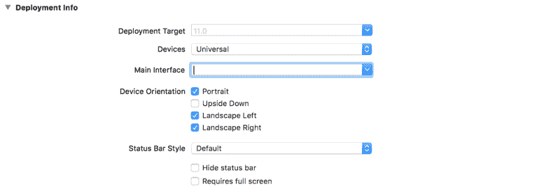

# 如何用苹果的 CoreML 和 Vision APIs 搭建图像识别 iOS app

> 原文：<https://www.freecodecamp.org/news/ios-coreml-vision-image-recognition-3619cf319d0b/>

马克·曼苏尔

# 如何用苹果的 CoreML 和 Vision APIs 搭建图像识别 iOS app


随着今年苹果全球开发者大会上 [CoreML](https://developer.apple.com/documentation/coreml) 和 new Vision APIs 的发布，机器学习从未如此容易进入。今天我将向您展示如何构建一个简单的图像识别应用程序。

我们将学习如何访问 iPhone 的摄像头，以及如何将摄像头看到的内容传递给机器学习模型进行分析。我们将以编程的方式完成这一切，不使用故事板！我知道这很疯狂。

下面是我们今天要完成的任务:

```
//
//  ViewController.swift
//  cameraTest
//
//  Created by Mark Mansur on 2017-08-01.
//  Copyright © 2017 Mark Mansur. All rights reserved.
//
import UIKit
import AVFoundation
import Vision

class ViewController: UIViewController, AVCaptureVideoDataOutputSampleBufferDelegate {
    let label: UILabel = {
        let label = UILabel()
        label.textColor = .white
        label.translatesAutoresizingMaskIntoConstraints = false
        label.text = "Label"
        label.font = label.font.withSize(30)
        return label
    }()

    override func viewDidLoad() {
        super.viewDidLoad()

        setupCaptureSession()

        view.addSubview(label)
        setupLabel()
    }

    func setupCaptureSession() {
        let captureSession = AVCaptureSession()

        // search for available capture devices
        let availableDevices = AVCaptureDevice.DiscoverySession(deviceTypes: [.builtInWideAngleCamera], mediaType: AVMediaType.video, position: .back).devices

        // setup capture device, add input to our capture session
        do {
            if let captureDevice = availableDevices.first {
                let captureDeviceInput = try AVCaptureDeviceInput(device: captureDevice)
                captureSession.addInput(captureDeviceInput)
            }
        } catch {
            print(error.localizedDescription)
        }

        // setup output, add output to our capture session
        let captureOutput = AVCaptureVideoDataOutput()
        captureOutput.setSampleBufferDelegate(self, queue: DispatchQueue(label: "videoQueue"))
        captureSession.addOutput(captureOutput)

        let previewLayer = AVCaptureVideoPreviewLayer(session: captureSession)
        previewLayer.frame = view.frame
        view.layer.addSublayer(previewLayer)

        captureSession.startRunning()
    }

    // called everytime a frame is captured
    func captureOutput(_ output: AVCaptureOutput, didOutput sampleBuffer: CMSampleBuffer, from connection: AVCaptureConnection) {
        guard let model = try? VNCoreMLModel(for: Resnet50().model) else {return}

        let request = VNCoreMLRequest(model: model) { (finishedRequest, error) in

            guard let results = finishedRequest.results as? [VNClassificationObservation] else { return }
            guard let Observation = results.first else { return }

            DispatchQueue.main.async(execute: {
                self.label.text = "\(Observation.identifier)"
            })
        }
        guard let pixelBuffer: CVPixelBuffer = CMSampleBufferGetImageBuffer(sampleBuffer) else { return }

        // executes request
        try? VNImageRequestHandler(cvPixelBuffer: pixelBuffer, options: [:]).perform([request])
    }

    func setupLabel() {
        label.centerXAnchor.constraint(equalTo: view.centerXAnchor).isActive = true
        label.bottomAnchor.constraint(equalTo: view.bottomAnchor, constant: -50).isActive = true
    }
}
```

ViewController.swift

### 🙌🏻步骤 1:创建一个新项目。

启动 Xcode 并创建一个新的单视图应用程序。给它一个名字，也许是“图像识别”选择 swift 作为主要语言并保存您的新项目。

### 👋第二步:告别故事板。

在本教程中，我们将以编程的方式做所有事情，不需要故事板。也许我会在另一篇文章中解释为什么。

删除`main.storyboard`。

导航至`info.plist` 并向下滚动至部署信息。我们需要告诉 Xcode 我们不再使用故事板了。

删除主界面。



没有故事板，我们需要手动创建应用程序窗口和根视图控制器。

将以下内容添加到`AppDelegate.swift`中的`application()`功能:

```
 func application(_ application: UIApplication, didFinishLaunchingWithOptions launchOptions: [UIApplicationLaunchOptionsKey: Any]?) -> Bool {
        // Override point for customization after application launch.

        window = UIWindow()
        window?.makeKeyAndVisible()
        let vc = ViewController()

        window?.rootViewController = vc
        return true
    }
```

AppDelegate.swift

我们用`UIWindow()`、**、**手动创建 app 窗口，创建我们的视图控制器，并告诉窗口使用它作为它的根视图控制器。

应用程序现在应该可以在没有故事板的情况下构建和运行了😎

### ⚙️步骤 3:设置 AVCaptureSession。

在我们开始之前，导入 UIKit、AVFoundation 和 Vision。AVCaptureSession 对象处理捕获活动，并管理输入设备(如后置摄像头)和输出之间的数据流。

我们将首先创建一个函数来设置我们的捕获会话。

在`ViewController.swift` 中创建`setupCaptureSession()`，并实例化一个新的`AVCaptureSession`。

```
func setupCaptureSession() {

        // creates a new capture session
        let captureSession = AVCaptureSession()
}
```

ViewController.swift

不要忘记从`ViewDidLoad()`调用这个新函数。

```
override func viewDidLoad() {
        super.viewDidLoad()

        setupCaptureSession()
}
```

ViewController.swift

接下来，我们需要一个后视摄像头的参照物。我们可以使用`DiscoverySession` 来根据我们的搜索标准查询可用的捕获设备。

添加以下代码:

```
// search for available capture devices
let availableDevices = AVCaptureDevice.DiscoverySession(deviceTypes: [.builtInWideAngleCamera], mediaType: AVMediaType.video, position: .back).devices 
```

ViewController.swift

`AvailableDevices` 现在包含符合我们搜索标准的可用设备列表。

我们现在需要访问我们的`captureDevice`，并将其作为输入添加到我们的`captureSession`。

向捕获会话添加输入。

```
// get capture device, add device input to capture session
do {
    if let captureDevice = availableDevices.first {
        captureSession.addInput(try AVCaptureDeviceInput(device: captureDevice))
    }
} catch {
    print(error.localizedDescription)
}
```

ViewController.swift

第一个可用的设备将是后置摄像头。我们使用我们的捕获设备创建一个新的`AVCaptureDeviceInput` ，并将其添加到捕获会话中。

现在我们已经有了输入设置，我们可以开始讨论如何输出摄像机捕捉到的内容。

向我们的捕获会话添加视频输出。

```
// setup output, add output to our capture session
let captureOutput = AVCaptureVideoDataOutput()
captureSession.addOutput(captureOutput)
```

ViewController.swift

`AVCaptureVideoDataOutput`是捕获视频的输出。它还为我们提供了对被捕获的帧的访问，以便用我们稍后将看到的委托方法进行处理。

接下来，我们需要将捕获会话的输出作为子层添加到我们的视图中。

将捕获会话输出作为子层添加到视图控制器的视图中。

```
let previewLayer = AVCaptureVideoPreviewLayer(session: captureSession)
previewLayer.frame = view.frame
view.layer.addSublayer(previewLayer)

captureSession.startRunning()
```

ViewController.swift

我们基于捕获会话创建一个层，并将该层作为子层添加到视图中。`CaptureSession.startRunning()`开始我们之前连接的从输入到输出的流程。

### 📷第四步:允许使用相机？准许。

几乎每个人都是第一次打开应用程序，并被提示允许应用程序使用相机。从 iOS 10 开始，如果我们在尝试访问相机之前不提示用户，我们的应用程序将会崩溃。

导航到`info.plist` 并添加一个名为`NSCameraUsageDescription`的新键。在“值”栏中，简单地向用户解释为什么你的应用程序需要摄像头访问。

现在，当用户第一次启动应用程序时，他们会被提示允许访问相机。

### 📊第五步:获取模型。

这个项目的核心很可能是机器学习模型。该模型必须能够接受一个图像，并给我们一个图像是什么的预测。你可以在这里找到免费训练的模特。我选的是 ResNet50。

获得模型后，将其拖放到 Xcode 中。它将自动生成必要的类，为您提供一个与模型交互的接口。

### 🏞第六步:图像分析。

为了分析摄像机看到了什么，我们需要以某种方式访问摄像机捕捉到的帧。

符合`AVCaptureVideoDataOutputSampleBufferDelegate` 为我们提供了一个界面，每当相机捕捉到一帧图像时，我们都可以与之交互并得到通知。

使`ViewController`与`AVCaptureVideoDataOutputSampleBufferDelegate`一致。

我们需要告诉我们的视频输出，ViewController 是它的样本缓冲委托。

在`SetupCaptureSession()`中增加以下一行:

```
captureOutput.setSampleBufferDelegate(self, queue: DispatchQueue(label: "videoQueue")) 
```

ViewController.swift

添加以下功能:

```
func captureOutput(_ output: AVCaptureOutput, didOutput sampleBuffer: CMSampleBuffer, from connection: AVCaptureConnection) {
        guard let model = try? VNCoreMLModel(for: Resnet50().model) else { return }
        let request = VNCoreMLRequest(model: model) { (finishedRequest, error) in
            guard let results = finishedRequest.results as? [VNClassificationObservation] else { return }
            guard let Observation = results.first else { return }

            DispatchQueue.main.async(execute: {
                self.label.text = "\(Observation.identifier)"
            })
        }
        guard let pixelBuffer: CVPixelBuffer = CMSampleBufferGetImageBuffer(sampleBuffer) else { return }

        // executes request
        try? VNImageRequestHandler(cvPixelBuffer: pixelBuffer, options: [:]).perform([request])
    }
```

ViewController.swift

每次捕捉到一帧，通过调用`captureOutput()`通知代理。这是一个用 CoreML 进行图像分析的完美地方。

首先，我们创建一个`VNCoreMLModel` ，它本质上是一个与 vision 框架一起使用的 CoreML 模型。我们用 Resnet50 模型创建它。

接下来，我们创建我们的愿景请求。在完成处理程序中，我们用模型返回的标识符更新屏幕上的 UILabel。然后，我们将传递给我们的帧从`CMSampleBuffer`转换为`CVPixelBuffer`。这是我们的模型进行分析所需的格式。

最后，我们用一个`VNImageRequestHandler`来执行视觉请求。

### 🗒第七步:创建一个标签。

最后一步是创建一个包含模型预测的`UILabel`。

创建一个新的`UILabel` ，并使用约束对其进行定位。

```
let label: UILabel = {
        let label = UILabel()
        label.textColor = .white
        label.translatesAutoresizingMaskIntoConstraints = false
        label.text = "Label"
        label.font = label.font.withSize(30)
        return label
    }()

func setupLabel() {
        label.centerXAnchor.constraint(equalTo: view.centerXAnchor).isActive = true
        label.bottomAnchor.constraint(equalTo: view.bottomAnchor, constant: -50).isActive = true
}
```

ViewController.swift

不要忘记添加标签作为子视图，并从`ViewDidLoad()`中调用`setupLabel()`。

```
view.addSubview(label)
setupLabel()
```

ViewController.swift

你可以从 [GitHub 这里](https://github.com/markmansur/CoreML-Vision-demo)下载完成的项目。

喜欢你看到的吗？给这篇文章点个大拇指👍，在 [Twitter](https://twitter.com/MarkMansur2) 、 [GitHub](https://github.com/markmansur) 上关注我，或者查看[我的个人页面](http://markmansur.me/)。