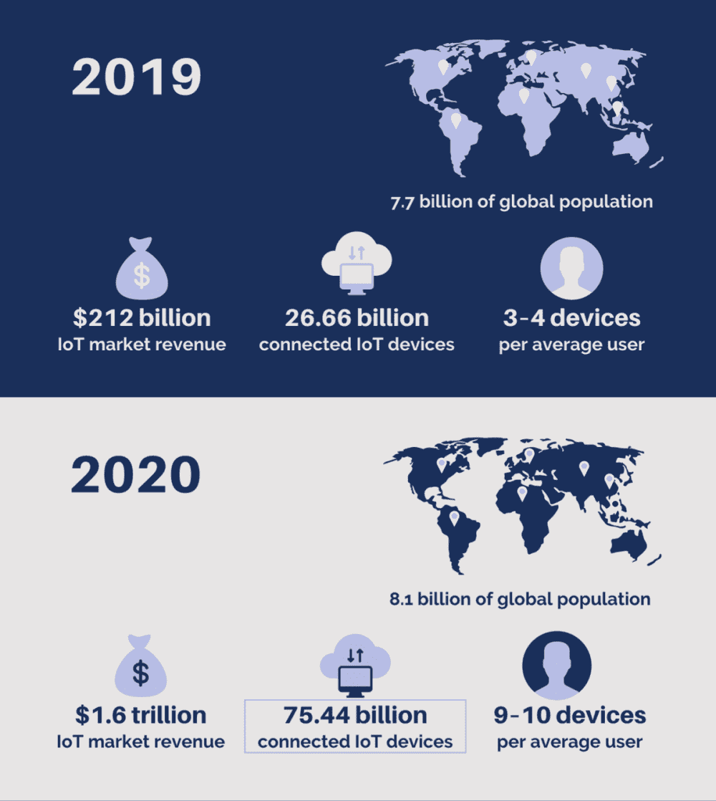
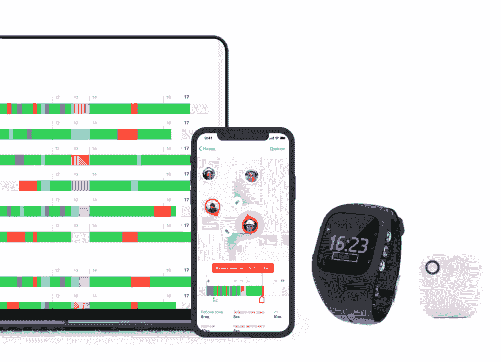
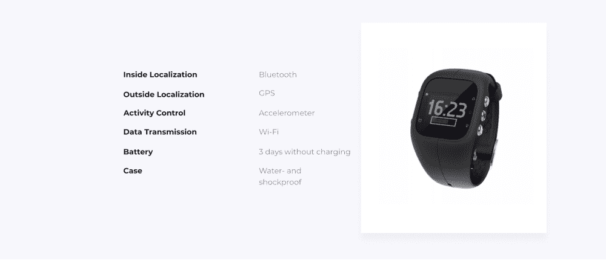
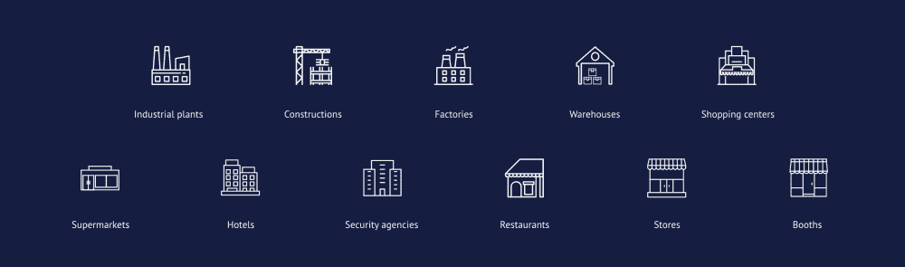
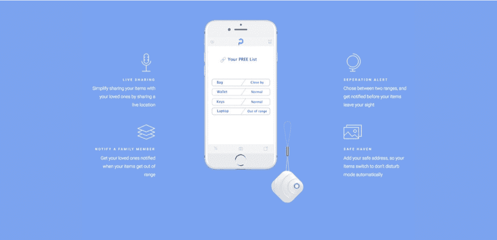

# 如何以及为什么应该使用 Node.js 构建物联网设备

> 原文：<https://www.freecodecamp.org/news/iot-and-node-js-how-to-catch-the-opportunity/>

在本文中，我们将讨论为什么以及如何将 Node.js 用于物联网(IoT)设备的服务器端。

## 了解商机

2019 年，物联网 的 [市场收入达到 2120 亿美元。全球约有 266.6 亿台联网设备，到 2025 年，这一数字将达到 754.4 亿台。](https://www.statista.com/topics/2637/internet-of-things/)

联合国估计，2020 年 2 月， [世界人口](https://www.worldometers.info/world-population/) 目前为 77 亿人。简单的数学告诉我们，平均每个人拥有大约 3 到 4 台物联网设备。你有吗？可能是智能手表？智能电视？还是智能车？

进一步来看，人口预计将在 2025 年达到 81 亿。同样的数学计算告诉我们，到 2025 年，平均每个人将拥有 9 到 10 台智能设备。

你明白我的意思了吗？你想加入这个利润丰厚的市场利基，让你的物联网设备成为这些 9 到 10 之一吗？



Statistics retrieved from Statista and the United Nations.

## 选择正确的框架

物联网设备的客户端由硬件本身来表示。它是用 C、C++或 Lua——低级且难懂的编程语言——编程的。但是由于硬件的限制，你对此无能为力。

除了高性能，物联网设备的用户还优先考虑低成本和高能效。因此，至少现在，你应该继续使用低级语言。

另一方面，物联网应用的服务器端为你提供了更多的选择自由。在这里，你不受硬件的限制，你可以选择任何你喜欢的编码语言和框架。

我相信正确的是 Node.js，下面是原因。

### Node.js 速度快，性能好

首先，任何物联网设备都在不断地处理动态变化的数据。这意味着您需要一个能够处理实时应用程序和大量数据流的框架。

Node.js 建立在 Google 的 V8 JS 引擎之上，该引擎高效且可完美扩展。得益于这一特性， **Node.js 是用于实时应用和平台的头号框架。**不断变化的数据对 it 来说也不是挑战。

### Node.js 易于与物联网协议集成

物联网应用积极使用基于发布-订阅的消息协议 MQTT。反过来，对于传输和封装，该协议使用 WebSockets。【MQTT 和 WebSockets 都得到了很好的支持，并且很容易与 Node.js 集成。

### Node.js 模块促进物联网开发

Node.js 增加了 npm，即节点包管理器，它提供了许多有用的物联网模块。英特尔物联网 Edison、Arduino、或 Raspberry Pi 大约有 80 个包。此外，它还为不同的传感器、信标和其他工具提供了 30 多个包。

这也是为什么 [物联网开发](https://keenethics.com/services-internet-of-things) 用 Node.js 物联网模块更简单快捷的原因。

### Node.js 具有资源效率和可伸缩性

一般来说，开发人员更喜欢使用 Node.js，因为它不需要大量资源。CPU 和 RAM 不会过载。

还有，Node.js 是高度可扩展的，这对于大多数现代公司来说是绝对必要的。

## 小心挑战

进入物联网利基市场可以引领你走向成功。难怪在你前进的路上会有许多挑战和陷阱等待着你——成功从来都不容易实现。您应该意识到的首要挑战是安全性。

安全性是物联网领域的首要问题之一，也是您最先遇到的陷阱之一。那么你应该怎么做呢？

### 安全认证

先说认证。Node.js 中有很多用于认证的工具:tokens、JSON web tokens、Auth0 等等。各有利弊。首先，你应该从物联网的角度来看待它们。

**一方面，令牌是有效的，但不是百分之百安全的**。它们是设置身份验证的一种很酷的方式，因为它们允许您识别特定的用户，并决定是允许还是拒绝他们访问。令牌可以用任何算法加密。

但是，硬件(扫描仪、传感器、集线器或其他物联网设备)应该将此令牌或登录/密码数据存储在固件中。这意味着，如果攻击者能够物理访问硬件，他们就可以窃取令牌。同样的故事也适用于 JWT 或 Auth0。

另一方面，我们可以在服务器端使用任何工具进行认证。你可以在 Node.js 平台上轻松集成任何认证工具。

有很多 npm 包允许你手动完成:Auth0，Passport 和 JWT。还有集成云物联网服务的包:@azure-iot/authentication，aws-iot-device-sdk 等等。

### 安全 HTTP 请求

接下来，要小心来自物联网设备的 HTTP 请求。您应该检查是否收到来自适当物联网设备的请求。

首先，你应该用你的物联网设备实现 HTTPS。硬件不是浏览器，你应该在它上面手动实现 HTTPS。对于服务器端，您可以手动操作，也可以使用 HTTPS 配置和证书进行托管。

在 Node.js 中，很容易实现:

```
const express = require('express');
const https = require('https');
const http = require('http');
const fs = require('fs');
const options = {
  key: fs.readFileSync('path/to/your/key.pem'),
  cert: fs.readFileSync(path/to/your/certificate.cert')
};
const app = express();
http.createServer(app).listen(80);
https.createServer(options, app).listen(443); 
```

HTTPS 使用 SSL 或 TLS 协议进行数据加密。但是，为了确保从必要的服务器或客户端获得请求，请使用额外的数据加密。例如，您可以这样使用签名:

```
const fetch = require('node-fetch');
const verifier = crypto.createVerify('RSA-SHA1')
const SIGNATURE_FORMAT = 'base64';
//check if it trusted url for your certificate
const trustedUrl = ‘https://trustedUrl/’
const isTrustedUrl = trustedUrl.match(url);
If (isTrustedUrl) {
verifier.update(req.body, 'utf8')
	fetch(isTrustedUrl)
    .then(certificate => {
	// check signature
const isValidSignature = verifier.verify(certificate, reg.header.signature, SIGNATURE_FORMAT);
   })
    .catch(err => console.log(err));
}
```

总结这一部分:

1.  首先，您必须检查您的证书的可信 URL。
2.  然后，您用您的证书中的公钥对请求主体进行签名。
3.  最后，将签名的正文与来自标头的签名进行比较。

非常重要的一点是，要知道你是从适当的设备收到请求，并且你没有面临中间攻击。

## 看看这些例子

### [](https://asama.tech/ips/eng)——追踪你的员工的动向



Asama 是一个微型定位系统，它使用智能手表和蓝牙信标来跟踪员工的移动和活动。信标发送常规信号。

根据这些信号，智能手表可以确定员工的位置。智能手表还会分析是否有合适的人佩戴它，以及员工是在睡觉还是在工作。



这些数据随后被传输到手机应用程序，该应用程序安装并配置在雇主的手机上。该系统由物联网中的 Node.js 提供支持。

这样，管理人员可以实时跟踪他们的员工，立即找到他们需要的人，并优化工作空间。此外，在周末，雇主会收到一份关于员工活动的详细报告。所有这些都有助于提高公司的业绩和生产率。

这种解决方案可能不适合办公室小、工作时间灵活的企业。然而，它非常适合工厂、建筑工地、工厂、仓库、购物中心、超市、酒店、安全机构、餐馆或商店。

作为雇主，它非常适合任何你需要知道员工是否来得太晚或太早、不在工作场所、一整天都不积极工作或不遵守路线和时间表的地方。



### [](https://keenethics.com/project-pree)——寻找你的物品

PREE 是一个由 BLE 信标和移动软件组成的系统，可以帮助人们不再丢失他们的东西。对于那些经常忘记手机、包、钥匙、钱包或任何其他贵重物品的人来说，这是一个救命稻草。

用户可以实时看到自己物品的位置，并与信任的联系人分享。一旦物品超出范围，他们会收到通知，他们的朋友或家人也会收到通知。它不会在不需要的时候向其他人发送垃圾通知——例如，在家里，用户可以在某个区域将他们静音。

这个物联网物联网系统是由后端的 [Node.js](https://keenethics.com/services-web-development-node) 、 [Express](https://keenethics.com/tech-back-end-express) 、 [Mongo](https://keenethics.com/tech-data-base-mongo) 和前端的[Cordova](https://keenethics.com/tech-apps-cordova)Ionic 构建而成。这些框架的结合确保了最佳的用户体验。



## 验证你的想法

一旦你有了一个物联网产品的想法，就开始验证它。有两种方法可以做到这一点:

*   雇佣一个创意验证团队，他们会在你投资开发之前帮你测试产品的可行性，或者
*   雇佣一个软件设计和开发团队，他们将启动一个广泛的 [产品发现](https://keenethics.com/blog/product-discovery) 过程。

## 附言

我想对 KeenEthics 的物联网专家 Volodya Andrushchak 表示衷心的感谢，感谢他为这篇文章做出了贡献并赋予了生命。

如果你喜欢这篇文章，你一定要多看一些关于 Node.js 的文章:[Node 的优势是什么。JS？](https://keenethics.com/blog/what-are-the-advantages-of-node-js)或者 [NodeJS vs Python:如何选择最好的技术来开发你的 Web App 后端](https://keenethics.com/blog/nodejs-vs-python)。

KeenEthics 博客上发布的文章原文可以在这里找到: [IoT 和 Node。JS:如何抓住机会？](https://keenethics.com/blog/iot-and-node-js)