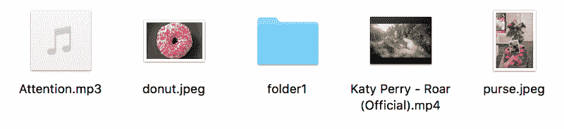
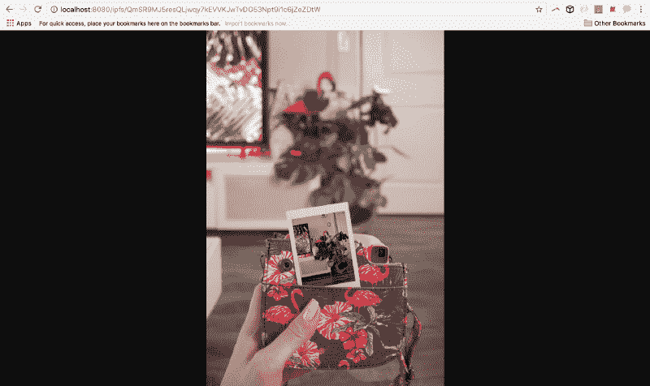
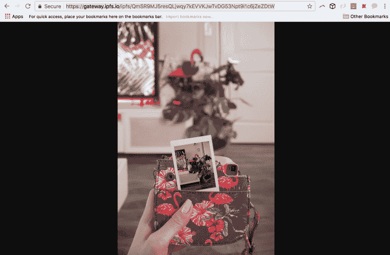
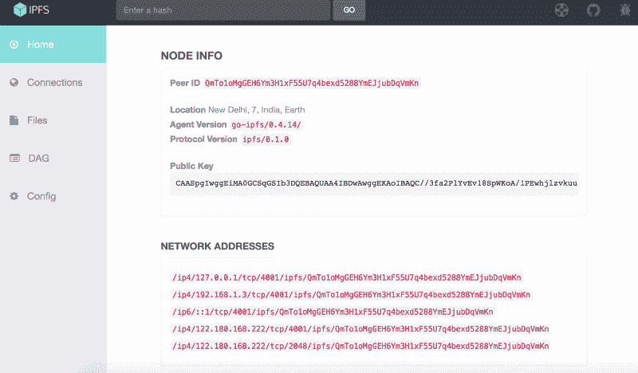
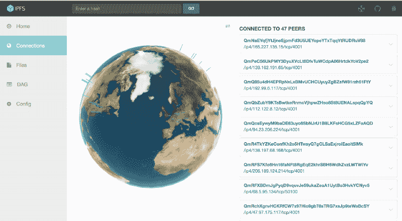
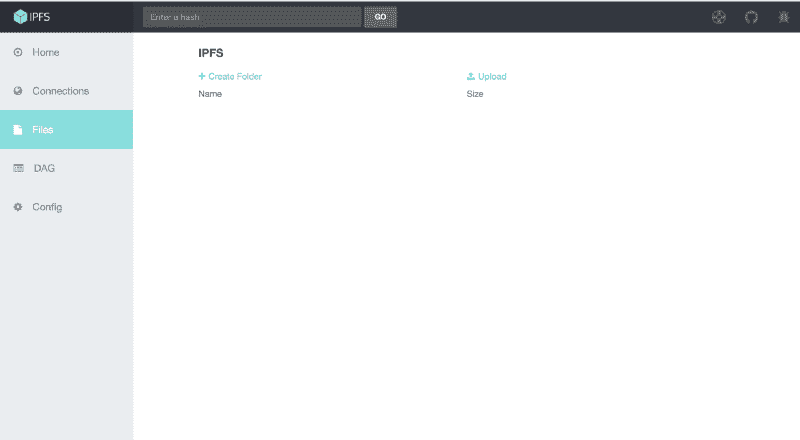
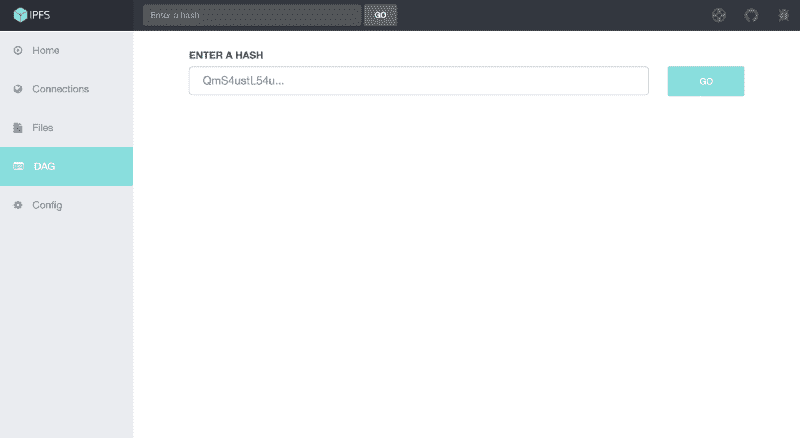
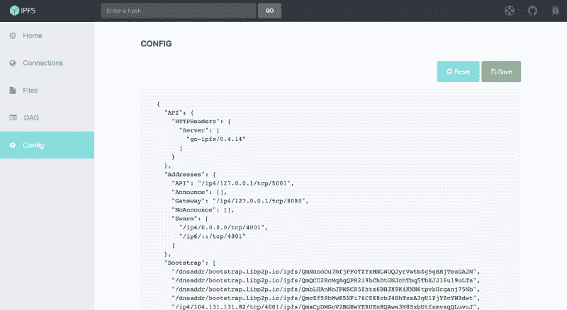
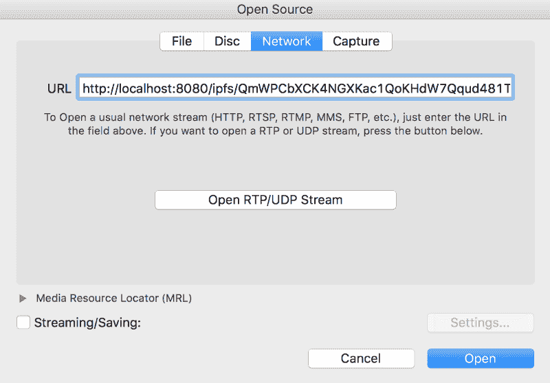
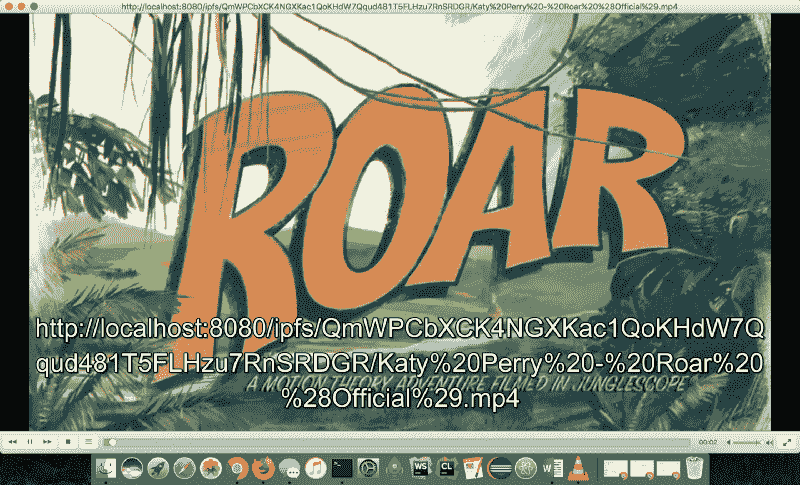

# 边做边学:行星间文件系统的简单介绍

> 原文：<https://www.freecodecamp.org/news/ipfs-101-understand-by-doing-it-9f5622c4d4ed/>

作者:尼哈里卡·辛格

# 边做边学:行星间文件系统的简单介绍


### IPFS 入门

IPFS 是行星间文件系统的缩写。它是一个点对点的分布式文件系统，使网络更快、更安全、更开放。为了从当前版本的网络转移到分布式版本的网络，我们需要 IPFS。本质上，目标是取代 HTTP。

没有中央服务器。一切都是分散的。让我们通过这样做来看看它是如何工作的。

我写了一篇关于 IPFS 如何使用 MerkleDAG 的文章，可以在这里找到。

### 步骤 1:安装 IPFS

IPFS 阿尔法版本是用戈兰语写的。您需要从[此链接](https://ipfs.io/docs/install/)为您的平台下载它。

要检查您是否成功安装了 IPFS，请打开命令控制台并输入以下命令。

```
$ ipfs help
```

如果你看到这样的开头:

```
USAGE
```

```
ipfs - Global p2p merkle-dag filesystem.
```

```
ipfs [--config=<config> | -c] [--debug=<debug> | -D] [--help=<help>] [-h=<h>] [--local=<local> | -L] [--api=<api>] <command> ...
```

那你就可以走了。


### 步骤 2:初始化 IPFS 节点

要将本地计算机初始化为 IPFS 节点，请运行以下命令:

```
$ ipfs init
```

此命令初始化 IPFS 配置文件，并使用 2048 位 RSA 生成新的密钥对。这将产生您的**对等身份**作为输出。

您会看到类似这样的内容:

```
initializing IPFS node at /Users/niharikasingh/.ipfs
```

```
generating 2048-bit RSA keypair...done
```

```
peer identity: QmTo1oMgGEH6Ym3H1xF55U7q4bexd5288YmEJjubDqVmKn
```

```
to get started, enter:
```

```
ipfs cat /ipfs/QmS4ustL54uo8FzR9455qaxZwuMiUhyvMcX9Ba8nUH4uVv/readme
```

你会有一个和我不同的同龄人身份。

现在运行以下命令查看 hello 消息:

```
$ ipfs cat /ipfs/QmS4ustL54uo8FzR9455qaxZwuMiUhyvMcX9Ba8nUH4uVv/readme
```

您将看到类似这样的结果:

```
Hello and Welcome to IPFS!
```

```
██╗██████╗ ███████╗███████╗
```

```
██║██╔══██╗██╔════╝██╔════╝
```

```
██║██████╔╝█████╗  ███████╗
```

```
██║██╔═══╝ ██╔══╝  ╚════██║
```

```
██║██║     ██║     ███████║
```

```
╚═╝╚═╝     ╚═╝     ╚══════╝
```

```
If you're seeing this, you have successfully installed
```

```
IPFS and are now interfacing with the ipfs merkledag!
```

```
-------------------------------------------------------
```

```
| Warning:                                              |
```

```
|   This is alpha software. Use at your own discretion! |
```

```
|   Much is missing or lacking polish. There are bugs.  |
```

```
|   Not yet secure. Read the security notes for more.   |
```

```
-------------------------------------------------------
```

```
Check out some of the other files in this directory:
```

```
./about
```

```
./help
```

```
./quick-start     <-- usage examples
```

```
./readme          <-- this file
```

```
./security-notes
```

**到了！**

### 第三步:添加一些文件到 IPFS

在你的机器上的任何地方创建一个演示文件夹，并放入几个文件。任何类型的文件:图像，视频，音乐…几乎任何东西。您甚至可以在该文件夹中添加另一个文件夹。



This is what my demo folder looks like.

假设文件夹名为**“test-ipfs”。**因此，要推送这些文件，首先在命令行上导航到该文件夹，然后运行以下命令:

```
$ ipfs add -r .
```

该命令将文件夹中的所有文件/目录递归添加到 IPFS，以创建 IPFS MerkleDAG。您甚至可以使用以下命令添加一个文件:`$ ipfs add <filename.extensi` on >

这将创建以下输出:

```
added QmSTuTEThyESvDgmYdao2HK6kurXe2pqjA1KHPD8wSHVy7 test-ipfs/donut.jpeg
```

```
added QmSR9MJ5resQLjwqy7kEVVKJwTvDG53Npt9i1c6jZeZDtW test-ipfs/purse.jpeg
```

```
added QmUNLLsPACCz1vLxQVkXqqLX5R1X345qqfHbsf67hvA3Nn test-ipfs/folder1
```

```
added QmaKZ3dnc9ejBdGgEDCRtsLFNRxcY67HLjk6gXUnk9sdM9 test-ipfs
```

你会注意到这个长长的东西是那个特定文件的唯一散列。所有的文件和目录，以及父文件夹，将有他们唯一的散列。

```
$ ipfs ls QmaKZ3dnc9ejBdGgEDCRtsLFNRxcY67HLjk6gXUnk9sdM9
```

这与 UNIX 文件系统的工作方式完全一样。预期输出将显示以下内容:

```
QmSTuTEThyESvDgmYdao2HK6kurXe2pqjA1KHPD8wSHVy7 219859 donut.jpeg
```

```
QmUNLLsPACCz1vLxQVkXqqLX5R1X345qqfHbsf67hvA3Nn 4      folder1/
```

```
QmSR9MJ5resQLjwqy7kEVVKJwTvDG53Npt9i1c6jZeZDtW 110254 purse.jpeg
```

文件大小显示在哈希字符串的末尾。例如，219859 是 donut.jpeg 的文件大小。

### 步骤 4:在线访问文件

要在线访问文件，首先我们必须将节点连接到 IPFS 网络。为此，我们必须运行 IPFS 守护进程。

```
$ ipfs daemon
```

这将产生以下输出:

```
Initializing daemon...
```

```
Successfully raised file descriptor limit to 2048.
```

```
Swarm listening on /ip4/127.0.0.1/tcp/4001
```

```
Swarm listening on /ip4/169.254.100.132/tcp/4001
```

```
Swarm listening on /ip4/192.168.1.3/tcp/4001
```

```
Swarm listening on /ip6/::1/tcp/4001
```

```
Swarm listening on /p2p-circuit/ipfs/QmTo1oMgGEH6Ym3H1xF55U7q4bexd5288YmEJjubDqVmKn
```

```
Swarm announcing /ip4/127.0.0.1/tcp/4001
```

```
Swarm announcing /ip4/169.254.100.132/tcp/4001
```

```
Swarm announcing /ip4/192.168.1.3/tcp/4001
```

```
Swarm announcing /ip6/::1/tcp/4001
```

```
API server listening on /ip4/127.0.0.1/tcp/5001
```

```
Gateway (readonly) server listening on /ip4/127.0.0.1/tcp/8080
```

```
Daemon is ready
```

现在您已经将文件推送到 IPFS，让我们看看如何访问它们。

```
localhost:8080/ipfs/hashOfTheFileYouWantToOpen
```

假设我想打开 purse.jpeg。我将复制 purse.jpeg 的散列，并用上面的语法点击浏览器。



同样，您甚至可以听到自己的音乐、视频等等。

您甚至可以使用 IPFS 网关访问您的内容:

```
gateway.ipfs.io/ipfs/hashOfTheFile
```



你马上就要看到真正的魔法了！

将您的浏览器指向:

```
127.0.0.1:5001/webui
```

您会看到这个屏幕:



随便玩吧。

**人脉:**会给你看全世界的同龄人。



How cool is that!

**文件:**您可以使用 webUI 推送文件。



**DAG:** 将向您显示 MerkleDAG，并在输入其哈希后显示文件的相关信息。



配置:这将显示您自己机器的配置。



### 第五步:从你的同伴那里获取文件

IPFS 承诺，没有中央服务器给你的文件。那么，如果我告诉你，即使 IPFS 守护进程不在我的电脑上运行，你也可以从我的笔记本电脑上播放视频，那又怎么样呢？

我已经把凯蒂·佩里的咆哮视频上传到网上了。你可以从我这里访问，而不是点击 YouTube。

转到:

```
localhost:8080/ipfs/QmWPCbXCK4NGXKac1QoKHdW7Qqud481T5FLHzu7RnSRDGR/
```

还有**享受**！

你将会在 IPFS 播放这个视频。

你甚至可以使用 VLC 媒体播放器。

使用的 URL:

```
http://localhost:8080/ipfs/QmWPCbXCK4NGXKac1QoKHdW7Qqud481T5FLHzu7RnSRDGR/Katy%20Perry%20-%20Roar%20%28Official%29.mp4
```



你可以随意和 IPFS 玩耍。这是一个非常简短的概述。但是我希望你对 IPFS 有一个基本的概念！