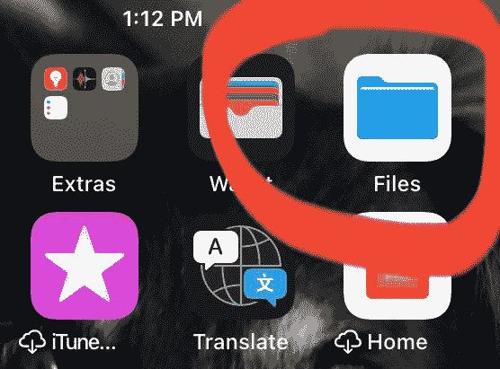
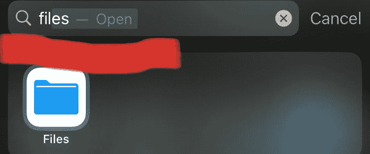
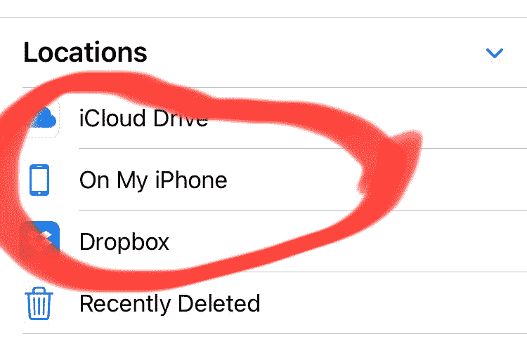
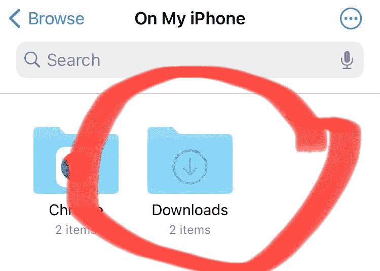
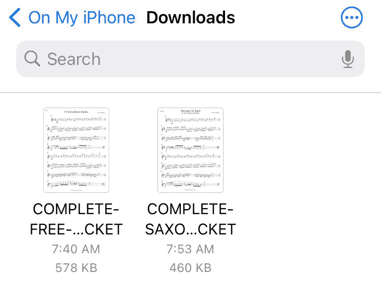
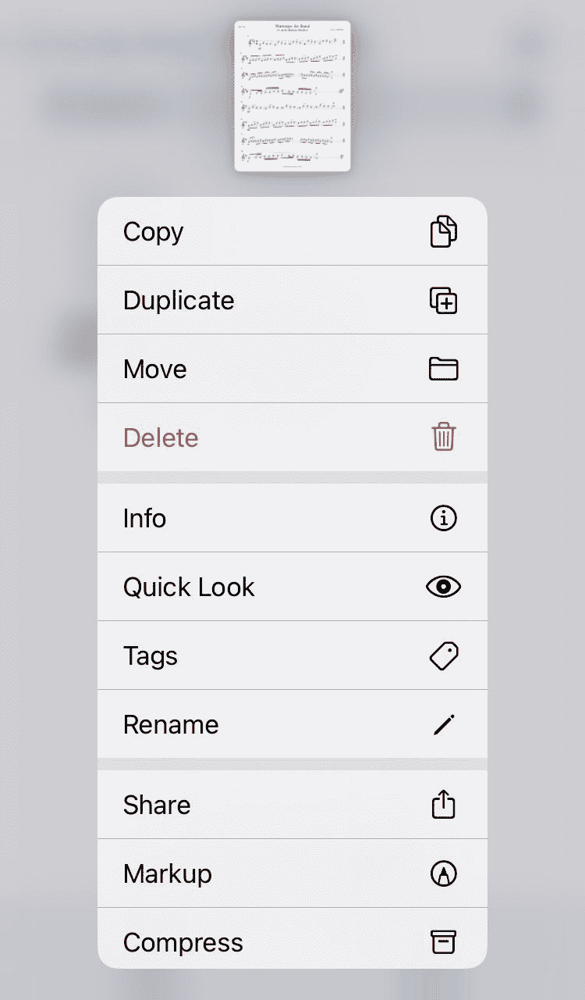

# iPhone 下载文件夹–我的下载在哪里？iOS 和 iPad

> 原文：<https://www.freecodecamp.org/news/iphone-downloads-folder-where-are-my-downloads-ios-and-ipad/>

iPhone 和 iPad 都有一个名为 Files 的应用程序，您可以在其中找到来自 iCloud Drive、Dropbox 等服务的所有文件。

如果您想要访问“下载”文件夹，可以在“文件”应用程序中找到它。在本文中，我将向您展示如何访问文件应用程序和下载文件夹。

## 如何在 iPhone 和 iPad 上找到文件应用程序

如果您有运行 iOS 11 或更高版本的 iPhone 和 iPad，则“文件”应用程序会自动加载到您的设备中。

您也可以使用搜索功能来查找文件应用程序。

## 如何在 iPhone 和 iPad 上找到“下载”文件夹

步骤 1:打开文件应用程序

第二步:点击浏览

第三步:点击位置下的我的 iPhone

第四步:点击下载文件夹

然后你就可以看到你下载的所有文件。

如果您按住想要选择的文件，那么您可以看到可用选项的列表。

现在，您可以对这些文件进行复制、删除、共享、重命名和执行许多其他操作。

感谢阅读，并愉快浏览！