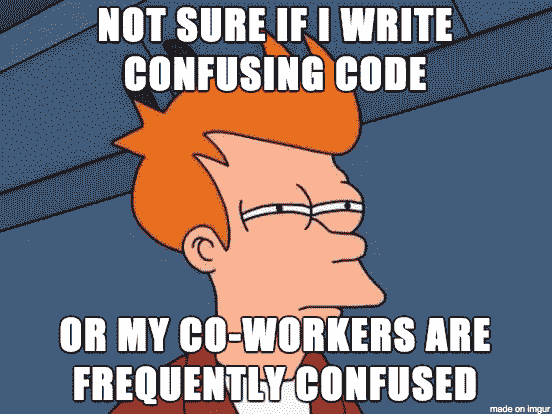

# ES6 给了 JavaScript 开发者更多的做事方法。但这并不总是一件好事。

> 原文：<https://www.freecodecamp.org/news/is-es6-destroying-javascript-drowning-in-options-7fc02d25d81c/>

作者:萨姆·威廉姆斯

# ES6 给了 JavaScript 开发者更多的做事方法。但这并不总是一件好事。


我最近写了一篇关于 [ES6 提示和技巧](https://medium.freecodecamp.org/make-your-code-cleaner-shorter-and-easier-to-read-es6-tips-and-tricks-afd4ce25977c)的文章，有超过 17，000 次浏览和 4，600 次鼓掌。一条评论来自[的鲍勃·蒙克](https://www.freecodecamp.org/news/is-es6-destroying-javascript-drowning-in-options-7fc02d25d81c/undefined)，他说:

> 这篇文章非常有力地证明了在任何需要长期可靠性、可维护性和可修改性的应用中，避免 JavaScript 像瘟疫一样蔓延。

他的观点似乎是，如果语言的变化如此之大，它就等于签署了自己的死刑判决。

### ES6、7 和 8 给 JavaScript 增加了什么

最新的规范给这种语言增加了许多新特性。析构、简洁的对象赋值和符号等等。有一些好的东西出现了，但是这篇文章旨在突出问题。

### 为什么这是一个问题？

您希望创建一个函数来接收一个对象，并对其执行一些逻辑操作。简单吧？但是你打算用哪种方式去做呢？

```
var data = { a: "print me" };
```

```
function method1(data) {    var a = data.a;    console.log(a);}
```

```
function method2(data) {    console.log(data.a);}
```

```
function method3({ a: info }) {    console.log(info);}
```

```
function method4({ a }) {    console.log(a);}
```

所有这些方法给你完全相同的结果。这是一个非常简单的例子，但它适用于更复杂的函数。

#### 怎么决定用什么？

有三种主要的方法来决定采用哪种方式:

*   评估和比较可用的选项。
*   你想用什么就用什么。
*   有一个关于在哪里使用的策略。

这些都有自己的优点和缺点。


Photo: [pixabay.com](https://pixabay.com/en/thought-idea-innovation-imagination-2123971/)

#### 评估和比较可用的选项

这似乎是一个显而易见的选择，但这是最好的选择吗？每次都这样做意味着每次编写函数时都要评估每种方法的优缺点。这是很大的思考能力，可以用在你试图解决的问题上。

你和与你一起工作的每个人都需要知道每种方法的优点、缺点和细微差别。这看起来不算太糟，只有 4 个，但是接下来如何处理异步行为呢？你使用回调、承诺、生成器、异步/等待还是它们的组合？

这意味着和你一起工作的每个人都需要理解这门语言的每一个细节。从我的 ES6 文章的浏览量来看，我猜很多人仍在学习一些更基本的语言语法。这意味着很少有人理解异步行为的复杂性(我自己目前也在努力理解)。

#### 想用什么就用什么

这是个人和公司最常用的方法。这很好，因为这意味着你不用浪费时间和精力去计算最佳选择。

当其他人来阅读或修改您的代码时，问题可能会出现。你可能是一个 JavaScript 天才，知道所有最新的方法。但是下一个来阅读或修改你作品的人可能不知道你做了什么。

这也助长了公司和同事之间巨大的风格差异。当你学习一种新的语法时，这也意味着你和未来的你之间的差异。这并不好，而且使得阅读多个开发人员编写的代码更加困难。


Photo: [pixabay.com](https://pixabay.com/en/bureaucracy-aktenordner-paperwork-2106924/)

#### 政策

无论是公司政策还是个人政策，这都消除了前两种方法的许多问题。它不需要思考，并且促进了整个代码库的一致性。不幸的是，它仍然有一些问题。

随着 ECMAScript 规范新版本的不断出现，出现了一个难题。该公司是否应该改变其政策以与最新版本保持一致？或者写了一份保单却从不更改——错过了新功能？还是应该介于两者之间？

新员工必须学习该政策，并知道如何使用它。是的，您可以有一本关于政策的小册子，但是找到规范可能比编写代码行需要更长的时间。即使他们找到了关于异步行为的策略，他们也需要能够使用它。这可能最终会压制初级开发人员进行简单的编码，因为他们不想违反政策，严重限制他们的成长。

### ES6+到底提供了什么？

我上面举的例子真正的区别是什么？新的语法更容易阅读还是提供了额外的功能？

> 他们的建议必须减少击键次数，增加“简洁”的技巧。

除了节省击键次数，我实在看不出使用析构或简洁的对象语法有什么好处。可能有我不知道或不理解的性能优势或一些特殊的魔力，但是:

这些性能差异根本无关紧要！— YDKJS


photo: [pixabay.com](https://pixabay.com/en/hourglass-time-hours-sand-clock-620397/)

这句话有点断章取义，所以我来解释一下。假设方法 X 每秒运行 1，000，000 次运算，方法 Y 每秒运行 500，000 次运算。这意味着 X 的速度是 y 的两倍。**但是**运行时间的差别只有 1 微秒。这比人眼所能感知的要慢 10 万倍。所以性能差异根本不重要！

通过使用不同的方法节省下来的钱可能会非常少，所以没关系。如果你想写最快的代码，为什么要用 JavaScript 写呢？

#### ES6 还提供了什么

困惑、复杂性和选择。



后来在与 Bob 的讨论中，他谈到了 JavaScript:

> 你必须*解码它*才能理解它在做什么。这种语言的语法和语义是复杂的，错综复杂的，令人费解的。第二天或十年后调试、维护、增强和修改你的代码的程序员将很难理解它。他们会发现自己想知道你做的事情是非常聪明还是非常愚蠢。

这对我来说是如此真实。我发现自己看着自己写的代码，困惑地想弄清楚自己做了什么以及为什么这么做。虽然您可以用任何语言编写复杂而令人困惑的代码，但是 JavaScript 给了您很多机会来让自己脱颖而出。

我在 ES6 的文章中这样对自己。在阅读整篇文章的 4000 人中，只有 5 人设法在我改正之前发现了我的错误。以下哪一个是正确的？

```
let person = {     name: "John",     age: 36,     job: { company: "Tesco", role: "Store Assistant"}}
```

```
function methodA({ name: driverName, age, job.company: company}){ ... }
```

```
function methodB({ name: driverName, age, job: { company }){ ... }
```

我用错了，大多数人都没注意到。只有少数尝试过的人设法找到了错误。


这两种方法到底提供了什么来证明额外的混乱和复杂性呢？许多人可以读、写和理解这样的函数:

```
function methodC(person){    var driverName = person.name,        age = person.age,        company = person.job.company;    ...}
```

是的，我不得不写 32 个额外的字符，但是由于大多数编程是思考，而不是打字，我们节省打字时间只是为了花更多的时间思考吗？

不仅仅是作者花了额外的时间去思考它，而是每个人在这一点之后阅读代码(通常又是作者)。复杂的代码每次被阅读时都有“思考税”，而我们作为人类，每天的思考能力是有限的。

#### 并非一切都是坏的

虽然这篇文章似乎是在大量引用 ES6，但是有一些东西增加了可读性和可维护性。承诺、异步函数和 async/await 都有助于抽象异步行为的复杂性，使代码更具逻辑性，更易于阅读。这是我认为应该关注的，而不是节省按键的技巧。

### 长期影响

虽然这对开发人员来说不会有什么影响，但是有很多开发人员的公司可能会感受到影响。在理解代码做什么之前，必须先理解语法在做什么，这会导致代码不可靠和不可维护。

这可能导致 JavaScript 失去对任何大型、复杂、关键或不断发展的事物的青睐。对于 JavaScript 来说，这将是一个巨大的市场。

### 摘要

*   ES6 给了我们更多的方法来完成同样的任务。
*   你可以计算什么是最好的，做你想做的，或者有一个政策。
*   ES6 给了我们新的技巧来节省一些按键。
*   这些新技巧增加了复杂性和出错几率，同时降低了可读性。
*   ES6 有一些好的地方，增加了可读性。
*   增加的复杂性和降低的可读性会使公司不太可能在复杂、关键或不断发展的解决方案中使用它吗？

> 你怎么想呢?请在评论中告诉我。如果你喜欢它，请鼓掌并关注我以获取更多的 JavaScript 文章。

