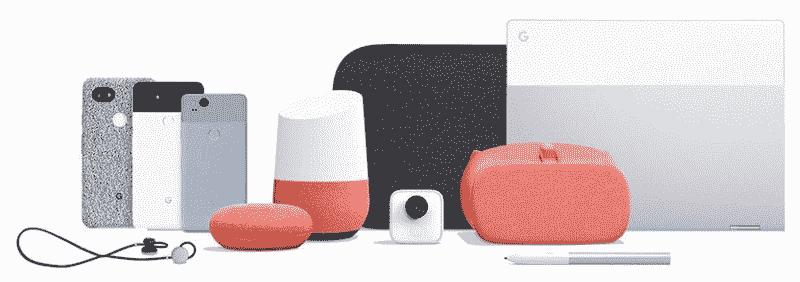

# 谷歌是新的苹果吗？

> 原文：<https://www.freecodecamp.org/news/is-google-the-new-apple-f15e7cf49a92/>

苏米特·古普塔

# 谷歌是新的苹果吗？

#### 随着众多设备的推出，谷歌试图击败苹果。“谷歌制造”是否让谷歌变得更像苹果？

谷歌一直是一家软件公司，一直遵循授权策略。它制造软件，但从未真正用软件制造产品。迄今为止，三星、HTC 和 LG 一直在为其设计硬件。不像苹果一直都是自己创造软硬件。

从去年开始，谷歌开始涉足制造业。他们创建了一个“由谷歌制造”的计划，以进入高端设备。

早在 2007 年，在发布 iPhone 时，史蒂夫·乔布斯引用了艾伦·凯的话，

> “真正对软件认真的人，应该自己做硬件。”

苹果严重扰乱了市场，在智能手机竞赛中还没有人超过苹果。苹果做什么，大家都跟着做。更准确地说，苹果已经完成了别人做不到的事情，现在，就连他们也效仿了苹果。

过去，微软确实在个人电脑领域打败了苹果。

> **微软做了什么？**
> 微软创造了 Windows 并开始授权。很快，大量可供选择的产品涌入市场。买 Windows 电脑比 Mac 电脑便宜。所有这些都有助于微软获得牵引力，这有很多好处，让球滚动。

谷歌、三星和许多其他公司试图用这种方式击败苹果。谷歌制造软件，其合作伙伴制造硬件。就像微软做了 Windows，戴尔做了 PC。但这次所有人都失败了。

> **大家都缺什么？**
> 苹果是唯一一种有秘制酱料的。

> “没有其他公司能生产 MacBook Air，原因是我们不仅控制了硬件，还控制了操作系统。正是操作系统和硬件之间的亲密互动让我们能够做到这一点。Windows 和戴尔笔记本之间没有亲密的互动。”—史蒂夫·乔布斯

许多苹果产品被认为是标杆，这是因为它们具有革命性。其他人遵循标准，最终制造出彼此相似的东西。

试着购买一部安卓手机，你会发现很多选项都差不多。搞不清楚哪个更好。

> “质量比数量更重要。一个本垒打比两个二垒打强多了。”—史蒂夫·乔布斯

苹果每年生产一款手机。虽然苹果已经开始为一款机型提供不同的尺寸，但它们可以被归类为一款旗舰产品。

有了 iPhone，你买个 iPhone 就行了。你可以相信这是苹果提供的最好的手机，它与市场上的其他手机不相上下。

这有助于苹果创造一种形象，即 iPhone 是 iPhone，而不仅仅是一部手机。

当 iPad 和 Mac 开始蚕食微软的销售时，微软很快意识到了创造自己设备的重要性。微软从未被认为是一个优质品牌。对于个人电脑来说，这没什么大不了的，因为商业是最大的市场，它需要任何有成本效益的东西。但是当涉及到消费者的时候，事情发生了巨大的变化。他们想要设计精良的设备。

微软的合作伙伴无法做到这一点。每个合伙人都想脱颖而出，但事实上，他们都只是彼此的变体。微软很快意识到这一点，并推出了他们自己的产品系列，命名为“ **Surface** ”。这个产品系列很受欢迎，被认为是优质产品。surface 产品被视为 Windows 和硬件的最佳结合。还记得 [Surface 工作室](https://www.youtube.com/watch?v=BzMLA8YIgG0)吗？

这对苹果和微软来说非常有效，以至于现在谷歌已经改变了策略，冒着与合作伙伴关系恶化的风险。

谷歌现在正在制作自己的产品，如 Pixel 系列，Chromecast，WiFi 路由器，Google Home 等等。谷歌想创建一个高端品牌“ **Pixel** ”。它想展示最好的软件，这在合作中是不可能的。

当谷歌采取“**由谷歌**制造”的策略时，他们将事情推向了一个新的高度。与苹果不同，谷歌几乎无处不在，尤其是在机器学习和人工智能领域。他们在创造自己的产品时很好地利用了这些专业知识。

所有的谷歌产品都很好地结合在一起来帮助你。你的笔记本电脑、手机、扬声器里也有同样的谷歌助手，现在还在你的耳朵里帮你。他们甚至将谷歌翻译和谷歌像素芽结合起来，为你提供 40 种语言的实时双向翻译。

这在合伙的时候是可能的。但是谷歌选择单干。也许它不愿意与他们分享所有的专业知识，或者它可能需要更多的时间来开发，或者只是谷歌想要完美的设计和集成。

不管是什么原因，他们现在都像苹果一样提供自己的设备系列。

> "协同工作使生活更加顺畅的设备."

> —由谷歌制造

#### 未来会怎样？

在我看来，我们将在一段时间内看到苹果和谷歌都在制造自己的设备。但我相信，当尘埃落定时，谷歌将会脱颖而出。

> **为什么？**
> 谷歌已经转向“人工智能优先”的方式。谷歌的人工智能和机器学习是它拥有的最大武器。他们已经开始在他们的设备中使用它，而苹果依靠最好的硬件，设计软件到硬件的集成。

苹果是第一个将语音助手推向市场的公司。但是今天谷歌助手比 Siri 聪明多了。

苹果不会坐视谷歌获胜。他们正在招聘人工智能和机器学习方面的人才。但是谷歌肯定在即将到来的战争中占据上风。

如果你没有看过 iPhone X T1 和 T2 Pixel 2 T3 的发布视频，请观看。看完他们有什么感受？

你认为谷歌会变得像苹果一样吗？

如果你喜欢这个故事，请点击？按钮并分享，帮助其他人找到它！欢迎在下方留言评论。

在我的博客上查看更多我的故事。