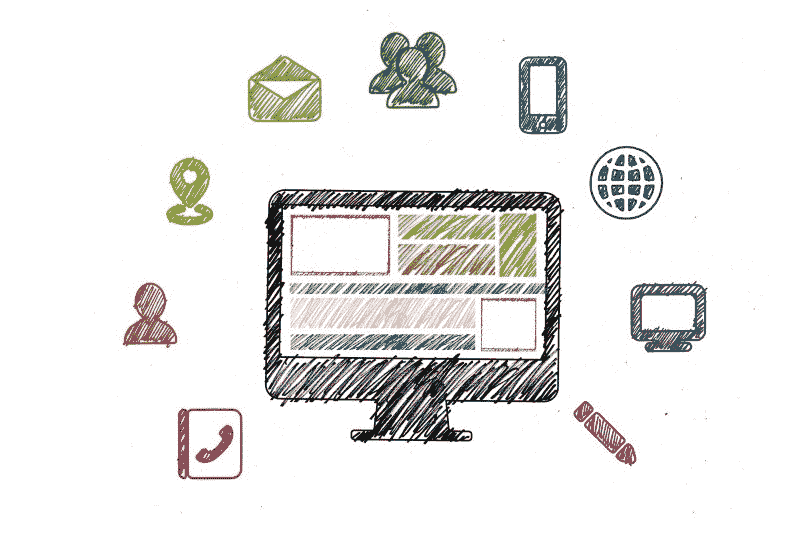
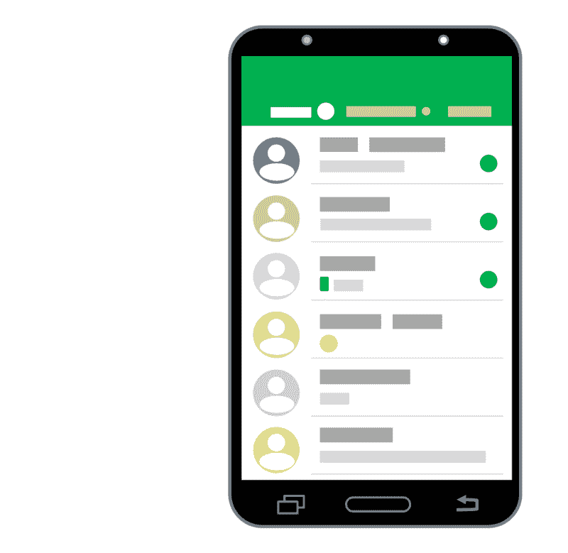

# 如何定义最小可行产品

> 原文：<https://www.freecodecamp.org/news/is-it-an-mvp-really-6657db743544/>

乔治·克拉萨达基斯

# 如何定义最小可行产品

#### 从概念转移到正确定义的 MVP

**最小可行产品**，虽然是一个恰当定义的术语，但对不同的人有不同的含义。事实上，这是技术领域中最常被误用的术语之一。描述一个**原型**、一个**演示**或者甚至**一个项目的第一个可交付成果**通常是很少被引用的。

> “在产品开发中，最小可行产品(MVP)是一种具有足够满足早期客户并为未来开发提供反馈的功能的产品”“[最小可行产品](https://en.wikipedia.org/wiki/Minimum_viable_product)

### 定义 MVP

假设你有这个伟大的想法，你需要一个方法来开始定义**产品** *。*更具体地说，可以服务于你的目标的产品特性子集，具有**最小成本** 和**风险**。下面解释如何从一个想法到一个 MVP。

### **识别您的用户**

**设置语境** —想到问题，情境*T3*T5【机遇】T6。*想想市场上已经有哪些解决同样问题的产品。确定并说出所涉及的用户类型以及他们如何互动。记录您的**用户**，他们的**需求**，他们正在经历的**问题**，他们的**期望**，以及他们在您的环境中可能拥有的**最佳体验**。*

**MVP** 中的**最小值**暗示你已经有了大局，你已经有了**的产品愿景！**一个常见的错误是团队“轻易地”将一组“显而易见的”用例确定为 MVP——没有清晰的产品愿景和大局。

> **检查还:[如何(以及为什么)写出伟大的用户故事](https://uxdesign.cc/how-and-why-to-write-great-user-stories-f5a110668246)**

### 从用户的角度思考

有了大图，你需要应用一个过程来识别服务于一个非常具体的目标的最小功能子集。目标是**让你的用户满意。**你也要启用关键用户洞察和反馈。这个反馈可以改进你的产品开发计划中的下一次迭代。

大图是跨所有已识别的用户类别的用户故事的超级集合。创建一大套**史诗故事是个好主意。**然后遍历所有已识别的用户，尝试定义涵盖他们的需求和预期利益/收益的用户故事。

使用 Scrum 中提出的紧凑格式:**作为一个<用户>我希望<能够执行一个活动>，这样< des** 就可以获得收益>。在这个阶段，你不必担心优先顺序。一个好主意是给每个故事命名/指定一个紧凑的标题，以便于分类和组织。

一旦你有了你的产品特性超集，你需要检查它以确保它定义了一个产品(T2 MVP T3 的 T0 P T1)。在你的用户故事中搜索**连续性**、**同质性**和**互补性**。

作为这个过程的结果，您可能会意识到在您的 backlog 中引用了不止一个相关的产品，并且需要将它们分开。或者你可能意识到有很大的差距需要填补。

再次，**作为用户思考。**运用同理心来确定需要包含的互动、场景和故事。

你还需要**收集反馈**，这样你就可以试着**验证你的故事**和产品。您可以通过专家建议、用户访谈、正式或非正式调查或公共领域参考资料(例如可以帮助您测试假设的任何可靠的公共领域统计资料)来收集反馈。

### 像企业家一样思考

作为用户思考是很棒的。你可以发挥创造力，暂时忘记现实世界的挑战，比如技术和财务限制。你的目标是编辑用户故事的产品超集，以满足——甚至激发——所有不同类型的用户。

现在是时候作为一个企业家来思考了。您需要开始考虑并记录实施成本、优先级、战略优势和竞争优势。

你需要估计每个用户故事的开发成本。您还必须量化用户的**预期价值以及对业务的预期影响:**您的业务**。**

识别**右最小子集**的逻辑可能很复杂——需要在用户故事级别上对上述所有内容进行估计。对于每个用户故事(或史诗)，您至少需要具备以下内容:

1.**复杂性/相关成本/可行性**

2.**用户的期望值**

对上述维度的估计可以是数字或顺序尺度。一旦你有了这些评估，你就可以对你的故事进行排序。还可以将它们绘制在一个简单的图表中，对照用户的**复杂性** 和**期望值**。

> **查也:[如何成为一个伟大的产品经理](https://medium.com/@gkrasadakis/the-successful-product-manager-5f3cb3aacb51)**

### 区分优先次序，排名，设定重点

此时，你可以开始将**高价值、低成本的故事**优先于价值较低的**、*高成本的故事。但是，请注意产品特性之间的那些自然的、强烈的依赖性。*

*在许多情况下，存在技术或程序依赖性，要求首先实现某些功能，尽管它们的成本很高，预期的用户价值很低。这些依赖关系需要在用户故事映射中被识别和可视化。*

*了解了产品的每个特性(用户故事)后，您可以**将您的 MVP** 定义为:*

> *“…确保足够好的产品体验的最小功能(故事)集，推动用户参与度的提高，从而确保下一个产品开发周期”*

*你可以通过**依赖序列**对你的整个产品 backlog 进行排序(从基础开始)。然后由用户的**值**按降序排列。然后由**复杂度**和**可行性**依次递增。*

*您还可以结合预算限制、团队的速度和走向市场战略，从而“轻松”确定您有待证明的可行 MP 的红线。*

### *现状核实*

*然而实际上，这只是 MVP 的一个草案定义。理想场景中需要的是真实用户通过原型、焦点小组、市场研究、竞争分析和相关方法对功能进行反馈和验证。*

*来自真实用户的输入越多，你就越有信心，你的产品概念已经具备了成为**可行**(这也假设了一个伟大的执行/实施/发布)。*

*查看[这篇关于如何定义 MVP 的文章](https://medium.freecodecamp.org/is-it-a-prototype-or-an-mvp-well-its-a-proof-of-concept-f8df5bb8940a)(以及其他内容)。*

*感谢阅读！*

**图像:pixabay**