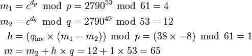

# 是“计算机科学”还是“编程”？

> 原文：<https://www.freecodecamp.org/news/is-it-computer-science-or-programming-c01383dacc9c/>

作者:山姆·科尔科斯


# 是“计算机科学”还是“编程”？

#### *教育政策白皮书(提示:它们不是一回事)*

*由[刘易斯](https://github.com/lewisjellis)和[萨姆](https://github.com/samcorcos)科尔科斯*

计算机科学教育的倡导者一直在推动大学预科计算机科学教育的改进，经常哀叹它在我们的高中代表性不足和缺乏认可。

这些抱怨并非没有道理:截至 2015 年 11 月，**美国只有 27 个州承认**计算机科学是数学或科学课程， **90%的高中没有该领域的课程**。政治家、企业家和名人都鼓励转向更好的计算机科学教育。

> 现在没有足够多的人受过训练并拥有这些技能。
> —马克·扎克伯格，脸书

随着如此多的公共倡导者站出来——特别是围绕 Code.org 在 2014 年 12 月开展的“代码一小时”活动——计算机科学教育已经成为一个主流问题。到 Code.org 的游客被问及是否同意“每个学校的每个学生都应该有机会学习计算机科学”的观点，并签名以示支持。将近 200 万人这样做过，包括我自己。

> 重要的是向未来前进，也就是现在，每个人都要学习它。—克里斯·波什，迈阿密热火队

但是当你试图更具体地问某人他们支持什么时，就有微妙之处了。你支持“编程”还是“计算机科学”课程？**与你所想的相反，这两门学科的不同就像拉丁语与线性代数的不同**。请允许我解释。

> 试一试吧，不要让任何人告诉你你不行——奥巴马总统

#### 什么是计算机科学？



**是数学**。作为一名计算机科学专业的学生，我可以直接告诉你，计算机科学只需要编写很少的代码——尤其是在高层。如果我必须给“数学与编程”任意分配一个百分比，我会说计算机科学至少 80%是数学，最多 20%是编程。

在计算机科学中，你学习排序算法、有限状态机、图灵机、解析器、词法分析器、记号赋予器、λ演算、单子、幺半群、函子、列表、映射、可能、透镜和未来等等。

计算机科学课程有一个数学先决条件是很常见的。算法和数据结构严重依赖于数学背景。

同样与流行观点相反的是，**计算机科学专业的学生不一定是优秀的程序员**。诚然，他们在成为一名优秀的程序员方面表现出了更高的资质，但他们很少知道如何在获得计算机科学学位后编写有用的代码。

#### 什么是编程？

```
function fibonacci(n) {   if (n < 2) {     return 1;   } else {     return fibonacci(n - 2) + fibonacci(n - 1);   }}
```

它介于外语和形式逻辑之间。在编程中你会经常听到的一个词是“语法”，这是一种特定的编程语言如何构建其逻辑。这听起来可能很熟悉，因为它和外语课用来描述句子结构的词是同一个词——并非巧合。

编程不需要很高的数学背景，就像外语一样，成为一名更好的程序员的唯一途径就是实践。大多数开始编程的人都惊讶地发现编程是多么容易学，而且几乎不涉及数学。正如一位朋友曾经向我描述的那样，“一旦它不再看起来像*矩阵*，它实际上就相当容易了。”以我的经验来看，这种观念的改变通常不到一个月。

举个例子来说明区别:在编程中，你用函数 **Math.random()** 生成一个随机数。在计算机科学中，您将学习如何构建算法来生成真正的随机数，这些随机数可以用在 Math.random()这样的函数中来生成随机数。

#### 问题描述

我在中学自学编程，对高中有限的计算机科学课程感到失望。在大学里，我以大学助教的身份给许多同龄人教授了七个学期的计算机科学(CS)，还组织并举办了四次高中级别的编程竞赛**共有 1000 多人参加。我花了大量时间与中学和大专层次的计算机系学生和教师交流。

我也和许多高中老师明确地讨论过计算机科学教育，了解他们的成功、困难和彻底的失败。我所听到的很多都与 2013 年*计算机科学教师协会*的一项调查相符，该调查发现:

> 40%的教师表示，教授计算机科学的最大挑战是缺乏学校工作人员的支持或兴趣。另有 35%的人表示，缺乏学生兴趣或注册是最大的挑战。快速变化的技术和缺乏课程资源分别被 30.5%和 23.5%的教师认为是最大的挑战。

我和老师们的对话反映了这项研究的结果。这些老师告诉我的一个主要问题是他们如何给他们的编程作业评分。他们通常会通过电子邮件接收学生提交的内容，然后在自己的电脑上手动运行和评估。这种古老的系统比大多数大学广泛使用的提交系统和自动评分系统花费更多的时间来评分。

他们解释说，如果没有大学计算机科学系的注册人数、人员配备或财政支持，他们就没有资源来开发或投资更复杂的东西。即使他们这样做了，学校通常也只有一名计算机科学教师会受益。尽管如此，这些老师总是会讲述他们教过的学生的鼓舞人心的故事，他们激发的好奇心，以及他们的学生继续做的令人兴奋的事情。

一个挑战是说服学生去学习计算机科学课程(如果有的话)。这主要是因为它通常只作为选修课提供。一系列缺失的激励措施阻碍了计算机科学教育的发展，这是一个消极的恶性循环。当一个类没有任何价值时，有:

1.  没有激励学生参加考试，因此…
2.  没有激励学校提供它，因此…
3.  没有激励教师去培训去教授它。

如果本来会感兴趣的学生由于毕业要求执行不力或支持不足而过早地离开该领域，那将是不幸的。

现有的高中跳级(AP) *计算机科学 A* 课程其实大部分是编程课程。它用 Java 教授面向对象编程，它的考试完全由这样的问题组成:“这里有一段代码，它是做什么的？”还有，“这里有个问题，写个程序解决。”

另一方面，最近推出的 AP *计算机科学原理*侧重于更高层次的计算思维，编程只是该课程涵盖的七个“大思想”之一。它讨论的主题从音频和视频到互联网如何工作，我们如何保护事物的安全，以及计算机系统对世界的影响。它与编程是如此的未婚，甚至不需要老师使用特定的编程语言。

当然，部分困惑来自历史:AP 计算机科学 A(前身为 AP CS AB)几十年来基本上是镇上唯一的节目，它是一门被称为计算机科学的编程课程。AP 计算机科学原理课程是一种广泛的基础课程，适用于更一般的“计算机科学”名称。

这种新的 AP 计算机科学原理课程于 2014 年底推出，将于 2016-17 学年推出，2014 年有 6000 万学生参加了“代码小时”，而 2013 年只有 2000 万。我们现在有 27 个州承认计算机科学课程不仅仅是一门选修课，而且采用率还在增加。

但是，尽管有这些改进，我们的教育系统进展太慢，而且对我们前进的方向没有明确的认识。

#### 编程教学的特殊挑战

计算机科学课程的课程设置相当统一和完善。这门学科的数学基础几十年来都没有改变，所以年复一年地用同样的、精炼的讲课来教一门课是可行的。

另一方面，编程则完全不同。有几十种主要的编程语言，每一种都有不同的用例、复杂性和性能。不仅有几十种语言，而且围绕这些语言还有数百种框架，它们的变化速度甚至更快。这使得几乎不可能教授关于这个主题的最新课程，但是有一些方法可以解决这个问题，将在后面讨论。

大多数大学水平的编程课程(不恰当地命名为“计算机科学”)教授一种叫做 Java 的编程语言。Java 是由 Oracle 在 20 世纪 90 年代中期推出的，当时非常流行，今天仍在广泛使用。不涉及太多细节，Java 不是学生现在应该学习的编程语言:在 Java 发布 20 年后。未来的编程语言是一种叫做 JavaScript，*的语言，尽管名字相似，但实际上与 Java* 毫无关系。

JavaScript 是最广为人知的编程语言，也是最受欢迎的语言。大多数下一代 web 框架完全运行在 JavaScript 上，包括 Angular(由 Google 支持)、React(由脸书支持)和 Meteor。JavaScript 允许你构建全功能的软件、网站、移动应用，以及你能想到的任何东西。由于谷歌对这种语言的大量投资(更多信息，见 [V8](https://code.google.com/p/v8/) )，JavaScript 现在比 Python 快 5 倍多，Python 是目前科学界和学术界青睐的编程语言。

即使 JavaScript 具备一切优势，我也很难说所有的编程课程都应该教授 JavaScript，至少在入门阶段是这样。编程语言的功效会随着时间的推移而改变，所以设置一个不灵活的课程可能弊大于利，这就是我们如何结束 90 年代遗留下来的教授 Java 的课程。

某些编程语言也更擅长完成某些任务。C++是一种非常古老的语言，但仍然是最有效的语言之一。Python 还有大量可用的资源，这使得机器学习比用 JavaScript 实现要实用得多。

编程教学的另一个主要挑战是难以设置课程和衡量效果。此外，如上所述，评分是一个费力的过程，具有讽刺意味的是，在大多数教室里都是手工完成的。

#### 政策选项

当学生被问及是什么让他们对计算机科学感兴趣时，一个共同的线索很快变得显而易见:他们在短暂接触该主题后就喜欢上了计算机科学。我从未听任何人说过，培养对这门学科的兴趣需要很长时间；他们只需要一个介绍，其余的就交给好奇心了。

这让我想起了几年前的一项研究，该研究提出了一个令人难以置信的相关结果。原文是[这里](http://www.eis.mdx.ac.uk/research/PhDArea/saeed/SD_PPIG_2009.pdf)，杰夫·阿特伍德在这里提供了一个很棒的总结[。从论文摘要来看:](http://blog.codinghorror.com/separating-programming-sheep-from-non-programming-goats/)

> 一项实验发现了两种不同的学生群体:一种可以建立并持续应用程序执行的心智模型；另一个似乎要么不能建立一个模型，要么始终如一地应用一个模型。就成功或失败而言，第一组在课程结束考试中的表现比第二组好得多……我们表明，一致性确实对早期编程学习的成功有很大影响，但另一方面，背景编程经验几乎没有影响。"

引用杰夫·阿特伍德的话来说，这意味着“对于相当大一部分计算机科学新生来说，编程似乎是不可教的。”这不只是数字在讲述一个故事；我问过的每一位计算机科学教育工作者都有类似的预感，他们班上有相当一部分人觉得事情不太顺利。

在我担任各种介绍序列编程为主的 CS 课程的助教期间，我一次又一次地看到了这一点。每个学期都会有一些学生，不是因为没有努力，就是无法完成这门课程。这是典型的:他们每周投入 20 或 30 个小时，是普通学生的三倍，试图完成每项任务，经常花 10 个小时，有时甚至 20 个小时在办公时间寻求指导，确认理解，并提出问题。

作为助教，我们会尽我们所能，但看到这些学生付出如此多的努力，而其他许多学生相比之下却轻松过关，每次作业花费 5 或 10 个小时，很少需要帮助，这总是令人痛苦的。

每个学期，在每一门计算机导论课中，都有相当一部分人遇到这种情况。这些是宾夕法尼亚大学世界上最聪明的学生，一旦他们发现计算机科学并不适合他们，他们就会去做研究人员、银行家、医生和律师。如果这些非常聪明和勤奋的学生发现这不适合他们，我们怎么可能期望每个高中生都学习大量的编程呢？

即使我们不认为许多人只是没有其他人掌握编程，但以发明电子表格而闻名的装饰技术专家丹·布里克林(Dan Bricklin)提出了另一种观点:

> 编程是一件非常容易出错的事情，尤其是对于“类型化语句”系统。他们中的大多数人非常不能容忍错误(甚至是简单的错别字)…除非你完全沉浸在那个特定的编程系统中…这对大多数人来说是很难做到的…这并不是说许多人不能沉浸在需要这种理解的系统中。他们在生活的很多方面都是如此。

> 例如，律师和税务会计师经常在他们的合同和计划中处理如此复杂的工作。医生的工作有数不清的变量…只是那些不是专业或业余程序员的人通常不希望如此沉浸在不经常做的事情中，这些事情也不是他们生活的一部分。问题真的不是“为什么 Johnny 不会编程”，而是“为什么 Johnny 不会或不选择编程”。

他没有将人们分成基于表现的类别，而是考虑了动机和复杂性，并提出可能存在一些自我选择。也许有些人只是不想在他们认为没什么用的东西上大量投资。也许有些人喜欢某些口味的复杂性，但不喜欢其他的。

Y Combinator(帮助 Dropbox、Airbnb 和无数其他科技公司起步的著名种子基金)总裁萨姆·奥尔特曼(Sam Altman)最近在推特上简要总结了这一观点:

> 每个人都应该有机会学习编码。但这不是一切的答案。不是每个人都会喜欢或者擅长。我永远不会喜欢或擅长足球。一个 CS 是唯一选择的世界将是一个悲哀的世界。

那么这一切意味着什么呢？编程并不适合每个人。不是每个人都会喜欢或者擅长；计算机科学也是如此。但是当务之急是学生有机会尝试计算机科学宜早不宜迟，以便自己决定是否想学更多。

现在我们已经了解了大部分背景，有四个政策选项应该考虑:

1.  所有学校都应该开设 CS 课吗？
2.  所有学校都应该开设编程课吗？
3.  是不是所有学校都应该要求上 CS 课？
4.  是不是所有学校都应该要求开设编程课？

第一项是要求学校在现有课程中开设计算机科学课；作为该领域的基本介绍，目前的课程就足够了。**这一政策选择绝对值得实施**。大多数人认为这是不可避免的，但它只会随着立法的改变而发生。

第二个方案将迫使学校开设编程课程。不幸的是，这对公立学校来说是新的，需要新的课程和额外的教师培训。在线资源，如 CodeAcademy、CodeSchool、KhanAcademy 和许多其他资源已经做了大量的工作来制作易于访问和前沿的课程。课堂学习与一些在线资源的结合可能是教授编程课程的关键。这一政策选择只有在有足够的资源投入使用的情况下才值得实施。

第三种选择是要求学生参加计算机科学课程作为毕业要求。这很可能在未来某个时间点发生，**但是在 2015 年**要求它还为时过早。资源、教师培训和公众支持不足以完成这项工作。也就是说，一个人在计算机科学中所学的数学对于长期成功的适用性不亚于几何或微积分。

第四种选择是要求学生修一门编程课程作为毕业要求。这意味着学习一门编程语言，比如 JavaScript、C++、Haskel 等。虽然这对许多人来说是一项有用的技能，但在课堂上完全没有必要要求它。与英语、数学或历史不同，编程是一种在编程本身之外缺乏广泛适用性的技能。

#### 政策建议

一些措施很容易得到无条件的支持:是的，一门好的计算机科学课应该比选修课更有价值。是的，更多的学校应该开设计算机科学课。是的，我们希望更多的人学习计算机科学。但是除了这些更容易得到支持的建议，还不清楚应该做些什么。

一个建议是让每个学生都能接触到广泛的 CS 入门课程。我们只需要提供足够的内容让学生尝试，看看他们是否喜欢。如果他们愿意，而且他们想了解更多，那么这个课程就达到了目的，希望还能提供更深入的课程。如果他们不这样做，课程应该仍然教授一些有用的理解，而不仅仅是一堆不感兴趣的学生可能永远不会再使用的编程细节。

另一个建议是为计算机科学教师设置清晰的认证途径和课程。很少有州做到了这一点，但这有助于让感兴趣的教师更容易接触到计算机科学教学。这导致更多的计算机科学教师，这使得更多的学校能够提供计算机科学课程。它还帮助我们知道何时我们有足够的计算机科学教师来考虑更大的未来计划，这将需要比目前可用的更多的资源。

作为一项广泛的政策，我谨按重要性顺序提出以下建议:

```
1\. All high schools should offer computer science courses, with the current curriculum.
```

```
2\. Computer science courses should satisfy a math or science course requirement.
```

```
3\. All students should have the option to take at least an introductory computer science or programming course.
```

```
4\. Programming courses, where taught, should be offered in a modern language, such as JavaScript.
```

不管是谁在读这篇文章，我都很想听听你的想法，并期待着阅读你的评论。

#### 额外的

*照片由[Unsplash](https://unsplash.com/)T3 提供*

*幸运的是，我的高中确实开设了一门计算机科学课，我的计算机科学老师很棒。但是他只有一个人，而且他教很多其他的课，没有多少人上他的计算机科学课，所以没有太多希望继续下去。

* * PClassic.org

*Sam Corcos 是最直观的 3D 打印地形图平台 [Sightline Maps](http://sightlinemaps.com) 和 [LearnPhoenix.io](http://learnphoenix.io) 的首席开发者和联合创始人，LearnPhoenix.io 是一个高级教程网站，用于使用 Phoenix 和 React 构建可扩展的生产应用。*