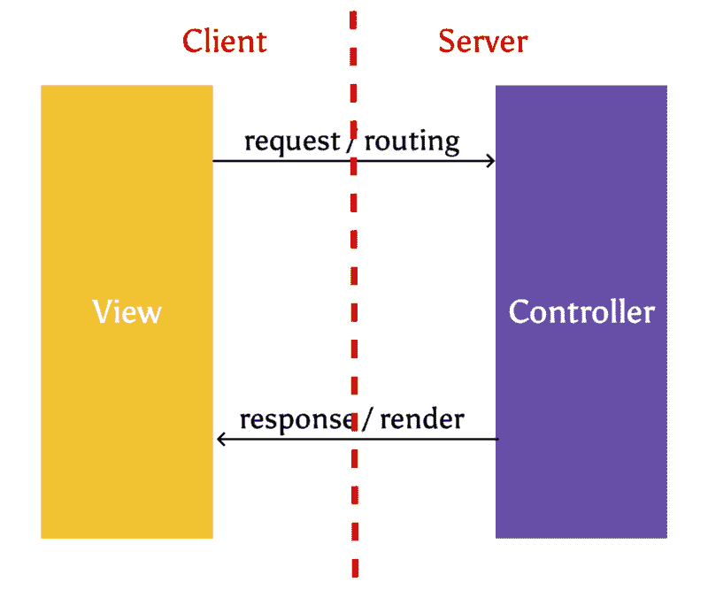
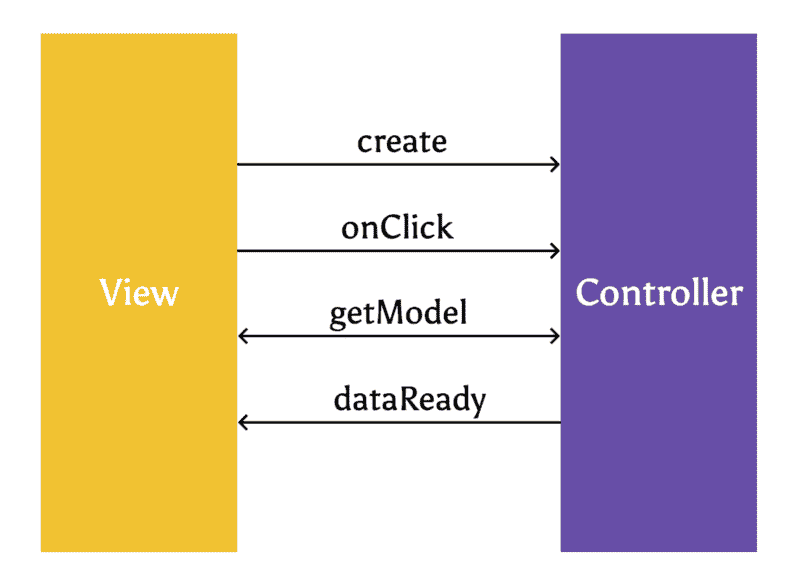
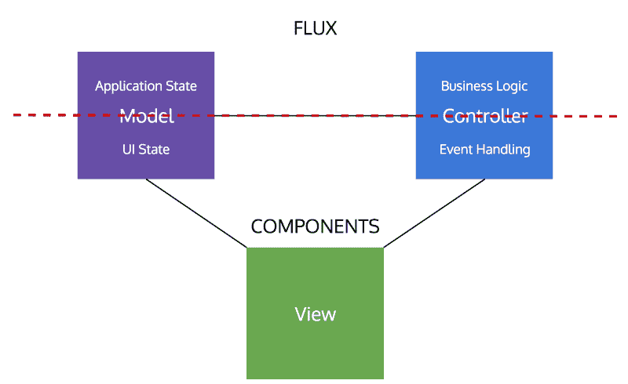

# 模型-视图-控制器死在前端了吗？

> 原文：<https://www.freecodecamp.org/news/is-mvc-dead-for-the-frontend-35b4d1fe39ec/>

越来越多的前端开发者采用[单向架构](http://staltz.com/unidirectional-user-interface-architectures.html)。那么经典的模型-视图-控制器(MVC)方法的未来会是怎样的呢？

为了理解我们是如何走到这一步的，我们先来回顾一下前端架构的演变。

在过去的四年里，我参与了大量的 web 项目，花了大量的时间设计前端，并将框架集成到其中。

在 2010 年之前，**JavaScript**——编程语言 *jQuery* 被用来为传统网站添加 DOM 操作。开发人员似乎不太关心架构本身。像[揭示模块模式](https://toddmotto.com/mastering-the-module-pattern/#revealing-module-pattern)这样的东西足够好来构建我们的代码库。

我们目前对前端和后端架构的讨论是在 2010 年末才开始的。这是开发者开始认真对待单页应用程序概念的时候。这也是像[骨干](http://backbonejs.org/)和[淘汰赛](http://knockoutjs.com/)这样的框架开始流行的时候。

由于这些框架所围绕的许多原则在当时都很新，所以它们的设计者不得不从别处寻找灵感。他们借用了已经为服务器端架构建立的实践。那时，所有流行的服务器端框架都包含了经典的 [MVC](https://en.wikipedia.org/wiki/Model%E2%80%93view%E2%80%93controller) 模型的某种实现(因为它的变体，也被称为 MV* [)。](https://www.quora.com/What-are-the-main-differences-between-MVC-MVP-and-MVVM-design-patterns-for-the-JavaScript-developer)

当 [React.js](https://facebook.github.io/react/) 作为[渲染库](http://stackoverflow.com/questions/148747/what-is-the-difference-between-a-framework-and-a-library#answer-148788)首次推出时，许多开发人员[嘲笑它](https://www.youtube.com/watch?v=x7cQ3mrcKaY)，因为他们认为它在 JavaScript 中处理 HTML 的方式有悖常理。但是他们忽略了 React 带来的最重要的贡献——基于组件的架构。

React 并没有发明组件，但它确实将这种想法向前推进了一步。

当脸书宣传 React 是“MVC 中的 V”时，他们甚至忽略了架构中的这一重大突破

另一方面，在审查了同时使用了 [Angular 1.x 和 React】的代码库后，我仍然会做噩梦。](https://github.com/ngReact/ngReact)

2015 年给我们带来了思维模式的重大转变——从熟悉的 MVC 模式转变为源自 Flux 和函数式反应式编程的**单向架构和数据流**,由像 [Redux](https://github.com/reactjs/redux) 或 [RxJS](https://github.com/Reactive-Extensions/RxJS) 这样的工具支持。

### 那么 MVC 到底哪里出错了呢？

MVC 可能仍然是处理服务器端的最好方法。像 [Rails](http://rubyonrails.org/) 和 [Django](https://www.djangoproject.com/) 这样的框架是一种乐趣。

这些问题源于这样一个事实，即 MVC 在服务器端引入的原则和分离与在客户端引入的并不相同。

#### 控制器-视图耦合

下图显示了视图和控制器在服务器上的交互方式。它们之间只有两个接触点，都跨越了客户机和服务器之间的边界。

Server MVC

当你在客户端转移到 MVC 时，就有问题了。控制器类似于我们所说的“代码隐藏”控制器高度依赖于视图。在大多数框架实现中，它甚至是由视图创建的(例如 Angular 中的 ng-controller 就是这种情况)。

Client MVC

此外，当你想到[单一责任原则](http://www.oodesign.com/single-responsibility-principle.html)时，这显然是违反规则的。在某种程度上，客户端控制器代码同时处理**事件处理**和**业务逻辑**。

#### **胖模特**

考虑一下您在客户端的模型中存储的数据类型。

一方面，你有像*用户*和*产品*这样的数据，它们代表你的**应用状态**。另一方面，你需要存储 **UI 状态—** 的东西，比如 *showTab* 或者 *selectedValue* 。

与控制器类似，该模型打破了单一责任原则，因为你没有单独的方式来管理 **UI 状态**和**应用状态**。

### 那么组件在这个模型中处于什么位置呢？

组件有:**视图** + **事件处理** + **UI 状态**。

下图显示了您实际上是如何分割原始 MVC 模型来获得组件的。线上方留下的正是 **Flux** 试图解决的问题:管理**应用状态**和**业务逻辑**。

随着 React 和**基于组件的架构**的流行，我们看到了用于管理应用程序状态的**单向架构**的兴起。

这两者配合得如此好的原因之一是它们完全涵盖了经典的 MVC 方法。在构建前端架构时，它们还提供了更好的关注点分离。

但这不再是一个反应的故事。如果你看一下 [Angular 2](https://angular.io/) ，你会看到应用了完全相同的模式，尽管你有不同的选项来管理应用状态，比如 [ngrx/store](https://github.com/ngrx/store) 。

MVC 在客户端上真的没有做得更好的了。从一开始就注定要失败。我们只是需要时间来看这个。通过这五年的过程，前端架构演变成了今天的样子。仔细想想，对于最佳实践的出现来说，五年的时间并不算长。

MVC 在一开始是必要的，因为我们的前端应用程序变得越来越大越来越复杂，我们不知道如何构建它们。我认为这达到了它的目的，同时也提供了一个很好的教训，即从一个上下文(服务器)中获取一个好的实践，并将其应用到另一个上下文(客户机)中。

### 那么未来会怎样呢？

我不认为我们的前端应用会很快回到经典的 MVC 架构。

随着越来越多的开发人员开始看到组件和单向架构的优势，焦点将会放在构建更好的工具和库上。

这种架构五年后会是最好的解决方案吗？这种情况很有可能发生，但话又说回来，一切都不确定。

五年前，没有人能预测到我们今天会如何编写应用程序。所以我不认为现在对未来下注是安全的。

差不多就是这样！我希望你喜欢读这篇文章。我欢迎你在下面的反馈。

如果你喜欢这篇文章，点击下面的绿色心脏，我会知道我的努力没有白费。