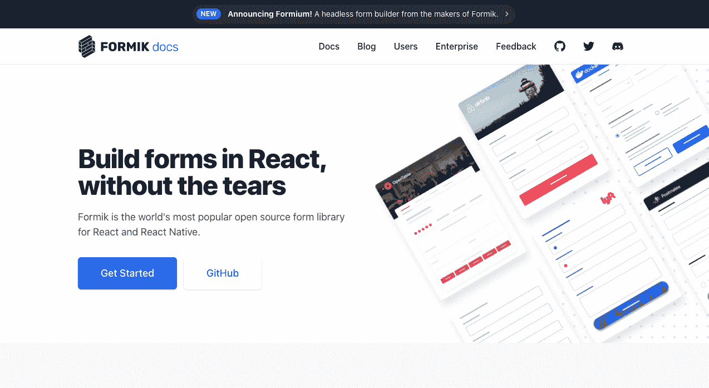
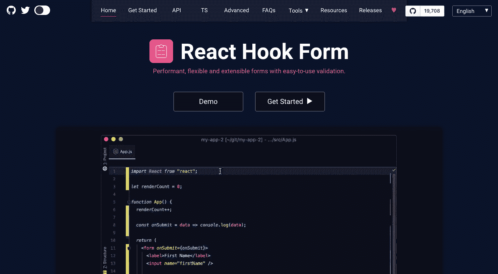

# React 是库还是框架？这就是为什么它很重要

> 原文：<https://www.freecodecamp.org/news/is-react-a-library-or-a-framework/>

开发人员已经花了大量时间讨论 React 是什么。但是他们忽略了为什么这个主题对构建 React 应用程序的人如此重要。

这个问题的答案对于任何 React 开发人员都是至关重要的，不管他们的技能水平如何。这是因为它指出了他们必须知道什么，以及在开发任何 React 应用程序时他们必须如何工作。

无论您是一名新的还是高级的 React 开发人员，我希望在您构建下一个 React 项目时，这份深思熟虑的分析将改进您自己的开发过程。

> 寻找成为受欢迎的 React 开发人员的完整指南？查看 [React 训练营](https://reactbootcamp.com)。

## 为什么 React 是库而不是框架？

React 旨在构建成熟的 web 应用程序。因此，它经常被与开发人员用来构建应用程序的其他工具相比较，如 Angular、Vue 和 Svelte。

React 是用 JavaScript 写的，用来做更好的 JavaScript 应用。我们特别将 React 称为**库**。

但是是什么让 React 成为一个库而不是一个框架呢？

当我们看看用于创建完整 web 应用程序的其他类似工具时，原因就变得很清楚了。

让我们看一个类似 Angular 的项目，它和 React 有着相同的目的(创建单页 web 应用程序)。让它与众不同的是，当你建立一个 Angular 项目时，它几乎包含了你制作一个完整的大规模应用所需的所有东西。

> 许多开发人员喜欢将框架或类似的解决方案称为“包含电池”

框架是公司和任何希望开发企业 JavaScript 应用程序的人的常见选择，因为它们包含了大规模应用程序可能需要的资源。这包括用于常见任务的内置工具，如创建表单、运行自动化测试、发出网络请求等等。

简而言之，创建一个完整的应用程序所需的一切都包含在 Angular 项目中。但 React 的情况并非如此。

## React 基本上是“非个人化的”

虽然流行的工具已经出现，如 Create React App，它允许您在一个命令中创建一个完整的 React 项目，但 React 通常被称为“非 pinionated”。

*对 React 来说，不被个人化意味着什么？*

React 和 React DOM 库为我们提供了使用 JSX 语法构建用户界面的方法，以及通过钩子实现的强大的状态管理工具。

然而，React 本身并不包含大多数项目所需的许多 React 特定的库。相比之下，Angular 和 Vue 包括更多的工具，这些工具都捆绑在核心包中。

许多开发人员认为关于什么是库，什么不是库的讨论是微不足道的。但它对我们的发展进程有着真正的影响。换句话说，因为 React 是一个库而不是一个框架，**成为一名熟练的 React 开发人员需要对第三方 React 库有很好的了解**。

## 因为 React 是一个库，所以您必须自己选择工具

这意味着，为了构建完整的 React 应用程序，您需要自己选择这些包和工具。

下面是我在自己构建 React 应用程序时经常需要做出的一些决定:

对于一个表单库，我必须决定是使用包 React Hook 表单还是 Formik。这两个都是 React 特有的表单库，为我们的表单增加了重要的特性，比如验证。

为了测试我的 React 应用程序，我可能会使用 React 测试库、Jest 或两者的某种组合。

对于发出网络请求，我可能需要在 Fetch API 和 Axios 之间进行选择。我可能还需要决定是否要添加一个额外的库来简化服务器状态的管理，比如 React Query 或 SWR。

## 您选择的工具取决于您的应用程序和对它们的了解

React 是一个库还是一个框架这个问题很重要，因为任何 React 开发人员都必须知道他们的选择是什么，以及在给定他们正在构建的 React 应用程序类型的情况下做出哪个选择。

如果您正在构建一个没有很多表单的应用程序，您可能根本不需要表单库。如果你对 Fetch API 更有信心，你可以在 Axios 上使用它。

这真的不仅取决于应用程序的需求是什么，还取决于你作为开发人员的偏好是什么。这可以说是 React 作为一个库的优势，也是我认为它在新开发人员中非常受欢迎的原因。除了 React 本身之外，它不会将您局限于一种选择或任何特定的库。

作为一名开发人员，你可以自己做决定，总体上你可以有更多的自由。

也就是说，尽管 React 不是一个框架，但这并没有减少它在企业领域的存在。它仍然被用来构建各种复杂而令人印象深刻的应用程序。企业已经开发了很多大规模的 React 应用程序，您可能每天都会用到这些应用程序。

## 你需要跟上新兴图书馆的步伐

如果我们在两年前讨论选择哪个表单库，我可能会选择 Redux Form。至于数据获取库，我不可能提到 React Query 或 SWR，因为直到去年左右，它们才被创建(或没有获得太多的关注)。

因为 React 应用程序通常依赖于第三方库，所以新的库是在旧的基础上改进而来的。单个开发人员和团队过渡到不同的工具来完成工作，整个生态系统也随之改变。

不管喜欢与否，React 作为一个库而不是一个框架，需要一个庞大的、不断变化的其他库的网络，我们必须意识到这一点来构建我们的项目。其中一些可能会失宠，被其他项目取代，或者可能会被弃用，不再作为开源项目得到支持。

简而言之，与 React 是一个框架相比，React 作为一个库可能需要我们更多地关注围绕着 React 发生的事情。

## 希望 React 是一个框架？有很多！

值得注意的是，有些框架是基于 React 的。

虽然 React 本身只是一个库，但近年来出现了许多基于 React 的框架，为开发人员提供了一套更强大的内置工具。这些允许您更快地构建项目，而不需要那么多第三方库。

其中一些最受欢迎的框架包括 Next.js、Gatsby 和 Redwood.js，所有这些都用于创建全面的动态和静态 React 应用程序。

在我看来，这就是框架的巨大优势——在整个开发过程中，您不必做太多的选择。

## 充分利用 React 的灵活性

请注意，展望未来，有一个强大的以 React 为中心的库生态系统，您可以将它添加到 React 项目中，以实现您所期望的一切，从最一般的任务到最具体的任务。

这要归功于 React 的流行和广泛使用。但也要注意，尤其是如果你来自 Angular 或 Vue 这样固执己见的框架，有许多基于 React 的框架可供你依赖和学习，来构建同样功能强大的应用程序。

## 想让主人有什么反应？加入 React 训练营

**[React 训练营](http://bit.ly/join-react-bootcamp)** 将你应该知道的关于学习 React 的一切打包成一个全面的包，包括视频、备忘单，外加特殊奖励。

获得数百名开发人员已经使用的内部信息，以掌握 React、找到他们梦想的工作并掌控他们的未来:

 
*打开时点击此处通知*