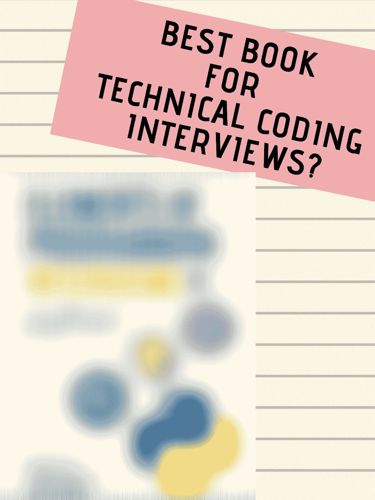
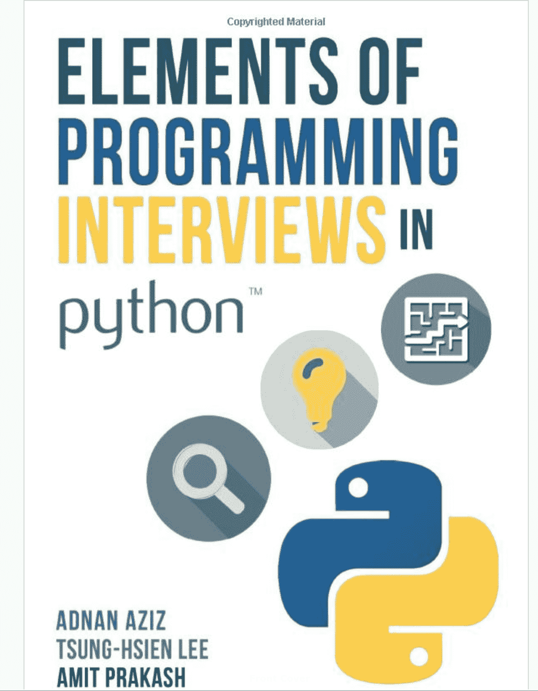
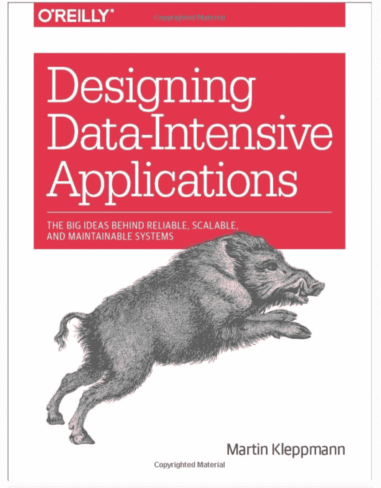

# 技术编码面试准备的最佳书籍

> 原文：<https://www.freecodecamp.org/news/is-this-the-best-book-for-coding-interview-preparation/>

Is this the best book for technical interviews?

技术编码面试是出了名的困难——对于那些没有准备的人来说，几乎就像是边缘测验。浏览所有在线可用的技术编码准备资源有时可能是一项令人生畏的任务，有人可能会问:*有没有哪本书/资源最适合为技术编码面试做准备？*

*最佳*，在这种情况下当然是相对的。如果你在寻找一本书，教你如何解决任何编码问题，指导你如何设计像 Instagram 这样的可以扩展到 10 亿用户的东西，并在你使用它的时候制作你的三明治，那么这本书肯定不是它。

但是为了提高你的技术水平，确保你在面试中准备好面对编程挑战，这本书非常接近。

在今天的书评中，我回顾了亚马逊上最畅销的书籍之一的技术编码访谈的*细节***好的**和**坏的**:[编程访谈的元素](https://amzn.to/2Q6m9xB)(又名 *EPI* ，在本文的其余部分也将如此提及)。

Elements of Programming Interviews

## 这本书是关于什么的？

EPI 是一本专注于准备技术软件工程面试问题的书，这些问题在科技公司很常见。如果你想找一份软件工程师的工作，这本书会对你有所帮助。

EPI 是由三位在世界上一些最著名的科技公司工作过的人编写的，如脸书、谷歌、优步和微软。作者有很强的技术背景，这一点从本书内容对技术的关注中可以看出。

这本书本身在本质上是高度技术性的，并深入到基础计算机科学。从字符串操作到图形遍历，技术编码问题的类型变化很大。这本书还提供了解决特定类型的编码问题的具体提示和技巧，并包括一个备忘单来帮助 ace 解决技术问题。

## 好人

简而言之:EPI 是一本技术性很强的书，非常适合准备围绕数据结构和算法的技术编码问题的人。

我特别喜欢的事情:

*   有许多问题(300 多)和详细的答案，相比之下，另一本受欢迎的书(破解编码采访)只有 170 多
*   有 3 个不同的版本:Java、Python 和 C++。适合想要使用自己选择的语言的人
*   有一个很棒的备忘单(第 4 章),总结了你需要的所有技术和数据结构
*   以简单易懂的格式详细介绍了您需要的每一个数据结构、您应该知道的算法和技术
*   涵盖了您在编码面试中可能会被问到的相关技术主题，比如什么是 TCP/IP，互联网如何工作，以及如何在模式设计中捕捉不同实体之间的关系

这些是我喜欢这本书的一些顶级要点。我真正喜欢的是这些答案非常、*非常*有条理。

答案通常采用暴力/简单的方法来解决问题。作者随后提供了如何改进暴力方法的具体例子。在每次迭代中，作者都会指出限制在哪里，以及如何通过增量优化来解决它们。

例如，EPI 解释了如何检测链表中的循环。第一种方法:使用哈希映射来存储您遍历的每个节点，然后对照哈希映射检查您是否见过它。这样做是可行的，尽管需要额外的空间(所谓的 O(N)空间复杂度和 O(N)时间复杂度)。

这本书然后指出，额外的空间是不需要的，并建议检测链表中的循环可以在没有额外空间的情况下通过操纵指针来完成。

它在解释几乎所有问题时都采用了相同的方法，因此每个人都可以理解如何从一个粗略的解决方案到一个优化的解决方案。

对于一个生疏的人来说，EPI 做得很好——每章都以你将学习的数据结构或算法的摘要开始，为什么数据结构是特殊的，所说的数据结构的优点/缺点是什么，以及你需要注意什么。

简而言之，EPI 是我在准备技术面试时希望拥有的笔记本。我会把这本书给一个想要准备技术面试的朋友——除了我最畅销的[面试课程](https://docs.google.com/document/d/1ppHix7p9knzaal-Edn3GHQMcx1MM_USY6zPcsbBpR3U/edit)(应对技术面试)，它为任何候选人准备了整个面试经历，从简历准备、行为问题到如何创造性地解决编码问题。课程很快就会满员，所以今天就在这里预订您的位置[。](https://zhiachong.com/courses/)

## 坏事

EPI 也有它的缺点。作为一本技术性很强的书，这意味着这本书的重点是编码问题。

无意中，这意味着这本书在技术面试过程的其他方面有所欠缺，这些方面可以说是同样重要的——提供谈判，如何写一份有说服力的简历，当你得到一份工作时该怎么做，如何处理行为问题等。

此外，这本书深入讨论了数据结构和算法的细节，但只是提供了一个高层次的概述，由于缺乏上下文而令人困惑，还有各种其他重要的概念，如 SQL、NoSQL、如何为简单的应用程序设计合适的模式等等。

这本书通过解释如何构造表来捕获实体关系，在一定程度上涵盖了 SQL 设计，但它没有解释更多关于连接或如何正确查询表的内容。我认为理解*什么* (SQL 表)和*如何*(查询)一样重要。

EPI 也有一章是关于系统设计的，但是这一章不包括分布式设计。如果这本书更详细地描述了什么是分布式系统或者在哪里可以找到更多关于分布式系统的信息，我会更喜欢。

## 这是一本适合我的好书吗？

如果你有 40 美元的闲钱和学习的兴趣，我会这么说。

这本书平均售价 36 美元(有 3 个版本)。这本书在 Amazon.com 上的评价很高，所有 3 个版本的平均评分为 4.53 星。统计数据如下:

在[Amazon.com](https://amzn.to/2Q6m9xB)上:

Versions of EPI on Amazon.com

3 个版本(截至 3 月 12 日):

*   Python: 169 评级 4.3 平均
*   Java: 203 评级平均 4.6
*   C++: 436 级平均 4.7 级

总共有 808 篇评论。

一些评论:

> "..我用过的最好的算法/数据结构”

> 代码质量很高，使用了有意义的变量名

> “这是一本必读的书”

### 现在，你应该买吗？

我认为 EPI 是准备技术编码面试的最佳资源之一，无一例外。不管你的经验水平如何，总有适合你的东西。我特别喜欢阅读这本书，因为它的解释简明扼要，我在编程课程中也把这本书作为参考。

如果你想在一本简单易读的书中了解所有的数据结构和算法，EPI 就是你要的书。

Designing Data Intensive Applications

对于分布式系统设计，我建议去别处看看。一个良好的开端是[设计数据密集型应用](https://amzn.to/2Q6m9xB)。

我喜欢它的深度和洞察力，我也把它推荐给许多正在学习我的课程的学生。

### 我推荐的资源

[设计数据密集型应用](https://amzn.to/33fcvOp) —学习分布式系统和大规模系统如何工作的绝佳资源。

应对技术面试——我最畅销的关于如何应对技术面试的个人教练课程。我们涵盖简历审查，技术编码面试，行为问题等等。

[参加分布式系统设计面试](https://docs.google.com/document/d/1PeK69h4H82rwKjhactiE_sAIorCcZgXgXTY7k-nXpnE/edit#heading=h.hs0b333nsxch)——我设计大型分布式系统的个人辅导课程。了解如何设计 Instagram Stories、Groupon 和网飞等电影流媒体网站。