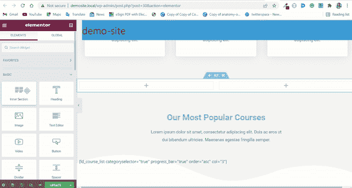
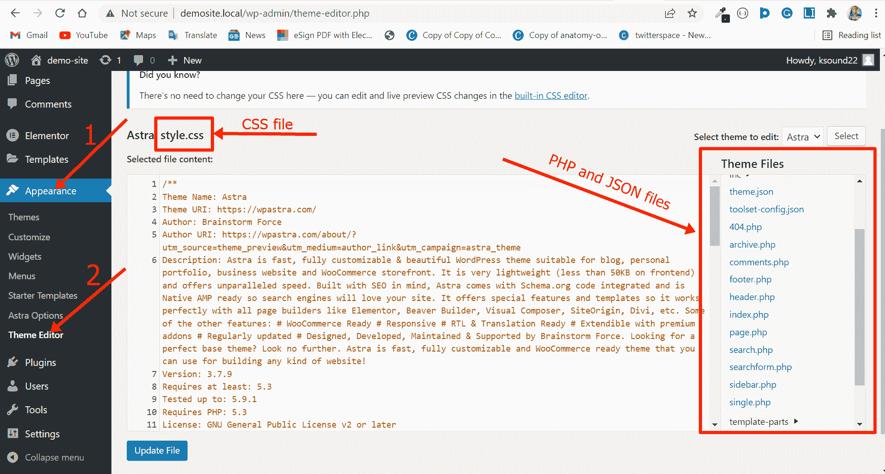
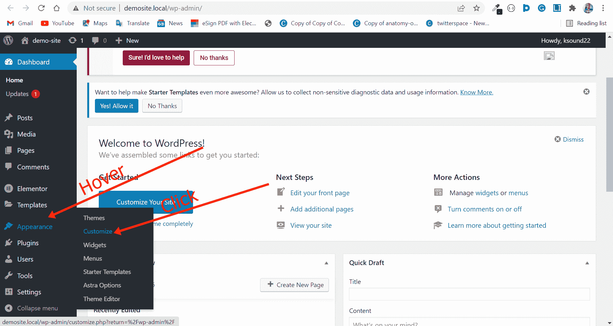
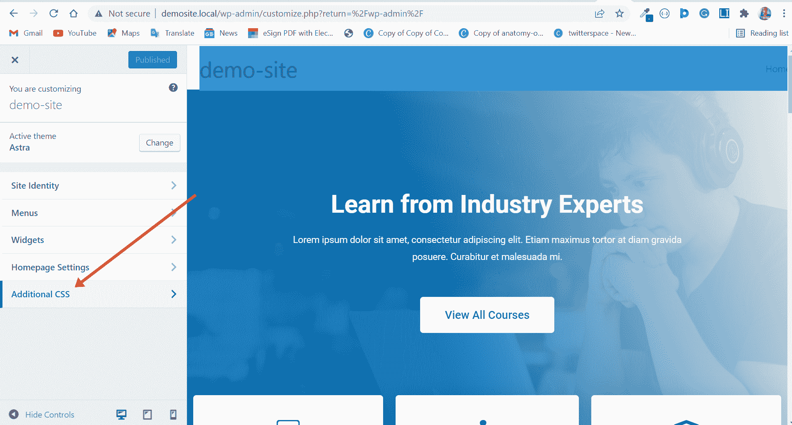
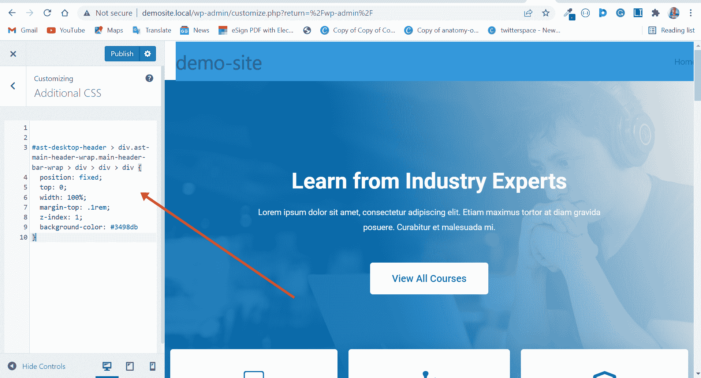
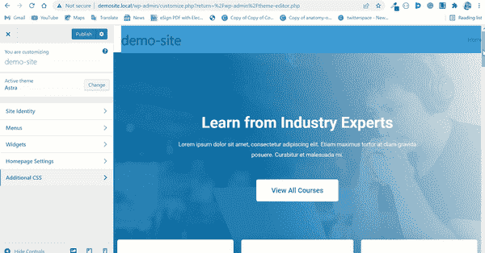
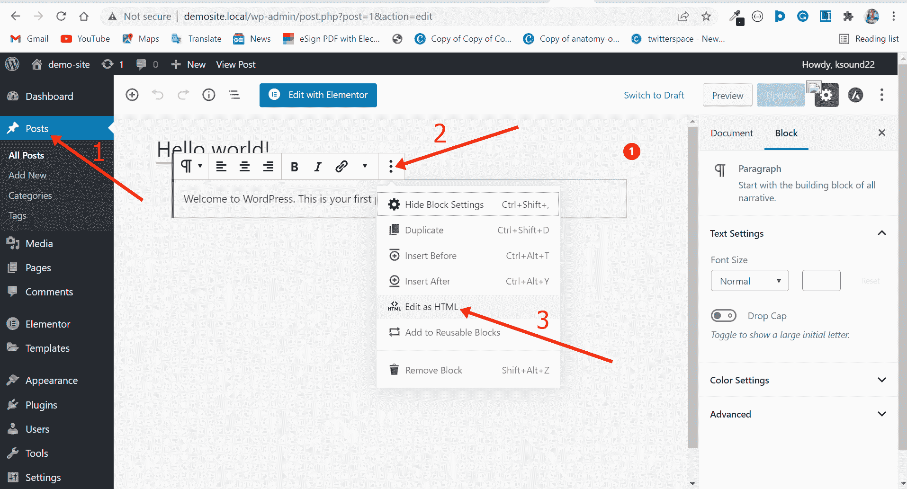
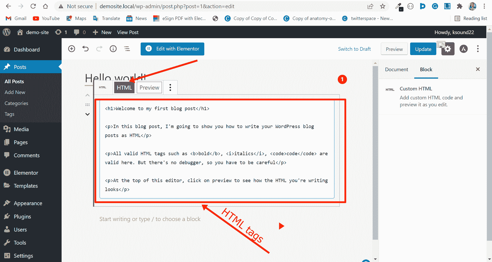
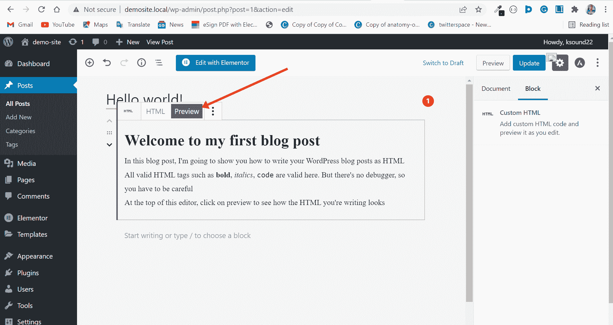

# WordPress 是代码工具还是无代码工具？

> 原文：<https://www.freecodecamp.org/news/is-wordpress-a-code-or-no-code-tool/>

WordPress 是一个开源内容管理系统(CMS ),用于构建任何类型的网站——电子商务网站、作品集、论坛等等。

WordPress 最初是一个简单的创建博客的平台，但是今天 WordPress 为全球超过 43%的网站提供支持，并且这个数字还在继续增长。

WordPress 如此受欢迎的一个显著原因是，很少或没有编码知识的人可以用它来制作网站。你可以用数以千计的可用插件和主题来添加许多功能。这就是 WordPress 被广泛称为无代码工具的原因。

尽管 WordPress 是一个没有代码的工具，但是很多专业人士和自由职业者都以它为生，因为他们可以编写代码。

所以，你可能知道 WordPress 是一个无代码工具——但是有些人从它身上赚了很多钱，因为他们可以编码。这意味着 WordPress 既是一个代码工具，也是一个非代码工具。

在这篇文章中，你将了解为什么 WordPress 既是一个代码工具又是一个非代码工具。我还将向你展示如何在你的 WordPress 网站上添加 HTML 和 CSS 代码。

我将创建一个演示 WordPress 网站与一个名为 LocalWP 的软件包。可以从官网下载。

## 文章的大纲

*   [为什么 WordPress 是一个无代码工具](#whywordpressisanocodetool)
*   [为什么 WordPress 是一个代码工具](#whywordpressisacodetool)
    *   [如何给你的 WordPress 网站添加自定义 CSS](#howtoaddcustomcsstoyourwordpresswebsite)
    *   [如何在博客文章中添加 HTML 代码](#howtoaddhtmlcodetoyourblogposts)
*   [最终想法](#finalthoughts)

## 为什么 WordPress 是一个无代码工具

如果你不知道如何编码，你仍然可以用 WordPress 用一个像[element 或](https://elementor.com/)这样的拖放页面生成器来制作网站。然后你可以用插件增加功能，优化你的网站速度，并备份。

Elementor 是 WordPress 的一个流行的拖放页面生成器。您可以使用它来定制您的设计和布局。


你可以用 Elementor 的免费版本做很多事情，但是如果你想从中获得更多，你至少应该购买最便宜的版本，然后用它来练习。这将有助于你成为一个更好的 WordPress 设计者和开发者。

WordPress 网站的一个常见问题是加载速度慢。如果你用 Elementor 建立了你的 WordPress 网站，那么 [Clio 网站](https://cliowebsites.com/)的 Nat Miletic[有一篇关于如何加速你的 Elementor 网站](https://cliowebsites.com/does-elementor-slow-down-your-site/)的博文。

除了 Elementor，其他值得注意的拖放页面生成器还有 [Divi](https://www.elegantthemes.com/gallery/divi/) 和 [Beaver builder](https://www.wpbeaverbuilder.com/)

既然这些拖放页面生成器帮助你建立 WordPress 网站，你如何添加功能，如电子商务、论坛、联系方式等等？大量可用的插件使得添加任何你想要的功能成为可能。

这些插件的例子包括用于添加电子商务功能的 [WooCommerce](https://woocommerce.com/) 、用于联系人表单的 [WP 表单](https://wpforms.com/)、用于创建工作板的 [WP 作业管理器](https://wordpress.org/plugins/wp-job-manager/)、用于添加学习平台功能的 [Learn Dash](https://www.learndash.com/) 等等。

你总能找到你想要的任何功能的插件！

除了插件，WordPress 还有一堆不同的主题来帮助你决定你想要的 WordPress 网站的外观。它们还让您能够添加定制设计。

你真的可以不用写一行代码就可以用 WordPress 做很多事情。这就是为什么 WordPress 可以被认为是一个无代码工具。

## 为什么 WordPress 是一个代码工具

开箱即用，WordPress 开发者可以用插件和主题为你的 WordPress 网站做很多事情。但是在某种程度上，如果你想添加自定义功能并在已经完成的插件和主题的基础上构建，你可能想尝试一些编码。

如果你对插件和主题开发感兴趣，你需要在 WordPress 中添加一些代码，添加定制的 CSS 来改进设计，以及添加定制的小部件。

比如你想做一个 WordPress 主题，你需要熟悉 HTML，CSS，PHP，因为你需要在`index.php`和`styles.css`中创建至少 2 个文件。

您的`index.php`文件包含一些混合在 PHP 代码中的 HTML，而您的 CSS 文件包含使主题看起来更好的样式。

如果你现在查看你的 WordPress 网站的主题，你肯定会看到一些 PHP 和 CSS 文件


不过，你可能不应该编辑这些文件，除非你知道你在做什么。

但是如果你对你的基本网络开发技能有信心，这里有一些你可以定制你的 WordPress 站点的方法。

### 如何给你的 WordPress 网站添加自定义 CSS

正如我之前指出的，在你的主题中添加自定义 CSS 是 WordPress 作为代码工具擅长的一个领域。

要添加自定义 CSS 到你的 WordPress 网站，请遵循以下步骤:

从管理端将鼠标悬停在外观上，选择定制:


选择附加 CSS:


添加所需的 CSS 代码:


我添加到演示站点的 CSS 使导航条变得有粘性:

```
#ast-desktop-header > div.ast-main-header-wrap.main-header-bar-wrap > div > div > div {
        position: fixed;
        top: 0;
        width: 100%;
        margin-top: .1rem;
        z-index: 1;
        background-color: #3498db 
} 
```



顺便说一下，这就是你如何在 Astra 主题中用代码使 navbar 具有粘性。

### 如何在博客文章中添加 HTML 代码

除了插件、主题、定制 CSS 和定制小部件，你还可以用 HTML 写博客文章，非常有创意。

如果你想用 HTML 写博客，下面的截图会告诉你怎么做:







## 最后的想法

毫无疑问，WordPress 作为代码和非代码工具都很出色。

如果你想专门用 WordPress 创建网站，你不需要会写代码，因为你可以用 WordPress 的无代码部分做很多事情。

在学习一些 HTML、CSS 和 JavaScript 之前，我个人开始用 WordPress 的无代码部分建立网站。

但是如果你想深入创建 WordPress 插件和主题，并解决复杂的问题，你需要能够编写一些 HTML、CSS、JavaScript 和 PHP 代码。

如果你对学习 HTML、CSS 和 JavaScript 编程感兴趣，你应该[看看今天的免费代码营课程](https://www.freecodecamp.org/learn/)。

如果你想学习 PHP，[这个来自 freeCodeCamp YouTube 频道的视频课程](https://www.youtube.com/watch?v=OK_JCtrrv-c)将帮助你发展基本的 PHP 技能。

如果你觉得这篇文章有帮助，不要犹豫，与你的朋友和家人分享。