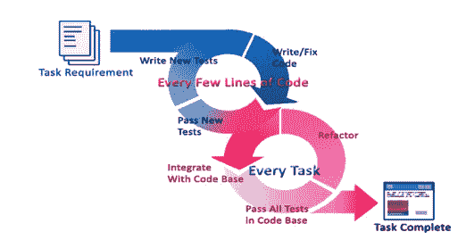
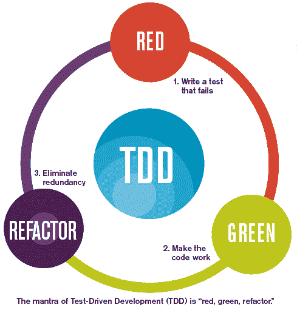
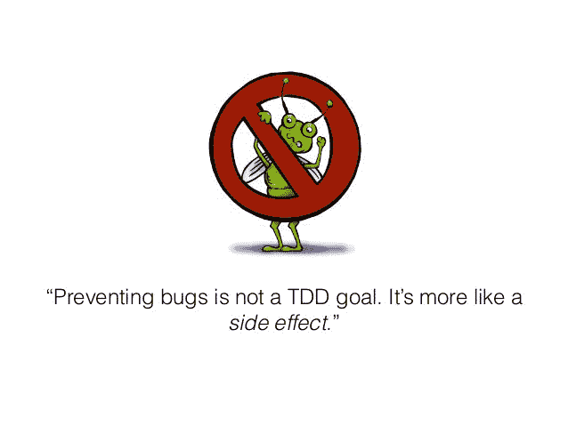
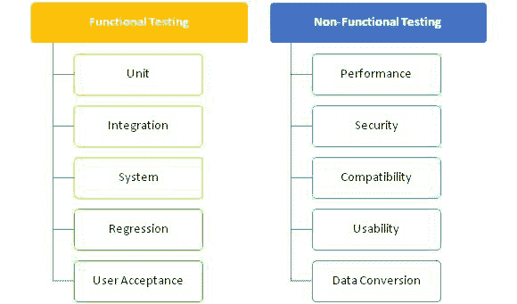
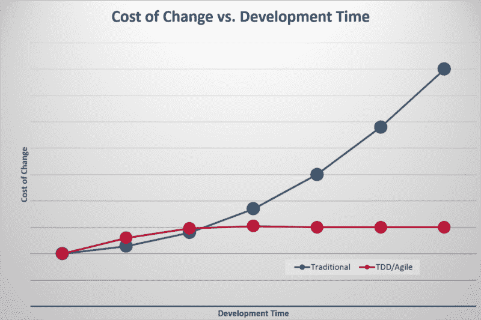

# 测试驱动的开发可能看起来像两倍的工作——但是无论如何你都应该去做

> 原文：<https://www.freecodecamp.org/news/isnt-tdd-test-driven-development-twice-the-work-why-should-you-care-4ddcabeb3df9/>

作者纳夫迪普·辛格

# 测试驱动的开发可能看起来像两倍的工作——但是无论如何你都应该去做

TDD: Red — Green — Refractor

测试驱动开发(TDD)不是事半功倍吗？你应该做吗？

第一个问题的简短回答是**否**。从表面上看，似乎没有 TDD，创建特性只需要时间。使用 TDD，您需要时间来创建测试和特性，因此需要双倍的开发时间。

您没有考虑的是当特性不能正常运行时，QA 测试和调试所需的时间。

> 案例研究是在微软的三个开发团队和 IBM 的一个团队中进行的，他们采用了 TDD。案例研究的结果表明，相对于没有使用 TDD 实践的类似项目，四个产品的预发布缺陷密度减少了 40%到 90%。

> 主观上，在采用 TDD 之后，团队经历了 15–35%的初始开发时间增长。([来源](https://www.microsoft.com/en-us/research/wp-content/uploads/2009/10/Realizing-Quality-Improvement-Through-Test-Driven-Development-Results-and-Experiences-of-Four-Industrial-Teams-nagappan_tdd.pdf))

预发布缺陷减少 40–90%意味着 QA 团队和客户没有发现和报告这些问题。工程部门并没有试图重现 bug 和开发补丁，所有这些都有相关的成本。

Number of Iterations per task

当讨论 TDD 时，我们认为任务是需求的子集，可以在几天或更短的时间内实现。TDD 软件工程师通过快速迭代开发生产代码，如上图所示。

### 什么是 TDD？

测试驱动开发是一种编写软件的方法，在这种方法中，开发人员使用规范来塑造他们实现功能的方式。简而言之，我们将其描述为“红绿重构循环”。

在编写任何向应用程序添加新功能的代码之前，开发人员首先编写一个自动化测试，描述新代码应该如何运行，并观察它变红(未通过)。然后他们按照规范编写代码，测试变成绿色(通过)。最后，开发人员花一点时间来确保刚刚写的代码尽可能的干净(重构)。

### 为什么您应该关注 TDD

自动化测试让您的软件开发人员有信心对软件进行更改，并知道没有错误作为副产品被创建。

此外，它允许不熟悉软件细节的开发人员更加灵活地修改源代码，而不会引入错误。

让我们讨论一下 TDD 的一些真正酷的优点。

#### 1.TDD 帮助你防止错误

首先，测试套件确保了对代码库的全面测试覆盖，因此错误不太可能被忽视。其次，测试套件允许开发人员在应用程序准备投入生产之前解决潜在的问题。最后，因为测试套件是不断维护的，所以它们保证了软件质量。

#### 2.自我解释的代码(文档齐全)

因为重构代码是 TDD 中的一个内置步骤，所以您最终会得到一个更加整洁的代码库。用 TDD 构建的应用程序往往有更少的重复，更少的没有考虑周全的边缘情况，以及更好的整体架构。

该测试作为将要编写的代码应该**做什么**的规范。只要你在写好的故事，你的开发团队就应该能够构建出你所要求的东西。如果你的团队同意使用[验收测试驱动开发](https://en.wikipedia.org/wiki/Test-driven_development#TDD_and_ATDD)，你甚至可以用简单的英语编写测试来描述你希望它如何工作！

#### 3.避免 bugger 调试器问题

通常，当谈论软件开发的技术时，有两种主要类型的测试可以集成:功能性的和非功能性的。正如您在这里看到的，这两种类型的测试实践被进一步分为许多类型的测试技术:

And the list goes on

在项目开始之前制定测试计划变得非常重要，因为这有助于清晰地定义测试时开发人员相对于测试人员的角色和职责。

例如:

*   在将构建分发给测试人员之前，由开发人员执行单元和集成测试
*   由测试人员执行的用户验收测试
*   性能测试和 UI 测试应该由两者共同完成

下面是对上图中一些非常重要的测试方法的简要描述，这些方法应该包含在几乎每个测试计划中。

**单元测试**包括测试源代码的单个单元，以确定它们是否适合使用。直观上，人们可以把一个单元看作是应用程序的最小可测试部分。 [**作伪、嘲讽、存根**](https://www.martinfowler.com/articles/mocksArentStubs.html) **在为有 API 交互*的代码编写单元测试时是必不可少的。***

**集成测试**涉及两个或更多被测试“单元”的组合。集成测试验证软件的所有组件一起工作或适当地“集成”。

**性能测试**用于确保软件应用程序在其预期工作负载下运行良好。软件系统支持的特性和功能并不是唯一的关注点。一个软件应用的性能，像它的**响应时间、可靠性、资源使用、**和**可伸缩性**，都很重要**。**性能测试的目标不是发现 bug，而是消除性能瓶颈。

#### 4.你可以预测麻烦

A solid TDD approach alarms you about troubles upfront

一个全面的测试套件的好处是，它可以在早期提醒您变化。例如，如果您的结账流程停止向用户的信用卡收费，您会马上知道，因为测试会失败。这也意味着，如果有人犯了一个错误，事情没有按照预期的方式进行，这将是显而易见的。

这很好，因为它会给你一个机会在投入生产之前修复它。如果将来有必要的话，你甚至可以开始一场深度重构的运动，而不用担心，因为你将拥有一个永不过时的测试套件。

#### 5.省钱

当代码变得复杂时，完成任何事情都变得更加困难——这里的一个小变化可能会导致那里的一个大问题。当遵循 TDD 时，开发人员可以满怀信心地进行更改，您的 QA 团队将会发现更少的回归。用发展的话说，**“节省的时间等于赚的钱。”**

#### 6.将节省下来的时间投资于创新和研究

Spend the saved time in innovation

如果我们只是采用 TDD 方法，这笔钱的大部分(如第 5 点所述节省的时间)可以用于新的创新。

#### **7。TDD 帮助你避免范围蔓延**

任何项目经理的噩梦都是范围蔓延——工作范围的任何意外增长都会导致项目交付的延迟。

范围蔓延可能由于各种原因而发生:定义不良的任务、对项目需求的误解、缺少文档等等。有许多方法旨在减轻范围蔓延，TDD 是其中之一。

感谢阅读！如果你觉得有用，请分享:)