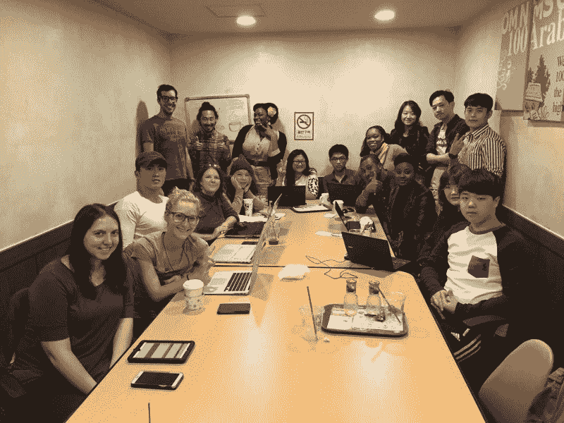

# 不是你，是我:为什么我要和教英语分手，成为一个完整的堆栈…

> 原文：<https://www.freecodecamp.org/news/it-s-not-you-it-s-me-why-i-m-breaking-up-with-teaching-english-and-becoming-a-full-stack-7909b84df0dd/>

作者斯蒂芬·马约

# 不是你，是我:为什么我要放弃英语教学，成为一名全栈开发者

等等——这听起来像是一封分手信。这是分手信吗？

是的，它是。

我将告别英语教学，开始我激动人心的软件工程师新职业。这封分手信是我成为全栈 JavaScript 开发人员之旅的许多帖子中的第一篇，接下来的帖子的主题将是记录我在这一旅程中的进步和犯的错误。你也可以期待读到我正在做的项目以及我正在学习的所有很酷的东西。

但是现在是时候让我澄清事实，向英语世界宣布我已经准备好和平解决了。七年来，我一直将英语作为第二语言进行教学，为学习者创造内容，并建立了一个由教师/嘻哈爱好者组成的令人惊叹的在线社区，现在我终于要向 ESL 世界说再见了。

Hip-Hop as a Second Language at the University of California Davis Extension

你们真的很棒。我周游了世界，遇到了许多了不起的人，我永远不会忘记他们。但不幸的是，我有一些严重的学生贷款账单要付，在这方面，教学不再能解决问题。在过去的一年里，我一直在寻找一份新的、收入更高的、具备以下品质的职业:

*   解决实际问题的激发智力的任务，
*   独立工作和作为团队一员的能力，
*   一些不一定需要我回到学校的事情，还有
*   一份我可以在一年内慢慢适应的工作

我非常喜欢为我的教学努力制作网站和博客，而且我没花多长时间就把这些碎片拼凑起来了。

> 我将永远不再教书，冒着风险全职制作应用程序和网站！

### 所以你和教书的工作永远结束了？

嗯，还没有。

我将在韩国教英语，直到 2016 年 9 月。与此同时，我会挤出每一秒空闲时间来学习和练习 JavaScript。我很幸运目前有一个要求不高的教学职位，我每周平均有 20-30 小时的学习时间。

再次成为学生的感觉真好！

在过去的四个月里，我一直在通过网站如[自由代码营](http://freecodecamp.com)、[代码学院](http://codecademy.com)和[代码学校](http://codeschool.com)如饥似渴地自学 HTML、CSS 和 JavaScript。我已经开始跑步了，从那以后就一直不停地冲刺。

这些网站中我最喜欢的是自由代码营，我刚刚在他们的前端开发项目中获得了[认证。为了完成自由代码营的全栈开发认证，我需要应对一些重大挑战，但是当我完成所有这些挑战时，我将获得足够的技能来参加工作面试。](http://www.freecodecamp.com/stephenmayeux/front-end-certification)

Free Code Camp Busan

“学习代码”运动已经让我接触到了一些了不起的人。他们中的大多数人都是我在釜山组织的[网络发展会议](https://www.facebook.com/groups/free.code.camp.busan/)的常客，这里是橡胶与道路相遇的地方。自由代码营鼓励结对编程，这是一种两个能力大致相同的人一起解决算法问题和编写项目的实践。

> 我自己已经开始理解 JavaScript 的基本原理，但是当我和另一个人一起工作并且必须解释事情时，那么真正的“神奇”和“啊哈！”时刻会发生。

所以也许我还没有完全结束教学。

### 那么下一步是什么？

我作为一名 ESL 教师的旧生活中的一些东西将保持不变，不会消失。例如， [ESL Hip Hop](http://eslhiphop.com) 将永远在线，这样老师就可以给他们的课堂带来新的优势。我可能没有时间像以前一样贡献新的课程，但有 100 多个帖子和视频都为教师和学生准备好了。

虽然我的网上教学业务是短暂的，但我会继续维持这个网站，但主要是展示我在 T2 的网络开发组合 T3。在科技行业，大多数雇主关心的是你能做什么，而不是你在哪里上过学。如果你也像我一样转行从事编码工作，那么今天就开始建立一个作品集页面，不要忘记 **git commit** 和 **git push** ！

我也不会放弃我的推特账户。我还是[@ eshiphop](https://twitter.com/ESLhiphop)。