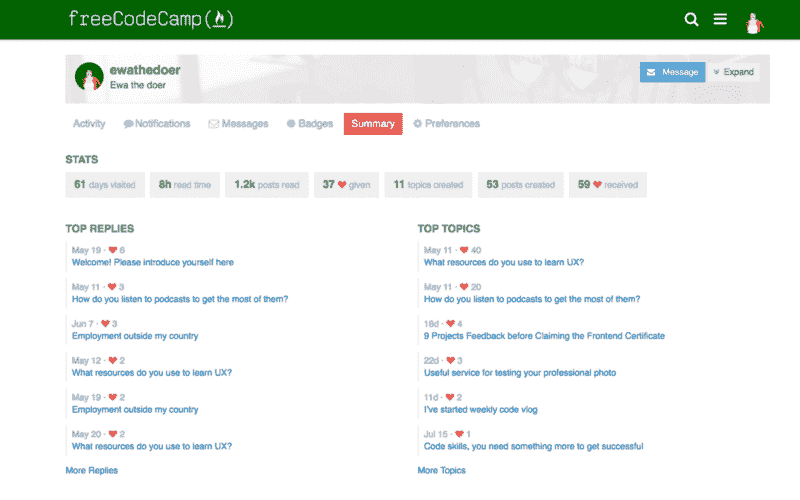
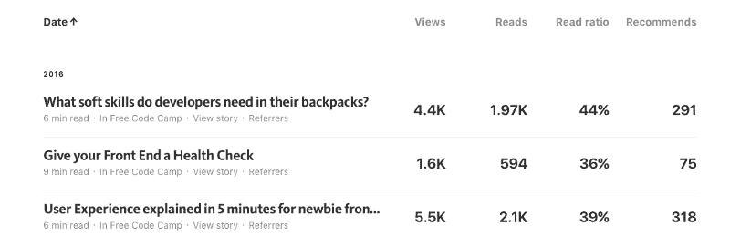

# 需要一个村庄来培养一个编码员

> 原文：<https://www.freecodecamp.org/news/it-takes-a-village-to-raise-a-coder-209b4e1d00f0/>

埃娃·米切卡什卡

# 需要一个村庄来培养一个编码员

> “养育一个孩子需要一个村子。”—斯瓦希里谚语

> 本文还有[中文](http://www.luxingyun.xyz/archives/265)版本。

在我加入自由代码营的六个月里，我…

*   建成 10 个[项目](http://theonewhodo.es/portfolio/)
*   设计了 6 支码笔[笔](http://codepen.io/thedoer/)
*   建了 4 个 GitHub [repos](https://github.com/ewathedoer) (和 6 个 [gists](https://gist.github.com/ewathedoer) ！)
*   赢得 454 个[印象分](https://www.freecodecamp.com/ewathedoer)
*   写了 3 篇[中等文章](https://medium.freecodecamp.com/@thedoer)
*   录了一段[学习编码 vlog](https://www.youtube.com/user/theonewhodoesPoland)
*   花了几周时间研究算法脚本部分
*   从编码中抽出两周时间
*   参加了 [2016 年新编码器调查](https://medium.freecodecamp.com/we-asked-15-000-people-who-they-are-and-how-theyre-learning-to-code-4104e29b2781#.79a09xvaa)
*   成立了[本地免费代码阵营](https://www.facebook.com/groups/free.code.camp.malaga/)
*   组织了一次[当地咖啡和代码活动](https://www.facebook.com/events/1707545496161725/)
*   参加了四次[科技](https://www.meetup.com/Malaga-Ideathons/events/229406164/)T2【见面会
*   喝了 148 杯咖啡
*   释放大量的情感
*   并且获得了我的前端开发证书！

当我踏上旅程时，我知道学习编码将是一个漫长而深思熟虑的过程。我一步一步地进步， *poco a poco* ， *po ciut ciut。*

起初，我通过学习简短的教程来保持自己的舒适区。我学到了一些东西，但仍然不清楚我应该如何运用这些新知识。

所以我鼓起信心，决定开始建造。

这才是我真正开始学习的时候。当我开始设计和实现真正的项目时，从那些教程中学到的东西突然变得更加有形。

最初的几个项目是带有简单动画的基本静态网页。

然后我尝试了一个更加雄心勃勃的项目，使用了 T2 聚合物。这是我第一次真正挣扎，因为我还不知道如何调整 Javascript。只有在朋友们的帮助下，我才能够完成这项工作，他们耐心地与我结对编程。

这一刻，我意识到我已经到达了一个高原。我能够使用 HTML，并使用我的设计敏感度和 CSS 技能来使网站看起来很漂亮。但是如果我想更进一步，我需要学习 JavaScript。

第二天，我去跑步，听了 CodeNewbie 播客。这是萨隆采访昆西·拉森关于自由代码营的那一集。

这是我第一次听说自由代码营。它立刻引起了我的注意，因为它不同于我尝试过的所有其他资源，因为它是一个社区。另外，它是免费的。

我跑步回家后，立即报名参加了免费代码营。我决定一字不差地遵循他们的挑战地图，假设——当学习编码时——他们比我更清楚。

根据挑战图，完成获得前端开发证书所需的所有编码挑战和项目大约需要 478 小时。根据我的计算，我比这多花了 33%的时间。

尽管我每天花四到八个小时应对这些挑战，但我觉得没有必要着急。在进入下一个概念之前，我不紧不慢地试图理解每个概念。

当我真的陷入困境时，我可以在自由代码营的聊天室里寻求帮助，通过我的本地前端会议小组和我认识的程序员面对面交流。这需要额外的努力，但这是值得的。

作为一个代码新手，[栈溢出](https://stackoverflow.com/)可能是一个相当不可原谅的地方，所以我在那里的存在是被动的。我阅读其他人问题的答案，试图理解事情是如何运作的。但是我不敢问自己的问题。

所以当自由代码营开始建立自己的论坛时，我很兴奋。我在那里得到的回应通常是迅速而周到的。

My forum account stats

每当我通过自由代码营的挑战，我总是保持聊天室开放。我是 [CodeReview](https://gitter.im/FreeCodeCamp/CodeReview) 和 [HelpFrontEnd](https://gitter.im/FreeCodeCamp/helpfrontend) 房间的常客。

你通过教别人学到的最多。这就是为什么——在我的知识范围内——我总是试图回答其他露营者的问题。

我还开始使用我所属的 Reddit、Slack 和脸书科技集团，以便对我的项目获得更多建设性的批评。我爱上了根据反馈对项目进行迭代的过程。

随着时间的推移，我学会了如何区分需要好好睡一觉的反馈和需要立即解决的问题。

从三月份开始，我也开始在技术上发表更多的文章。我将这些提交给了自由代码营的媒体出版物——该出版物发表了开发人员、设计人员和数据科学家的文章——包括一些营员的文章。

我能够把我的想法传达给成千上万的人——他们中的许多人在评论区给出了反馈。

Statistics on three of my articles that were published in Free Code Camp’s Medium publication

当我开始着手我的[西蒙游戏](http://theonewhodo.es/simon-game/)(前端开发证书所需的最终项目)时，我知道这将是艰难的，所以我用视频分享了我的学习过程。

这启发了我开始每周一次的关于一些代码问题和我学习代码之旅的 vlog。我已经有了几个订户和一堆有用的反馈。

教别人帮助我巩固知识。把自己放在公众的视野中，迫使我把缺乏自信放在一边，充分利用我手头的技能。

它还帮助我更好地表达和讲故事——这两项技能在与客户打交道时至关重要。

过去的六个月向我展示了在支持我的社区中学习编程的力量。我渴望回报，而不仅仅是通过为非营利组织无偿编码。

我已经决定，在我开始我的免费代码营数据可视化证书之前，我想通过帮助其他营员获得 500 个[印象分](https://github.com/FreeCodeCamp/FreeCodeCamp/wiki/Brownie-Points)。这是我表达感谢和转发的方式。

这仅仅是我成为一名优秀开发人员的开始。但这是一个重要的里程碑。

许多露营者问他们是否应该在获得第一个证书后开始申请工作。

我个人还没有在找全职工作。我是一些小项目的自由职业者。这让我可以随时随地灵活地工作。最重要的是，它让我有足够的时间继续学习编码。

我意识到，在未来，通过与更有经验的团队成员一起工作，我可能会学到更多东西。

同时，我会继续做有用的事。我会继续编码，帮助其他人学习编码！

*欢迎下面的评论。如果你觉得这篇文章能激励别人，请分享。点击？下面肯定会增加我的动力:)*

*我是[一名正在接受培训的前端开发人员](https://es.linkedin.com/in/ewathedoer)。我是一名[自由代码营员](http://www.freecodecamp.com/ewathedoer)。我在[媒体](https://medium.com/@thedoer)和[推特上发布关于 UX、前端、项目管理和初创公司](http://twitter.com/thedoerdoes)的信息。*