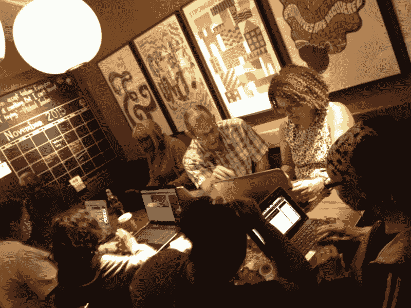
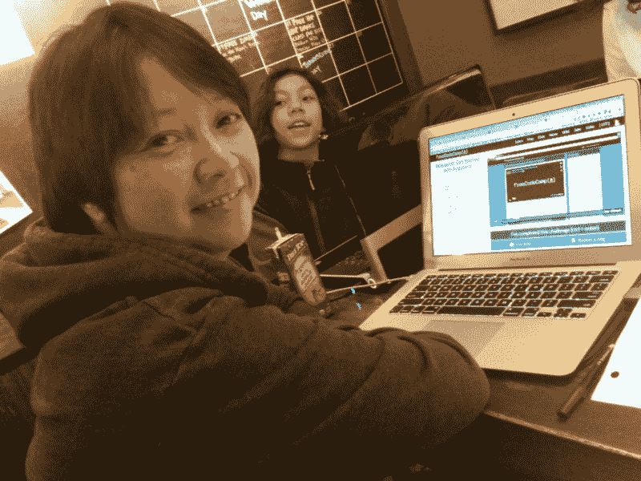

# 原来我的邻居也想学编程。他们只是没有意识到这是可能的。

> 原文：<https://www.freecodecamp.org/news/it-turns-out-my-neighbors-wanted-to-learn-to-code-too-they-just-didn-t-realize-it-was-possible-554a7bd8d4a7/>

我们都有不同的动机去开始一个咖啡和代码。在家自学可能会感到孤独，而且效率较低。其他程序员的陪伴可以帮助你保持动力。新朋友可以打破整天盯着命令提示符的压力。所以我在我们的社区创建了一个露营地[洛杉矶南部自由代码营地](https://www.facebook.com/groups/freecodecampsola/)。*经营一家咖啡馆意味着把别人的利益放在第一位，把你的利益放在最后，因为归根结底，这是一项公共服务。*

这里有一些开始你自己的咖啡和代码的提示。

#### 从小处着手

如果这是你第一次组织咖啡和代码，一个小团体是一个不错的选择。也会给你自己更多的时间去学习。当团队越来越大时，你会发现自己花在组织上的时间越来越多，留给自己编码的时间越来越少。

#### 位置，位置，位置

找一个安全、干净、位于目标人群中心的地方。确保有无线网络和足够的停车位。星巴克知道这个公式。他们的咖啡店地理位置优越，也有很强的无线网络连接。

随着你的咖啡和代码活动的增长，你可能需要改变场地，以便你可以容纳每个人。

My coffee-and-code meets at the same South Los Angeles Starbucks every time.

#### 把你的咖啡和代码传出去

这是一个大问题:你如何确保人们听到你的咖啡和代码？

至于在网上宣传活动，我有过 meetup.com 和 craigslist.com 的第一手经验——这两个都是让人们知道你存在的好方法。

利用你朋友和邻居的关系网。他们认识你个人，并且在把他们的朋友介绍给他们的社区时会更有信心。

在咖啡店或图书馆与随机的人交谈。这听起来可能很难接受，但确实有效。如果你经常去相同的咖啡店、杂货店和图书馆，你总是可以和那些看起来平易近人的人开始友好的交谈。

然后让他们知道你的咖啡和代码活动。即使他们不感兴趣，他们可能知道有人会感兴趣，并帮助你传播消息。

#### **了解你的资源**

无论你用什么作为你的咖啡和代码的主要资源，确保你足够熟悉它，你可以回答关于它的问题。

例如，如果你使用[自由代码营](http://freecodecamp.com)作为你的主要资源，熟悉它的挑战结构，以及 Bonfires 和 Ziplines 是如何工作的。在时间允许的情况下，自己完成尽可能多的挑战。你的编码俱乐部的成员会问一些问题，这将帮助你以一种更优雅、更省时的方式回答他们。

我个人希望在家里完成尽可能多的挑战，这样在我的咖啡和代码活动中，当别人遇到困难时，我可以用我的解决方案作为参考来帮助他们。这也给了我一个激励他人的机会，向他们展示我自己能够解决这些挑战。

#### **保持自由**

虽然有时向人们收取时间费用很诱人，但他们想加入你的“咖啡与代码”的主要原因是因为这是一种免费、有趣的学习编程的方式。如果你收费、出售或推销某样东西，会员可能会对你产生怀疑。

#### **有些成员会退出——没关系**

如果人们没有回到你的团队，不要感到沮丧。是因为现在不是他们合适的时间和合适的人选。感激那些留下来的人，因为他们是最坚定的人，有他们在你的阵营里是一种特权。

#### **合适的材料**

作为一个营的领导者，你的成员期望你成为他们的力量，并在困难和挫折中激励他们。毕竟，他们正在学习如何编码——无论如何都不是一件容易的事情。

在我的小组里，我是唯一一个有计算机科学背景的人。我花一对一的时间和成员解释逻辑、语法和命令。我花了很多时间思考不同年龄组和不同背景的成员可以关联的编码类比。

Me and our youngest coder at a coffee-and-code event

最后但并非最不重要的是，在那里庆祝他们的胜利，他们为此而努力！