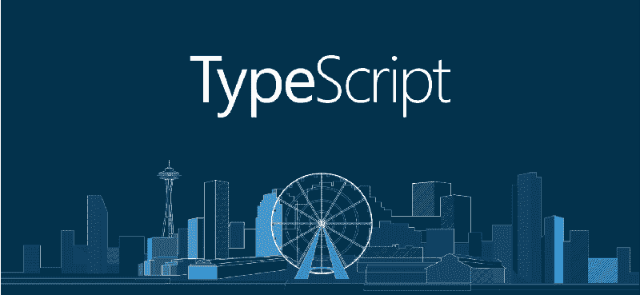
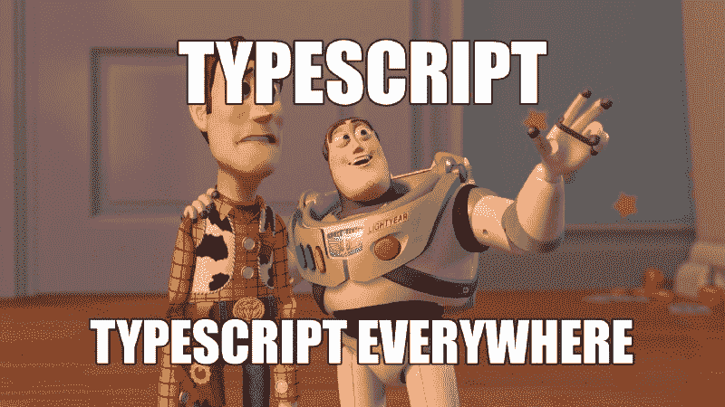
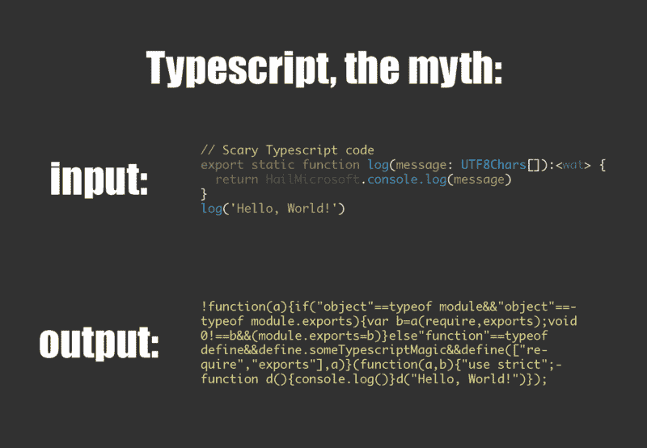
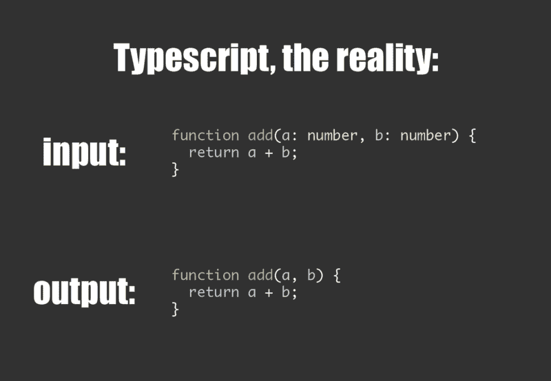
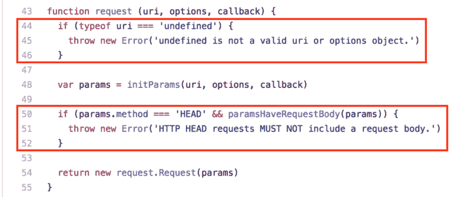
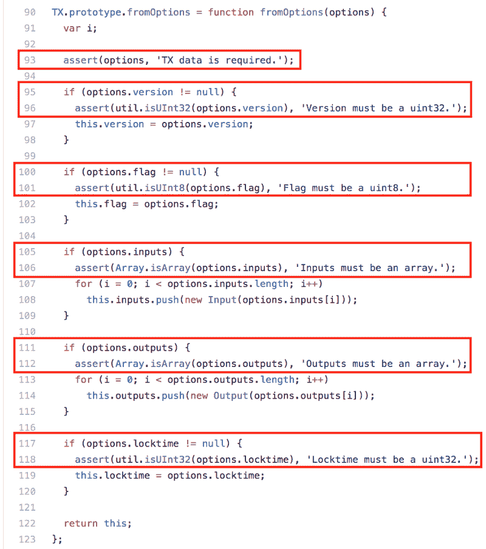

# 是时候再给 TypeScript 一次机会了

> 原文：<https://www.freecodecamp.org/news/its-time-to-give-typescript-another-chance-2caaf7fabe61/>

杰森·德莱泽纳

# 是时候再给 TypeScript 一次机会了

自 2012 年以来，对于从更结构化的语言(如 C++或 Java)转向 JavaScript 的程序员来说，TypeScript 一直是一个受欢迎的选择。但是它也在很大程度上被 JavaScript 世界的本地人所忽视。

你可能听说过 Angular 团队最近[为 Angular 2](https://vsavkin.com/writing-angular-2-in-typescript-1fa77c78d8e8) 转了 TypeScript。于是有了 [RxJS](https://github.com/ReactiveX/rxjs) 、 [Ionic](https://blog.ionic.io/announcing-ionic-2-0-0-final/) 、 [Cycle.js](https://cycle.js.org/) 、[蓝图](https://github.com/palantir/blueprint)、[道场](https://dojotoolkit.org/community/roadmap/vision.html)、 [NativeScript](https://github.com/NativeScript/NativeScript) 、[plotable](https://github.com/palantir/plottable)等等背后的团队。

如果你已经在 JavaScript/Node.js 领域呆了一段时间，很容易认为这些项目的发起人已经疯了。或者他们可能被微软收买了。？

如果您没有密切关注，您可能会错过 TypeScript 在过去一年(甚至是过去几个月)取得的惊人进展。

如果你还在想“TypeScript 有点像 CoffeeScript，对吗？”—这篇文章送给你。

有很多关于使用 TypeScript 的好处的资源和文章。我希望读完这篇文章后，你会再看一看。

### JavaScript——带类型？

对于刚刚接触这个讨论的人来说，理解 JavaScript 世界对类型的厌恶是很重要的。除了可移植性，JavaScript 的流行很大程度上归功于它的简单性。

> “为了吸引黑客，一种语言必须适合编写他们想要编写的程序。这意味着，也许令人惊讶的是，它必须有利于编写一次性程序。”——保罗·格拉厄姆，[走红](http://paulgraham.com/popular.html)

将 JavaScript 作为首选工具的程序员通常是因为它的灵活性。没有标准的库，很少的结构，没有类型，JavaScript 用户在构思新想法时不需要花太多时间考虑细节。

这可能最容易与 C++之类的语言形成对比，在 c++中，程序往往需要更多的结构和开销。许多 JavaScript 程序员(尤其是上面提到的黑客类型)发现传统类、样板文件、类型和类型转换的单调乏味降低了他们的速度。

> “给我你的疲惫，你的贫穷，你的渴望自由呼吸的人群——过度保护的编程语言。”— JavaScript ？️ *(基本上)*

从这个角度来看，很容易理解为什么很多 JavaScript 用户如此反对 JavaScript 使用类型的想法。

以下是一些可能有助于减轻这些恐惧的见解。

### TypeScript 是林挺更好的 JavaScript

对于使用 TypeScript 的想法，最常见的担忧之一可能是它不是纯粹的 JavaScript。因为 TypeScript 是它自己的语言，所以假设您的代码将被编译成一个混乱的 glob，有一天您将被迫调试它。

Too many people have this impression of Typescript.

除了 TypeScript 经过了非常好的测试并被广泛使用之外，值得注意的是，根据您的配置，实际上很少发生“传输”(如果有的话)。TypeScript 只是带有可选类型的 Javascript。

Type a little extra now, get instant feedback when “add” is used incorrectly. You also get up-to-date documentation free (without JSDoc tags to maintain), and fantastic editor and tooling support.

TypeScript 就像一个高度先进的 linter，能够检查文档并在代码没有按预期使用时发出警告。

它为您代码的所有未来用户提供即时反馈和更好的开发体验。这也是对新项目的一个很好的测试——如果您的项目值得林挺来执行代码风格约定，那么您的项目可能足够持久，可以从 TypeScript 中受益。

TypeScript 团队已经承诺在可预见的未来跟踪 JavaScript。因此，如果/当额外的特性在 JavaScript 中稳定下来时，TypeScript 将匹配它们并适应它们。

### TypeScript 消除了运行时开销

另一个常见的误解是，TypeScript 的类型检查以某种方式持续到运行时环境中，增加了复杂性和开销。

事实上，TypeScript 是避免运行时类型检查开销的好方法。

TypeScript 是一个开发时/编译时工具——它接受带有可选类型提示的标准 JavaScript，并输出去掉这些提示的 JavaScript。(如果启用，它还可以将 ES6 和 ES7 JavaScript 特性转换回当前标准。)

TypeScript 的类型提示给了我们类型的所有好处，然后它们就消失了。

对象的类型*和*在运行时留下的唯一线索是由标准 JavaScript 特性提供的相同线索。(例如，当您从原型创建一个新对象时，您可以用`instanceof`检查它的类型。)

具有讽刺意味的是，因为 JavaScript 没有提供开发时类型检查的标准方法，许多最发达的 JavaScript 库**重新实现了它们自己的运行时类型检查系统**。

Runtime type checking in the [Request](https://github.com/request/request) library. This provides a much better debugging experience for users who use the method incorrectly. But it requires more code at runtime and more cases to unit test. [Snippet→](https://github.com/request/request/blob/092e1e657326626da0b8ac4cfe8752751689313b/index.js#L43-L55)

这些库一开始并不打算这么做，但是提供良好的开发体验的一部分是确保开发人员在犯错误时看到清晰且可操作的错误。

为了实现这个目标，许多库在运行时广泛地检查传递给方法的参数类型，抛出只对实现该方法的开发人员有用的错误。

这无疑是两个世界中最糟糕的。这些运行时类型检查的级联增加了显著的代码膨胀，使得代码可读性更差，并且增加了维护 100%单元测试覆盖率的难度。

在大型代码库中，这些运行时测试真的越来越多。经过一点重构后，许多最大的代码库以**全类型系统**结束。

[Bcoin](https://github.com/bcoin-org/bcoin/) provides a good development experience by failing fast (at runtime) and emitting helpful errors. But this comes at the cost of maintaining and testing an extensive, runtime type checking system. It would be more helpful and efficient to do this with Typescript. [Snippet→](https://github.com/bcoin-org/bcoin/blob/4e7df6ef875e5936bea5139d922871498b4d9586/lib/primitives/tx.js#L84-L123)

如果不使用 Typescript，不仅会失去开发时的类型检查，还会将其转移到运行时。(*我希望你有完整的测试覆盖。*)

当您使用 TypeScript 时，您为您的用户提供了更好的开发体验，将运行时类型检查减少到只在需要的情况下(例如，净化最终用户输入)，并使您的代码更容易进行全面的单元测试。

### TypeScript 已经走过了漫长的道路

可能是因为上面提到的原因，当我第一次听说 TypeScript 的时候，我以最快的速度跑向了相反的方向。除了与“JavaScript 最好的东西”(更少的结构)相对立，它还是微软做的*。*

但现在已经不是 2012 年了。TypeScript 不是 JavaScript 的一个[漏洞抽象](https://en.wikipedia.org/wiki/Leaky_abstraction)，TypeScript 项目拥有这个领域一些最好的黑客和工程师。(我对微软在这方面的出色表现印象深刻。)

由于 TypeScript 跟踪 ECMAScript，使用 TypeScript 不会将您的项目锁定到一种新的语言。很多人仍然没有意识到这一点，因此经常会听到这样的观点:

> "维护一个打字稿项目是很难的."

对我来说，听起来像是:

> “和林挺一起维持一个项目很难。”

如果您的项目由于某种原因不再受益于 TypeScript，您可以通过编译器运行您的项目(最后一次),从您的代码库中移除所有类型。

然后你又回到了非类型化的 JavaScript。

### TL；速度三角形定位法(dead reckoning)

TypeScript 最近改进了很多。如果您几年前就听说过 TypeScript，但从那以后并没有真正关注它，那么它值得再看一看。

### 何时使用 TypeScript

#### [**棱角分明:为什么要打字稿？**](https://vsavkin.com/writing-angular-2-in-typescript-1fa77c78d8e8)

关于 Angular 团队为什么选择 TypeScript 来构建 Angular 2 的简短技术讨论。

#### [**所有的 JS 库都应该用 TypeScript** 创作](http://staltz.com/all-js-libraries-should-be-authored-in-typescript.html)

从 Cycle.js 的创建者和 RxJS 的贡献者总结了为什么 Typescript 是 JS 库的好主意。

#### [**打字稿深潜——为什么打字稿**](https://basarat.gitbooks.io/typescript/content/docs/why-typescript.html)

对使用 TypeScript 的好处的一个很好的总结。( [TypeScript Deep Dive](https://basarat.gitbooks.io/typescript/) 是一个很棒的通用参考。)

### 了解 TypeScript

#### [**打字稿教程**](https://www.typescriptlang.org/docs/tutorial.html)

由 TypeScript 团队维护的简短教程。

#### [**打字稿设计目标**](https://github.com/Microsoft/TypeScript/wiki/TypeScript-Design-Goals)

概述 TypeScript 团队一般设计原则的简短 wiki。

### [****](https://github.com/bitjson/typescript-starter)

**用于构建 JavaScript 库的样板项目。包括适当的单元测试、文档生成以及 CommonJS 和 ES6 模块导出(针对 Node.js 和浏览器)。**

**我写这篇文章是希望能改变人们的想法。如果你对我如何改进这篇文章有任何想法，请[告诉我](https://twitter.com/bitjson)。**

**如果你觉得这个帖子有趣，请♡和[分享。感谢阅读！](https://twitter.com/bitjson/status/832497164467183616)**