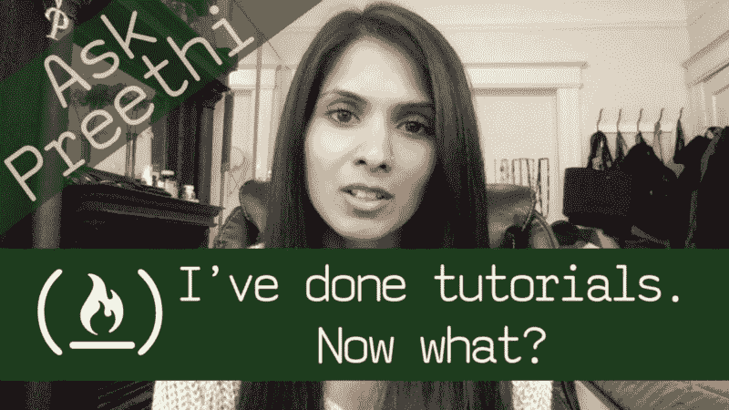

# 我做过编程教程。现在怎么办？

> 原文：<https://www.freecodecamp.org/news/ive-done-programming-tutorials-now-what-1dd1bc26cf55/>

作者:Preethi Kasireddy

# 我做过编程教程。现在怎么办？

本周我的 [Ask Preethi](https://medium.freecodecamp.org/what-are-the-most-challenging-parts-of-your-coding-journey-fbd7d3a7600f) 系列的问题是关于如何从简单地做教程到实际构建真实世界的应用程序。

### 这个问题

> 我知道 Html、CSS、JavaScript 和 jQuery 的基础知识。我跟随很多教程来制作简单的网站。但是我现在卡住了，接下来该怎么办。我怎样才能用我学到的东西来建造一些真实的东西？

### 这是我的答案

所以，你决定学习编码，也许还浏览了一些在线教程。你知道很多不同的东西——语法、条件、类、原型等等。

但是接下来呢？你实际上想建造一些东西，但是感觉你不能把所有的东西都放在一起。

接下来你会做什么？好吧，以下是我对这个问题的 13 分钟回答: