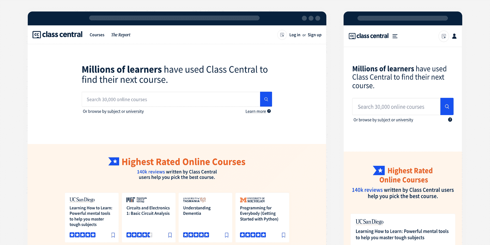

# 这里有 500 多门常青藤联盟的课程，你现在就可以在网上免费选修

> 原文：<https://www.freecodecamp.org/news/ivy-league-free-online-courses-a0d7ae675869/>

这 8 所常春藤盟校是世界上最负盛名的大学之一。这些大学包括布朗大学、哈佛大学、康奈尔大学、普林斯顿大学、达特茅斯大学、耶鲁大学、哥伦比亚大学和宾夕法尼亚大学。

在《美国新闻与世界报道》全国大学排名中，所有八所学校都排在前十五名。

这些常春藤盟校也是高选择性的，极难进入。但好消息是，所有这些大学现在都在多个在线课程平台上提供免费的在线课程。

到目前为止，他们已经创建了 700 多门课程，其中大约 500 门仍在使用。他们总共收到了至少 4000 万份注册申请

[课中央](https://www.classcentral.com/)把这些都做了一个收集，下面你可以探究一下。我将这些课程分为以下几类:

*   计算机科学
*   数据科学
*   编程；编排
*   人文学科
*   商业
*   艺术与设计
*   科学
*   社会科学
*   健康与医学
*   工程
*   数学
*   教育和教学
*   和个人发展

我还在 Class Central 的收藏页面上为常春藤联盟在线课程收集了这些课程。随着新课程的增加，该集合会自动更新。您可以点击蓝色的“关注”按钮订阅接收更新。

请注意，Coursera 的一些课程有点难上加难，所以我[写了这个指南来告诉你如何](https://www.classcentral.com/report/coursera-signup-for-free/)。如果你是网上学习的新手，看看这些 [30 个可行的技巧](https://www.classcentral.com/report/mooc-motivation-hacks/)来保持专注。

[Class Central](https://www.class-central.com/)’s home page.

## 计算机科学在线课程(51)

*   [CS50 的计算机科学入门](https://www.classcentral.com/course/edx-cs50-s-introduction-to-computer-science-442?utm_source=fcc_medium&utm_medium=web&utm_campaign=ivy_league_courses_2022)来自*哈佛大学*★★★★(109)
*   [算法，第一部分](https://www.classcentral.com/course/algs4partI-339?utm_source=fcc_medium&utm_medium=web&utm_campaign=ivy_league_courses_2022)来自*普林斯顿大学*★★★★(59)
*   [比特币和加密货币技术](https://www.classcentral.com/course/bitcointech-3655?utm_source=fcc_medium&utm_medium=web&utm_campaign=ivy_league_courses_2022)来自*普林斯顿大学*★★★☆(27)
*   [算法，第二部分](https://www.classcentral.com/course/algs4partII-340?utm_source=fcc_medium&utm_medium=web&utm_campaign=ivy_league_courses_2022)来自*普林斯顿大学*★★★★(21)
*   [数据科学和分析的机器学习](https://www.classcentral.com/course/edx-machine-learning-for-data-science-and-analytics-4912?utm_source=fcc_medium&utm_medium=web&utm_campaign=ivy_league_courses_2022)来自*哥伦比亚大学* ★★★☆☆(16)
*   [强化学习](https://www.classcentral.com/course/udacity-reinforcement-learning-1849?utm_source=fcc_medium&utm_medium=web&utm_campaign=ivy_league_courses_2022)来自*布朗大学* ★★★☆☆(8)
*   [软件定义的网络](https://www.classcentral.com/course/sdn-489?utm_source=fcc_medium&utm_medium=web&utm_campaign=ivy_league_courses_2022)来自*普林斯顿大学*★★★☆(7)
*   [CS50 的理解技术](https://www.classcentral.com/course/edx-cs50-s-understanding-technology-10142?utm_source=fcc_medium&utm_medium=web&utm_campaign=ivy_league_courses_2022)来自*哈佛大学*★★★★(6)
*   [数据科学和分析的使能技术:物联网](https://www.classcentral.com/course/edx-enabling-technologies-for-data-science-and-analytics-the-internet-of-things-4911?utm_source=fcc_medium&utm_medium=web&utm_campaign=ivy_league_courses_2022)来自*哥伦比亚大学*★☆☆☆(6)
*   [算法分析](https://www.classcentral.com/course/aofa-921?utm_source=fcc_medium&utm_medium=web&utm_campaign=ivy_league_courses_2022)来自*普林斯顿大学*★★★☆(6)
*   [计算机架构](https://www.classcentral.com/course/comparch-342?utm_source=fcc_medium&utm_medium=web&utm_campaign=ivy_league_courses_2022)来自*普林斯顿大学*★★★☆(6)
*   [机器学习](https://www.classcentral.com/course/udacity-machine-learning-1020?utm_source=fcc_medium&utm_medium=web&utm_campaign=ivy_league_courses_2022)来自*佐治亚理工学院*★★★☆(6)
*   [CS50 的商业人士计算机科学](https://www.classcentral.com/course/edx-cs50-s-computer-science-for-business-professionals-10143?utm_source=fcc_medium&utm_medium=web&utm_campaign=ivy_league_courses_2022)来自*哈佛大学*★★★★(4)
*   [机器人:感知](https://www.classcentral.com/course/robotics-perception-5033?utm_source=fcc_medium&utm_medium=web&utm_campaign=ivy_league_courses_2022)来自*宾夕法尼亚大学* ★★★☆☆(3)
*   [网络画报:没有微积分的原理](https://www.classcentral.com/course/ni-891?utm_source=fcc_medium&utm_medium=web&utm_campaign=ivy_league_courses_2022)来自*普林斯顿大学*★★★☆(3)
*   [网络:朋友、金钱和字节](https://www.classcentral.com/course/friendsmoneybytes-359?utm_source=fcc_medium&utm_medium=web&utm_campaign=ivy_league_courses_2022)来自*普林斯顿大学*★★★☆(3)
*   [机器学习:无监督学习](https://www.classcentral.com/course/udacity-machine-learning-unsupervised-learning-1848?utm_source=fcc_medium&utm_medium=web&utm_campaign=ivy_league_courses_2022)来自*布朗大学* ★★★☆☆(3)
*   [C 编程:模块化编程与内存管理](https://www.classcentral.com/course/edx-c-programming-modular-programming-and-memory-management-11666?utm_source=fcc_medium&utm_medium=web&utm_campaign=ivy_league_courses_2022)来自*达特茅斯学院* ★★★☆☆(3)
*   [CS50 用 Python 介绍人工智能](https://www.classcentral.com/course/edx-cs50-s-introduction-to-artificial-intelligence-with-python-18122?utm_source=fcc_medium&utm_medium=web&utm_campaign=ivy_league_courses_2022)来自*哈佛大学*★★★★(2)
*   [C 编程:使用 Linux 工具和库](https://www.classcentral.com/course/edx-c-programming-using-linux-tools-and-libraries-11538?utm_source=fcc_medium&utm_medium=web&utm_campaign=ivy_league_courses_2022)来自*达特茅斯学院*★★★★(2)
*   [C 编程:指针和内存管理](https://www.classcentral.com/course/edx-c-programming-pointers-and-memory-management-11533?utm_source=fcc_medium&utm_medium=web&utm_campaign=ivy_league_courses_2022)来自*达特茅斯学院*★★★★(2)
*   [C 编程:语言基础](https://www.classcentral.com/course/edx-c-programming-language-foundations-11535?utm_source=fcc_medium&utm_medium=web&utm_campaign=ivy_league_courses_2022)来自*Institut Mines-télécom*★★★★(2)
*   [Linux 基础知识:命令行界面](https://www.classcentral.com/course/edx-linux-basics-the-command-line-interface-11537?utm_source=fcc_medium&utm_medium=web&utm_campaign=ivy_league_courses_2022)来自*达特茅斯学院*★★★★(2)
*   [CS50 的律师计算机科学](https://www.classcentral.com/course/edx-cs50-s-computer-science-for-lawyers-16857?utm_source=fcc_medium&utm_medium=web&utm_campaign=ivy_league_courses_2022)来自*哈佛大学*★★★★(1)
*   [CS50 的 AP 计算机科学原理](https://www.classcentral.com/course/edx-cs50-s-ap-computer-science-principles-7017?utm_source=fcc_medium&utm_medium=web&utm_campaign=ivy_league_courses_2022)来自*哈佛大学*★★★★(1)
*   [算法设计与分析](https://www.classcentral.com/course/edx-algorithm-design-and-analysis-8520?utm_source=fcc_medium&utm_medium=web&utm_campaign=ivy_league_courses_2022)来自*宾夕法尼亚大学*★★★☆(1)
*   [HI-FIVE:健康信息学促进创新，价值&丰富(行政/IT 视角)](https://www.classcentral.com/course/hi-five-admin-it-8099?utm_source=fcc_medium&utm_medium=web&utm_campaign=ivy_league_courses_2022)来自*哥大*★★★★(1)
*   [计算机科学:有目的的编程](https://www.classcentral.com/course/cs-programming-java-13151?utm_source=fcc_medium&utm_medium=web&utm_campaign=ivy_league_courses_2022)来自*普林斯顿大学*★★★★(1)
*   [部署来自*哈佛大学*的 TinyML](https://www.classcentral.com/course/edx-deploying-tinyml-21643?utm_source=fcc_medium&utm_medium=web&utm_campaign=ivy_league_courses_2022)
*   [来自*哈佛大学*的 TinyML](https://www.classcentral.com/course/edx-applications-of-tinyml-21642?utm_source=fcc_medium&utm_medium=web&utm_campaign=ivy_league_courses_2022) 的申请
*   [来自*哈佛大学的 TinyML*](https://www.classcentral.com/course/edx-fundamentals-of-tinyml-21641?utm_source=fcc_medium&utm_medium=web&utm_campaign=ivy_league_courses_2022) 基础
*   [哈佛大学*的*](https://www.classcentral.com/course/youtube-advanced-algorithms-compsci-224-48051?utm_source=fcc_medium&utm_medium=web&utm_campaign=ivy_league_courses_2022)高级算法(COMPSCI 224)
*   [人工智能在人事管理中的应用](https://www.classcentral.com/course/wharton-ai-applications-people-management-56565?utm_source=fcc_medium&utm_medium=web&utm_campaign=ivy_league_courses_2022)来自*宾夕法尼亚大学*
*   [非数据科学家的人工智能基础](https://www.classcentral.com/course/wharton-ai-fundamentals-non-data-scientists-56564?utm_source=fcc_medium&utm_medium=web&utm_campaign=ivy_league_courses_2022)来自*宾夕法尼亚大学*
*   [人工智能在市场营销和金融领域的应用](https://www.classcentral.com/course/wharton-ai-applications-marketing-finance-56580?utm_source=fcc_medium&utm_medium=web&utm_campaign=ivy_league_courses_2022)来自*宾夕法尼亚大学*
*   [人工智能战略与治理](https://www.classcentral.com/course/wharton-ai-strategy-governance-56561?utm_source=fcc_medium&utm_medium=web&utm_campaign=ivy_league_courses_2022)来自*宾夕法尼亚大学*
*   [机器人:视觉智能和机器学习](https://www.classcentral.com/course/edx-robotics-vision-intelligence-and-machine-learning-8203?utm_source=fcc_medium&utm_medium=web&utm_campaign=ivy_league_courses_2022)来自*宾夕法尼亚大学*
*   [数据结构和软件设计](https://www.classcentral.com/course/edx-data-structures-and-software-design-8517?utm_source=fcc_medium&utm_medium=web&utm_campaign=ivy_league_courses_2022)来自*宾夕法尼亚大学*
*   [解决问题的计算思维](https://www.classcentral.com/course/computational-thinking-problem-solving-12278?utm_source=fcc_medium&utm_medium=web&utm_campaign=ivy_league_courses_2022)来自*宾夕法尼亚大学*
*   [加密货币和区块链:数字货币简介](https://www.classcentral.com/course/wharton-cryptocurrency-blockchain-introd-13733?utm_source=fcc_medium&utm_medium=web&utm_campaign=ivy_league_courses_2022)来自*宾夕法尼亚大学*
*   [HI-FIVE:健康信息促进创新，价值&丰富(社会/同伴视角)](https://www.classcentral.com/course/hi-five-social-peer-8303?utm_source=fcc_medium&utm_medium=web&utm_campaign=ivy_league_courses_2022)来自*哥大*
*   [HI-FIVE:健康信息促进创新，价值&浓缩(临床视角)](https://www.classcentral.com/course/hi-five-clinical-7456?utm_source=fcc_medium&utm_medium=web&utm_campaign=ivy_league_courses_2022)来自*哥大*
*   [视觉感知](https://www.classcentral.com/course/perception-54375?utm_source=fcc_medium&utm_medium=web&utm_campaign=ivy_league_courses_2022)来自*哥大*
*   [3D 重建-多视角](https://www.classcentral.com/course/3d-reconstruction---multiple-viewpoints-54376?utm_source=fcc_medium&utm_medium=web&utm_campaign=ivy_league_courses_2022)来自*哥大*
*   [3D 重建-单视点](https://www.classcentral.com/course/3d-reconstruction---single-viewpoint-54634?utm_source=fcc_medium&utm_medium=web&utm_campaign=ivy_league_courses_2022)来自*哥大*
*   [相机和成像](https://www.classcentral.com/course/cameraandimaging-54611?utm_source=fcc_medium&utm_medium=web&utm_campaign=ivy_league_courses_2022)来自*哥大*
*   [特点和界限](https://www.classcentral.com/course/features-and-boundaries-54633?utm_source=fcc_medium&utm_medium=web&utm_campaign=ivy_league_courses_2022)来自*哥大*
*   [计算机科学:算法、理论和机器](https://www.classcentral.com/course/computerscience2-10671?utm_source=fcc_medium&utm_medium=web&utm_campaign=ivy_league_courses_2022)来自*普林斯顿大学*
*   [частьалгоритмы我](https://www.classcentral.com/course/algorithms-part1-ru-39397?utm_source=fcc_medium&utm_medium=web&utm_campaign=ivy_league_courses_2022)来自*普林斯顿大学*
*   [C 编程:入门](https://www.classcentral.com/course/edx-c-programming-getting-started-11534?utm_source=fcc_medium&utm_medium=web&utm_campaign=ivy_league_courses_2022)来自*达特茅斯学院*
*   [C 编程:高级数据类型](https://www.classcentral.com/course/edx-c-programming-advanced-data-types-11536?utm_source=fcc_medium&utm_medium=web&utm_campaign=ivy_league_courses_2022)来自*达特茅斯学院*

## 数据科学在线课程(18)

*   [统计和 R](https://www.classcentral.com/course/edx-statistics-and-r-2960?utm_source=fcc_medium&utm_medium=web&utm_campaign=ivy_league_courses_2022) 来自*哈佛大学*★★★☆(20)
*   [数据科学和分析的统计思维](https://www.classcentral.com/course/edx-statistical-thinking-for-data-science-and-analytics-4913?utm_source=fcc_medium&utm_medium=web&utm_campaign=ivy_league_courses_2022)来自*哥伦比亚大学* ★★☆☆☆(19)
*   [数据科学:R 基础知识](https://www.classcentral.com/course/edx-data-science-r-basics-9253?utm_source=fcc_medium&utm_medium=web&utm_campaign=ivy_league_courses_2022)来自*哈佛大学*★★★★(11)
*   [人物分析](https://www.classcentral.com/course/wharton-people-analytics-4264?utm_source=fcc_medium&utm_medium=web&utm_campaign=ivy_league_courses_2022)来自*宾夕法尼亚大学*★★★☆(5)
*   [数据科学:机器学习](https://www.classcentral.com/course/edx-data-science-machine-learning-10353?utm_source=fcc_medium&utm_medium=web&utm_campaign=ivy_league_courses_2022)来自*哈佛大学*★★★☆(4)
*   [数据科学:线性回归](https://www.classcentral.com/course/edx-data-science-linear-regression-10352?utm_source=fcc_medium&utm_medium=web&utm_campaign=ivy_league_courses_2022)来自*哈佛大学* ★★☆☆☆(3)
*   [高维数据分析](https://www.classcentral.com/course/edx-high-dimensional-data-analysis-2949?utm_source=fcc_medium&utm_medium=web&utm_campaign=ivy_league_courses_2022)来自*哈佛大学*★★★☆(3)
*   [因果图:得出结论前先得出假设](https://www.classcentral.com/course/edx-causal-diagrams-draw-your-assumptions-before-your-conclusions-9097?utm_source=fcc_medium&utm_medium=web&utm_campaign=ivy_league_courses_2022)来自*哈佛大学*★★★★(3)
*   [数据科学:可视化](https://www.classcentral.com/course/edx-data-science-visualization-10347?utm_source=fcc_medium&utm_medium=web&utm_campaign=ivy_league_courses_2022)来自*哈佛大学*★★★★(3)
*   [数据科学:扯皮](https://www.classcentral.com/course/edx-data-science-wrangling-10351?utm_source=fcc_medium&utm_medium=web&utm_campaign=ivy_league_courses_2022)来自*哈佛大学*★★★★(2)
*   [数据科学:概率](https://www.classcentral.com/course/edx-data-science-probability-10348?utm_source=fcc_medium&utm_medium=web&utm_campaign=ivy_league_courses_2022)来自*哈佛大学*★★★☆(2)
*   [数据科学:推理与建模](https://www.classcentral.com/course/edx-data-science-inference-and-modeling-10349?utm_source=fcc_medium&utm_medium=web&utm_campaign=ivy_league_courses_2022)来自*哈佛大学*★★★☆(1)
*   [数据科学:生产力工具](https://www.classcentral.com/course/edx-data-science-productivity-tools-10350?utm_source=fcc_medium&utm_medium=web&utm_campaign=ivy_league_courses_2022)来自*哈佛大学*★★★★(1)
*   [大数据与教育](https://www.classcentral.com/course/edx-big-data-and-education-968?utm_source=fcc_medium&utm_medium=web&utm_campaign=ivy_league_courses_2022)来自*哥大* ★★★☆☆(1)
*   [可再生数据科学的原理、统计和计算工具](https://www.classcentral.com/course/edx-principles-statistical-and-computational-tools-for-reproducible-data-science-9489?utm_source=fcc_medium&utm_medium=web&utm_campaign=ivy_league_courses_2022)来自*哈佛大学*
*   [哈佛大学*的*](https://www.classcentral.com/course/youtube-algorithms-for-big-data-compsci-229r-48050?utm_source=fcc_medium&utm_medium=web&utm_campaign=ivy_league_courses_2022)大数据算法(comp sci 229 r)
*   [数据科学:来自*哈佛大学*的顶点](https://www.classcentral.com/course/edx-data-science-capstone-10354?utm_source=fcc_medium&utm_medium=web&utm_campaign=ivy_league_courses_2022)
*   [使用 Python 的数据分析](https://www.classcentral.com/course/data-analysis-python-22538?utm_source=fcc_medium&utm_medium=web&utm_campaign=ivy_league_courses_2022)来自*宾夕法尼亚大学*

## 编程在线课程(14)

*   [使用 Python 进行研究](https://www.classcentral.com/course/edx-using-python-for-research-7204?utm_source=fcc_medium&utm_medium=web&utm_campaign=ivy_league_courses_2022)来自*哈佛大学*★★★☆(12)
*   [CS50 用 Python 和 JavaScript 的 Web 编程](https://www.classcentral.com/course/edx-cs50-s-web-programming-with-python-and-javascript-11506?utm_source=fcc_medium&utm_medium=web&utm_campaign=ivy_league_courses_2022)来自*哈佛大学*★★★★(11)
*   [用 JavaScript 为网络编程](https://www.classcentral.com/course/edx-programming-for-the-web-with-javascript-8518?utm_source=fcc_medium&utm_medium=web&utm_campaign=ivy_league_courses_2022)来自*宾夕法尼亚大学*★★★★(4)
*   [智能手机内的计算技术](https://www.classcentral.com/course/edx-the-computing-technology-inside-your-smartphone-2809?utm_source=fcc_medium&utm_medium=web&utm_campaign=ivy_league_courses_2022)来自*康乃尔大学*★★★★(4)
*   [宾夕法尼亚大学*的软件开发基础*](https://www.classcentral.com/course/edx-software-development-fundamentals-8516?utm_source=fcc_medium&utm_medium=web&utm_campaign=ivy_league_courses_2022)★★★☆☆(2)
*   [CS50 用 React Native 开发的手机 App](https://www.classcentral.com/course/edx-cs50-s-mobile-app-development-with-react-native-11505?utm_source=fcc_medium&utm_medium=web&utm_campaign=ivy_league_courses_2022)来自*哈佛大学*★★★☆(1)
*   [数据库系统-康奈尔大学课程(SQL，NoSQL，大规模数据分析)](https://www.classcentral.com/course/freecodecamp-database-systems-cornell-university-course-sql-nosql-large-scale-data-analysis-57068?utm_source=fcc_medium&utm_medium=web&utm_campaign=ivy_league_courses_2022)来自*康奈尔大学* ★★★★☆(1)
*   [【新】CS50 的 Python 编程入门](https://www.classcentral.com/course/cs50s-introduction-to-programming-with-python-58275?utm_source=fcc_medium&utm_medium=web&utm_campaign=ivy_league_courses_2022)来自*哈佛大学*
*   [CS50 的游戏开发入门](https://www.classcentral.com/course/edx-cs50-s-introduction-to-game-development-11504?utm_source=fcc_medium&utm_medium=web&utm_campaign=ivy_league_courses_2022)来自*哈佛大学*
*   [生物定量方法](https://www.classcentral.com/course/edx-quantitative-methods-for-biology-17849?utm_source=fcc_medium&utm_medium=web&utm_campaign=ivy_league_courses_2022)来自*哈佛大学*
*   [CS50 的从头编程入门](https://www.classcentral.com/course/cs50s-introduction-to-programming-with-scratch-39309?utm_source=fcc_medium&utm_medium=web&utm_campaign=ivy_league_courses_2022)来自*哈佛大学*
*   [Java 中的继承和数据结构](https://www.classcentral.com/course/java-inheritance-data-structures-22537?utm_source=fcc_medium&utm_medium=web&utm_campaign=ivy_league_courses_2022)来自*宾夕法尼亚大学*
*   [Python 编程入门](https://www.classcentral.com/course/python-programming-intro-22536?utm_source=fcc_medium&utm_medium=web&utm_campaign=ivy_league_courses_2022)来自*宾夕法尼亚大学*
*   [宾夕法尼亚大学*的*](https://www.classcentral.com/course/java-object-oriented-programming-22535?utm_source=fcc_medium&utm_medium=web&utm_campaign=ivy_league_courses_2022)Java 和面向对象编程简介

## 人文学科在线课程(91)

*   [希望:人类向政治存在主义的奥德赛](https://www.classcentral.com/course/edx-hope-human-odyssey-to-political-existentialism-11584?utm_source=fcc_medium&utm_medium=web&utm_campaign=ivy_league_courses_2022)来自*普林斯顿大学*★★★★(245)
*   [现代&当代美国诗歌【ModPo】](https://www.classcentral.com/course/modpo-356?utm_source=fcc_medium&utm_medium=web&utm_campaign=ivy_league_courses_2022)来自*宾夕法尼亚大学*★★★★(190)
*   [日常生活的道德观](https://www.classcentral.com/course/moralities-911?utm_source=fcc_medium&utm_medium=web&utm_campaign=ivy_league_courses_2022)来自*耶鲁大学*★★★★(42)
*   [职业发展英语](https://www.classcentral.com/course/careerdevelopment-6011?utm_source=fcc_medium&utm_medium=web&utm_campaign=ivy_league_courses_2022)来自*宾夕法尼亚大学*★★★☆(24)
*   [希腊罗马神话](https://www.classcentral.com/course/mythology-353?utm_source=fcc_medium&utm_medium=web&utm_campaign=ivy_league_courses_2022)来自*宾夕法尼亚大学*★★★★(21)
*   [科学&烹饪:从高级料理到软物质科学(化学)](https://www.classcentral.com/course/edx-science-cooking-from-haute-cuisine-to-soft-matter-science-chemistry-811?utm_source=fcc_medium&utm_medium=web&utm_campaign=ivy_league_courses_2022)来自*哈佛大学*★★★★(15)
*   [宾夕法尼亚大学*的新闻英语*](https://www.classcentral.com/course/journalism-6009?utm_source=fcc_medium&utm_medium=web&utm_campaign=ivy_league_courses_2022)★★★☆(15)
*   [古代哲学:柏拉图&他的前辈](https://www.classcentral.com/course/plato-5237?utm_source=fcc_medium&utm_medium=web&utm_campaign=ivy_league_courses_2022)来自*宾夕法尼亚大学*★★★★(12)
*   [中国的政治和思想基础:从圣王到孔子](https://www.classcentral.com/course/edx-china-s-political-and-intellectual-foundations-from-sage-kings-to-confucius-941?utm_source=fcc_medium&utm_medium=web&utm_campaign=ivy_league_courses_2022)来自*哈佛大学*★★★★(11)
*   [科技、工程、数学英语](https://www.classcentral.com/course/stem-6538?utm_source=fcc_medium&utm_medium=web&utm_campaign=ivy_league_courses_2022)来自*宾夕法尼亚大学*★★★★(11)
*   [有效的利他主义](https://www.classcentral.com/course/effectivealtruism-3446?utm_source=fcc_medium&utm_medium=web&utm_campaign=ivy_league_courses_2022)来自*普林斯顿大学*★★★☆(11)
*   [可视化日本(19 世纪 50 年代-30 年代):西化、抗议、现代性](https://www.classcentral.com/course/edx-visualizing-japan-1850s-1930s-westernization-protest-modernity-2159?utm_source=fcc_medium&utm_medium=web&utm_campaign=ivy_league_courses_2022)来自*哈佛大学*★★★★(10)
*   [古代哲学:亚里斯多德及其后继者](https://www.classcentral.com/course/aristotle-5238?utm_source=fcc_medium&utm_medium=web&utm_campaign=ivy_league_courses_2022)来自*宾夕法尼亚大学*★★★☆(10)
*   [宗教、冲突与和平](https://www.classcentral.com/course/edx-religion-conflict-and-peace-9452?utm_source=fcc_medium&utm_medium=web&utm_campaign=ivy_league_courses_2022)来自*哈佛大学*★★★☆(9)
*   [宗教素养:传统与经文](https://www.classcentral.com/course/edx-religious-literacy-traditions-and-scriptures-5844?utm_source=fcc_medium&utm_medium=web&utm_campaign=ivy_league_courses_2022)来自*哈佛大学*★★★★(9)
*   [近代中国的根基:满清](https://www.classcentral.com/course/edx-modern-china-s-foundations-the-manchus-and-the-qing-1986?utm_source=fcc_medium&utm_medium=web&utm_campaign=ivy_league_courses_2022)来自*哈佛大学*★★★★(8)
*   [创建现代中国:民国时期至今](https://www.classcentral.com/course/edx-creating-modern-china-the-republican-period-to-the-present-2468?utm_source=fcc_medium&utm_medium=web&utm_campaign=ivy_league_courses_2022)来自*哈佛大学*★★★★(7)
*   [基督教通过它的经文](https://www.classcentral.com/course/edx-christianity-through-its-scriptures-5858?utm_source=fcc_medium&utm_medium=web&utm_campaign=ivy_league_courses_2022)从*哈佛大学*★★★☆(7)
*   [商务和创业英语](https://www.classcentral.com/course/business-6010?utm_source=fcc_medium&utm_medium=web&utm_campaign=ivy_league_courses_2022)来自*宾夕法尼亚大学*★★★★(7)
*   [内战与重建——1865-1890:未完成的革命](https://www.classcentral.com/course/edx-the-civil-war-and-reconstruction-1865-1890-the-unfinished-revolution-2439?utm_source=fcc_medium&utm_medium=web&utm_campaign=ivy_league_courses_2022)来自*哥大* ★★★★★(7)
*   [世界文学名著](https://www.classcentral.com/course/edx-masterpieces-of-world-literature-6844?utm_source=fcc_medium&utm_medium=web&utm_campaign=ivy_league_courses_2022)来自*哈佛大学*★★★★(6)
*   [佛教经其经文](https://www.classcentral.com/course/edx-buddhism-through-its-scriptures-5857?utm_source=fcc_medium&utm_medium=web&utm_campaign=ivy_league_courses_2022)来自*哈佛大学*★★★☆(6)
*   [文人中国:考试、理学、后来的帝制中国](https://www.classcentral.com/course/edx-literati-china-examinations-neo-confucianism-and-later-imperial-china-1845?utm_source=fcc_medium&utm_medium=web&utm_campaign=ivy_league_courses_2022)来自*哈佛大学*★★★★(6)
*   [中国的第一个帝国和佛教的兴起](https://www.classcentral.com/course/edx-china-s-first-empires-and-the-rise-of-buddhism-1617?utm_source=fcc_medium&utm_medium=web&utm_campaign=ivy_league_courses_2022)来自*哈佛大学*★★★★(6)
*   [内战与重建——1861-1865:自由的新生](https://www.classcentral.com/course/edx-the-civil-war-and-reconstruction-1861-1865-a-new-birth-of-freedom-2297?utm_source=fcc_medium&utm_medium=web&utm_campaign=ivy_league_courses_2022)来自*哥大*★★★★(6)
*   [莎士比亚的哈姆雷特:鬼魂](https://www.classcentral.com/course/edx-shakespeare-s-hamlet-the-ghost-7016?utm_source=fcc_medium&utm_medium=web&utm_campaign=ivy_league_courses_2022)来自*哈佛大学*★★★★(5)
*   [中国和共产主义](https://www.classcentral.com/course/edx-china-and-communism-2469?utm_source=fcc_medium&utm_medium=web&utm_campaign=ivy_league_courses_2022)来自*哈佛大学*★★★★(5)
*   [入侵、叛乱和中华帝国的衰落](https://www.classcentral.com/course/edx-invasions-rebellions-and-the-fall-of-imperial-china-2467?utm_source=fcc_medium&utm_medium=web&utm_campaign=ivy_league_courses_2022)来自*哈佛大学*★★★★(5)
*   [古埃及及其文明介绍](https://www.classcentral.com/course/introancientegypt-7326?utm_source=fcc_medium&utm_medium=web&utm_campaign=ivy_league_courses_2022)来自*宾夕法尼亚大学*★★★☆(5)
*   [南北战争与重建——1850-1861:一座被分割的房子](https://www.classcentral.com/course/edx-the-civil-war-and-reconstruction-1850-1861-a-house-divided-2172?utm_source=fcc_medium&utm_medium=web&utm_campaign=ivy_league_courses_2022)来自*哥大*★★★★(5)
*   [四海为家的唐:中国的贵族文化](https://www.classcentral.com/course/edx-cosmopolitan-tang-aristocratic-culture-in-china-1773?utm_source=fcc_medium&utm_medium=web&utm_campaign=ivy_league_courses_2022)来自*哈佛大学*★★★★(4)
*   [全球中国:从蒙古人到明朝](https://www.classcentral.com/course/edx-global-china-from-the-mongols-to-the-ming-1988?utm_source=fcc_medium&utm_medium=web&utm_campaign=ivy_league_courses_2022)来自*哈佛大学*★★★★(4)
*   [当代中国:中华人民共和国、台湾和香港](https://www.classcentral.com/course/edx-contemporary-china-the-people-s-republic-taiwan-and-hong-kong-2470?utm_source=fcc_medium&utm_medium=web&utm_campaign=ivy_league_courses_2022)来自*哈佛大学*★★★★(4)
*   [古埃及奇观](https://www.classcentral.com/course/wondersancientegypt-9577?utm_source=fcc_medium&utm_medium=web&utm_campaign=ivy_league_courses_2022)来自*宾夕法尼亚大学*★★★★(4)
*   [宇宙之旅:生命的展开](https://www.classcentral.com/course/journey-unfolding-life-6947?utm_source=fcc_medium&utm_medium=web&utm_campaign=ivy_league_courses_2022)来自*耶鲁大学*★★★☆(4)
*   [全球历史实验室](https://www.classcentral.com/course/edx-global-history-lab-2371?utm_source=fcc_medium&utm_medium=web&utm_campaign=ivy_league_courses_2022)来自*普林斯顿大学*★★★☆(4)
*   [质疑现实！科学、哲学和寻找意义](https://www.classcentral.com/course/edx-question-reality-science-philosophy-and-the-search-for-meaning-6851?utm_source=fcc_medium&utm_medium=web&utm_campaign=ivy_league_courses_2022)来自*达特茅斯学院*★★★☆(4)
*   [西方基督教之旅:从被迫害的信仰到全球宗教(200 - 1650)](https://www.classcentral.com/course/western-christianity-200-1650-8106?utm_source=fcc_medium&utm_medium=web&utm_campaign=ivy_league_courses_2022) 来自*耶鲁大学*★★★☆(3)
*   [生物伦理:生殖技术和遗传学的法律、医学和伦理](https://www.classcentral.com/course/edx-bioethics-the-law-medicine-and-ethics-of-reproductive-technologies-and-genetics-6649?utm_source=fcc_medium&utm_medium=web&utm_campaign=ivy_league_courses_2022)来自*哈佛大学*★★★☆(2)
*   [莎士比亚的《奥赛罗:摩尔人》](https://www.classcentral.com/course/edx-shakespeare-s-othello-the-moor-11951?utm_source=fcc_medium&utm_medium=web&utm_campaign=ivy_league_courses_2022)来自*哈佛大学*★★★★(2)
*   [吉萨金字塔:古埃及艺术和考古](https://www.classcentral.com/course/edx-pyramids-of-giza-ancient-egyptian-art-and-archaeology-20964?utm_source=fcc_medium&utm_medium=web&utm_campaign=ivy_league_courses_2022)来自*哈佛大学*★★★★(2)
*   [幸福之路:中国哲学教给我们的美好生活](https://www.classcentral.com/course/edx-the-path-to-happiness-what-chinese-philosophy-teaches-us-about-the-good-life-20046?utm_source=fcc_medium&utm_medium=web&utm_campaign=ivy_league_courses_2022)来自*哈佛大学* ★★★☆☆(2)
*   [伊斯兰教经](https://www.classcentral.com/course/edx-islam-through-its-scriptures-5818?utm_source=fcc_medium&utm_medium=web&utm_campaign=ivy_league_courses_2022)来自*哈佛大学*★★★★(2)
*   [印度教通过它的经文](https://www.classcentral.com/course/edx-hinduism-through-its-scriptures-5819?utm_source=fcc_medium&utm_medium=web&utm_campaign=ivy_league_courses_2022)从*哈佛大学*★★★★②
*   [古希腊英雄](https://www.classcentral.com/course/edx-the-ancient-greek-hero-609?utm_source=fcc_medium&utm_medium=web&utm_campaign=ivy_league_courses_2022)来自*哈佛大学* ★★★☆☆(2)
*   [女人总是在工作:美国 1700 - 1920 年的经历](https://www.classcentral.com/course/edx-women-have-always-worked-the-u-s-experience-1700-1920-8110?utm_source=fcc_medium&utm_medium=web&utm_campaign=ivy_league_courses_2022)来自*哥大*★★★★(2)
*   [权力与责任:与来自*哈佛大学的超级英雄*](https://www.classcentral.com/course/edx-power-and-responsibility-doing-philosophy-with-superheroes-9708?utm_source=fcc_medium&utm_medium=web&utm_campaign=ivy_league_courses_2022)一起做哲学★★★★(1)
*   [美国诗歌:惠特曼](https://www.classcentral.com/course/edx-poetry-in-america-whitman-940?utm_source=fcc_medium&utm_medium=web&utm_campaign=ivy_league_courses_2022)来自*哈佛大学*★★★☆(1)
*   [日本书籍:从手稿到印刷](https://www.classcentral.com/course/edx-japanese-books-from-manuscript-to-print-19157?utm_source=fcc_medium&utm_medium=web&utm_campaign=ivy_league_courses_2022)来自*哈佛大学*★★★☆(1)
*   [数字人文入门](https://www.classcentral.com/course/edx-introduction-to-digital-humanities-13557?utm_source=fcc_medium&utm_medium=web&utm_campaign=ivy_league_courses_2022)来自*哈佛大学*★★★★(1)
*   [莎士比亚的《威尼斯商人》:夏洛克](https://www.classcentral.com/course/edx-shakespeare-s-the-merchant-of-venice-shylock-8536?utm_source=fcc_medium&utm_medium=web&utm_campaign=ivy_league_courses_2022)来自*哈佛大学*★★★★(1)
*   [古代世界文学名著](https://www.classcentral.com/course/edx-ancient-masterpieces-of-world-literature-9423?utm_source=fcc_medium&utm_medium=web&utm_campaign=ivy_league_courses_2022)来自*哈佛大学*★★★★(1)
*   [PredictionX:失去没有经度](https://www.classcentral.com/course/edx-predictionx-lost-without-longitude-11693?utm_source=fcc_medium&utm_medium=web&utm_campaign=ivy_league_courses_2022)来自*哈佛大学*★★★★(1)
*   [诗歌在美国:现代主义](https://www.classcentral.com/course/edx-poetry-in-america-modernism-5346?utm_source=fcc_medium&utm_medium=web&utm_campaign=ivy_league_courses_2022)来自*哈佛大学*★★★★(1)
*   [美国诗歌:内战及其后果](https://www.classcentral.com/course/edx-poetry-in-america-the-civil-war-and-its-aftermath-3355?utm_source=fcc_medium&utm_medium=web&utm_campaign=ivy_league_courses_2022)来自*哈佛大学*★★★★(1)
*   [犹太教通过它的经文](https://www.classcentral.com/course/edx-judaism-through-its-scriptures-5820?utm_source=fcc_medium&utm_medium=web&utm_campaign=ivy_league_courses_2022)从*哈佛大学*★★★★(1)
*   [科学&烹饪:从高级料理到软物质科学(物理学)](https://www.classcentral.com/course/edx-science-cooking-from-haute-cuisine-to-soft-matter-science-physics-8383?utm_source=fcc_medium&utm_medium=web&utm_campaign=ivy_league_courses_2022)来自*哈佛大学*★★★★(1)
*   [世界中的帐幕&图片:一份意大利犹太手稿被揭露](https://www.classcentral.com/course/edx-the-tabernacle-in-word-image-an-italian-jewish-manuscript-revealed-11462?utm_source=fcc_medium&utm_medium=web&utm_campaign=ivy_league_courses_2022)来自*宾夕法尼亚大学*★★★★(1)
*   [古希腊历史介绍](https://www.classcentral.com/course/youtube-introduction-to-ancient-greek-history-with-donald-kagan-53043?utm_source=fcc_medium&utm_medium=web&utm_campaign=ivy_league_courses_2022)来自*耶鲁大学*★★★★(1)
*   [寻求女权:殖民时期到内战](https://www.classcentral.com/course/edx-seeking-women-s-rights-colonial-period-to-the-civil-war-13127?utm_source=fcc_medium&utm_medium=web&utm_campaign=ivy_league_courses_2022)来自*哥大*★★★★(1)
*   女性公民的工资工作:1870-1920 年来自*哥大*★★★★(1)
*   [约翰·弥尔顿:失乐园](https://www.classcentral.com/course/edx-john-milton-paradise-lost-11575?utm_source=fcc_medium&utm_medium=web&utm_campaign=ivy_league_courses_2022)来自*达特茅斯学院*★★★★(1)
*   [食物发酵:用微生物烹饪的科学](https://www.classcentral.com/course/fermentation-cooking-with-microbes-32763?utm_source=fcc_medium&utm_medium=web&utm_campaign=ivy_league_courses_2022)来自*哈佛大学*
*   [现代世界文学名著](https://www.classcentral.com/course/edx-modern-masterpieces-of-world-literature-9424?utm_source=fcc_medium&utm_medium=web&utm_campaign=ivy_league_courses_2022)来自*哈佛大学*
*   中国的政治和知识基础:从圣王到孔子来自*哈佛大学*
*   [美国诗歌:惠特曼](https://www.classcentral.com/course/edx-poetry-in-america-whitman-2816?utm_source=fcc_medium&utm_medium=web&utm_campaign=ivy_league_courses_2022)来自*哈佛大学*
*   [向*哈佛大学*学习古希腊语](https://www.classcentral.com/course/youtube-learn-ancient-greek-with-prof-leonard-muellner-53386?utm_source=fcc_medium&utm_medium=web&utm_campaign=ivy_league_courses_2022)
*   [中国人文:中国文化中的个体](https://www.classcentral.com/course/edx-china-humanities-the-individual-in-chinese-culture-9256?utm_source=fcc_medium&utm_medium=web&utm_campaign=ivy_league_courses_2022)来自*哈佛大学*
*   [创造历史的女人:十件物品，许多故事](https://www.classcentral.com/course/edx-women-making-history-ten-objects-many-stories-12269?utm_source=fcc_medium&utm_medium=web&utm_campaign=ivy_league_courses_2022)来自*哈佛大学*
*   [锡克教通过它的经文](https://www.classcentral.com/course/edx-sikhism-through-its-scriptures-11388?utm_source=fcc_medium&utm_medium=web&utm_campaign=ivy_league_courses_2022)从*哈佛大学*
*   来自*哈佛大学*的
*   [莎翁的生活和工作](https://www.classcentral.com/course/edx-shakespeare-s-life-and-work-15184?utm_source=fcc_medium&utm_medium=web&utm_campaign=ivy_league_courses_2022)来自*哈佛大学*
*   中世纪犹太祈祷书的空白处:关于历史，实物手稿能告诉我们什么？来自*宾夕法尼亚大学*
*   来自宾夕法尼亚大学*的文艺复兴时期犹太学者眼中的地理发现和新世界*
*   [【新】基督教&生态学](https://www.classcentral.com/course/christianity-ecology-58919?utm_source=fcc_medium&utm_medium=web&utm_campaign=ivy_league_courses_2022)来自*耶鲁大学*
*   [【新】宗教介绍&生态学](https://www.classcentral.com/course/intro-religions-ecology-58921?utm_source=fcc_medium&utm_medium=web&utm_campaign=ivy_league_courses_2022)来自*耶鲁大学*
*   [【新】西方宗教&生态学](https://www.classcentral.com/course/western-religions-ecology-58920?utm_source=fcc_medium&utm_medium=web&utm_campaign=ivy_league_courses_2022)来自*耶鲁大学*
*   [【新】南亚宗教&生态](https://www.classcentral.com/course/south-asian-religions-ecology-58918?utm_source=fcc_medium&utm_medium=web&utm_campaign=ivy_league_courses_2022)来自*耶鲁大学*
*   [【新】东亚宗教&生态](https://www.classcentral.com/course/east-asian-religions-ecology-58917?utm_source=fcc_medium&utm_medium=web&utm_campaign=ivy_league_courses_2022)来自*耶鲁大学*
*   [【新】土著宗教&生态](https://www.classcentral.com/course/indigenous-religions-ecology-58916?utm_source=fcc_medium&utm_medium=web&utm_campaign=ivy_league_courses_2022)来自*耶鲁大学*
*   [与雪莱·卡根一起死亡](https://www.classcentral.com/course/youtube-death-with-shelly-kagan-53041?utm_source=fcc_medium&utm_medium=web&utm_campaign=ivy_league_courses_2022)来自*耶鲁大学*
*   [旧约全书简介](https://www.classcentral.com/course/youtube-introduction-to-the-old-testament-with-christine-hayes-53024?utm_source=fcc_medium&utm_medium=web&utm_campaign=ivy_league_courses_2022)来自*耶鲁大学*
*   [内战和重建](https://www.classcentral.com/course/youtube-the-civil-war-and-reconstruction-with-david-blight-53046?utm_source=fcc_medium&utm_medium=web&utm_campaign=ivy_league_courses_2022)来自*耶鲁大学*
*   [为平等而战:1950–2018](https://www.classcentral.com/course/edx-fighting-for-equality-1950-2018-13130?utm_source=fcc_medium&utm_medium=web&utm_campaign=ivy_league_courses_2022)来自*哥大*
*   [女性总是在工作:美国 1920 - 2016 年的经历](https://www.classcentral.com/course/edx-women-have-always-worked-the-u-s-experience-1920-2016-8523?utm_source=fcc_medium&utm_medium=web&utm_campaign=ivy_league_courses_2022)来自*哥伦比亚大学*
*   [谈判一个变化的世界:1920-1950](https://www.classcentral.com/course/edx-negotiating-a-changing-world-1920-1950-13129?utm_source=fcc_medium&utm_medium=web&utm_campaign=ivy_league_courses_2022) 来自*哥伦比亚大学*
*   [印度&藏传佛教](https://www.classcentral.com/course/edx-indian-tibetan-river-of-buddhism-13686?utm_source=fcc_medium&utm_medium=web&utm_campaign=ivy_league_courses_2022)来自*哥大*
*   [撰写案例研究:交付科学](https://www.classcentral.com/course/edx-writing-case-studies-science-of-delivery-4908?utm_source=fcc_medium&utm_medium=web&utm_campaign=ivy_league_courses_2022)来自*普林斯顿大学*
*   [记忆的伦理](https://www.classcentral.com/course/edx-the-ethics-of-memory-8538?utm_source=fcc_medium&utm_medium=web&utm_campaign=ivy_league_courses_2022)来自*布朗大学*
*   神奇的地方，非人类:通过文学探索人性来自*布朗大学*
*   [自由意志论者的自由意志:神经科学和哲学证据](https://www.classcentral.com/course/edx-libertarian-free-will-neuroscientific-and-philosophical-evidence-12605?utm_source=fcc_medium&utm_medium=web&utm_campaign=ivy_league_courses_2022)来自*达特茅斯学院*

## 商务在线课程(84)

*   [市场营销入门](https://www.classcentral.com/course/whartonmarketing-1137?utm_source=fcc_medium&utm_medium=web&utm_campaign=ivy_league_courses_2022)来自*宾夕法尼亚大学*★★★☆(74)
*   [宾夕法尼亚大学*财务会计简介*](https://www.classcentral.com/course/whartonaccounting-769?utm_source=fcc_medium&utm_medium=web&utm_campaign=ivy_league_courses_2022)★★★★(65)
*   [金融市场](https://www.classcentral.com/course/financialmarkets-912?utm_source=fcc_medium&utm_medium=web&utm_campaign=ivy_league_courses_2022)来自*耶鲁大学*★★★☆(36)
*   [运营管理入门](https://www.classcentral.com/course/whartonoperations-372?utm_source=fcc_medium&utm_medium=web&utm_campaign=ivy_league_courses_2022)来自*宾夕法尼亚大学沃顿商学院*★★★☆(35)
*   [病毒式营销和如何制作有感染力的内容](https://www.classcentral.com/course/wharton-contagious-viral-marketing-5034?utm_source=fcc_medium&utm_medium=web&utm_campaign=ivy_league_courses_2022)来自*宾夕法尼亚大学*★★★☆(27)
*   [宾夕法尼亚大学*沃顿商学院*★★★☆(20)公司金融入门](https://www.classcentral.com/course/whartonfinance-625?utm_source=fcc_medium&utm_medium=web&utm_campaign=ivy_league_courses_2022)
*   [客户分析](https://www.classcentral.com/course/wharton-customer-analytics-4353?utm_source=fcc_medium&utm_medium=web&utm_campaign=ivy_league_courses_2022)来自*宾夕法尼亚大学* ★★★☆☆(16)
*   [全球金融危机](https://www.classcentral.com/course/global-financial-crisis-4893?utm_source=fcc_medium&utm_medium=web&utm_campaign=ivy_league_courses_2022)来自*耶鲁大学*★★★☆(11)
*   [新兴经济体的企业家精神](https://www.classcentral.com/course/edx-entrepreneurship-in-emerging-economies-2104?utm_source=fcc_medium&utm_medium=web&utm_campaign=ivy_league_courses_2022)来自*哈佛大学*★★★★(10)
*   [创业 2:启动你的创业](https://www.classcentral.com/course/wharton-launching-startup-5468?utm_source=fcc_medium&utm_medium=web&utm_campaign=ivy_league_courses_2022)来自*宾夕法尼亚大学*★★★☆(10)
*   [通过健康文化提升你的生意](https://www.classcentral.com/course/edx-improving-your-business-through-a-culture-of-health-11363?utm_source=fcc_medium&utm_medium=web&utm_campaign=ivy_league_courses_2022)来自*哈佛大学*★★★★(9)
*   [创业 1:发展机遇](https://www.classcentral.com/course/wharton-entrepreneurship-opportunity-5467?utm_source=fcc_medium&utm_medium=web&utm_campaign=ivy_league_courses_2022)来自*宾夕法尼亚大学*★★★☆(7)
*   [企业财务概论](https://www.classcentral.com/course/whartonfinancees-4688?utm_source=fcc_medium&utm_medium=web&utm_campaign=ivy_league_courses_2022)来自*宾夕法尼亚大学*【7)
*   [电子表格和模型介绍](https://www.classcentral.com/course/wharton-introduction-spreadsheets-models-5451?utm_source=fcc_medium&utm_medium=web&utm_campaign=ivy_league_courses_2022)来自*宾夕法尼亚大学*★★★☆(7)
*   [会计分析](https://www.classcentral.com/course/accounting-analytics-4166?utm_source=fcc_medium&utm_medium=web&utm_campaign=ivy_league_courses_2022)来自*宾夕法尼亚大学*★★★☆(7)
*   [创业四:融资与盈利](https://www.classcentral.com/course/wharton-entrepreneurship-financing-profi-5476?utm_source=fcc_medium&utm_medium=web&utm_campaign=ivy_league_courses_2022)来自*宾夕法尼亚大学*★★★☆(6)
*   [运营分析](https://www.classcentral.com/course/wharton-operations-analytics-4204?utm_source=fcc_medium&utm_medium=web&utm_campaign=ivy_league_courses_2022)来自*宾夕法尼亚大学*★★★☆(6)
*   [社会影响战略:企业家和创新者的工具](https://www.classcentral.com/course/social-impact-2136?utm_source=fcc_medium&utm_medium=web&utm_campaign=ivy_league_courses_2022)来自*宾夕法尼亚大学*★★★☆(6)
*   [宾夕法尼亚大学*的量化建模基础*](https://www.classcentral.com/course/wharton-quantitative-modeling-fundamenta-5448?utm_source=fcc_medium&utm_medium=web&utm_campaign=ivy_league_courses_2022)★★★☆(5)
*   [更多财务会计介绍](https://www.classcentral.com/course/accountingmore-3539?utm_source=fcc_medium&utm_medium=web&utm_campaign=ivy_league_courses_2022)来自*宾夕法尼亚大学*★★★☆(5)
*   [艺术文化战略](https://www.classcentral.com/course/artsculturestrategy-2678?utm_source=fcc_medium&utm_medium=web&utm_campaign=ivy_league_courses_2022)来自*宾夕法尼亚大学*★★★★(5)
*   [创业 3:成长策略](https://www.classcentral.com/course/growth-strategy-5466?utm_source=fcc_medium&utm_medium=web&utm_campaign=ivy_league_courses_2022)来自*宾夕法尼亚大学*★★★☆(4)
*   [工程成本估算与成本控制](https://www.classcentral.com/course/construction-cost-estimating-7106?utm_source=fcc_medium&utm_medium=web&utm_campaign=ivy_league_courses_2022)来自*哥伦比亚大学*★★★★(4)
*   [过你想要的生活](https://www.classcentral.com/course/leading-the-life-you-want-8228?utm_source=fcc_medium&utm_medium=web&utm_campaign=ivy_league_courses_2022)来自*宾夕法尼亚大学* ★★☆☆☆(3)
*   [企业社会责任(CSR):一种战略方法](https://www.classcentral.com/course/edx-corporate-social-responsibility-csr-a-strategic-approach-9510?utm_source=fcc_medium&utm_medium=web&utm_campaign=ivy_league_courses_2022)来自*宾夕法尼亚大学*★★★☆(3)
*   [非财务经理的财务智慧](https://www.classcentral.com/course/finance-healthcare-managers-10797?utm_source=fcc_medium&utm_medium=web&utm_campaign=ivy_league_courses_2022)来自*宾夕法尼亚大学* ★★★☆☆(3)
*   [什么是腐败:反腐与合规](https://www.classcentral.com/course/what-is-corruption-anti-corruption-compl-13458?utm_source=fcc_medium&utm_medium=web&utm_campaign=ivy_league_courses_2022)来自*宾夕法尼亚大学*★★★★(3)
*   [从*宾夕法尼亚大学引进 al Marketing*](https://www.classcentral.com/course/whartonmarketinges-4685?utm_source=fcc_medium&utm_medium=web&utm_campaign=ivy_league_courses_2022)★★★★(2)
*   [财务会计概论](https://www.classcentral.com/course/whartonaccountinges-4686?utm_source=fcc_medium&utm_medium=web&utm_campaign=ivy_league_courses_2022)来自*宾夕法尼亚大学*【2】
*   [众筹](https://www.classcentral.com/course/wharton-crowdfunding-9664?utm_source=fcc_medium&utm_medium=web&utm_campaign=ivy_league_courses_2022)来自*宾夕法尼亚大学* ★★★☆☆(2)
*   [建筑工程管理](https://www.classcentral.com/course/construction-project-management-7105?utm_source=fcc_medium&utm_medium=web&utm_campaign=ivy_league_courses_2022)来自*哥大*★★★★(2)
*   [行使领导力:基本原则](https://www.classcentral.com/course/edx-exercising-leadership-foundational-principles-20796?utm_source=fcc_medium&utm_medium=web&utm_campaign=ivy_league_courses_2022)来自*哈佛大学*★★★★(1)
*   [科技创业:实验室到市场](https://www.classcentral.com/course/edx-technology-entrepreneurship-lab-to-market-13334?utm_source=fcc_medium&utm_medium=web&utm_campaign=ivy_league_courses_2022)来自*哈佛大学*★★★★(1)
*   [决策与情景](https://www.classcentral.com/course/wharton-decision-making-scenarios-5481?utm_source=fcc_medium&utm_medium=web&utm_campaign=ivy_league_courses_2022)来自*宾夕法尼亚大学*★★★★(1)
*   [市场营销概论（中文版)](https://www.classcentral.com/course/whartonmarketingzh-3900?utm_source=fcc_medium&utm_medium=web&utm_campaign=ivy_league_courses_2022)来自*宾夕法尼亚大学* ★★★☆☆(1)
*   [打造高绩效团队](https://www.classcentral.com/course/high-performing-teams-7121?utm_source=fcc_medium&utm_medium=web&utm_campaign=ivy_league_courses_2022)来自*宾夕法尼亚大学*★★★★(1)
*   [全球商业和社会趋势](https://www.classcentral.com/course/wharton-global-trends-business-9800?utm_source=fcc_medium&utm_medium=web&utm_campaign=ivy_league_courses_2022)来自*宾夕法尼亚大学*★★★★(1)
*   [金融市场](https://www.classcentral.com/course/financial-markets-global-pt-32714?utm_source=fcc_medium&utm_medium=web&utm_campaign=ivy_league_courses_2022)来自*耶鲁大学*【1)
*   [施工进度](https://www.classcentral.com/course/construction-scheduling-7114?utm_source=fcc_medium&utm_medium=web&utm_campaign=ivy_league_courses_2022)来自*哥大*★★★★(1)
*   [建筑金融](https://www.classcentral.com/course/construction-finance-7107?utm_source=fcc_medium&utm_medium=web&utm_campaign=ivy_league_courses_2022)来自*哥大*★★★☆(1)
*   [全渠道战略与管理](https://www.classcentral.com/course/edx-omnichannel-strategy-and-management-8519?utm_source=fcc_medium&utm_medium=web&utm_campaign=ivy_league_courses_2022)来自*达特茅斯学院*★★★☆(1)
*   [零售基础](https://www.classcentral.com/course/edx-retail-fundamentals-8513?utm_source=fcc_medium&utm_medium=web&utm_campaign=ivy_league_courses_2022)来自*达特茅斯学院* ★★★☆☆(1)
*   [领导力:创造公共价值](https://www.classcentral.com/course/creating-public-value-56463?utm_source=fcc_medium&utm_medium=web&utm_campaign=ivy_league_courses_2022)来自*哈佛大学*
*   [建模风险和现实](https://www.classcentral.com/course/wharton-risk-models-5546?utm_source=fcc_medium&utm_medium=web&utm_campaign=ivy_league_courses_2022)来自*宾夕法尼亚大学*
*   [影响力](https://www.classcentral.com/course/wharton-influence-9072?utm_source=fcc_medium&utm_medium=web&utm_campaign=ivy_league_courses_2022)来自*宾夕法尼亚大学*
*   [零售营销策略](https://www.classcentral.com/course/wharton-retail-marketing-strategy-48077?utm_source=fcc_medium&utm_medium=web&utm_campaign=ivy_league_courses_2022)来自*宾夕法尼亚大学*
*   [零售数字供应链](https://www.classcentral.com/course/wharton-retail-supply-chain-48076?utm_source=fcc_medium&utm_medium=web&utm_campaign=ivy_league_courses_2022)来自*宾夕法尼亚大学*
*   [管理零售业人力资本](https://www.classcentral.com/course/wharton-managing-human-capital-retail-48075?utm_source=fcc_medium&utm_medium=web&utm_campaign=ivy_league_courses_2022)来自*宾夕法尼亚大学*
*   [财务会计概论（中文版)](https://www.classcentral.com/course/whartonaccountingzh-3902?utm_source=fcc_medium&utm_medium=web&utm_campaign=ivy_league_courses_2022)来自*宾夕法尼亚大学*
*   [企业金融概论（中文版)](https://www.classcentral.com/course/whartonfinancezh-3903?utm_source=fcc_medium&utm_medium=web&utm_campaign=ivy_league_courses_2022)来自*宾夕法尼亚大学*
*   [金融科技:基础、支付和法规](https://www.classcentral.com/course/wharton-fintech-overview-payments-regula-13730?utm_source=fcc_medium&utm_medium=web&utm_campaign=ivy_league_courses_2022)来自*宾夕法尼亚大学*
*   [管理社会和人力资本](https://www.classcentral.com/course/wharton-managing-human-capital-6887?utm_source=fcc_medium&utm_medium=web&utm_campaign=ivy_league_courses_2022)来自*宾夕法尼亚大学*
*   [宾夕法尼亚大学*的*](https://www.classcentral.com/course/finance-fundamentals-20026?utm_source=fcc_medium&utm_medium=web&utm_campaign=ivy_league_courses_2022)金融基础
*   [【新】ESG 和社会行动主义](https://www.classcentral.com/course/esg-social-activism-59396?utm_source=fcc_medium&utm_medium=web&utm_campaign=ivy_league_courses_2022)来自*宾夕法尼亚大学*
*   [【新】ESG 影响:投资者视角](https://www.classcentral.com/course/esg-impact-investor-perspective-59397?utm_source=fcc_medium&utm_medium=web&utm_campaign=ivy_league_courses_2022)来自*宾夕法尼亚大学*
*   [团队文化的力量](https://www.classcentral.com/course/team-culture-7122?utm_source=fcc_medium&utm_medium=web&utm_campaign=ivy_league_courses_2022)来自*宾夕法尼亚大学*
*   [【新】ESG 风险与机遇](https://www.classcentral.com/course/esg-risks-opportunities-58758?utm_source=fcc_medium&utm_medium=web&utm_campaign=ivy_league_courses_2022)来自*宾夕法尼亚大学*
*   [运营管理概论（中文版)](https://www.classcentral.com/course/whartonoperationszh-3901?utm_source=fcc_medium&utm_medium=web&utm_campaign=ivy_league_courses_2022)来自*宾夕法尼亚大学*
*   [有效的合规计划](https://www.classcentral.com/course/effective-compliance-programs-13461?utm_source=fcc_medium&utm_medium=web&utm_campaign=ivy_league_courses_2022)来自*宾夕法尼亚大学*
*   [社会影响的商业策略](https://www.classcentral.com/course/wharton-social-impact-9743?utm_source=fcc_medium&utm_medium=web&utm_campaign=ivy_league_courses_2022)来自*宾夕法尼亚大学*
*   [营运管理简介](https://www.classcentral.com/course/whartonoperationses-4687?utm_source=fcc_medium&utm_medium=web&utm_campaign=ivy_league_courses_2022)来自*宾夕法尼亚大学*
*   [创造持续学习的团队文化](https://www.classcentral.com/course/continuous-learning-culture-7120?utm_source=fcc_medium&utm_medium=web&utm_campaign=ivy_league_courses_2022)来自*宾夕法尼亚大学*
*   [宾夕法尼亚大学*的管理基础*](https://www.classcentral.com/course/management-fundamentals-healthcare-admin-10801?utm_source=fcc_medium&utm_medium=web&utm_campaign=ivy_league_courses_2022)
*   [什么是合规？](https://www.classcentral.com/course/what-is-compliance-13460?utm_source=fcc_medium&utm_medium=web&utm_campaign=ivy_league_courses_2022)来自*宾夕法尼亚大学*
*   [宾夕法尼亚*大学*AI、InsurTech、房地产技术](https://www.classcentral.com/course/wharton-ai-application-insurtech-real-es-13732?utm_source=fcc_medium&utm_medium=web&utm_campaign=ivy_league_courses_2022)的应用
*   [借贷、众筹和现代投资](https://www.classcentral.com/course/wharton-crowdfunding-marketplace-lending-13731?utm_source=fcc_medium&utm_medium=web&utm_campaign=ivy_league_courses_2022)来自*宾夕法尼亚大学*
*   [【新】ESG 和气候变化](https://www.classcentral.com/course/esg-and-climate-change-59398?utm_source=fcc_medium&utm_medium=web&utm_campaign=ivy_league_courses_2022)来自*宾夕法尼亚大学*
*   T0“金融市场”T1“来自”T2“耶鲁大学”T3“金融市场”
*   [来自*耶鲁大学*的金融家们](https://www.classcentral.com/course/financial-markets-global-fr-32716?utm_source=fcc_medium&utm_medium=web&utm_campaign=ivy_league_courses_2022)
*   T0 金融市场 t1 from T2 Yale 联合交易所 T3 _ _ _ _ _ _ _ _ _ _ _ _ _ _ _ _ _ _ _ _ _ _ _ _ _ _ _ _ _)
*   *耶鲁大学*的
*   [自由现金流分析](https://www.classcentral.com/course/edx-free-cash-flow-analysis-9061?utm_source=fcc_medium&utm_medium=web&utm_campaign=ivy_league_courses_2022)来自*哥大*
*   [来自*哥大*的企业财务介绍](https://www.classcentral.com/course/edx-introduction-to-corporate-finance-9060?utm_source=fcc_medium&utm_medium=web&utm_campaign=ivy_league_courses_2022)
*   [金融工程与风险管理简介](https://www.classcentral.com/course/financial-engineering-intro-53151?utm_source=fcc_medium&utm_medium=web&utm_campaign=ivy_league_courses_2022)来自*哥大*
*   [定价和模型校准的计算方法](https://www.classcentral.com/course/financial-engineering-computationalmethods-53153?utm_source=fcc_medium&utm_medium=web&utm_campaign=ivy_league_courses_2022)来自*哥伦比亚大学*
*   [资产管理中的优化方法](https://www.classcentral.com/course/financial-engineering-optimizationmethods-53152?utm_source=fcc_medium&utm_medium=web&utm_campaign=ivy_league_courses_2022)来自*哥大*
*   [期限结构和信用衍生品](https://www.classcentral.com/course/financial-engineering-termstructure-53150?utm_source=fcc_medium&utm_medium=web&utm_campaign=ivy_league_courses_2022)来自*哥伦比亚大学*
*   [衍生产品定价的高级课题](https://www.classcentral.com/course/financial-engineering-advancedtopics-53149?utm_source=fcc_medium&utm_medium=web&utm_campaign=ivy_league_courses_2022)来自*哥伦比亚大学*
*   [建筑业:前进的道路](https://www.classcentral.com/course/construction-industry-forward-27985?utm_source=fcc_medium&utm_medium=web&utm_campaign=ivy_league_courses_2022)来自*哥大*
*   [沃顿商学院的商业战略:竞争优势](https://www.classcentral.com/course/edx-business-strategy-from-wharton-competitive-advantage-6829?utm_source=fcc_medium&utm_medium=web&utm_campaign=ivy_league_courses_2022)来自*宾夕法尼亚大学沃顿商学院*
*   [战略管理顶点](https://www.classcentral.com/course/edx-strategic-management-capstone-15197?utm_source=fcc_medium&utm_medium=web&utm_campaign=ivy_league_courses_2022)来自*宾夕法尼亚大学沃顿商学院*
*   [来自*宾夕法尼亚大学沃顿商学院*的互联战略介绍](https://www.classcentral.com/course/edx-introduction-to-connected-strategy-15196?utm_source=fcc_medium&utm_medium=web&utm_campaign=ivy_league_courses_2022)
*   [利用来自*达特茅斯学院的*](https://www.classcentral.com/course/edx-executing-breakthrough-innovations-with-the-three-box-solution-11329?utm_source=fcc_medium&utm_medium=web&utm_campaign=ivy_league_courses_2022)三箱解决方案实施突破性创新
*   [利用三箱解决方案开发突破性创新](https://www.classcentral.com/course/edx-developing-breakthrough-innovations-with-the-three-box-solution-11328?utm_source=fcc_medium&utm_medium=web&utm_campaign=ivy_league_courses_2022)来自*达特茅斯学院*

## 健康与医学在线课程(46)

*   [了解医学研究:你的脸书朋友错了](https://www.classcentral.com/course/medical-research-19515?utm_source=fcc_medium&utm_medium=web&utm_campaign=ivy_league_courses_2022)来自*耶鲁大学*★★★★(364)
*   [生命体征:了解身体在告诉我们什么](https://www.classcentral.com/course/vitalsigns-1887?utm_source=fcc_medium&utm_medium=web&utm_campaign=ivy_league_courses_2022)来自*宾夕法尼亚大学*★★★★(51)
*   [佛教与现代心理学](https://www.classcentral.com/course/science-of-meditation-1355?utm_source=fcc_medium&utm_medium=web&utm_campaign=ivy_league_courses_2022)来自*普林斯顿大学*★★★★(29)
*   [新冠肺炎的机械通气](https://www.classcentral.com/course/edx-mechanical-ventilation-for-covid-19-19347?utm_source=fcc_medium&utm_medium=web&utm_campaign=ivy_league_courses_2022)来自*哈佛大学*★★★★(24)
*   [危机资源管理](https://www.classcentral.com/course/edx-crisis-resource-management-21613?utm_source=fcc_medium&utm_medium=web&utm_campaign=ivy_league_courses_2022)来自*哥大*★★★★(17)
*   [改善全球健康:关注质量和安全](https://www.classcentral.com/course/edx-improving-global-health-focusing-on-quality-and-safety-1950?utm_source=fcc_medium&utm_medium=web&utm_campaign=ivy_league_courses_2022)来自*哈佛大学*★★★☆(10)
*   [口腔医学入门](https://www.classcentral.com/course/dentmedpenn-2902?utm_source=fcc_medium&utm_medium=web&utm_campaign=ivy_league_courses_2022)来自*宾夕法尼亚大学*★★★☆(9)
*   [人道主义应对冲突和灾难](https://www.classcentral.com/course/edx-humanitarian-response-to-conflict-and-disaster-6569?utm_source=fcc_medium&utm_medium=web&utm_campaign=ivy_league_courses_2022)来自*哈佛大学*★★★★(8)
*   [人体解剖学:肌肉骨骼案例](https://www.classcentral.com/course/edx-human-anatomy-musculoskeletal-cases-2024?utm_source=fcc_medium&utm_medium=web&utm_campaign=ivy_league_courses_2022)来自*哈佛大学*★★★★(8)
*   约翰·斯诺和 1854 年的霍乱疫情来自*哈佛大学*★★★★(7)
*   [乳腺癌简介](https://www.classcentral.com/course/breast-cancer-causes-prevention-6044?utm_source=fcc_medium&utm_medium=web&utm_campaign=ivy_league_courses_2022)来自*耶鲁大学*★★★★(7)
*   [临床试验基础](https://www.classcentral.com/course/edx-fundamentals-of-clinical-trials-924?utm_source=fcc_medium&utm_medium=web&utm_campaign=ivy_league_courses_2022)来自*哈佛大学*★★★★(5)
*   [医疗保健创新](https://www.classcentral.com/course/wo-pmo-healthcareinnovation-10802?utm_source=fcc_medium&utm_medium=web&utm_campaign=ivy_league_courses_2022)来自*宾夕法尼亚大学*★★★☆(3)
*   [儿科艾滋病护理](https://www.classcentral.com/course/edx-pediatric-hiv-nursing-11350?utm_source=fcc_medium&utm_medium=web&utm_campaign=ivy_league_courses_2022)来自*哥大*★★★☆(3)
*   [蝙蝠、鸭子和流行病:同一健康政策简介](https://www.classcentral.com/course/onehealth-20756?utm_source=fcc_medium&utm_medium=web&utm_campaign=ivy_league_courses_2022)来自*普林斯顿大学*★★★★(3)
*   [转基因生物的科学与政治](https://www.classcentral.com/course/edx-the-science-and-politics-of-the-gmo-6501?utm_source=fcc_medium&utm_medium=web&utm_campaign=ivy_league_courses_2022)来自*康乃尔大学*★★★☆(3)
*   [美国卫生政策](https://www.classcentral.com/course/edx-united-states-health-policy-1616?utm_source=fcc_medium&utm_medium=web&utm_campaign=ivy_league_courses_2022)来自*哈佛大学*★★★★(2)
*   [处方药监管、成本和准入:当前的争议背景](https://www.classcentral.com/course/edx-prescription-drug-regulation-cost-and-access-current-controversies-in-context-13246?utm_source=fcc_medium&utm_medium=web&utm_campaign=ivy_league_courses_2022)来自*哈佛大学*★★★★(2)
*   [全球健康要义](https://www.classcentral.com/course/essentials-global-health-7337?utm_source=fcc_medium&utm_medium=web&utm_campaign=ivy_league_courses_2022)来自*耶鲁大学*★★★☆(2)
*   [胸部、颈部、腹部、骨盆的解剖](https://www.classcentral.com/course/trunk-anatomy-10390?utm_source=fcc_medium&utm_medium=web&utm_campaign=ivy_league_courses_2022)来自*耶鲁大学*★★★★(2)
*   [健康行为改变:从证据到行动](https://www.classcentral.com/course/health-behavior-change-19269?utm_source=fcc_medium&utm_medium=web&utm_campaign=ivy_league_courses_2022)来自*耶鲁大学*★★★★(2)
*   [全球健康阅读(2017)](https://www.classcentral.com/course/edx-readings-in-global-health-2017-5178?utm_source=fcc_medium&utm_medium=web&utm_campaign=ivy_league_courses_2022) 来自*哈佛大学*★★★★(1)
*   [埃博拉的教训:防止下一个疫情](https://www.classcentral.com/course/edx-lessons-from-ebola-preventing-the-next-pandemic-4879?utm_source=fcc_medium&utm_medium=web&utm_campaign=ivy_league_courses_2022)来自*哈佛大学*★★★★(1)
*   [美国阿片危机](https://www.classcentral.com/course/edx-the-opioid-crisis-in-america-7830?utm_source=fcc_medium&utm_medium=web&utm_campaign=ivy_league_courses_2022)来自*哈佛大学*★★★★(1)
*   [口腔:健康与疾病的门户](https://www.classcentral.com/course/oralcavity-9263?utm_source=fcc_medium&utm_medium=web&utm_campaign=ivy_league_courses_2022)来自*宾夕法尼亚大学*★★★★(1)
*   [用抗逆转录病毒疗法对抗艾滋病毒:实施全面治疗法](https://www.classcentral.com/course/edx-fighting-hiv-with-antiretroviral-therapy-implementing-the-treat-all-approach-11351?utm_source=fcc_medium&utm_medium=web&utm_campaign=ivy_league_courses_2022)来自*哥伦比亚大学*★★★★(1)
*   [加强社区卫生工作者项目](https://www.classcentral.com/course/edx-strengthening-community-health-worker-programs-13318?utm_source=fcc_medium&utm_medium=web&utm_campaign=ivy_league_courses_2022)来自*哈佛大学*
*   [医疗保健创新](https://www.classcentral.com/course/edx-innovating-in-health-care-1614?utm_source=fcc_medium&utm_medium=web&utm_campaign=ivy_league_courses_2022)来自*哈佛大学*
*   [coid-19 患者的机械通气](https://www.classcentral.com/course/respiracion-mecanica-para-covid-19-22806?utm_source=fcc_medium&utm_medium=web&utm_campaign=ivy_league_courses_2022)来自*哈佛大学*
*   [医疗保健中的实用改进科学:获得结果的路线图](https://www.classcentral.com/course/edx-practical-improvement-science-in-health-care-a-roadmap-for-getting-results-5003?utm_source=fcc_medium&utm_medium=web&utm_campaign=ivy_league_courses_2022)来自*哈佛大学*
*   [新冠肺炎疫情和 mRNA 疫苗的使用](https://www.classcentral.com/course/the-future-of-mrna-vaccines-covid-19-and-beyond-43715?utm_source=fcc_medium&utm_medium=web&utm_campaign=ivy_league_courses_2022)来自*宾夕法尼亚大学*
*   [比较健康系统](https://www.classcentral.com/course/comparative-health-systems-18064?utm_source=fcc_medium&utm_medium=web&utm_campaign=ivy_league_courses_2022)来自*宾夕法尼亚大学*
*   [美国卫生法基础](https://www.classcentral.com/course/health-law-fundamentals-18065?utm_source=fcc_medium&utm_medium=web&utm_campaign=ivy_league_courses_2022)来自*宾夕法尼亚大学*
*   [供养世界](https://www.classcentral.com/course/feedingtheworld-3913?utm_source=fcc_medium&utm_medium=web&utm_campaign=ivy_league_courses_2022)来自*宾夕法尼亚大学*
*   [宾夕法尼亚大学*的*](https://www.classcentral.com/course/health-economics-us-healthcare-systems-10796?utm_source=fcc_medium&utm_medium=web&utm_campaign=ivy_league_courses_2022)医疗保健交付的经济学
*   [放射学入门](https://www.classcentral.com/course/youtube-lecture-series-on-introduction-to-radiology-53061?utm_source=fcc_medium&utm_medium=web&utm_campaign=ivy_league_courses_2022)来自*耶鲁大学*
*   [上下肢解剖](https://www.classcentral.com/course/anatomy-extremeties-58598?utm_source=fcc_medium&utm_medium=web&utm_campaign=ivy_league_courses_2022)来自*耶鲁大学*
*   [全球优质孕产妇和新生儿护理](https://www.classcentral.com/course/global-quality-maternal-and-newborn-care-22339?utm_source=fcc_medium&utm_medium=web&utm_campaign=ivy_league_courses_2022)来自*耶鲁大学*
*   [成瘾治疗:医疗服务提供者的临床技能](https://www.classcentral.com/course/addiction-treatment-17925?utm_source=fcc_medium&utm_medium=web&utm_campaign=ivy_league_courses_2022)来自*耶鲁大学*
*   [医疗软件简介](https://www.classcentral.com/course/introduction-to-medical-software-57706?utm_source=fcc_medium&utm_medium=web&utm_campaign=ivy_league_courses_2022)来自*耶鲁大学*
*   [全球背景下的月经:解决政策和实践](https://www.classcentral.com/course/menstruation-in-a-global-context-addressing-polic-57799?utm_source=fcc_medium&utm_medium=web&utm_campaign=ivy_league_courses_2022)来自*哥伦比亚大学*
*   [防治艾滋病毒的抗逆转录病毒治疗:从*哥伦比亚大学*实施全民治疗方法](https://www.classcentral.com/course/edx-traitement-antiretroviral-pour-lutter-contre-le-vih-mise-en-oeuvre-de-l-approche-traiter-tout-le-monde-13312?utm_source=fcc_medium&utm_medium=web&utm_campaign=ivy_league_courses_2022)
*   [儿科艾滋病毒护理](https://www.classcentral.com/course/edx-soins-infirmiers-en-vih-pediatrique-13333?utm_source=fcc_medium&utm_medium=web&utm_campaign=ivy_league_courses_2022)来自*哥伦比亚大学*
*   [超越病史:从患者故事中获得洞察力](https://www.classcentral.com/course/edx-beyond-medical-histories-gaining-insight-from-patient-stories-11762?utm_source=fcc_medium&utm_medium=web&utm_campaign=ivy_league_courses_2022)来自*布朗大学*
*   [艺术医学:艺术丰富病人护理的力量](https://www.classcentral.com/course/edx-artful-medicine-art-s-power-to-enrich-patient-care-8541?utm_source=fcc_medium&utm_medium=web&utm_campaign=ivy_league_courses_2022)来自*布朗大学*
*   [了解和对抗癌症的基础](https://www.classcentral.com/course/world-science-u-foundations-of-understanding-and-combating-cancer-58165?utm_source=fcc_medium&utm_medium=web&utm_campaign=ivy_league_courses_2022)来自*康乃尔大学*

## 艺术与设计在线课程(19)

*   [游戏化](https://www.classcentral.com/course/gamification-343?utm_source=fcc_medium&utm_medium=web&utm_campaign=ivy_league_courses_2022)来自*宾夕法尼亚大学*★★★★(58)
*   [古典音乐入门](https://www.classcentral.com/course/introclassicalmusic-2987?utm_source=fcc_medium&utm_medium=web&utm_campaign=ivy_league_courses_2022)来自*耶鲁大学*★★★★(26)
*   [设计:社会中的造物](https://www.classcentral.com/course/design-371?utm_source=fcc_medium&utm_medium=web&utm_campaign=ivy_league_courses_2022)来自*宾夕法尼亚大学*★★★☆(18)
*   [罗马建筑](https://www.classcentral.com/course/romanarchitecture-910?utm_source=fcc_medium&utm_medium=web&utm_campaign=ivy_league_courses_2022)来自*耶鲁大学*★★★☆(13)
*   [来自*哈佛大学的建筑想象力*](https://www.classcentral.com/course/edx-the-architectural-imagination-7836?utm_source=fcc_medium&utm_medium=web&utm_campaign=ivy_league_courses_2022)★★★☆(12)
*   [吉萨金字塔:古埃及艺术和考古](https://www.classcentral.com/course/edx-pyramids-of-giza-ancient-egyptian-art-and-archaeology-10385?utm_source=fcc_medium&utm_medium=web&utm_campaign=ivy_league_courses_2022)来自*哈佛大学*★★★★(5)
*   [18 世纪歌剧:亨德尔&莫札特](https://www.classcentral.com/course/edx-18th-century-opera-handel-mozart-12061?utm_source=fcc_medium&utm_medium=web&utm_campaign=ivy_league_courses_2022)来自*哈佛大学*★★★★(5)
*   [初夜——贝多芬第九交响曲和 19 世纪管弦乐团](https://www.classcentral.com/course/edx-first-nights-beethoven-s-9th-symphony-and-the-19th-century-orchestra-5383?utm_source=fcc_medium&utm_medium=web&utm_campaign=ivy_league_courses_2022)来自*哈佛大学*★★★★(4)
*   [初夜——亨德尔的《弥赛亚与巴洛克清唱剧](https://www.classcentral.com/course/edx-first-nights-handel-s-messiah-and-baroque-oratorio-4548?utm_source=fcc_medium&utm_medium=web&utm_campaign=ivy_league_courses_2022)来自*哈佛大学*★★★★(4)
*   [重塑钢琴](https://www.classcentral.com/course/kadenze-reinventing-the-piano-3778?utm_source=fcc_medium&utm_medium=web&utm_campaign=ivy_league_courses_2022)来自*普林斯顿大学*★★★★(4)
*   [初夜——蒙特威尔第的《奥菲欧》和歌剧的诞生](https://www.classcentral.com/course/edx-first-nights-monteverdi-s-l-orfeo-and-the-birth-of-opera-6365?utm_source=fcc_medium&utm_medium=web&utm_campaign=ivy_league_courses_2022)来自*哈佛大学*★★★★(3)
*   [曝光数码摄影](https://www.classcentral.com/course/independent-exposing-digital-photography-8091?utm_source=fcc_medium&utm_medium=web&utm_campaign=ivy_league_courses_2022)来自*哈佛大学*★★★★(3)
*   [初夜——斯特拉文斯基的《春之祭》:现代主义、芭蕾和骚乱](https://www.classcentral.com/course/edx-first-nights-stravinsky-s-rite-of-spring-modernism-ballet-and-riots-7319?utm_source=fcc_medium&utm_medium=web&utm_campaign=ivy_league_courses_2022)来自*哈佛大学*★★★★(2)
*   [初夜——柏辽兹 19 世纪的交响幻想曲和程序音乐](https://www.classcentral.com/course/edx-first-nights-berlioz-s-symphonie-fantastique-and-program-music-in-the-19th-century-6612?utm_source=fcc_medium&utm_medium=web&utm_campaign=ivy_league_courses_2022)来自*哈佛大学*★★★★(2)
*   [意大利歌剧简介](https://www.classcentral.com/course/edx-introduction-to-italian-opera-3840?utm_source=fcc_medium&utm_medium=web&utm_campaign=ivy_league_courses_2022)来自*达特茅斯学院* ★★★☆☆(2)
*   [19 世纪歌剧:梅耶贝尔、瓦格纳、&威尔第](https://www.classcentral.com/course/edx-19th-century-opera-meyerbeer-wagner-verdi-12384?utm_source=fcc_medium&utm_medium=web&utm_campaign=ivy_league_courses_2022)来自*哈佛大学*★★★★(1)
*   [大教堂的年代](https://www.classcentral.com/course/age-of-cathedrals-9671?utm_source=fcc_medium&utm_medium=web&utm_campaign=ivy_league_courses_2022)来自*耶鲁大学*★★★☆(1)
*   [音乐与社会行动](https://www.classcentral.com/course/music-and-social-action-5842?utm_source=fcc_medium&utm_medium=web&utm_campaign=ivy_league_courses_2022)来自*耶鲁大学*★★★☆(1)
*   [德国歌剧简介](https://www.classcentral.com/course/edx-introduction-to-german-opera-7474?utm_source=fcc_medium&utm_medium=web&utm_campaign=ivy_league_courses_2022)来自*达特茅斯学院*

## 科学(39)

*   [生物医学研究数据管理最佳实践(HE)](https://www.classcentral.com/course/canvas-network-best-practices-for-biomedical-research-data-management-he-10172?utm_source=fcc_medium&utm_medium=web&utm_campaign=ivy_league_courses_2022) 来自*哈佛医学院*★★★★(54)
*   [神经科学基础，第一部分:神经元的电特性](https://www.classcentral.com/course/edx-fundamentals-of-neuroscience-part-1-the-electrical-properties-of-the-neuron-942?utm_source=fcc_medium&utm_medium=web&utm_campaign=ivy_league_courses_2022)来自*哈佛大学*★★★★(20)
*   [生物化学原理](https://www.classcentral.com/course/edx-principles-of-biochemistry-3462?utm_source=fcc_medium&utm_medium=web&utm_campaign=ivy_league_courses_2022)来自*哈佛大学*★★★★(13)
*   [神经科学基础，第二部分:神经元和网络](https://www.classcentral.com/course/edx-fundamentals-of-neuroscience-part-2-neurons-and-networks-2430?utm_source=fcc_medium&utm_medium=web&utm_campaign=ivy_league_courses_2022)来自*哈佛大学*★★★★(8)
*   [神经科学基础，第三部分:大脑](https://www.classcentral.com/course/edx-fundamentals-of-neuroscience-part-3-the-brain-3927?utm_source=fcc_medium&utm_medium=web&utm_campaign=ivy_league_courses_2022)来自*哈佛大学*★★★★(7)
*   [空间、时间和爱因斯坦](https://www.classcentral.com/course/world-science-u-space-time-and-einstein-3407?utm_source=fcc_medium&utm_medium=web&utm_campaign=ivy_league_courses_2022)来自*哥大*★★★★(6)
*   [气候变化对健康的影响](https://www.classcentral.com/course/edx-the-health-effects-of-climate-change-12106?utm_source=fcc_medium&utm_medium=web&utm_campaign=ivy_league_courses_2022)来自*哈佛大学*★★★★(5)
*   鲨鱼！来自*康乃尔大学*★★★★(5)
*   [超级地球和生命](https://www.classcentral.com/course/edx-super-earths-and-life-1874?utm_source=fcc_medium&utm_medium=web&utm_campaign=ivy_league_courses_2022)来自*哈佛大学*★★★☆(4)
*   [狭义相对论](https://www.classcentral.com/course/world-science-u-special-relativity-3406?utm_source=fcc_medium&utm_medium=web&utm_campaign=ivy_league_courses_2022)来自*哥大*★★★☆(4)
*   [从化学到生活](https://www.classcentral.com/course/world-science-u-from-chemistry-to-life-5213?utm_source=fcc_medium&utm_medium=web&utm_campaign=ivy_league_courses_2022)来自*哈佛大学*★★★☆(3)
*   [想象其他地球](https://www.classcentral.com/course/otherearths-1271?utm_source=fcc_medium&utm_medium=web&utm_campaign=ivy_league_courses_2022)来自*普林斯顿大学*★★★☆(3)
*   [细胞生物学:线粒体](https://www.classcentral.com/course/edx-cell-biology-mitochondria-6022?utm_source=fcc_medium&utm_medium=web&utm_campaign=ivy_league_courses_2022)来自*哈佛大学*★★★☆(2)
*   [来自*哈佛大学的气候能源挑战*](https://www.classcentral.com/course/edx-the-climate-energy-challenge-9626?utm_source=fcc_medium&utm_medium=web&utm_campaign=ivy_league_courses_2022)★★★☆(2)
*   [生物导体简介](https://www.classcentral.com/course/edx-introduction-to-bioconductor-2970?utm_source=fcc_medium&utm_medium=web&utm_campaign=ivy_league_courses_2022)来自*哈佛大学* ★★★☆☆(2)
*   [爱因斯坦革命](https://www.classcentral.com/course/edx-the-einstein-revolution-2910?utm_source=fcc_medium&utm_medium=web&utm_campaign=ivy_league_courses_2022)来自*哈佛大学*★★★☆(2)
*   [来自*哈佛大学的高级生物导体*](https://www.classcentral.com/course/edx-advanced-bioconductor-2976?utm_source=fcc_medium&utm_medium=web&utm_campaign=ivy_league_courses_2022)★★★☆☆(1)
*   [后院气象学:天气科学](https://www.classcentral.com/course/edx-backyard-meteorology-the-science-of-weather-12108?utm_source=fcc_medium&utm_medium=web&utm_campaign=ivy_league_courses_2022)来自*哈佛大学*★★★★(1)
*   [宇宙的边缘](https://www.classcentral.com/course/world-science-u-the-edges-of-the-universe-5206?utm_source=fcc_medium&utm_medium=web&utm_campaign=ivy_league_courses_2022)来自*哈佛大学*★★★★(1)
*   [MalariaX:从基因到地球战胜疟疾](https://www.classcentral.com/course/edx-malariax-defeating-malaria-from-the-genes-to-the-globe-8413?utm_source=fcc_medium&utm_medium=web&utm_campaign=ivy_league_courses_2022)来自*哈佛大学*★★★★(1)
*   [开垦破碎的地方:城市生态学导论](https://www.classcentral.com/course/edx-reclaiming-broken-places-introduction-to-civic-ecology-2811?utm_source=fcc_medium&utm_medium=web&utm_campaign=ivy_league_courses_2022)来自*康乃尔大学* ★★★☆☆(1)
*   [功能基因组学案例研究](https://www.classcentral.com/course/edx-case-studies-in-functional-genomics-2973?utm_source=fcc_medium&utm_medium=web&utm_campaign=ivy_league_courses_2022)来自*哈佛大学*
*   [弦理论的基础课](https://www.classcentral.com/course/world-science-u-fundamental-lessons-from-string-theory-5208?utm_source=fcc_medium&utm_medium=web&utm_campaign=ivy_league_courses_2022)来自*哈佛大学*
*   [大学化学:分子基础和全球前沿第一部分](https://www.classcentral.com/course/edx-university-chemistry-molecular-foundations-and-global-frontiers-part-1-21508?utm_source=fcc_medium&utm_medium=web&utm_campaign=ivy_league_courses_2022)来自*哈佛大学*
*   [关于暗物质的新想法](https://www.classcentral.com/course/world-science-u-new-ideas-about-dark-matter-8893?utm_source=fcc_medium&utm_medium=web&utm_campaign=ivy_league_courses_2022)来自*宾夕法尼亚大学*
*   [科学哲学](https://www.classcentral.com/course/philosophy-of-science-18142?utm_source=fcc_medium&utm_medium=web&utm_campaign=ivy_league_courses_2022)来自*宾夕法尼亚大学*
*   [交流气候变化与健康](https://www.classcentral.com/course/climatecommunication-16879?utm_source=fcc_medium&utm_medium=web&utm_campaign=ivy_league_courses_2022)来自*耶鲁大学*
*   [气候变化与健康介绍](https://www.classcentral.com/course/introduction-climate-change-health-16878?utm_source=fcc_medium&utm_medium=web&utm_campaign=ivy_league_courses_2022)来自*耶鲁大学*
*   [黑洞如何成为现实](https://www.classcentral.com/course/world-science-u-how-black-holes-became-real-58214?utm_source=fcc_medium&utm_medium=web&utm_campaign=ivy_league_courses_2022)来自*耶鲁大学*
*   [人类健康的气候适应](https://www.classcentral.com/course/climateadaptation-16880?utm_source=fcc_medium&utm_medium=web&utm_campaign=ivy_league_courses_2022)来自*耶鲁大学*
*   [旅途对话:编织知识与行动](https://www.classcentral.com/course/journey-knowledge-action-6945?utm_source=fcc_medium&utm_medium=web&utm_campaign=ivy_league_courses_2022)来自*耶鲁大学*
*   [宇宙之旅：展现生命(宇宙之旅:生命的展开)](https://www.classcentral.com/course/yuzhou-zhi-lu-9462?utm_source=fcc_medium&utm_medium=web&utm_campaign=ivy_league_courses_2022)来自*耶鲁大学*
*   托马斯·贝里的世界观：地球社区的繁荣(托马斯·贝里的世界观:地球社区的繁荣)来自*耶鲁大学*
*   [宇宙之旅：对话(宇宙之旅:编织知识与行动)](https://www.classcentral.com/course/yuzhou-duihua-9460?utm_source=fcc_medium&utm_medium=web&utm_campaign=ivy_league_courses_2022)来自*耶鲁大学*
*   [托马斯·贝里的世界观:地球社区的繁荣](https://www.classcentral.com/course/thomas-berry-6946?utm_source=fcc_medium&utm_medium=web&utm_campaign=ivy_league_courses_2022)来自*耶鲁大学*
*   [物理学基础](https://www.classcentral.com/course/youtube-fundamentals-of-physics-with-ramamurti-shankar-53087?utm_source=fcc_medium&utm_medium=web&utm_campaign=ivy_league_courses_2022)来自*耶鲁大学*
*   [用来自*哥大*的 CRISPR](https://www.classcentral.com/course/world-science-u-rewriting-the-code-of-life-with-crispr-58218?utm_source=fcc_medium&utm_medium=web&utm_campaign=ivy_league_courses_2022) 改写生命密码
*   [无尽的宇宙:超越大爆炸](https://www.classcentral.com/course/world-science-u-endless-universe-beyond-the-big-bang-3404?utm_source=fcc_medium&utm_medium=web&utm_campaign=ivy_league_courses_2022)来自*普林斯顿大学*
*   [两足行走:直立行走的科学](https://www.classcentral.com/course/edx-bipedalism-the-science-of-upright-walking-8493?utm_source=fcc_medium&utm_medium=web&utm_campaign=ivy_league_courses_2022)来自*达特茅斯学院*

## 社会科学在线课程(83)

*   [正义](https://www.classcentral.com/course/edx-justice-610?utm_source=fcc_medium&utm_medium=web&utm_campaign=ivy_league_courses_2022)来自*哈佛大学*★★★★(49)
*   [幸福的科学](https://www.classcentral.com/course/the-science-of-well-being-10346?utm_source=fcc_medium&utm_medium=web&utm_campaign=ivy_league_courses_2022)来自*耶鲁大学*★★★★(26)
*   [宪法解释](https://www.classcentral.com/course/edx-constitutional-interpretation-13427?utm_source=fcc_medium&utm_medium=web&utm_campaign=ivy_league_courses_2022)来自*普林斯顿大学*★★★★(22)
*   [宾夕法尼亚大学*的美国法律简介*](https://www.classcentral.com/course/americanlaw-2872?utm_source=fcc_medium&utm_medium=web&utm_campaign=ivy_league_courses_2022)★★★★(19)
*   [政治的道德基础](https://www.classcentral.com/course/moral-politics-2986?utm_source=fcc_medium&utm_medium=web&utm_campaign=ivy_league_courses_2022)来自*耶鲁大学*★★★☆(15)
*   [心理学入门](https://www.classcentral.com/course/introduction-psychology-12509?utm_source=fcc_medium&utm_medium=web&utm_campaign=ivy_league_courses_2022)来自*耶鲁大学*★★★★(14)
*   [合同法:从信任到承诺再到契约](https://www.classcentral.com/course/edx-contract-law-from-trust-to-promise-to-contract-2633?utm_source=fcc_medium&utm_medium=web&utm_campaign=ivy_league_courses_2022)来自*哈佛大学*★★★★(13)
*   [可持续发展的时代](https://www.classcentral.com/course/susdev-1533?utm_source=fcc_medium&utm_medium=web&utm_campaign=ivy_league_courses_2022)来自*哥大*★★★★(13)
*   [战争的悖论](https://www.classcentral.com/course/warparadoxes-1361?utm_source=fcc_medium&utm_medium=web&utm_campaign=ivy_league_courses_2022)来自*普林斯顿大学*★★★☆(12)
*   [美国成文宪法](https://www.classcentral.com/course/awc-2677?utm_source=fcc_medium&utm_medium=web&utm_campaign=ivy_league_courses_2022)来自*耶鲁大学*★★★☆(10)
*   [有形的东西:通过艺术品、文物、科学标本和你身边的东西发现历史](https://www.classcentral.com/course/edx-tangible-things-discovering-history-through-artworks-artifacts-scientific-specimens-and-the-stuff-around-you-1870?utm_source=fcc_medium&utm_medium=web&utm_campaign=ivy_league_courses_2022)来自*哈佛大学* ★★★★☆(7)
*   [关键宪法概念和最高法院案例介绍](https://www.classcentral.com/course/constitution-2082?utm_source=fcc_medium&utm_medium=web&utm_campaign=ivy_league_courses_2022)来自*宾夕法尼亚大学*★★★★(6)
*   [微观经济学:市场的力量](https://www.classcentral.com/course/microeconomics-part1-624?utm_source=fcc_medium&utm_medium=web&utm_campaign=ivy_league_courses_2022)来自*宾夕法尼亚大学*★★★☆(6)
*   [积极心理学:韧性技能](https://www.classcentral.com/course/positive-psychology-resilience-8331?utm_source=fcc_medium&utm_medium=web&utm_campaign=ivy_league_courses_2022)来自*宾夕法尼亚大学*★★★☆(6)
*   [货币与银行经济学](https://www.classcentral.com/course/money-banking-6632?utm_source=fcc_medium&utm_medium=web&utm_campaign=ivy_league_courses_2022)来自*哥大*★★★★(6)
*   [公民自由](https://www.classcentral.com/course/edx-civil-liberties-11764?utm_source=fcc_medium&utm_medium=web&utm_campaign=ivy_league_courses_2022)来自*普林斯顿大学*★★★★(6)
*   [知识产权法律与政策:第一部分](https://www.classcentral.com/course/edx-intellectual-property-law-and-policy-part-1-5001?utm_source=fcc_medium&utm_medium=web&utm_campaign=ivy_league_courses_2022)来自*宾夕法尼亚大学*★★★☆(5)
*   [积极心理学:应用与干预](https://www.classcentral.com/course/positive-psychology-applications-8332?utm_source=fcc_medium&utm_medium=web&utm_campaign=ivy_league_courses_2022)来自*宾夕法尼亚大学*★★★★(5)
*   [全球资本主义史](https://www.classcentral.com/course/edx-global-history-of-capitalism-10307?utm_source=fcc_medium&utm_medium=web&utm_campaign=ivy_league_courses_2022)来自*普林斯顿大学*★★★★(5)
*   [革命思想:功利、正义、平等、自由](https://www.classcentral.com/course/political-philosophy-4234?utm_source=fcc_medium&utm_medium=web&utm_campaign=ivy_league_courses_2022)来自*宾夕法尼亚大学*★★★☆(4)
*   [法学院学生的工具包](https://www.classcentral.com/course/law-student-4897?utm_source=fcc_medium&utm_medium=web&utm_campaign=ivy_league_courses_2022)来自*耶鲁大学*★★★☆(4)
*   [美国不成文的宪法](https://www.classcentral.com/course/auc-3008?utm_source=fcc_medium&utm_medium=web&utm_campaign=ivy_league_courses_2022)来自*耶鲁大学*★★★★(4)
*   [儿童保护:理论与实践中的儿童权利](https://www.classcentral.com/course/edx-child-protection-children-s-rights-in-theory-and-practice-12686?utm_source=fcc_medium&utm_medium=web&utm_campaign=ivy_league_courses_2022)来自*哈佛大学*★★★★(3)
*   [JuryX:对社会变革的思考](https://www.classcentral.com/course/edx-juryx-deliberations-for-social-change-3188?utm_source=fcc_medium&utm_medium=web&utm_campaign=ivy_league_courses_2022)来自*哈佛大学*★★★★(2)
*   [美国政府:宪法基础](https://www.classcentral.com/course/edx-american-government-constitutional-foundations-11664?utm_source=fcc_medium&utm_medium=web&utm_campaign=ivy_league_courses_2022)来自*哈佛大学*★★★★(2)
*   [美国公共政策:社会、经济和外交政策](https://www.classcentral.com/course/edx-u-s-public-policy-social-economic-and-foreign-policies-11696?utm_source=fcc_medium&utm_medium=web&utm_campaign=ivy_league_courses_2022)来自*哈佛大学*★★★☆(2)
*   [通过犹太手稿了解中世纪医学史](https://www.classcentral.com/course/edx-the-history-of-medieval-medicine-through-jewish-manuscripts-6301?utm_source=fcc_medium&utm_medium=web&utm_campaign=ivy_league_courses_2022)来自*宾夕法尼亚大学*★★★★(2)
*   [社会规范，社会变革 I](https://www.classcentral.com/course/norms-5910?utm_source=fcc_medium&utm_medium=web&utm_campaign=ivy_league_courses_2022) 来自*宾夕法尼亚大学*★★★★(2)
*   [美国合同法 I](https://www.classcentral.com/course/contracts-1-12714?utm_source=fcc_medium&utm_medium=web&utm_campaign=ivy_league_courses_2022) 来自*耶鲁大学*★★★★(2)
*   [日常育儿:育儿基础知识](https://www.classcentral.com/course/everyday-parenting-8875?utm_source=fcc_medium&utm_medium=web&utm_campaign=ivy_league_courses_2022)来自*耶鲁大学*★★★★(2)
*   [让政府在艰苦的地方工作](https://www.classcentral.com/course/edx-making-government-work-in-hard-places-4562?utm_source=fcc_medium&utm_medium=web&utm_campaign=ivy_league_courses_2022)来自*普林斯顿大学*★★★★(2)
*   [全球系统性风险](https://www.classcentral.com/course/global-systemic-risk-55173?utm_source=fcc_medium&utm_medium=web&utm_campaign=ivy_league_courses_2022)来自*普林斯顿大学*★★★★(2)
*   [窃听大数据:互联时代的隐私和监控](https://www.classcentral.com/course/edx-wiretaps-to-big-data-privacy-and-surveillance-in-the-age-of-interconnection-1492?utm_source=fcc_medium&utm_medium=web&utm_campaign=ivy_league_courses_2022)来自*康乃尔大学*★★★☆(2)
*   [网络、人群和市场](https://www.classcentral.com/course/edx-networks-crowds-and-markets-1565?utm_source=fcc_medium&utm_medium=web&utm_campaign=ivy_league_courses_2022)来自*康乃尔大学*★★★☆(2)
*   [PredictionX:预兆、神谕&预言](https://www.classcentral.com/course/edx-predictionx-omens-oracles-prophecies-8717?utm_source=fcc_medium&utm_medium=web&utm_campaign=ivy_league_courses_2022)来自*哈佛大学*★★★☆(1)
*   [美国公民学介绍:由来自*哈佛大学的 Zero-L*](https://www.classcentral.com/course/edx-introduction-to-american-civics-presented-by-zero-l-20365?utm_source=fcc_medium&utm_medium=web&utm_campaign=ivy_league_courses_2022) 主讲★★★★(1)
*   [美国政治机构:国会、总统、法院和官僚机构](https://www.classcentral.com/course/edx-u-s-political-institutions-congress-presidency-courts-and-bureaucracy-11694?utm_source=fcc_medium&utm_medium=web&utm_campaign=ivy_league_courses_2022)来自*哈佛大学*★★★★(1)
*   [微观经济学:当市场失灵](https://www.classcentral.com/course/microeconomics-part2-5295?utm_source=fcc_medium&utm_medium=web&utm_campaign=ivy_league_courses_2022)来自*宾夕法尼亚大学*★★★★(1)
*   [革命思想:边界、选举、宪法、监狱](https://www.classcentral.com/course/political-philosophy-2-4171?utm_source=fcc_medium&utm_medium=web&utm_campaign=ivy_league_courses_2022)来自*宾夕法尼亚大学*★★★★(1)
*   [社会规范，社会变革 II](https://www.classcentral.com/course/change-7429?utm_source=fcc_medium&utm_medium=web&utm_campaign=ivy_league_courses_2022) 来自*宾夕法尼亚大学* ★★☆☆☆(1)
*   [腐败](https://www.classcentral.com/course/wharton-corruption-6888?utm_source=fcc_medium&utm_medium=web&utm_campaign=ivy_league_courses_2022)来自*宾夕法尼亚大学*★★★★(1)
*   [社会行为的网络动力学](https://www.classcentral.com/course/networkdynamics-9306?utm_source=fcc_medium&utm_medium=web&utm_campaign=ivy_league_courses_2022)来自*宾夕法尼亚大学*★★★☆(1)
*   [媒介素养英语](https://www.classcentral.com/course/media-2839?utm_source=fcc_medium&utm_medium=web&utm_campaign=ivy_league_courses_2022)来自*宾夕法尼亚大学*★★★★(1)
*   [知识产权法律与政策:第二部分](https://www.classcentral.com/course/edx-intellectual-property-law-and-policy-part-2-6490?utm_source=fcc_medium&utm_medium=web&utm_campaign=ivy_league_courses_2022)来自*宾夕法尼亚大学*★★★☆(1)
*   [积极心理学专业项目:为幸福设计你的生活](https://www.classcentral.com/course/positive-psychology-project-8330?utm_source=fcc_medium&utm_medium=web&utm_campaign=ivy_league_courses_2022)来自*宾夕法尼亚大学*★★★★(1)
*   [积极心理学:性格、毅力和研究方法](https://www.classcentral.com/course/positive-psychology-methods-8335?utm_source=fcc_medium&utm_medium=web&utm_campaign=ivy_league_courses_2022)来自*宾夕法尼亚大学*★★★★(1)
*   [积极心理学:马丁·e·p·塞利格曼的视觉科学](https://www.classcentral.com/course/positive-psychology-visionary-science-8337?utm_source=fcc_medium&utm_medium=web&utm_campaign=ivy_league_courses_2022)来自*宾夕法尼亚大学*★★★★(1)
*   [隐私法和数据保护](https://www.classcentral.com/course/privacy-law-data-protection-13459?utm_source=fcc_medium&utm_medium=web&utm_campaign=ivy_league_courses_2022)来自*宾夕法尼亚大学*★★★★(1)
*   [隐私法和 HIPAA](https://www.classcentral.com/course/privacy-law-hipaa-18049?utm_source=fcc_medium&utm_medium=web&utm_campaign=ivy_league_courses_2022) 来自*宾夕法尼亚大学*★☆☆☆(1)
*   [全球揭发丑闻:调查性新闻和全球媒体](https://www.classcentral.com/course/edx-global-muckraking-investigative-journalism-and-global-media-8029?utm_source=fcc_medium&utm_medium=web&utm_campaign=ivy_league_courses_2022)来自*哥大*★★★★(1)
*   [来自*哥大的杰弗里·萨克斯*](https://www.classcentral.com/course/the-jeffrey-sachs-book-club-25377?utm_source=fcc_medium&utm_medium=web&utm_campaign=ivy_league_courses_2022)读书俱乐部★★★★(1)
*   [风险&回报](https://www.classcentral.com/course/edx-risk-return-9062?utm_source=fcc_medium&utm_medium=web&utm_campaign=ivy_league_courses_2022)来自*哥大*★★★☆(1)
*   [构建成功的商业协议](https://www.classcentral.com/course/edx-structuring-business-agreements-for-success-8285?utm_source=fcc_medium&utm_medium=web&utm_campaign=ivy_league_courses_2022)来自*康乃尔大学*★★★★(1)
*   [幼儿发展:全球实施战略](https://www.classcentral.com/course/early-child-development-global-strategies-for-imp-27971?utm_source=fcc_medium&utm_medium=web&utm_campaign=ivy_league_courses_2022)来自*哈佛大学*
*   [CitiesX:城市生活的过去、现在和未来](https://www.classcentral.com/course/edx-citiesx-the-past-present-and-future-of-urban-life-9738?utm_source=fcc_medium&utm_medium=web&utm_campaign=ivy_league_courses_2022)来自*哈佛大学*
*   [定量社会科学方法](https://www.classcentral.com/course/youtube-quantitative-social-science-methods-i-gov2001-at-harvard-university-53190?utm_source=fcc_medium&utm_medium=web&utm_campaign=ivy_league_courses_2022)来自*哈佛大学*
*   [我们人民:宪政民主中的公民参与](https://www.classcentral.com/course/civic-engagement-in-us-democracy-33440?utm_source=fcc_medium&utm_medium=web&utm_campaign=ivy_league_courses_2022)来自*哈佛大学*
*   [今日正义:金钱、市场和道德](https://www.classcentral.com/course/edx-justice-today-money-markets-and-morals-21573?utm_source=fcc_medium&utm_medium=web&utm_campaign=ivy_league_courses_2022)来自*哈佛大学*
*   美国的公民政治:公众舆论、选举、利益集团和媒体来自*哈佛大学*
*   [总统上任 100 天的十大社会问题](https://www.classcentral.com/course/edx-top-10-social-issues-for-the-president-s-first-100-days-7586?utm_source=fcc_medium&utm_medium=web&utm_campaign=ivy_league_courses_2022)来自*宾夕法尼亚大学*
*   [宜居城市的城市交通](https://www.classcentral.com/course/urban-transit-for-livable-cities-23259?utm_source=fcc_medium&utm_medium=web&utm_campaign=ivy_league_courses_2022)来自*宾夕法尼亚大学*
*   [创建有效的儿童福利体系](https://www.classcentral.com/course/edx-creating-an-effective-child-welfare-system-11665?utm_source=fcc_medium&utm_medium=web&utm_campaign=ivy_league_courses_2022)来自*宾夕法尼亚大学*
*   [医疗保健行业的知识产权](https://www.classcentral.com/course/intellectual-property-healthcare-industry-18053?utm_source=fcc_medium&utm_medium=web&utm_campaign=ivy_league_courses_2022)来自*宾夕法尼亚大学*
*   [探索可再生能源方案](https://www.classcentral.com/course/exploring-renewable-energy-17025?utm_source=fcc_medium&utm_medium=web&utm_campaign=ivy_league_courses_2022)来自*宾夕法尼亚大学*
*   [优化团队的多样性](https://www.classcentral.com/course/diverse-teams-7123?utm_source=fcc_medium&utm_medium=web&utm_campaign=ivy_league_courses_2022)来自*宾夕法尼亚大学*
*   [宾夕法尼亚大学*的*](https://www.classcentral.com/course/introduction-intellectual-property-13446?utm_source=fcc_medium&utm_medium=web&utm_campaign=ivy_league_courses_2022)知识产权介绍
*   [商标法](https://www.classcentral.com/course/trademark-law-13467?utm_source=fcc_medium&utm_medium=web&utm_campaign=ivy_league_courses_2022)来自*宾夕法尼亚大学*
*   [专利法](https://www.classcentral.com/course/patents-13462?utm_source=fcc_medium&utm_medium=web&utm_campaign=ivy_league_courses_2022)来自*宾夕法尼亚大学*
*   [版权法](https://www.classcentral.com/course/copyright-law-13463?utm_source=fcc_medium&utm_medium=web&utm_campaign=ivy_league_courses_2022)来自*宾夕法尼亚大学*
*   [美国合同法 II](https://www.classcentral.com/course/contracts-2-12715?utm_source=fcc_medium&utm_medium=web&utm_campaign=ivy_league_courses_2022) 来自*耶鲁大学*
*   [心理学入门](https://www.classcentral.com/course/youtube-introduction-to-psychology-with-paul-bloom-54701?utm_source=fcc_medium&utm_medium=web&utm_campaign=ivy_league_courses_2022)来自*耶鲁大学*
*   [哲学和人性科学](https://www.classcentral.com/course/youtube-philosophy-and-the-science-of-human-nature-w-tamar-gendler-54702?utm_source=fcc_medium&utm_medium=web&utm_campaign=ivy_league_courses_2022)来自*耶鲁大学*
*   [美国社会服务比较](https://www.classcentral.com/course/welfare-state-12819?utm_source=fcc_medium&utm_medium=web&utm_campaign=ivy_league_courses_2022)来自*哥伦比亚大学*
*   [为家庭、老年人和残疾人提供社会服务](https://www.classcentral.com/course/social-health-policy-programs-12823?utm_source=fcc_medium&utm_medium=web&utm_campaign=ivy_league_courses_2022)来自*哥伦比亚大学*
*   美国社会服务:它们来自哪里？来自*哥大*
*   全球化时代的言论自由来自*哥伦比亚大学*
*   [贫困&人口:人口统计学如何影响政策](https://www.classcentral.com/course/poverty-population-demographics-policy-12818?utm_source=fcc_medium&utm_medium=web&utm_campaign=ivy_league_courses_2022)来自*哥伦比亚大学*
*   [健康、住房和教育服务](https://www.classcentral.com/course/health-housing-educational-services-12826?utm_source=fcc_medium&utm_medium=web&utm_campaign=ivy_league_courses_2022)来自*哥伦比亚大学*
*   [全球化时代的言论和信息自由:来自*哥伦比亚大学*的基础课程](https://www.classcentral.com/course/edx-freedom-of-expression-and-information-in-the-time-of-globalization-foundational-course-15198?utm_source=fcc_medium&utm_medium=web&utm_campaign=ivy_league_courses_2022)
*   [土著人民权利](https://www.classcentral.com/course/indigenous-peoples-rights-22010?utm_source=fcc_medium&utm_medium=web&utm_campaign=ivy_league_courses_2022)来自*哥伦比亚大学*
*   [保护人道主义环境中的儿童](https://www.classcentral.com/course/edx-protecting-children-in-humanitarian-settings-14482?utm_source=fcc_medium&utm_medium=web&utm_campaign=ivy_league_courses_2022)来自*哥伦比亚大学*
*   [全球化时代的言论和信息自由:来自*哥伦比亚大学*的高级课程](https://www.classcentral.com/course/edx-freedom-of-expression-and-information-in-the-time-of-globalization-advanced-course-15199?utm_source=fcc_medium&utm_medium=web&utm_campaign=ivy_league_courses_2022)
*   [能源公正:促进更公平的能源未来](https://www.classcentral.com/course/energy-justice-58339?utm_source=fcc_medium&utm_medium=web&utm_campaign=ivy_league_courses_2022)来自*达特茅斯学院*

## 个人发展在线课程(13)

*   [提高沟通技巧](https://www.classcentral.com/course/wharton-communication-skills-8235?utm_source=fcc_medium&utm_medium=web&utm_campaign=ivy_league_courses_2022)来自*宾夕法尼亚大学*★★★★(27)
*   [谈判入门:成为有原则、有说服力的谈判者的战略手册](https://www.classcentral.com/course/negotiation-4336?utm_source=fcc_medium&utm_medium=web&utm_campaign=ivy_league_courses_2022)来自*耶鲁大学*★★★★(13)
*   [修辞学:有说服力的写作和公开演讲的艺术](https://www.classcentral.com/course/edx-rhetoric-the-art-of-persuasive-writing-and-public-speaking-16993?utm_source=fcc_medium&utm_medium=web&utm_campaign=ivy_league_courses_2022)来自*哈佛大学*★★★☆(5)
*   [成功](https://www.classcentral.com/course/wharton-succcess-6893?utm_source=fcc_medium&utm_medium=web&utm_campaign=ivy_league_courses_2022)来自*宾夕法尼亚大学*★★★★(5)
*   [扫除改变的障碍](https://www.classcentral.com/course/removing-barriers-to-change-20203?utm_source=fcc_medium&utm_medium=web&utm_campaign=ivy_league_courses_2022)来自*宾夕法尼亚大学*★★★★(1)
*   [在不确定时期管理情绪&压力](https://www.classcentral.com/course/managing-emotions-uncertainty-stress-22856?utm_source=fcc_medium&utm_medium=web&utm_campaign=ivy_league_courses_2022)来自*耶鲁大学*★★★★(1)
*   [找到你的职业:归国老兵的职业过渡原则](https://www.classcentral.com/course/edx-find-your-calling-career-transition-principles-for-returning-veterans-12258?utm_source=fcc_medium&utm_medium=web&utm_campaign=ivy_league_courses_2022)来自*哥大*★★★☆(1)
*   [人人远程工作革命](https://www.classcentral.com/course/remote-work-37070?utm_source=fcc_medium&utm_medium=web&utm_campaign=ivy_league_courses_2022)来自*哈佛商学院*
*   [谈判](https://www.classcentral.com/course/wharton-online-negotiations-58635?utm_source=fcc_medium&utm_medium=web&utm_campaign=ivy_league_courses_2022)来自*宾夕法尼亚大学*
*   [慷慨的科学:做好事…感觉良好](https://www.classcentral.com/course/the-science-of-generosity-do-goodfeel-good-48153?utm_source=fcc_medium&utm_medium=web&utm_campaign=ivy_league_courses_2022)来自*宾夕法尼亚大学*
*   慷慨的科学:做好事...感觉良好来自*宾夕法尼亚大学*
*   谈判简介:成为有原则和有说服力的谈判者的战略指南{ > t1 { >从{ > T2 { >耶鲁大学{ > T3 }。
*   T0 简介:如何成为 t1 from T2 雅乐联合公司 T3 的令人信服的谈判者

## 工程在线课程(14)

*   [结构工程的艺术:拱顶](https://www.classcentral.com/course/edx-the-art-of-structural-engineering-vaults-12040?utm_source=fcc_medium&utm_medium=web&utm_campaign=ivy_league_courses_2022)来自*普林斯顿大学*★★★★(23)
*   [机器人学:空中机器人学](https://www.classcentral.com/course/robotics-flight-5025?utm_source=fcc_medium&utm_medium=web&utm_campaign=ivy_league_courses_2022)来自*宾夕法尼亚大学*★★★☆(10)
*   [结构工程的艺术:桥梁](https://www.classcentral.com/course/edx-the-art-of-structural-engineering-bridges-4561?utm_source=fcc_medium&utm_medium=web&utm_campaign=ivy_league_courses_2022)来自*普林斯顿大学*★★★☆(7)
*   [环境约束下的能源](https://www.classcentral.com/course/edx-energy-within-environmental-constraints-6021?utm_source=fcc_medium&utm_medium=web&utm_campaign=ivy_league_courses_2022)来自*哈佛大学*★★★★(6)
*   [机器人学:计算运动规划](https://www.classcentral.com/course/robotics-computation-5029?utm_source=fcc_medium&utm_medium=web&utm_campaign=ivy_league_courses_2022)来自*宾夕法尼亚大学*★★★☆(4)
*   [机器人学:运动学和数学基础](https://www.classcentral.com/course/edx-robotics-kinematics-and-mathematical-foundations-8197?utm_source=fcc_medium&utm_medium=web&utm_campaign=ivy_league_courses_2022)来自*宾夕法尼亚大学*★☆☆☆(2)
*   [机器人学:机动性](https://www.classcentral.com/course/robotics-mobility-5032?utm_source=fcc_medium&utm_medium=web&utm_campaign=ivy_league_courses_2022)来自*宾夕法尼亚大学* ★★★☆☆(2)
*   [来自*康乃尔大学*的工程模拟实践介绍](https://www.classcentral.com/course/edx-a-hands-on-introduction-to-engineering-simulations-5850?utm_source=fcc_medium&utm_medium=web&utm_campaign=ivy_league_courses_2022)★★★★(2)
*   [身边结构的工程](https://www.classcentral.com/course/edx-the-engineering-of-structures-around-us-3208?utm_source=fcc_medium&utm_medium=web&utm_campaign=ivy_league_courses_2022)来自*达特茅斯学院*★★★★(2)
*   [机器人学:估计和学习](https://www.classcentral.com/course/robotics-estimation-and-learning-5030?utm_source=fcc_medium&utm_medium=web&utm_campaign=ivy_league_courses_2022)来自*宾夕法尼亚大学* ★★☆☆☆(1)
*   [MOS 晶体管](https://www.classcentral.com/course/mosfet-547?utm_source=fcc_medium&utm_medium=web&utm_campaign=ivy_league_courses_2022)来自*哥大*★★★★(1)
*   [机器人学:动力学和控制](https://www.classcentral.com/course/edx-robotics-dynamics-and-control-8196?utm_source=fcc_medium&utm_medium=web&utm_campaign=ivy_league_courses_2022)来自*宾夕法尼亚大学*
*   [机器人学:宾夕法尼亚大学*的移动工程*](https://www.classcentral.com/course/edx-robotics-locomotion-engineering-8204?utm_source=fcc_medium&utm_medium=web&utm_campaign=ivy_league_courses_2022)
*   [工程设计介绍](https://www.classcentral.com/course/edx-introduction-to-engineering-and-design-12329?utm_source=fcc_medium&utm_medium=web&utm_campaign=ivy_league_courses_2022)来自*布朗大学*

## 教育与教学在线课程(24)

*   [学术领袖](https://www.classcentral.com/course/edx-leaders-of-learning-2027?utm_source=fcc_medium&utm_medium=web&utm_campaign=ivy_league_courses_2022)来自*哈佛大学*★★★☆(19)
*   [申请美国大学](https://www.classcentral.com/course/usuniversities-1620?utm_source=fcc_medium&utm_medium=web&utm_campaign=ivy_league_courses_2022)来自*宾夕法尼亚大学*★★★☆(10)
*   [美国教育改革:历史、政策、实践](https://www.classcentral.com/course/edref-2793?utm_source=fcc_medium&utm_medium=web&utm_campaign=ivy_league_courses_2022)来自*宾夕法尼亚大学*★★★★(9)
*   [家庭参与教育简介](https://www.classcentral.com/course/edx-introduction-to-family-engagement-in-education-6513?utm_source=fcc_medium&utm_medium=web&utm_campaign=ivy_league_courses_2022)来自*哈佛大学*★★★★(8)
*   [拯救学校迷你课程 1:美国教育的历史和政治](https://www.classcentral.com/course/edx-saving-schools-mini-course-1-history-and-politics-of-u-s-education-2365?utm_source=fcc_medium&utm_medium=web&utm_campaign=ivy_league_courses_2022)来自*哈佛大学*★★★☆(5)
*   [在线和混合教学介绍](https://www.classcentral.com/course/edx-introduction-to-online-and-blended-teaching-8856?utm_source=fcc_medium&utm_medium=web&utm_campaign=ivy_league_courses_2022)来自*宾夕法尼亚大学*★★★☆(2)
*   [拯救学校，迷你课程 3:问责制和国家标准](https://www.classcentral.com/course/edx-saving-schools-mini-course-3-accountability-and-national-standards-2695?utm_source=fcc_medium&utm_medium=web&utm_campaign=ivy_league_courses_2022)来自*哈佛大学*★★★☆(1)
*   [拯救学校迷你课程 4:学校选择](https://www.classcentral.com/course/edx-saving-schools-mini-course-4-school-choice-2696?utm_source=fcc_medium&utm_medium=web&utm_campaign=ivy_league_courses_2022)来自*哈佛大学*★★★☆(1)
*   [拯救学校，迷你课程 2:教师政策](https://www.classcentral.com/course/edx-saving-schools-mini-course-2-teacher-policies-2812?utm_source=fcc_medium&utm_medium=web&utm_campaign=ivy_league_courses_2022)来自*哈佛大学*★★★☆(1)
*   [Data Wise 简介:提高学习的协作过程&授课](https://www.classcentral.com/course/edx-introduction-to-data-wise-a-collaborative-process-to-improve-learning-teaching-3395?utm_source=fcc_medium&utm_medium=web&utm_campaign=ivy_league_courses_2022)来自*哈佛大学*★★★★(1)
*   [拯救学校:改革美国教育体系](https://www.classcentral.com/course/edx-saving-schools-reforming-the-u-s-education-system-8616?utm_source=fcc_medium&utm_medium=web&utm_campaign=ivy_league_courses_2022)来自*哈佛大学*★★★★(1)
*   [如何申请大学](https://www.classcentral.com/course/applying-to-college-7504?utm_source=fcc_medium&utm_medium=web&utm_campaign=ivy_league_courses_2022)来自*宾夕法尼亚大学*★★★☆(1)
*   [策划整个课堂讨论](https://www.classcentral.com/course/classdiscussion-7421?utm_source=fcc_medium&utm_medium=web&utm_campaign=ivy_league_courses_2022)来自*宾夕法尼亚大学*★★★☆(1)
*   [学习的科学——每个老师都应该知道的事情](https://www.classcentral.com/course/edx-the-science-of-learning-what-every-teacher-should-know-5725?utm_source=fcc_medium&utm_medium=web&utm_campaign=ivy_league_courses_2022)来自*哥大*★★★★(1)
*   [教学&在多元的课堂中学习](https://www.classcentral.com/course/edx-teaching-learning-in-the-diverse-classroom-15171?utm_source=fcc_medium&utm_medium=web&utm_campaign=ivy_league_courses_2022)来自*康乃尔大学*★★★★(1)
*   [课程设计中的分析:利用画布数据(HE)](https://www.classcentral.com/course/canvas-network-analytics-in-course-design-leveraging-canvas-data-he-6668?utm_source=fcc_medium&utm_medium=web&utm_campaign=ivy_league_courses_2022) 来自*达特茅斯学院*★★★☆(1)
*   [传记:通过系统、模型、&论证进行生物学教学](https://www.classcentral.com/course/edx-biograph-teaching-biology-through-systems-models-argumentation-13796?utm_source=fcc_medium&utm_medium=web&utm_campaign=ivy_league_courses_2022)来自*麻省理工学院*
*   [理解课堂互动](https://www.classcentral.com/course/edx-understanding-classroom-interaction-7198?utm_source=fcc_medium&utm_medium=web&utm_campaign=ivy_league_courses_2022)来自*宾夕法尼亚大学*
*   [创新教学:用技术重新想象教学](https://www.classcentral.com/course/edx-innovating-instruction-reimagining-teaching-with-technology-8019?utm_source=fcc_medium&utm_medium=web&utm_campaign=ivy_league_courses_2022)来自*哥伦比亚大学*
*   来自*哥伦比亚大学*的退伍学生
*   [从*哥伦比亚大学*获得高等教育](https://www.classcentral.com/course/edx-attaining-higher-education-13336?utm_source=fcc_medium&utm_medium=web&utm_campaign=ivy_league_courses_2022)
*   [学习成功](https://www.classcentral.com/course/learning-success-21907?utm_source=fcc_medium&utm_medium=web&utm_campaign=ivy_league_courses_2022)来自*哥大*
*   [包容性教学:支持大学教室里的所有学生](https://www.classcentral.com/course/edx-inclusive-teaching-supporting-all-students-in-the-college-classroom-13690?utm_source=fcc_medium&utm_medium=web&utm_campaign=ivy_league_courses_2022)来自*哥大*
*   [循证本科 STEM 教学简介](https://www.classcentral.com/course/edx-an-introduction-to-evidence-based-undergraduate-stem-teaching-6994?utm_source=fcc_medium&utm_medium=web&utm_campaign=ivy_league_courses_2022)来自*康乃尔大学*

## 数学在线课程(15)

*   [线性模型与矩阵代数入门](https://www.classcentral.com/course/edx-introduction-to-linear-models-and-matrix-algebra-2963?utm_source=fcc_medium&utm_medium=web&utm_campaign=ivy_league_courses_2022)来自*哈佛大学*★★★☆(12)
*   [微积分:单变量第一部分——函数](https://www.classcentral.com/course/single-variable-calculus-5066?utm_source=fcc_medium&utm_medium=web&utm_campaign=ivy_league_courses_2022)来自*宾夕法尼亚大学*★★★★(8)
*   [胖几率:从地面上升的概率](https://www.classcentral.com/course/edx-fat-chance-probability-from-the-ground-up-10159?utm_source=fcc_medium&utm_medium=web&utm_campaign=ivy_league_courses_2022)来自*哈佛大学*★★★★(5)
*   [微积分:单变量第二部分——微分](https://www.classcentral.com/course/differentiation-calculus-5068?utm_source=fcc_medium&utm_medium=web&utm_campaign=ivy_league_courses_2022)来自*宾夕法尼亚大学*★★★★(5)
*   [高通量实验的统计推断和建模](https://www.classcentral.com/course/edx-statistical-inference-and-modeling-for-high-throughput-experiments-2967?utm_source=fcc_medium&utm_medium=web&utm_campaign=ivy_league_courses_2022)来自*哈佛大学*★★★★(4)
*   [微积分:单变量第三部分——积分](https://www.classcentral.com/course/integration-calculus-5069?utm_source=fcc_medium&utm_medium=web&utm_campaign=ivy_league_courses_2022)来自*宾夕法尼亚大学*★★★☆(4)
*   [微积分:单变量第四部分——申请](https://www.classcentral.com/course/applications-calculus-5070?utm_source=fcc_medium&utm_medium=web&utm_campaign=ivy_league_courses_2022)来自*宾夕法尼亚大学*★★★★(3)
*   [解析组合学](https://www.classcentral.com/course/ac-922?utm_source=fcc_medium&utm_medium=web&utm_campaign=ivy_league_courses_2022)来自*普林斯顿大学*★★★☆(3)
*   [微积分应用！](https://www.classcentral.com/course/edx-calculus-applied-8778?utm_source=fcc_medium&utm_medium=web&utm_campaign=ivy_league_courses_2022)来自*哈佛大学*★★★★(2)
*   [概率入门](https://www.classcentral.com/course/edx-introduction-to-probability-11423?utm_source=fcc_medium&utm_medium=web&utm_campaign=ivy_league_courses_2022)来自*哈佛大学*★★★★(1)
*   [因果关系速成班:从观察数据推断因果关系](https://www.classcentral.com/course/crash-course-in-causality-8425?utm_source=fcc_medium&utm_medium=web&utm_campaign=ivy_league_courses_2022)来自*宾夕法尼亚大学*★★★☆(1)
*   [宾夕法尼亚大学*的单变量微积分*](https://www.classcentral.com/course/discrete-calculus-5067?utm_source=fcc_medium&utm_medium=web&utm_campaign=ivy_league_courses_2022)
*   [因果推断](https://www.classcentral.com/course/causal-inference-12136?utm_source=fcc_medium&utm_medium=web&utm_campaign=ivy_league_courses_2022)来自*哥大*
*   [因果推断 2](https://www.classcentral.com/course/causal-inference-2-13095?utm_source=fcc_medium&utm_medium=web&utm_campaign=ivy_league_courses_2022) 来自*哥大*
*   [非线性动力学和混沌](https://www.classcentral.com/course/youtube-nonlinear-dynamics-and-chaos-steven-strogatz-cornell-university-53089?utm_source=fcc_medium&utm_medium=web&utm_campaign=ivy_league_courses_2022)来自*康乃尔大学*