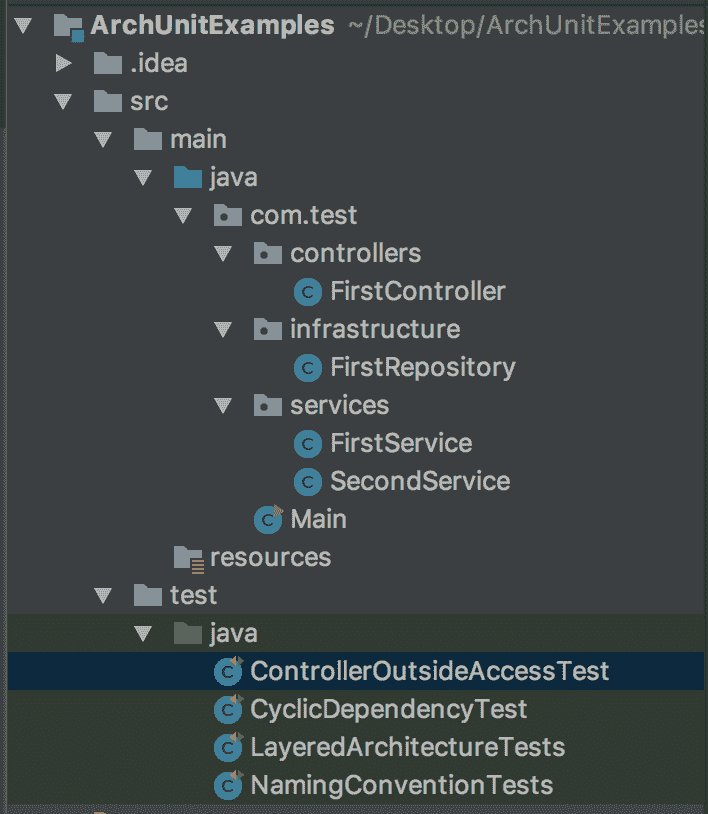
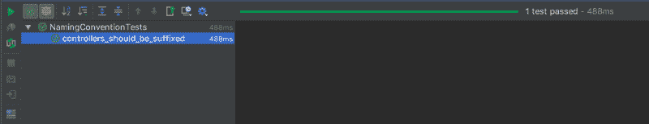
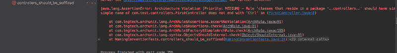
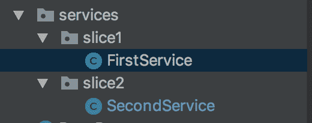
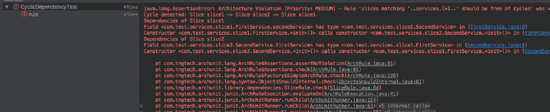
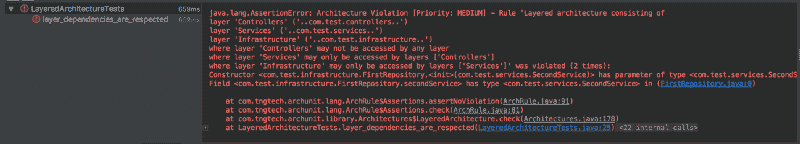

# 如何用 ArchUnit 测试 Java 项目的架构

> 原文：<https://www.freecodecamp.org/news/java-archunit-testing-the-architecture-a09f089585be/>

是检察官的命令

# 如何用 ArchUnit 测试 Java 项目的架构


在这篇文章中，我将向你展示我最近遇到的一个有趣的库，名为 ArchUnit。它不测试您的代码流或业务逻辑。该库允许您测试您的“架构”,包括类依赖、循环依赖、层访问、命名约定和继承检查。

下面是我们将在本帖中写的测试列表:

*   循环依赖测试
*   层访问测试
*   班级定位测验
*   方法返回类型测试
*   命名约定测试

因此，让我们设想一个项目，其包结构如下所示:



在为我们的架构编写测试之前，作为起点，我们决定不应该从任何其他类或包访问我们的控制器。此外，从概念上讲，我们接受控制器名称应该以“…控制器”后缀结尾。

现在是我们动手的时候了。下面，我们开始编写我们的第一个测试。它允许我们检查我们的命名约定。

#### **命名约定测试**

```
@RunWith(ArchUnitRunner.class)@AnalyzeClasses(packages = "com.test.controllers")public class NamingConventionTests {    @ArchTest    ArchRule controllers_should_be_suffixed = classes()            .that().resideInAPackage("..controllers..")            .should().haveSimpleNameEndingWith("Controller");    }
```

当我们运行测试时，我们看到它通过了:



arc 装置有两种类型的测试。其中一个就像上面显示的那样。如果我们愿意，我们可以使用 JUnit 的`Test`注释来编写测试。将`RunWith`参数更改为`JUnit4.class`，并移除`AnalyzeClasses`注释。

这样，我们在 ArcUnit 中使用`ClassFileImporter` 指定要导入的包。

```
@RunWith(JUnit4.class)public class NamingConventionTests {    @Test    public void controllers_should_be_suffixed() {        JavaClasses importedClasses = new ClassFileImporter().importPackages("com.test.controllers");        ArchRule rule = classes()                .that().resideInAPackage("..controllers..")                .should().haveSimpleNameEndingWith("Controller");        rule.check(importedClasses);    }}
```

现在，让我们看看如果我们有一个不同的后缀会发生什么。改变`("Controller") to ("Ctrl")`并运行:



该异常指出:“Java . lang .**assertion error**:**架构冲突**[优先级:中] —规则‘驻留在包中的类’..控制器..应具有以“Ctrl”结尾的简单名称被违反(1 次):
(first controller . Java:0)中 com . test . controllers .**first controller 的简单名称不以“Ctrl”**结尾

到目前为止一切顺利。我们编写了我们的第一个测试，它正确运行。现在是时候跳到其他测试了。

#### **班级位置测试**

让我们编写另一个规则，确保拥有注释库的类应该位于 T2 基础设施包中。

```
@RunWith(ArchUnitRunner.class)@AnalyzeClasses(packages = "com.test")public class RepositoryPackageTest {    @ArchTest    public ArchRule repositories_should_located_in_infrastructure = classes()            .that().areAnnotatedWith(Repository.class)            .should().resideInAPackage("..infrastructure..");}
```

如果我们注释基础设施包之外的其他类，测试会引发 AssertionError。

#### **方法返回类型测试**

让我们写一些方法检查。假设我们决定我们的控制器方法应该返回 BaseResponse 类型。

```
@RunWith(ArchUnitRunner.class)@AnalyzeClasses(packages = "com.test.controllers")public class ControllerMethodReturnTypeTest {    @ArchTest    public ArchRule controller_public_methods_should_return = methods()            .that().areDeclaredInClassesThat().resideInAPackage("..controllers..")            .and().arePublic()            .should().haveRawReturnType(BaseResponse.class)            .because("here is the explanation");}
```

#### **循环依赖测试**

在这个时代，循环依赖问题由大多数 IOC 容器来处理。有一些工具为我们测试它是一件好事。

现在首先创建具有循环复杂性的类:



```
package com.test.services.slice1;import com.test.services.slice2.SecondService;public class FirstService {    private SecondService secondService;    public FirstService() {        this.secondService = new SecondService();    }}
```

```
package com.test.services.slice2;import com.test.services.slice1.FirstService;public class SecondService {    private FirstService firstService;    public SecondService() {        this.firstService = new FirstService();    }}
```

第一服务和第二服务相互依赖，形成了循环。

现在为它写一个测试:

```
@RunWith(ArchUnitRunner.class)@AnalyzeClasses(packages = "com.test")public class CyclicDependencyTest {    @ArchTest    public static final ArchRule rule = slices().matching("..services.(*)..")            .should().beFreeOfCycles();}
```

运行该测试得到以下结果:



同样，结果与构造函数注入相同。

#### **层测试**

现在是时候写一个覆盖我们的层的层测试了。

```
@RunWith(JUnit4.class)public class LayeredArchitectureTests {    @Test    public void layer_dependencies_are_respected() {        JavaClasses importedClasses = new ClassFileImporter().importPackages("..com.test..");        ArchRule myRule = layeredArchitecture()                .layer("Controllers").definedBy("..com.test.controllers..")                .layer("Services").definedBy("..com.test.services..")                .layer("Infrastructure").definedBy("..com.test.infrastructure..")                .whereLayer("Controllers").mayNotBeAccessedByAnyLayer()                .whereLayer("Services").mayOnlyBeAccessedByLayers("Controllers")                .whereLayer("Infrastructure").mayOnlyBeAccessedByLayers("Services");        myRule.check(importedClasses);    }}
```

我们违反了上述规则，以确保我们的测试失败——我们将服务注入到存储库中。

```
package com.test.infrastructure;import com.test.services.SecondService;public class FirstRepository {    SecondService secondService;    public FirstRepository(SecondService secondService) {        this.secondService = secondService;    }}
```

当我们运行测试时，我们会发现我们的存储库违反了规则:



#### 包扎

如您所见，ArchUnit 确保您的项目具有正确的架构。它有助于保持项目结构的整洁，并防止开发人员做出破坏性的更改。

我们已经对图书馆做了一个简要的概述。除了它所有的特性之外，我认为如果 ArchUnit 能有一些规则来测试[六边形架构](https://blog.octo.com/en/hexagonal-architecture-three-principles-and-an-implementation-example/)、 [cqrs](https://docs.microsoft.com/tr-tr/azure/architecture/guide/architecture-styles/cqrs) 和一些 DDD 概念，比如集合、值对象等等，那就太好了。

出于好奇，下面是 Github 上的代码:

[**mstrYoda/Java-arch unit-examples**](https://github.com/mstrYoda/java-archunit-examples)
[*通过在 GitHub 上创建账号为 mstrYoda/Java-arch unit-examples 开发做贡献。*github.com](https://github.com/mstrYoda/java-archunit-examples)[**TNG/arch Unit**](https://github.com/TNG/ArchUnit)
[*一个 Java 架构测试库，用简单的 Java 来指定和断言架构规则——TNG/arch Unit*github.com](https://github.com/TNG/ArchUnit)[**单元测试您的 Java 架构**](https://www.archunit.org/)
[*使用您已有的测试设置在 30 分钟内开始实施您的架构。*www.archunit.org](https://www.archunit.org/)