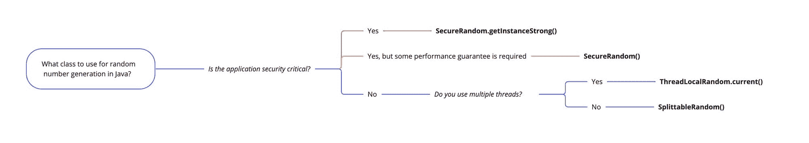

# Java 随机数生成器——如何用 Math.random()生成数字并转换成整数

> 原文：<https://www.freecodecamp.org/news/java-random-number-generator-how-to-generate-with-math-random-and-convert-to-integer/>

在许多应用中，你需要随机数。您可能需要在视频游戏中掷骰子，创建私有加密密钥，或者创建用户的临时密码。

所有这些应用都依赖于随机数的产生。有时很难区分什么时候使用什么，安全性是一个很深的话题。如果不花几年时间深入研究，很难快速理解关于可用实现的文档并为您的用例选择合适的方式。

因此，在本教程中，我将总结突出的用例，以及如何根据您的 Java 代码选择性能最佳的实现。



在本文中，您将了解到:

*   如何生成整数、浮点数和布尔值，
*   如何为关键性能用例生成随机数，
*   如何为安全关键用例生成随机数，
*   数字生成器是如何工作的，
*   伪随机数发生器和真随机数发生器之间的区别，
*   如何利用种子为自己谋利？

所有的代码示例都很少，你可以在 GitHub 上找到完整的[源代码。](https://github.com/sesigl/random-number-generators-java)

## Math.random()的约束

甚至在 Java 6 之前就存在了。它很容易获取，并且仍然被广泛使用。在 Java 17 中，一个名为`RandomGenerator`的新的公共接口是可用的，它整合了当前 Java SDK 中所有的随机生成器实现。

`Math.random()`如今干脆委托给`Random().nextFloat()`。但是，它只返回一个`double`。所以它不允许您请求不同类型的数字或在范围之间生成数字。它也不允许您从不同的实现中进行选择。

在接下来的几节中，您将了解一种更灵活的数字生成方法，并了解如何生成针对效率或安全性进行优化的数字。

## Java 17 以来的通用接口

在 Java 17 中，Java SDK 中可用的数字生成器实现了一个公共接口。您拥有适用于所有基本数据类型的方法，并且可以定义希望为其生成数字的预期范围:

```
RandomGenerator randomGenerator = new Random();

// generate int between 0 - 9
randomGenerator.nextInt(10);

// generate int between 1 - 9
randomGenerator.nextInt(1, 9);

// generate long between 1 - 9
randomGenerator.nextLong(1, 9);

// generate float between 1 - 9
randomGenerator.nextFloat(1, 9);

// generate double between 1 - 9
randomGenerator.nextDouble(1, 9);

// generate random boolean
randomGenerator.nextBoolean();
```

## 单线程环境中性能优化的随机数生成

对于许多与安全性无关的情况，您并不关心随机数的可预测性。通常，你只是想有一个可靠的分布。

如果您的应用程序是单线程的，那么比`Random`更高性能的实现是可用的。一种非常有效的替代方法叫做`SplittableRandom`:

```
new SplittableRandom().nextInt();
```

在 MacBook Pro 上执行的[基准测试比较 SplittableRandom 和 Random](https://github.com/sesigl/random-number-generators-java/blob/main/src/test/java/org/example/BenchmarkSingleThreadedTest.java) 显示了以下结果:

```
SingleThreaded.Random  116528253,100 ops/s
SingleThreaded.SplittableRandom  619630768,299  ops/s
```

在单线程环境中，`SplittableRandom`的执行速度比`Random`快 5 倍左右。

`Random()`的额外优势是确定性行为和可拆分的 fork/join 实现。总而言之，在单线程环境中，你应该更喜欢使用`SplittableRandom`而不是`Random`。

## 多线程环境中性能优化的随机数生成

高吞吐量应用利用多线程。所以你想使用一个并行使用的数字生成器。

`Random`的实现是线程安全的，但是相对较慢，并且由于锁的原因速度会更慢。因为`SplittableRandom`不是线程安全的，所以在这里它不是一个替代方案。

但是，在多线程环境中使用`ThreadLocalRandom`可以获得更好的性能。它使用`SplittableRandom`，但确保在多线程中的高性能和安全使用:

```
ThreadLocalRandom.current().nextInt();
```

在 MacBook Pro 上执行的[基准测试比较了使用 10 个线程并行生成数字的 ThreadLocalRandom 和 Random](https://github.com/sesigl/random-number-generators-java/blob/main/src/test/java/org/example/BenchmarkMultiThreadedTest.java) ,结果如下:

```
MultiThreaded   Random                      8308724,791         ops/s
MultiThreaded   ThreadLocalRandom  3537955530,922   ops/s
```

如你所见，使用`ThreadLocalRandom`要快 425 倍。`ThreadLocalRandom`是无锁的，因此比线程安全的`Random`类性能更好。

## 安全优化的随机数生成

我们刚刚讨论的方法对于您的大多数应用程序来说既快速又足够。但是，他们正在创造所谓的伪随机数。

他们并不总是创建一个真正的随机数，而是根据之前预测的数字预测一个新的数字，这带来了一个状态和一个严重的可预测性问题。

也许您想要为加密创建长期存在的秘密，并且您不希望其他人，万一，能够预测下一个生成的令牌。

在 Java 中，您可以使用`SecureRandom`来获得更多与安全性相关的用例:

```
SecureRandom.getInstanceStrong().nextInt();
```

为您提供一个创建安全令牌的提供商。在许多 Linux 系统中，您使用`/dev/random`，根据真实设备的随机噪声生成数字。

但是，如果没有收集到足够的随机数据，即所谓的缺失[熵](https://en.wikipedia.org/wiki/Entropy)，执行可能会阻塞，并花费意想不到的长时间。特别是在有很多 Docker 容器的机器中，这实际上会导致执行缓慢。

作为替代，在没有熵可用的情况下，`new SecureRandom()`默认不阻塞。它还使用一种不太安全的数字生成方式作为后备。

## 如何利用种子为自己谋利

默认情况下，伪数字生成器使用随机种子，它反映用于生成值的起始值。因此，种子对于测试来说非常方便，因为它可以让您控制预测，并允许您重置数字的创建方式。

直到现在，我们都没有谈过任何和种子有关的事情。

```
@Test
   public void splittableRandomWithSeedIsDeterministic() {
   assertEquals(new SplittableRandom(9999).nextInt(), -788346102);
}

@Test
   public void randomWithSeedIsDeterministic() {
   assertEquals(new Random(9999).nextInt(), -509091100);
}
```

这使得测试更加容易。否则，您将需要始终[模仿依赖关系](https://site.mockito.org/)。

## 为什么数字生成很难

理解为什么数代很难获得安全感是必不可少的。

工程师编写代码，这些代码最终被编译成在真实的处理单元(CPU)中执行的机器可读代码。CPU 是建立在由逻辑门组成的电子电路上的。

长话短说，用传统的计算机无法创造真正的随机性，因为输出需要一些输入，根据定义，这不可能是随机的。

这意味着你需要来自真实世界的某种真正的随机输入，比如来自[电阻器](https://en.wikipedia.org/wiki/Resistor)的[热噪声](https://en.wikipedia.org/wiki/Johnson-Nyquist_noise)。有昂贵的[硬件数字发生器](https://en.wikipedia.org/wiki/Hardware_random_number_generator)，它使用真实世界的物理原理给你很大的容量来产生随机数。

## 不安全随机数生成的风险

尽管许多协议在设计上是安全的，但如果攻击者能够预测加密密钥，它们就不是安全的。

如今，很多应用程序都需要在后台生成真随机数。否则，攻击者可能能够预测生成的数字，从而渗透到应用程序中。

例如，基于[量子计算](https://en.wikipedia.org/wiki/Quantum_computing#Cryptography)的安全相关处理突破可能是一个真正的威胁，如果突然攻击者可以在短时间内解决加密问题。

## 摘要

在这篇博文中，您学习了如何在 Java 中高效地生成数字。您还了解了如何优化性能或安全性，以及种子是什么以及如何使用它。

此外，您现在应该了解伪随机数和真随机数之间的主要区别，并且应该能够描述为什么安全随机数生成很重要。

我希望你喜欢这篇文章。

如果你喜欢它，觉得有必要给我一点掌声，或者只是想和我保持联系，[在 Twitter 上关注我](https://twitter.com/sesigl)。

顺便说一下，[我们正在招聘](https://www.ebay-kleinanzeigen.de/careers)！

### 参考

*   [https://better programming . pub/generating-random-numbers-is-a-lot-hard-than-you-think-b 121 C3 e 75d 08](https://betterprogramming.pub/generating-random-numbers-is-a-lot-harder-than-you-think-b121c3e75d08)
*   [https://docs . Oracle . com/javase/8/docs/API/Java/security/securerandom . html](https://docs.oracle.com/javase/8/docs/api/java/security/SecureRandom.html)
*   [https://www.happycoders.eu/java/random-number/](https://www.happycoders.eu/java/random-number/)
*   [https://www.baeldung.com/java-17-random-number-generators](https://www.baeldung.com/java-17-random-number-generators)
*   [https://programmer.ink/think/61db978dde30a.html](https://programmer.ink/think/61db978dde30a.html)
*   [https://www.baeldung.com/java-secure-random](https://www.baeldung.com/java-secure-random)
*   [https://terse systems . com/blog/2015/12/17/the-right-way-to-use-securerandom/](https://tersesystems.com/blog/2015/12/17/the-right-way-to-use-securerandom/)
*   [https://en.wikipedia.org/wiki//dev/random](https://en.wikipedia.org/wiki//dev/random)
*   [https://www . schutzwerk . com/en/43/posts/attaking _ a _ random _ number _ generator/](https://www.schutzwerk.com/en/43/posts/attacking_a_random_number_generator/)
*   [https://en . Wikipedia . org/wiki/Random _ number _ generator _ attack](https://en.wikipedia.org/wiki/Random_number_generator_attack)