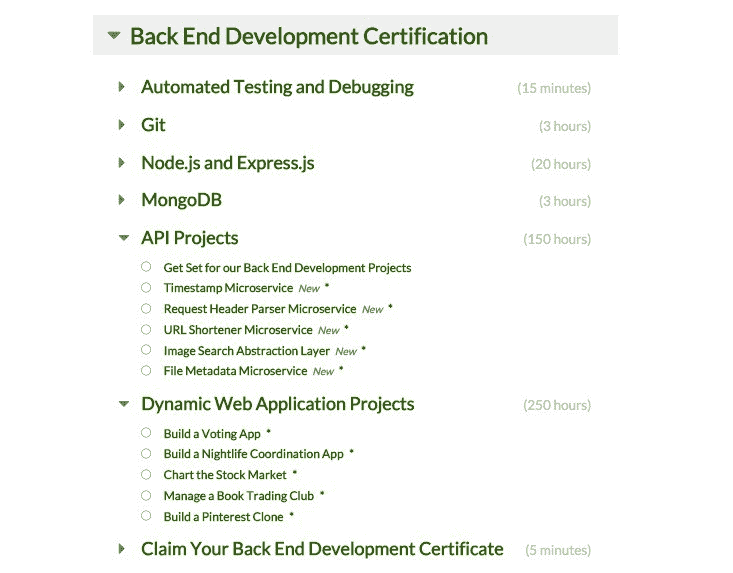

# Java，Ruby，然后走，天啊！

> 原文：<https://www.freecodecamp.org/news/java-ruby-and-go-oh-my-6b5577ba2bc2/>

自从我们 17 个月前开始以来，自由代码营已经 100%专注于全栈 JavaScript。我们在前端教了 JavaScript，在后端教了 JavaScript(感谢[强大的 Node.js 框架](https://www.quora.com/What-are-the-most-famous-web-apps-built-on-top-of-Node-js/answer/Quincy-Larson))——甚至把 JavaScript 作为数据库查询语言。

从一开始，我们的开源社区每天都会收到一些请求，要求我们教授其他流行的后端语言。

今天，我很兴奋地宣布，我们将关注成千上万的请求。免费代码营现在将教授各种各样的 web 开发语言。

从今天开始，我们将构建一个大规模的知识共享许可教程集合，涵盖 Python、Java、Ruby 和 PHP 等流行语言，以及 Elixir 和 Go 等新兴语言。

现在，您可以完成我们的后端开发认证，并使用您想要的任何语言和框架构建它的十个 API 和动态 Web 应用程序项目。

An image of our Back End Development Certification challenges, with optional Git, Node.js, Express.js and MongoDB sections, and 10 required projects.

#### 我应该先学习哪种语言？

答案和之前一样: **JavaScript** 。

几乎任何教授都会告诉你，在尝试学习第二种语言之前，你应该彻底学习一种语言。JavaScript 是目前最流行和最有前途的语言。JavaScript 也是第一编程语言的热门选择，并且有各种各样的[免费学习资源](https://medium.freecodecamp.com/25-free-resources-for-new-javascript-developers-11342cf1f4df#.tuc8r5zav)(包括[免费代码营](http://www.freecodecamp.com)本身)。

无论您使用哪种 web 开发框架，您都需要精通 JavaScript。这是因为 JavaScript 不仅在前端 web 开发上拥有近乎垄断的地位，而且由于 Node.js 和 Express.js 这样的工具，它在后端也相当有竞争力。

因此，如果你刚刚开始做一名 web 开发人员，我们的建议仍然是一样的:**把 100%的时间集中在掌握 JavaScript** 上。

#### 如果新开发人员应该关注全栈 JavaScript，那么为什么自由代码营会教授额外的后端语言？

我们营员中大约三分之二的人是网络开发新手。他们中的一些人之前根本没有编程经验。其他人加入自由代码营，在网页设计、系统管理和其他相关领域有经验。这三分之二的营员是我们专门为他们设计开源课程的人。

但是我们社区的另外三分之一已经做了一些 web 开发——通常是用 PHP 或 Ruby 之类的语言。他们正在加入自由代码营来回顾——或建立——现有的技能。

而且——你可能听说过——数百名我们的营员在加入我们的开源社区后获得了软件开发工作。其中一些工作不是专门的全栈 JavaScript 工作，而是使用替代 web 开发框架的全栈 web 开发人员工作，如 Python Django 或 Ruby on Rails。在接受这些工作后，这些营员能够利用他们对 Node.js 和 Express.js 的知识来使用这些其他工具。但是许多露营者报告说，他们需要在这个过程中支付昂贵的学习资源。

我们社区的这三分之一——经验丰富的 web 开发人员和刚刚被雇佣的露营者——已经表达了他们希望我们涵盖更多后端语言和框架的愿望。他们的声音已经被听到。

我们的开源社区现在已经足够大了——而且我们现在在 web 开发专业知识上也足够多样化——我们可以在广泛的 web 开发主题上创建大量的免费资源。

这就是我们要做的。

#### 这些语言将如何被纳入自由代码阵营？

自由代码营的优势之一一直是我们为你的第一份软件工程工作提供一条清晰明确的前进道路。

为了避免选修课使我们的挑战地图变得复杂，我们选择保持我们的核心课程 100%专注于全栈 JavaScript。

相反，营员们正在自由代码营的“扩展宇宙”中构建这些内容

*   我们正在创建关于这些语言的各种教程和文章——从如何在不同的操作系统上设置开发环境，到如何使用流行的库构建示例应用程序。这些都可以用 Markdown 写出来，在我们的 wiki 上互相链接。
*   我们欢迎露营者在我们的 Twitch.tv 频道上用他们想要的任何语言直播网络开发。
*   我们邀请营员向我们的媒体刊物投稿这些语言的文章。这里有一篇我们昨天刚刚发表的关于 Java 和 Go 之间相似性的文章。
*   我们正在制作讨论其他语言特有的各种概念的视频，比如 Rails 资产管道和 Java 虚拟机。我们会将这些视频嵌入维基文章中，并发布在我们的 [YouTube 频道](https://www.youtube.com/freecodecamp)上。

[Arijit Layek](https://gitter.im/alayek) is an experienced Java and Python developer in Hyderabad, India. He joined Free Code Camp to improve his JavaScript, and now leads our effort to cover additional back end languages.

Arijit Layek 正在积极地创建 Python 和 Java 的教程，并协调其他想要贡献这些和其他语言的教程的营员的努力。

如果你是一个有一种或多种语言经验的网络开发人员，你应该加入这些相关的聊天室并介绍你自己。Arijit 和那里的其他露营者可以帮助你提出教程的想法，并回答你可能有的任何其他问题。

我们的目标是建立地球上最具包容性的网络开发资源。对我们来说，这意味着严格的核心课程，大量的补充内容，最重要的是，一个充满活力、相互支持的社区。

我只写编程和技术。如果你在推特上关注我，我不会浪费你的时间。？