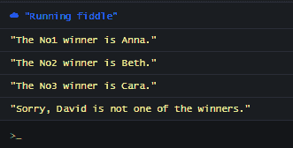

# JavaScript Array.filter()教程——如何遍历数组中的元素

> 原文：<https://www.freecodecamp.org/news/javascript-array-filter-tutorial-how-to-iterate-through-elements-in-an-array/>

`Array.filter()`方法可以说是 JavaScript 中迭代数组的最重要和最广泛使用的方法。

`filter()`方法的工作方式非常简单。它需要根据某种条件/偏好从一个较大的项目集合(超集)中过滤出一个或多个项目(子集)。

我们每天都在这样做，无论是读书、选择朋友或配偶、选择看什么电影等等。

## JavaScript `Array.filter()`方法

`filter()`方法接受一个回调函数，并为它在目标数组中迭代的每一项调用该函数。回调函数可以接受以下参数:

*   `currentItem`:这是数组中当前正在迭代的元素。
*   `index`:这是`currentItem`在数组中的索引位置。
*   `array`:表示目标数组及其所有项目。

filter 方法创建一个新数组，并返回通过回调中指定条件的所有项目。

## 如何在 JavaScript 中使用`filter()`方法

在下面的例子中，我将演示如何在 JavaScript 中使用`filter()`方法过滤数组中的条目。

### 例 1:如何从数组中过滤出条目

在这个例子中，我们过滤掉了每个正在学步的人(年龄在 0 到 4 岁之间)。

```
let people = [
    {name: "aaron",age: 65},
    {name: "beth",age: 2},
    {name: "cara",age: 13},
    {name: "daniel",age: 3},
    {name: "ella",age: 25},
    {name: "fin",age: 1},
    {name: "george",age: 43},
]

let toddlers = people.filter(person => person.age <= 3)

console.log(toddlers)

/*
[{
  age: 2,
  name: "beth"
}, {
  age: 3,
  name: "daniel"
}, {
  age: 1,
  name: "fin"
}]
*/
```

### `filter()`示例 2:如何根据特定属性过滤出项目

在这个例子中，我们将只过滤掉开发人员。

```
let team = [
	{
  		name: "aaron",
    	position: "developer"
 	 },
  	{
  		name: "beth",
    	position: "ui designer"
  	},
  	{
  		name: "cara",
    	position: "developer"
  	},
 	{
  		name: "daniel",
    	position: "content manager"
 	 },
  	{
  		name: "ella",
    	position: "cto"
  	},
  	{
  		name: "fin",
    	position: "backend engineer"
  	},
  	{
  		name: "george",
    	position: "developer"
  },

]

let developers = team.filter(member => member.position == "developer")

console.log(developers)

/*
[{
  name: "aaron",
  position: "developer"
}, {
  name: "cara",
  position: "developer"
}, {
  name: "george",
  position: "developer"
}]
*/
```

在上面的例子中，我们过滤掉了开发人员。但是如果我们想过滤掉每一个不是开发人员的成员呢？

我们可以这样做:

```
let team = [
	{ 
        name: "aaron",
   		position: "developer"
  	},
  	{
  		name: "beth",
   		position: "ui designer"
 	 },
  	{
  		name: "cara",
    	position: "developer"
  	},
  	{
  		name: "daniel",
    	position: "content manager"
  	},
  	{
  		name: "ella",
    	position: "cto"
  	},
  	{
  		name: "fin",
    	position: "backend engineer"
  	},
  	{
  		name: "george",
    	position: "developer"
  	},

]

let nondevelopers = team.filter(member => member.position !== "developer")

console.log(nondevelopers)

/*
[
    {
  		name: "beth",
  		position: "ui designer"
	}, 
    {
  		name: "daniel",
  		position: "content manager"
	}, 
    {
  		name: "ella",
  		position: "cto"
	}, 
    {
  		name: "fin",
  		position: "backend engineer"
	}
]

*/
```

### `filter()`示例 3:如何访问索引属性

这是一场比赛。在这场比赛中，有三个获胜者。第一名将获得金牌，第二名获得银牌，第三名获得铜牌。

通过使用`filter`并在每次迭代中访问每个项目的`index`属性，我们可以将三个获胜者中的每一个过滤到不同的变量中。

```
let winners = ["Anna", "Beth", "Cara"]

let gold = winners.filter((winner, index) => index == 0)
let silver = winners.filter((winner, index) => index == 1)
let bronze = winners.filter((winner, index) => index == 2)

console.log(Gold winner: ${gold}, Silver Winner: ${silver}, Bronze Winner: ${bronze})

// "Gold winner: Anna, Silver Winner: Beth, Bronze Winner: Cara"
```

### `filter()`例 4:如何使用数组参数

第三个参数(array)最常见的用途之一是检查被迭代的数组的状态。例如，我们可以检查数组中是否还有其他项。根据结果，我们可以指定不同的事情应该发生。

在这个例子中，我们将定义一个由四个人组成的数组。然而，由于只能有三名获奖者，名单中的第四人将不得不打折扣。

为了能够做到这一点，我们需要在每次迭代中获得关于目标数组的信息。

```
let competitors = ["Anna", "Beth", "Cara", "David"]

function displayWinners(name, index, array) {
    let isNextItem = index + 1 < array.length ? true : false
    if (isNextItem) {
    	console.log(`The No${index+1} winner is ${name}.`);
    } else {
    	console.log(`Sorry, ${name} is not one of the winners.`)
    }
}

competitors.filter((name, index, array) => displayWinners(name, index, array))

/*
"The No1 winner is Anna."
"The No2 winner is Beth."
"The No3 winner is Cara."
"Sorry, David is not one of the winners."
*/
```



Oops, sorry David!

### 如何使用上下文对象

除了回调函数，`filter()`方法还可以接受一个上下文对象。

```
filter(callbackfn, contextobj)
```

然后可以使用关键字引用从回调函数内部引用这个对象。

### `filter()`例 5:如何用`this`访问上下文对象

这将类似于`example 1`。我们将过滤掉所有年龄在 13 到 19 岁之间的人(青少年)。

但是，我们不会在回调函数中硬编码这些值。相反，我们将把这些值 13 和 19 定义为`range`对象中的属性，我们随后将把它们作为上下文对象(第二个参数)传递给`filter`。

```
let people = [
    {name: "aaron", age: 65},
    {name: "beth", age: 15},
    {name: "cara", age: 13},
    {name: "daniel", age: 3},
    {name: "ella", age: 25},
    {name: "fin", age: 16},
    {name: "george", age: 18},
]

let range = {
  lower: 13,
  upper: 16
}

let teenagers = people.filter(function(person) {
	return person.age >= this.lower && person.age <= this.upper;
}, range)

console.log(teenagers)

/*
[{
  age: 15,
  name: "beth"
}, {
  age: 13,
  name: "cara"
}, {
  age: 16,
  name: "fin"
}]
*/
```

我们将`range`对象作为第二个参数传递给`filter()`。此时，它成为了我们的上下文对象。因此，我们能够分别用`this.upper`和`this.lower`引用访问回调函数中的上限和下限。

## 包扎

数组方法过滤出匹配回调表达式的条目并返回它们。

除了回调函数，`filter`方法还可以接受一个上下文对象作为第二个参数。这将使您能够使用`this`从回调函数中访问它的任何属性。

我希望你能从这篇文章中得到一些有用的东西。

****我 ****如果你想了解更多关于 Web 开发的知识，欢迎访问我的**** [博客](https://ubahthebuilder.tech/my-top-10-youtube-channels-for-programmers) ****。********

感谢您的阅读，再见。

> **************************************************************P/S********************点击这里查看。******************************************